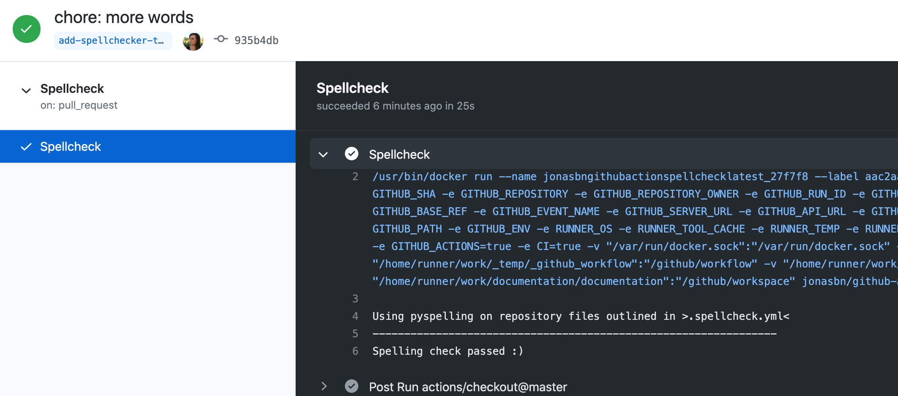

# Contributing to Agoric's Documentation Repo

Agoric's public-facing technical documentation is mostly in the [Agoric Documentation GitHub repo](https://github.com/Agoric/documentation).
The complete documentation set also includes external items such as papers, presentations, videos, etc. Our document
process is:
1. Write docs in the repo in Markdown. Image files are usually in `.svg` format and also stored in the repo.
2. Proofread your docs. However, be aware that everyone is their own worst proofreader and this is especially
   true if you try to do it immediately or very soon after you finish writing it. Given our frequent time pressure, while
   self-proofreading is required, later reviewers should not expect perfection.
3. If you deleted or added docs that either need to be removed from or added to the site menus (top menubar or sidebars),
   edit the menus and test on your local server.
4. Check your changed docs in a local copy of the repo and local documentation 
   server. Includes that they build and run successfully, pass link checking and (for now) spellchecking. 
5. Do a Draft PR and have it reviewed by others. The PR body describes what the purpose of the PR is, which
   files are being altered for what reasons, and any related material still outstanding (so reviewers know 
   if the PR is meant to be comprehensive or if it is part of a series of PRs).
   1. Component version tags (e.g., Zoe version, ERTP version) have been updated appropriately.
   2. PR contains only the files to be reviewed. No additional files are in the PR that are not intended to be changed or reviewed. 
   3. PRs contain no meta-comments or open questions. They can appear in DRAFT PRs but not real PRs. 
      Such questions can also just be added as comments on a newly opened PR.
   4. If the PR cannot be approved as is (because there's known issues) then it must be a draft PR
6. When all issues from the initial review are resolved, convert the PR from Draft to Ready For Review.
7. Reviewers approve PR, you merge it with `main`.
8. Pull Requests automatically run tests on their committed files.
9. [VuePress](https://vuepress.vuejs.org/guide/#how-it-works) automatically 
   processes any new or changed files for display. 
10. The [Agoric website's Documentation Section](https://agoric.com/documentation/) displays
   the VuePress processed files, which have been converted to HTML.

This doc explains:
- The overall documentation structure.
- Our preferred way of writing links.
- What happens when you make a PR.
- How to import code snippets into docs.
- Updating Zoe Version and DocsUpdated
- How to build and run a local doc server for testing.
- How to edit the top menubar and sidebars of the Agoric documentation site.
- How to redirect links if you move repo folders/files around or delete them.

## Structure

### Root Directory and Homepage

`/main` is the root directory for all files for the documentation site. It is the base path and renders as `/`.
`/main/README.md/` is the README file for the Agoric Documentation repo, and the homepage for the documentation
section of the Agoric website. The homepage uses the default VuePress homepage theme.

### Folders and Projects

Each project gets its own folder, often with `/api` and `/guide` subfolders as warranted. For example, we have `/main/ertp/api/` and `/main/ertp/guide/` as
well as `/main/zoe/api/` and `/main/zoe/guide/`. Projects can have additional subfolders as needed. 

Each folder should have its own `README.md`, which is an effective `index.html` equivalent in terms of rendering when someone navigates to
the folder's URL. See the next section for an explanation of how VuePress uses READMEs. 

Images, diagrams, and similar content-supporting files should go in an `assets` subfolder under the appropriate project folder.
For example, if you have a `process.svg` image file with a diagram for the Zoe Guide's Invitations page, it 
should be stored in `main/zoe/guide/assets/process.svg` and appear in the page via an image link of `./assets/process.svg` 

Note that `assets` should store all the auxiliary files for the files in its parent folder. Don't make an `assets` folder
or similar for individual files/pages.

### README files

VuePress converts Markdown files to an HTML file with the same base name. `README.md` files are an exception; they're 
renamed `index.html`, since that's the default file web servers expect to find in each directory. Navigating 
to `https://agoric.com/documentation/ertp/guide/` displays the VuePress processed `/main/ertp/guide/README.md`.
While it may seem odd, VuePress expects multiple `README.md` files in a repo; most folders will have one. 

The root README.md file must start with an H1 (`#` in Markdown) header. In fact, all our doc pages should start
with that. But for READMEs, it's needed to generate search indexes and sidebars.

All directories/folders should have a `README.md` file, even if it's empty. They provide a landing page for
the folder in the VuePress processed documentation structure. 

Lines with no special treatment are converted into standard HTML paragraph tags.

### Sectioning Pages

VuePress automatically builds search functionality and individual page menus from `h1`, `h2`, and `h3` headers (i.e. Markdown's `#`, `##`, and `###` commands). 
You must have **only one** `h1` per `.md` file. Be careful not to have too many `h2` and `h3` level headers 
on one page and that they aren't too long. Otherwise the sidebar menu for the page will be cluttered and hard to read and use.

Individual pages do not automatically display a sidebar menu for their headers (As of March 2021, VuePress
documentation implies they do. We've filed a PR with them).
To force an individual page sidebar menu, add the following YAML at the top of a page's source file (this file has this YAML at the top):
```js
---
sidebar: auto
---
```
Other ways of activating this are:

Turn it on for the whole site:
```js
// .vuepress/config.js
module.exports = {
  themeConfig: {
    sidebar: 'auto'
  }
}
```

Or, add a config entry, either as part of a group or as an individual page.
```js
// .vuepress/config.js
module.exports = {
  themeConfig: {
    sidebar: [
      {
        title: 'Group 1',   // required
        path: '/foo/',      // optional, link of the title, which should be an absolute path and must exist
        collapsable: false, // optional, defaults to true
        sidebarDepth: 1,    // optional, defaults to 1
        children: [
          '/'
        ]
      },
      {
        title: 'Group 2',
        children: [ /* ... */ ],
        initialOpenGroupIndex: -1 // optional, defaults to 0, defines the index of initially opened subgroup
      }
    ]
  }
}
```

## Writing Links

VuePress turns Markdown links into HTML links. There are some quirks about how you should write Markdown links.

First, our link checker does **not** check `router-link` style links. Please only use Markdown style links.

Next, your Markdown links should be to the `.md` Markdown files in the Doc repo. VuePress processing changes
both the `.md` files and links to them to be `.html`.

In general, use relative links instead of absolute ones for any links to files or folders in the Documentation repo. Relative links
open in the same browser tab when clicked on, absolute links open a new tab. 

However, there's a trick you can use that's easier than writing a complicated relative link. 
While it's easy enough to, say, write a relative link to something in
the same folder as the file you're writing (something like `(./assets/my-diagram.svg)` to include an image), it can be
difficult to remember/figure out what the right syntax is for relative linking to a file two folders up, in a different upper folder, and then
two levels down from there on a different branch of the file structure. 

Instead, VuePress considers `main` the top of the file hierarchy. So you can always get to, say, a Glossary entry 
by just linking to `(/glossary/#allocation)`; its path starting at `main`. Any path starting with just `/` starts
at `main`. These links also open in the same browser tab. 

VuePress turns every header in a Markdown file into an HTML anchor you can link to, so clicking such a link takes you directly to
that file location (called *slugifying* by WordPress and other blogging platforms). A header link consists of its file
name, with an appended `#` and appended altered header text. The header text in a link has been converted to
to lower case and all non-alphanumerics, including spaces, have been replaced by hyphens. The two exceptions to the latter
are, first, all consecutive non-alphanumbers are converted to a single hyphen; i.e. "Foo&$ Bar" is converted to "foo-bar".
Second, all trailing non-alphanumerics are just dropped; i.e. "Foo Bar)))" is converted to "foo-bar".

So, for example, the header `E(zoe).getBrands(instance)` is linked to by `zoe.md#e-zoe-getbrands-instance` (note the last `)` was
not turned into a hyphen) and the header
`Contract and Contract Instance` by `glossary/#contract-and-contract-instance`. Note that no specific file is specified in
the latter, as it defaults to the `glossary` folder's `README.md` file

## Github Actions and Continuous Integration

These GitHub Actions run on every pull request and commit to `main`:

- Check links
- Test the build
  - Tests for build errors and does HTML5 validation. 
- Lint and Test Snippets
  - Tests the imported code snippets. Code included inline is **not** tested or run.
- Spellcheck - **Does not work yet. Until finished, please check your docs in an external spellchecker before merging.**
  - Checks Markdown files against a dictionary and a local wordlist. 

### Spellcheck

**Does not work yet. Until finished, please check your docs in an external spellchecker before merging.**

This is currently only available in Github Actions on Pull Requests.
Any words that do fail spell check are shown in the logs of
the Github Action. Please either fix the words or add them to the list
in `Agoric/documentation/.wordlist.txt`. When entering new words, please keep the list 
in alphabetical order for the convenience of future maintainers.



### Importing and testing code snippets

Code snippets are not short inline code bits like `const x = 2 + 2;`. In fact,
you cannot insert a code snippet in line. They are for where you want to
do an effective code block (i.e. one that starts with a line consisting of 
three backquotes and an appended 'js' and ends with a line consisting of three backquotes).

The code used for code snippets is held to a similar standard of correctness as actual
development or test code from the agoric-sdk repo. It should pass `lint` and run with no
errors. This provides assurance our documents use real code that works
with the current agoric-sdk version (whatever is on `master`) and is
not outdated. However, you do need to remember to, after any new SDK release,
do any needed snippet updates to the new release. The `yarn test` command
run during CI over documentation will test if snippets work with the current
agoric-sdk release.

To import code snippets into the documentation, if there isn't
already an appropriate file, create a file
somewhere under the top-level `Agoric/documentation/snippets/` directory,
possibly in a subdirectory. 
Essentially, you want a parallel structure to the docs file structure
under `main`, with a separate snippets subfolder under `snippets` for each doc content
subfolder. This is similar to having one test hierarchy. 

As more files are converted to using snippets, you'll increasingly just
modify existing snippet files instead of creating new ones. 

Put the agoric-sdk code you want to use in its appropriate snippets file.
Remember, the code must be able to run without errors. For it to do so,
you'll often have set up its context by including code above the snippet you
want to use. This additional code doesn't have to be included in the snippet
displayed in a doc.

You can make an entire code file, or any part of it, into a snippet (each
of which can be used multiple times in the docs). Just surround the part
you want to be a snippet with `#region` and `#endregion` comments:
```js
// #region regionName
...
// #endregion regionName
```
`regionName` in the above is any name you want to give this snippet.

If you want the whole file to be a snippet, just put the `#region` / `#endregion`
pair at the start and end of the file. Or if the file has no defined regions, the
whole file is also used as a single snippet. For the latter, just don't include a
region name with the import command.

You can define any number of snippet
regions in a file, including defining one region inside of another. Just be sure to give
all the ones in a file different names.

To include a defined snippet in a Markdown file, put a
line like `<<< @/snippets/test-intro-zoe.js#install` in it.
Replace the `test-intro-zoe.js` with the filename in the snippets file.
Replace the `install` with the name of the region you want included from
the file. 

The tests should be in the snippets directory. Actually the snippet files and the test files ended up being the same file because that was the cleanest way to go. The snippet files should all be named test-original-filename.js where original-filename is the markdown filename, like amounts of ertp/guide/amounts.md

To test your snippets files while writing your docs:
1. Write tests using AVA. They should be in the appropriate file in the snippets directory, with files named `test-original-filename.js` `original-filename` is
   the Markdown filename. For example, `test-amounts.js` for `ertp/guide/amounts.md` See [this Snippets file](/snippets/ertp/guide/test-amounts.js)
2. Run the tests with `yarn test` (run from anywhere, but usually from the root of the repo).
3. Lint the files with `yarn lint-fix` (run from anywhere, but usually from the root of the repo).

Note that the PR will automatically test and lint files. The above is for local testing while you're writing the docs.

### Check Links

To check internal VuePress links locally, run the shell command `yarn check-links` from anywhere in the 
root of the local repo folder or below.

Note this does **not** check either external links or router-links. Output is the text of any 
broken links, and what file and line number they're at.

## Local Install, Build, and Run

1. **Clone**: Clone the Documentation repo to your local machine. We suggest using 
Sourcetree to manage your local and remote copies and the various commits
and pull requests you'll make while debugging. The following steps should all
be run from the directory you cloned the repo into.

2. **Install**: To ensure using the latest agoric-sdk 
version when running code snippets, from a shell, run
```shell
agoric install
```
3. **Build**: To build the site as it will be built for production, run:
```shell
yarn docs:build
```
4. **Run**: To run a local server and see your changes in real time, run:
```shell
yarn docs:dev
```
Most edit changes are immediately reflected in the browser, but 
applying site config changes may require stopping and restarting this program.

View your local documentation site at `localhost:8080/documentation/`

## Updating Zoe Version and DocsUpdated

In `[/.vuepress/config.js](/.vuepress/config.js)`, find the lines
```
zoeVersion: 'Beta Release v1.0.0',
zoeDocsUpdated: 'Apr 7, 2021'
```
Edit the values to be current. The current Zoe version is the "version" field of
[Zoe's package.json](https://github.com/Agoric/agoric-sdk/tree/HEAD/packages/zoe/package.json),
normally on line 3.

## Editing Site Menus

VuePress processing adds a top menubar to all Documentation site pages. When viewing a doc in an
overall grouping, such as Zoe docs or Getting Started docs, VuePress adds a specified sidebar menu of
other docs in that grouping. This section describes how to edit the top menubar and sidebar menus.

**Note**: We do not know how to specify which sidebar menu to display if a document is in
multiple groups. While a doc can be in more than one sidebar menu, it can only display one fixed
sidebar menu.

For example, "Introduction to Zoe" appears in two sidebar menus. One for Zoe docs, and one for
Getting Started docs. So if you're viewing either a Zoe API doc or the "Before Starting an Agoric Project"
doc in Getting Started, you'll see "Introduction to Zoe" as an item in both of the two different sidebar menus. 

But if you're viewing "Introduction to Zoe" itself, you'll always see the Getting Started sidebar menu. There's
no way to have it sometimes (appropriately) display the Zoe sidebar menu instead.

### Configuration and navigation
All configuration is handled in [`/main/.vuepress/config.js`](/.vuepress/config.js). Here you can:
- Set and modify the website title and description.
- Configure the top navigation bar.
- Configure the various sidebar menus

#### Configuring the top menubar
Go to `[main/.vuepress/themeConfig/nav.js](/.vuepress/themeConfig/nav.js)` to configure the top
navigation bar. `/main/.vuepress/config.js`, the overall VuePress configuration file, imports `nav.js`.

Below is an abridged configuration of the top navigation bar showing an array of only two entries,
Getting Started and Learn More.
Each entry is an object with three or four properties:
- `text`: The text shown in the nav bar.
- `ariaLabel`: Labels this page element. Used to access it if the text is not visible.
- `link`: Optional. Link to where the browser goes if you click the top menubar item itself, instead of a
  submenu item. Of the form `link: '/zoe/guide'` where the opening `/` starts the path at `main/`. In this
  case, no filename was given, so it defaults to `guide`'s `README.md` file. If not present, the menubar
  entry is not clickable.
- `items`: Optional. An array of submenu item objects, each of which is a single submenu item of its 
  parent navbar item. Not present if the item doesn't have a submenu.
  
To add an entry to the top menubar, just add a menu item object to the array. We suggest copying a
similar one, adding the copy, and editing the copy's property values to be those of the new item and
its submenus. To delete an entry, just remove its object from the menubar item array.
```js
module.exports = [
  {
    text: 'Getting Started',
    ariaLabel: 'Getting Started Menu',
    link: '/getting-started`
    items: [
      {
        // Submenu item
      },
      {
        // Submenu item
      }
    ]
  },     
  {
    text: 'Learn More',
    ariaLabel: 'Learn More Menu',
    items: [
      {
        // Submenu item
      },      
      {
        // Submenu item
      }
    ]
  },  
]
```
#### Configuring the top menubar submenus

A top menubar item without a submenu, such as Glossary, has no
`items` property and must have a `link` property (otherwise there's
nothing to click, so it's really not a good navigation menu item).
```js
 {
    text: 'Glossary',
    ariaLabel: 'Glossary Menu',
    link: '/glossary/'
  },
```

This is an abridged configuration of the `ERTP` entry and its submenu.
Each submenu item has the same structure and properties as a top menubar item,
except they do not have an `items` property. Note that for links to files, instead of folders, such as
the ERTP Introduction, you leave off the file's suffix. So in that case, the
link value is `'/getting-started/ertp-introduction/'` and not `'/getting-started/ertp-introduction.md'`

To add a submenu item, just copy an appropriate one, add it to the `items` array, and edit its
property values to be what you want for the new item. To delete a submenu item, just remove its
entry from the `items` array.
```js
{
    text: 'ERTP', 
    ariaLabel: 'ERTP Menu',
    link: '/ertp/guide/',
    items: [
       {
        text: 'Introduction',
        ariaLabel: 'ERTP Introduction Link',
        link: '/getting-started/ertp-introduction/',
      },
     {
        text: 'Guide',
        ariaLabel: 'ERTP Guide Link',
        link: '/ertp/guide/'
      },
      {
        text: 'API',
        ariaLabel: 'ERTP API Link',
        link: '/ertp/api/'
      },
    ]
  }
```

#### Configuring sidebar menus.
Sidebar menus are configured in [`/.vuepress/config.js`](/.vuepress/config.js). There,
sidebars are configured where it starts: `sidebar: {`.

Here's an abridged version of the overall sidebar configuration, only showing the Getting Started
and ERTP sidebars, and leaving out their specific items:
```js
sidebar: {
      '/getting-started/': [
        {
          // item configuration
        },
        {
          // item configuration
        },
      ],
      '/ertp/': [
        {
          // item configuration
        },
        {
          // item configuration
        },
      ],
    }
```
Below is an abridged version of the ERTP sidebar. Each item entry has five properties:
- `title`: The string that appears in the sidebar menu for this item.
- `path`: Where you go if you click on this menu item. As usual, the leading `/` denotes a path
  starting at `main`. Note the full file name is given, including the `.md` suffix (which VuePress
  will change to `.html` during its processing).
- `collapsible`: Can this item be collapsed? So far, we don't have any collapsible items, so 
  always give this property the value `false`.
- `sideBarDepth`: How many levels can the sidebar show? The site-level
  default is 2, which displays h3 and is the max, but if fewer levels
  are desired, the setting can be overridden at the sidebar item
  level. More information
  [here](https://vuepress.vuejs.org/theme/default-theme-config.html#nested-header-links).
  
- `children`: An array of submenu items for this sidebar menu item. You just need to specify
  the file paths to where you want to go when the submenu item is clicked. VuePress uses the
  file's (including default README.md files for folders) H1 level header text for the sidebar text.
  You can also specify what text to use using the form `{ title: 'Mint', path: '/api/mint' }`.
  
```js
      '/ertp/': [
        {
          title: 'ERTP Introduction',
          path: '/getting-started/ertp-introduction.md',
          collapsible: false,
          children: [
          ]
        },
        {
          title: 'ERTP Guide',
          path: '/ertp/guide/',
          collapsible: false,
          children: [
            '/ertp/guide/',
            '/ertp/guide/amounts',
            '/ertp/guide/amount-math',
            '/ertp/guide/issuers-and-mints',
            '/ertp/guide/purses-and-payments',
          ]
        },
      ],
```
When viewing a page, VuePress has automatically constructed a sidebar menu entry for that page 
consisting of all `h1`, `h2`, and `h3` header titles on the page.

## Redirecting links

If you reorganize part of the Documentation repo or delete/deprecate a file in favor of a replacement,
you should establish a site URL redirect from the old file to the new one, in case anyone external to 
Agoric has made a link or bookmarked the old file.

Go to (or create if not there) `documentation/main/.vuepress/enhanceApp.js` As of March 2021, ours
looks like this:
```js
export default ({ router }) => {
  router.addRoutes([
    { path: '/wallet-api/', redirect: '/guides/wallet/' },
    { path: '/wallet-api.html', redirect: '/guides/wallet/' },
    { path: '/chainlink-integration/', redirect: '/guides/chainlink-integration.md' },
    { path: '/chainlink-integration.html', redirect: '/guides/chainlink-integration.md' },
    { path: '/distributed-programming/', redirect: '/guides/js-programming/' },
    { path: '/distributed-programming.html', redirect: '/guides/js-programming/' },
    { path: '/getting-started/agoric-cli-guide/', redirect: '/guides/agoric-cli/' },
    { path: '/getting-started/agoric-cli-guide.html', redirect: '/guides/agoric-cli/' },
  ])
}
```
The general format should be self-explanatory. However, there are two things you need to know that aren't apparent
- VuePress treats `main` as the root of the folders. So all of the addresses start with `/` to represent `/main/`.
- You'll notice there are two entries for every redirect, one where the redirected address ends with `.html` and
  one where it ends with `/`. For each individual file that is not a `README.md`, there are two ways to access it.
  So we cover both ways. No entry has a `.md` extension. The redirect happens after VuePress' build step, so there
  are no longer any Markdown files; they've been converted to .html. So that's what's redirected.
  
