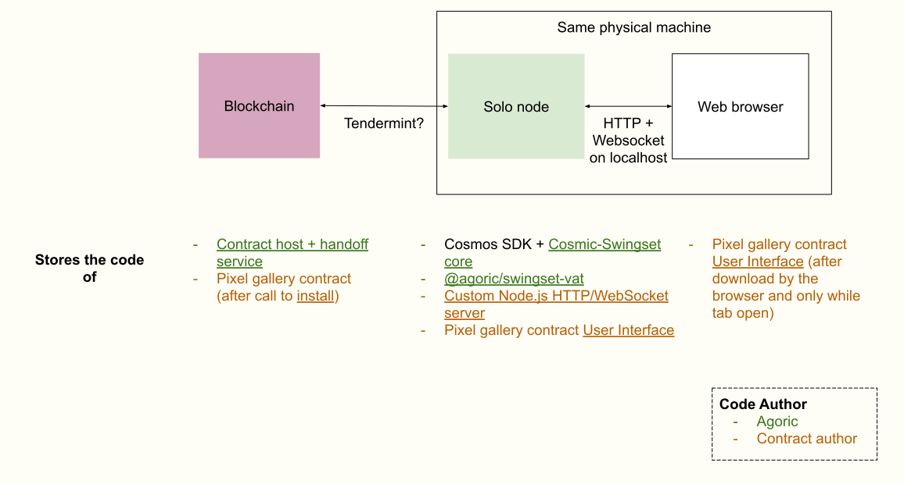

# Contract UX code architecture

The following diagrams show where code is stored in the Pixel Galery Demo

Code storage is documented, because it affects **building** and **distribution** the various software parts, which in turn affect security properties of the smart contract user experience

Code that is stored in the blockchain is more easily auditable and unless the blockchain integrity is attacked, the code that runs is the code that is stored
This is less true for code stored in the solo node which might be distributed by Agoric or by the contract author

Here is a diagram of the current Pixel Gallery Demo contract UX code architecture:

