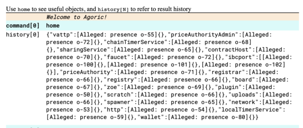

# Agoric REPL

**Note**: This page describes the Agoric REPL. For information about the `Node.js` REPL, 
click [here](https://nodejs.org/api/repl.html).

## Introduction

When you run `agoric start --reset`, you start a local *ag-solo*. 

All deployment happens via the local running Agoric process. This is usually the 
ag-solo process, and frequently referred to as that or just as ag-solo. It is also 
sometimes described as/called an Agoric VM or a local server.

An ag-solo communicates with either a locally running or remote chain. The local process 
has a `home` object, which contains references to services on-chain, including Zoe, the 
Board for sharing objects, and an application user's Wallet among others. Developers can 
use these service references to call the service's associated API commands.

Deploying a contract to the chain first uploads the bundled contract source code to the 
local Agoric ag-solo process. The deployment script then uses the `home` object to access 
Zoe which installs the code on chain.

An ag-solo has an associated REPL (*Read-Eval-Print Loop*). From the REPL and the `home`
object, developers can use all the on-chain commands that deployment scripts use to 
deploy contracts and Dapps. They can also run JavaScript commands from the REPL. 

## Accessing the REPL

Once an ag-solo is running and on-chain, you can access its associated REPL
in two ways. 
- In a browser tab, go to `localhost:8000`. Depending on the browser's width, you
  will see the Wallet UI and REPL either in separate columns or separate rows.


- From a shell, run `agoric open --repl` This opens the user's Wallet UI and its
  associated REPL. To open only the REPL, run `agoric open --repl only`


## Using the REPL

You can run JavaScript commands from the REPL. You can also use the REPL's 
`home` object's predefined connections to other objects and services. To see what’s 
available, just type `home` into the REPL:



```js
Command[1] home
History[1] {"chainTimerService":[Presence o-50],"sharingService":[Presence o-51],"contractHost":[Presence o-52],"ibcport":[Presence o-53],"registrar":[Presence o-54],"registry":[Presence o-55],"zoe":[Presence o-56],"localTimerService":[Presence o-57],"uploads":[Presence o-58],"spawner":[Presence o-59],"wallet":[Presence o-60],"network":[Presence o-61],"http":[Presence o-62]}
```
The results of what is entered into the REPL is saved under `history[N]`

Here’s a better formatted list of the `home` objects with brief description of each. The
link on each object name takes you to a more detailed documentation page for that object.
Several `home` objects are either for internal Agoric use only or have been deprecated. These
listed together at the end and external developers should ignore them and not try to use
them.

- [`wallet`](/wallet-api.md): The link takes you to the standard `wallet` API documentation. When calling
   a `wallet` API methods from the REPL, `wallet` must be prefaced by
   `home.` and use `E()`. For example, `E(home.wallet).getPurses()`   
- [`chainTimerService`](./timerService.md): Chain-based timing service used to schedule events.
- [`localTimerService`](./timerService.md): Local vat-based timing service used to schedule events 
- [`board`](./board.md): The Board is a shared, on-chain location where users can post a 
  value and make it accessible to others.
- `sharingService`: Lets you share items between vats connected to the same remote chain vat.
- `ibcport`:
- [`zoe`](/zoe/api/zoe.md): This link takes you
   to the standard `zoe` API documentation. When calling
   any of the `zoe` API methods from the REPL, `zoe` must be prefaced by
   `home.` and use `E()`. For example, `E(home.zoe).getFoo()` 
- `spawner`: Launches programs running on your local ag-solo. **tyg todo: Unclear what commands would be used from the REPL?**
- [`priceAuthority`](./priceAuthority.md):
- `priceAuthorityAdmin`:
- `scratch`:

Click on each object link above to go to its documentation.

The following `home` objects should be ignored.
- `contractHost`: Replaced by the `spawner` object.
- `faucet`: Internal for chain setup.
- `http`: `api/deploy.js` uses this to install new HTTP and WebSocket handlers in an
   ag-solo.  You should not need to use it. 
- `network`: Privileged object for internal use.
- `plugin`: Privileged object for internal use.
- `registrar`: Deprecated.
- `registry`: Deprecated.
- `uploads`: Deprecated name for `scratch`.
- `vattp`: Privileged object for internal use.

