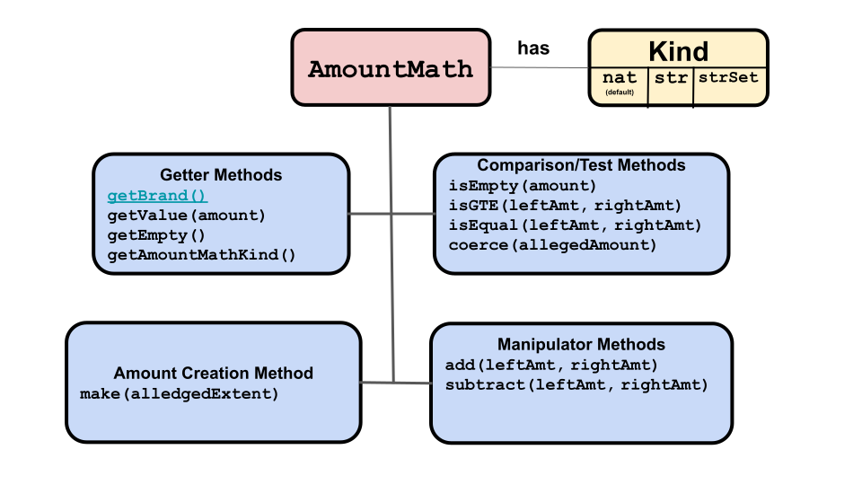

# Amount Math

 

`issuer` objects must be able to add and withdraw assets from a
`purse` and manipulate `payment` amounts. This 
requires being able to add and subtract digital assets. To do this,
and other operations on `amount` objects, an `issuer` uses a set 
of `amountMath` methods. 

In addition to math operations, `amountMath` methods check on their
arguments' brands, throwing an error if the wrong `brand` was used.

There are three different kinds of `amountMath`s, each of which
implements the same set of methods. When you create an `issuer`, you
do so for a specific `brand`. You thus have to specify which kind of
`amountMath` that `brand` uses. The 
correct kind is automatically used whenever an `amountMath` method
is used on `amount` objects with that `brand`. The kinds are: 
- `nat`: Used with fungible assests (i.e. natural numbers).
- `strSet`: Used with non-fungible assets (i.e. strings).
- `set`: Used with sets of objects, primarily non-fungible assets.

`makeIssuerKit(allegedName, amountMathKind)` creates a new `issuer`.
The second, optional, argument specifies which kind
of `amountMath` your contract uses for the `brand` in a one-to-one
association with the new `issuer`. It defaults to `nat` if not given. For example: 
```js
makeIssuerKit('quatloos`); // Defaults to 'nat'
makeIssuerKit('quatloos', 'strSet');
makeIssuerKit('quatloos, 'set');
```
`AmountMath` has:
- Three information getting methods (get brand, get value, and get
`amountMath` kind)
- Four comparison methods (is an amount empty, is an amount valid,
are two amounts equal, and is one amount greater than or equal to another)
- Two manipulator methods (add and subtract amounts)
- One amount creation method (create an `amount` with the
  `amountMath`'s associated `brand`)

The following is a brief description and example of each `amountMath` method. For
more detail, click the method's name to go to its entry in the ERTP
API Reference.

- **Information Getting Methods**
  - [`amountMath.getBrand()`](https://agoric.com/documentation/ertp/api/amount-math.html#amountmath-getbrand)
    - For this `amountMath`, return its `brand`.
    - ```js
      const { issuer } = makeIssuerKit('bucks');
      const exampleAmountMath = issuer.getAmountMath();
      const exampleBrand = exampleAmountMath.getBrand();
      ```
  - [`amountMath.getValue(amount)`](https://agoric.com/documentation/ertp/api/amount-math.html#amountmath-getvalue-amount)
    - Returns the `value` of the `amount` argument. 
    - ```js 
      const { amountMath } = makeIssuerKit('bucks'); 
      const fungible123 = amountMath.make(123); 
      // returns 123 
      const value = amountMath.getValue(amount); 
      ```
  - [`amountMath.getAmountMathKind()`](https://agoric.com/documentation/ertp/api/amount-math.html#amountmath-getmathhelpersname)
    - Returns a string of either 'nat', 'str', or 'strSet',
       indicating the kind of methods this
       `amountMath` uses.
    - ```js
       const { amountMath } = makeIssuerKit('bucks');
       amountMath.getAmountMathKind(); // 'nat'
       ```
  - [`amountMath.getEmpty()`](https://agoric.com/documentation/ertp/api/amount-math.html#amountmath-getempty)
    - Returns an `amount` representing an empty `amount` (which is the identity
       element for the `amountMath` `add()` and `subtract()`
       operations. Note that this value varies depending on the
       `brand` and whether `amountMath` is of kind `nat`, `str`, or `strSet`..
    - ```js
	   const { amountMath } = makeIssuerKit('bucks');
	   // Returns an empty amount for this issuer.
       // Since this is a fungible amount it returns 0
       const empty = amountMath.getEmpty();
       ```
- **Comparison Methods**
  - [`amountMath.isEmpty(amount)`](https://agoric.com/documentation/ertp/api/amount-math.html#amountmath-isempty-amount)
    - Returns `true` if its `amount` argument is empty, otherwise `false`.
    - ```js
      const { amountMath } = makeIssuerKit('fungible');
      const empty = amountMath.getEmpty();
      const fungible1 = amountMath.make(1);
      amountMath.isEmpty(empty)
      // returns false
      amountMath.isEmpty(fungible1)
      ```
  - [`amountMath.isGTE(leftAmount, rightAmount)`](https://agoric.com/documentation/ertp/api/amount-math.html#amountmath-isgte-leftamount-rightamount)
    - Returns `true` if the `leftAmount` argument is greater than or equal
       to the `rightAmount` argument, `false` otherwise.
    - ```js
      const { amountMath } = makeIssuerKit('fungible');
      const empty = amountMath.getEmpty();
      const fungible1 = amountMath.make(1);
      // Returns true
      amountMath.isGTE(fungible1, empty);
      // Returns false
      amountMath.isGTE(empty, fungible1);
      ```
  - [`amountMath.isEqual(leftAmount, rightAmount)`](https://agoric.com/documentation/ertp/api/amount-math.html#amountmath-isequal-leftamount-rightamount)
    - Returns `true` if the `leftAmount` argument equals the
	`rightAmount` argment
    - ```js
      const { amountMath } = makeIssuerKit('fungible');
      const empty = amountMath.getEmpty();
      const fungible1 = amountMath.make(1);
      const anotherFungible1 = amountMath.make(1);

      // Returns true
      amountMath.isEqual(fungible1, anotherFungible1);
      // Returns false
      amountMath.isEqual(empty, fungible1);
      ```
  - [`amountMath.coerce(allegedAmountOrValue)`](https://agoric.com/documentation/ertp/api/amount-math.html#amountmath-coerce-allegedamountorvalue)
    - Takes an `amount` and returns it if it's a valid `amount`   
      **(tyg todo: What does it return if not a valid amount? Also,
      claims it can take a value, but the type of argument is only
      given as an amount. If it can take a `value`, what does it
      return on success/failure?**
    - ```js
      const { amountMath } = makeIssuerKit('bucks');  
      const bucks50 = amountMath.make(50);
      amountMath.coerce(bucks50); /equal to bucks50
      ```
- **Manipulator Methods**

  - [`amountMath.add(leftAmount, rightAmount)`](https://agoric.com/documentation/ertp/api/amount-math.html#amountmath-add-leftamount-rightamount)
    - Returns an `amount` that is the union of the `leftAmount` and `rightAmount`.
       `amount` arguments. For a fungible `amount`, this means add their
       values.  For a non-fungible `amount`, it usually means
       including all elements from both `leftAmount` and `rightAmount`.
    - ```js
      const { amountMath } = makeIssuerKit('myItems', 'strSet');
      const listAmountA = amountMath.make(harden['1','2','4']);
      const listAmountB = amountMath.make(harden['3']);

      // Returns ['1', '2', '4', '3']
      const combinedList = amountMath.add(listAmountA, listAmountB);
      ```
  - [`amountMath.subtract(leftAmount, rightAmount)`](https://agoric.com/documentation/ertp/api/amount-math.html#amountmath-subtract-leftamount-rightamount)
    - Returns a new `amount` that is the `leftAmount` argument minus
      the `rightAmount` argument  (i.e. for strings or objects
      everything in `leftAmount` not in `rightAmount`). If `leftAmount`
      doesn't include `rightAmount` (subtraction results in a
      negative), throws error. 
    - ```js
      const { amountMath } = makeIssuerKit('myItems', 'strSet');
      const listAmountA = amountMath.make(harden['1','2','4']);
      const listAmountB = amountMath.make(harden['3']);
      const listAmountC = amountMath.make(harden['2']);
      // Returns ['1', '4']
      const subtractedList = amountMath.subtract(listAmountA, listAmountC)
      // Throws error
      const badList = amountMath.subtract(listAmountA, listAmountB)
      ```
- **Amount creation method**
  - [`amountMath.make(allegedValue)`](https://agoric.com/documentation/ertp/api/amount-math.html#amountmath-make-allegedvalue)	
    - Takes a `value` argument and returns an `amount` by combining the
       `amountMath`'s associated `brand` to the `value`.
    - ```js
      const {amountMath } = makeIssuerKit('bucks');
      const amount837 = amountMath.make(837);
      ```
 
## Methods on other objects

These methods either use or return `amountMath` objects:

- [`makeIssuerKit(alledgedName, amountMathKind)`](https://agoric.com/documentation/ertp/api/issuer.html#makeissuerkit-allegedname-mathhelpername)
  - Creates a new `issuer` that uses the `amountMath` kind
    designated by the `amountMathKind` argument (`nat`, `str`,
    `strSet`).
- [`issuer.getAmountMathKind()`](https://agoric.com/documentation/ertp/api/issuer.html#issuer-getmathhelpersname)
  - Returns the kind of AmountMath the `issuer` uses (`nat`, `str`, or `strSet`).	
- [`zcf.getAmountMath(brand)`](https://agoric.com/documentation/zoe/api/zoe-contract-facet.html#zcf-getamountmath-brand)
  - Returns the `amountMath` object associated with the `brand`
  argument.
  - ```js
    const ticketIssuer = publicAPI.getTicketIssuer();
    const ticketAmountMath = ticketIssuer.getAmountMath();
    ```
- [`issuer.getAmountMath()`](https://agoric.com/documentation/ertp/api/issuer.html#issuer-getamountmath)
  - Returns the `amountMath` object for this `issuer`.   
  - ```js
    const { issuer, amountMath } = makeIssuerKit('bucks');
    const issuerAmountMath = issuer.getAmountMath();
    // amountMath === issuerAmountMath
    ```
