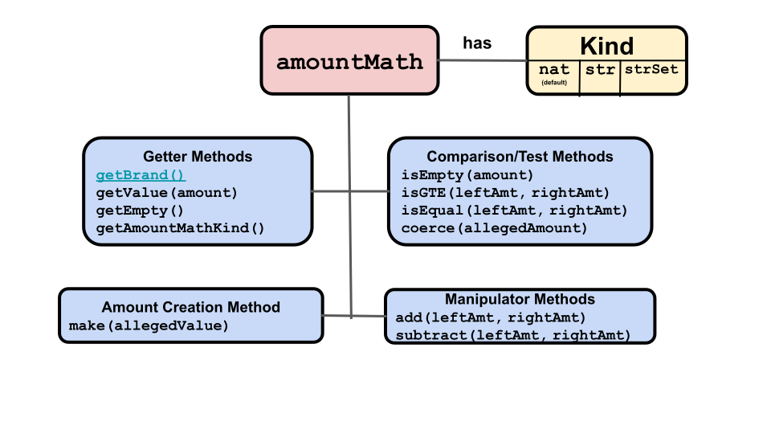

# Amount Math

 

You must be able to deposit and withdraw assets from a
`purse` and manipulate `payment` amounts. This 
requires adding and subtracting digital assets. To do this,
and other operations on an `amount`, you use `amountMath`methods. 

In addition to math operations, `amountMath` methods check the `brand`
of their arguments, throwing an error if the wrong `brand` was used.

There are three different kinds of `amountMath` methods, each of which
implements the same methods. When you create an `issuer` for a specific
`brand`, you also create an `amountMath` in a one-to-one relationship
with that `brand`. 

This means you have to specify which kind of`amountMath` to use
on an `amount` of that `brand`. That 
kind is automatically used whenever an `amountMath` method
is used on an `amount` with that `brand`. The kinds are: 
- `nat`: Used with fungible assets (the values are natural numbers).
- `strSet`: Used with non-fungible assets (the values are strings).
- `set`: Used with sets of objects, primarily non-fungible assets.

`makeIssuerKit(allegedName, amountMathKind)` creates a new `issuer`,
`mint`, `brand`, and `amountMath`. 
The second, optional, argument specifies which kind
of `amountMath` is used for the `brand` in a one-to-one
association with the new `issuer`. It defaults to `nat` if not given. 

For example: 
```js
makeIssuerKit('Quatloos`); // Defaults to 'nat'
makeIssuerKit('Quatloos', 'strSet');
makeIssuerKit('Quatloos, 'set');
```
`AmountMath` has:
- Three information getting methods (get `brand`, get `value`, and get
`amountMath` kind)
- Four comparison methods (is an `amount` empty, is an `amount` valid,
are two `amounts` equal, and is one `amount` greater than or equal to another)
- Two manipulator methods (`amount` addition and subtraction)
- Two amount creation methods (create an `amount` with a specified `value`, and get a new, empty, `amount`)

The following is a brief description and example of each `amountMath` method. For
more detail, click the method's name to go to its entry in the [ERTP
API Reference](https://agoric.com/documentation/ertp/api/#ertp-api).

- **Information Getting Methods**
  - [`amountMath.getBrand()`](https://agoric.com/documentation/ertp/api/amount-math.html#amountmath-getbrand)
    - For this `amountMath`, return the `brand` it can operate on..
    - ```js
      const { quatloosIssuer, quatloosAmountMath } = makeIssuerKit('Quatloos');
      const quatloosBrand = quatloosAmountMath.getBrand();
      ```
  - [`amountMath.getValue(amount)`](https://agoric.com/documentation/ertp/api/amount-math.html#amountmath-getvalue-amount)
    - Returns the `value` of the `amount` argument. 
    - ```js 
      const { quatloosAmountMath } = makeIssuerKit('quatloos'); 
      const quatloos123 = amountMath.make(123); 
      // returns 123 
      const value = quatloosAmountMath.getValue(quatloos123); 
      ```
  - [`amountMath.getAmountMathKind()`](https://agoric.com/documentation/ertp/api/amount-math.html#amountmath-getmathhelpersname)
    - Returns a string of either `'nat'`, `'str'`, or `'strSet'`,
       indicating the kind of values this
       `amountMath` operates on.
    - ```js
       // amountMath kind defaults to `nat`
       const { quatloosAmountMath } = makeIssuerKit('quatloos');
       const kind = quatloosAmountMath.getAmountMathKind(); // returns 'nat'
       ```
  - [`amountMath.getEmpty()`](https://agoric.com/documentation/ertp/api/amount-math.html#amountmath-getempty)
    - Returns an `amount` representing an empty `amount` (which is the identity
       element for the `amountMath` `add()` and `subtract()`
       operations. Note that this value varies depending on the
       `brand` and whether its `amountMath` is of kind `nat`, `str`, or `strSet`..
    - ```js
      const { quatloosAmountMath } = makeIssuerKit('quatloos');
      // Returns an empty amount for this issuer.
      // Since this is a fungible amount it returns 0
      const empty = quatloosAmountMath.getEmpty();
      ```
- **Comparison Methods**
  - [`amountMath.isEmpty(amount)`](https://agoric.com/documentation/ertp/api/amount-math.html#amountmath-isempty-amount)
    - Returns `true` if its `amount` argument is empty, otherwise `false`.
    - ```js
      const { quatloosAmountMath } = makeIssuerKit('quatloos');
      const empty = quatloosAmountMath.getEmpty();
      const quatloos1 = quatloosAmountMath.make(1);
      // returns true
      quatloosAmountMath.isEmpty(empty)
      // returns false
      quatloosAmountMath.isEmpty(quatloos1)
      ```
  - [`amountMath.isGTE(leftAmount, rightAmount)`](https://agoric.com/documentation/ertp/api/amount-math.html#amountmath-isgte-leftamount-rightamount)
    - Returns `true` if the `leftAmount` argument is greater than or equal
       to the `rightAmount` argument, otherwise `false`.
    - ```js
      const { quatloosAmountMath } = makeIssuerKit('quatloos');
      const empty = quatloosAmountMath.getEmpty();
      const quatloos1 = quatloosAmountMath.make(1);
      // Returns true
      quatloosAmountMath.isGTE(fungible1, empty);
      // Returns false
      quatloosAmountMath.isGTE(empty, quatloos1);
      ```
  - [`amountMath.isEqual(leftAmount, rightAmount)`](https://agoric.com/documentation/ertp/api/amount-math.html#amountmath-isequal-leftamount-rightamount)
    - Returns `true` if the `leftAmount` argument equals the
	`rightAmount` argument
    - ```js
      const { quatloosAmountMath } = makeIssuerKit('quatloos');
      const empty = quatloosAmountMath.getEmpty();
      const quatloos1 = quatloosAmountMath.make(1);
      const anotherQuatloos1 = quatloosAmountMath.make(1);

      // Returns true
      quatloosAmountMath.isEqual(fungible1, anotherQuatloos1);
      // Returns false
      quatloosAmountMath.isEqual(empty, quatloos1);
      ```
  - [`amountMath.coerce(allegedAmount)`](https://agoric.com/documentation/ertp/api/amount-math.html#amountmath-coerce-allegedamount)
    - Takes an `amount` and returns it if it's a valid `amount`.
      If invalid, it throws an error.
    - ```js
      const { quatloosAmountMath } = makeIssuerKit('quatloos');  
      const quatloos50 = quatloosAmountMath.make(50);
      quatloosAmountMath.coerce(quatloos50); /equal to quatloos50
      ```
- **Manipulator Methods**

  - [`amountMath.add(leftAmount, rightAmount)`](https://agoric.com/documentation/ertp/api/amount-math.html#amountmath-add-leftamount-rightamount)
    - Returns an `amount` that is the union of the `leftAmount` and `rightAmount`
       `amount` arguments. For a fungible `amount`, this means add their
       values.  For a non-fungible `amount`, it usually means
       including all elements from both `leftAmount` and `rightAmount`.
    - ```js
      const { myItemsAmountMath } = makeIssuerKit('myItems', 'strSet');
      const listAmountA = myItemsAmountMath.make(harden['1','2','4']);
      const listAmountB = myItemsAmountMath.make(harden['3']);

      // Returns an amount containing all of ['1', '2', '4', '3']
      const combinedList = myItemsAmountMath.add(listAmountA, listAmountB);
      ```
  - [`amountMath.subtract(leftAmount, rightAmount)`](https://agoric.com/documentation/ertp/api/amount-math.html#amountmath-subtract-leftamount-rightamount)
    - Returns a new `amount` that is the `leftAmount` argument minus
      the `rightAmount` argument  (i.e. for strings or objects
      everything in `leftAmount` not in `rightAmount`). If `leftAmount`
      doesn't include the contents of `rightAmount`, it throws an error. 
    - ```js
      const { myItemsAmountMath } = makeIssuerKit('myItems', 'strSet');
      const listAmountA = myItemsAmountMath.make(harden['1','2','4']);
      const listAmountB = myItemsAmountMath.make(harden['3']);
      const listAmountC = myItemsAmountMath.make(harden['2']);
      // Returns ['1', '4']
      const subtractedList = myItemsAmountMath.subtract(listAmountA, listAmountC)
      // Throws error
      const badList = myItemsAmountMath.subtract(listAmountA, listAmountB)
      ```
- **Amount Creation Methods**
  - [`amountMath.make(allegedValue)`](https://agoric.com/documentation/ertp/api/amount-math.html#amountmath-make-allegedvalue)	
    - Takes a `value` argument and returns an `amount` by combining the
       `amountMath` associated `brand` to the `value`.
    - ```js
      const { quatloosAmountMath } = makeIssuerKit('quatloos');
      /// An `amount` with `value` = 837 and `brand` = Quatloos
      const quatloos837 = quatloosAmountMath.make(837);
      ```
  - [`amountMath.getEmpty()`](https://agoric.com/documentation/ertp/api/amount-math.html#amountmath-getempty)
    - Returns an `amount` representing an empty `amount` (which is the identity
       element for the `amountMath` `add()` and `subtract()`
       operations. Note that this value varies depending on `amountMath`'s associated
       `brand` and whether `amountMath` is of kind `nat`, `str`, or `strSet`..
    - ```js
      const { quatloosAmountMath } = makeIssuerKit('quatloos');
      // Returns an empty amount for this issuer.
      // Since this is a fungible amount it returns 0
      const empty = quatloosAmountMath.getEmpty();
      ```  
 
## Methods on other objects

These methods either use or return `amountMath` objects:

- [`makeIssuerKit(allegedName, amountMathKind)`](https://agoric.com/documentation/ertp/api/issuer.html#makeissuerkit-allegedname-mathhelpername)
  - Creates a new `amountMath` that uses the `amountMath` kind
    designated by the `amountMathKind` argument (`nat`, `str`,
    `strSet`). Also creates a new `mint`, `issuer`, and `brand`.
- [`issuer.getAmountMathKind()`](https://agoric.com/documentation/ertp/api/issuer.html#issuer-getmathhelpersname)
  - Returns the kind of `amountMath` (`nat`, `str`, or `strSet`).	
- [`zcf.getAmountMath(brand)`](https://agoric.com/documentation/zoe/api/zoe-contract-facet.html#zcf-getamountmath-brand)
  - Returns the `amountMath` object associated with the `brand` argument.
  - ```js
    const ticketIssuer = publicAPI.getTicketIssuer();
    const ticketAmountMath = ticketIssuer.getAmountMath();
    ```
- [`issuer.getAmountMath()`](https://agoric.com/documentation/ertp/api/issuer.html#issuer-getamountmath)
  - Returns the `amountMath` object for this `issuer`.   
  - ```js
    const { issuer, amountMath } = makeIssuerKit('quatloos');
    const quatloosAmountMath = issuer.getAmountMath();
    // amountMath === quatloosAmountMath
    ```
