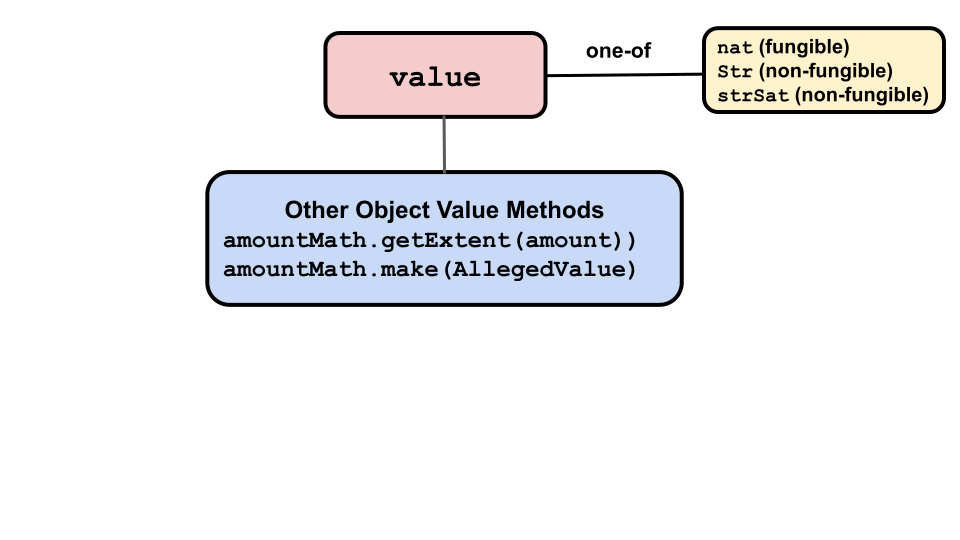

# Amounts, Values, and Brands

## Amounts

[`amount`](https://agoric.com/documentation/glossary/#amount) objects
have no API methods. Instead, each of an `amount` objects two
component objects, [`value`](https://agoric.com/documentation/glossary/#value) 
and [`brand`](https://agoric.com/documentation/glossary/#brand) have API methods. To get
information about and otherwise manipulate `amount` objects as a
whole, use the [`amountMath`](https://agoric.com/documentation/glossary/#amountmath) API methods.

Amounts describe digital assets.  Anyone with access to a `mint` object can
 create an `amount` object with new assets. 

By this, we mean it is possible to create a new `amount` object by
combining or splitting an existing one without using a `mint`; adding
2 quatloos to a purse with an `amount` of 3 quatloos results in an
`amount` of 5 quatloos. But to create a completely new `amount`
object of 7 quatloos requires access to the quatloos `mint` object. 

`amount` objects have two parts:
- **[Brand](https://agoric.com/documentation/glossary/#brand)**: The
  type of digital asset, such as our imaginary `qualtoos` currency or,
  in a game, a powerful magic sword.
- **[Value](https://agoric.com/documentation/glossary/#value)**: How much/many of the asset. Fungible values are natural
numbers. Non-fungible values may be represented as strings naming a
particular right, or an arbitrary object representing the rights at
issue (say, a theater ticket's date, time, row and seat positions).

Amounts and their values and brands, are manipulated by
the [`amountMath`](https://agoric.com/documentation/glossary/#amountmath)
API. It executes the logic of how amounts are changed when digital 
assets are merged, separated, or otherwise manipulated. For example, a 
deposit of 2 bucks into a purse that already has 3 bucks gives a new 
balance of 5 bucks. An empty purse has 0 bucks.

As fungible and non-fungible assets have different types as values,
there are three different types of `amountMath` methods, one 
for each kind of value. Each implements the same set of methods.

When you create an `issuer` for a
brand, you specify which kind of `amountMath` the brand uses. The
correct type is automatically used whenever an `amountMath` method
is used with that brand. The possible values are:
- `nat`: Used with fungible assests (i.e. natural numbers).
- `strSet`: Used with non-fungible assets (i.e. strings).
- `set`: Used with sets of objects, primarily non-fungible assets.

Use
[`makeIssuerKit(allegedName, amountMathType)`](https://agoric.com/documentation/ertp/api/issuer.html#produceissuer-allegedname-mathhelpername)
 to specify which kind of `amountMath` your contract uses for the brand
 associated with the created `issuer`.  The second parameter,
 `amountMathType`, is optional and defaults to `nat` if not given. For
 example: 
```js
makeIssuerKit('quatloos`); // Defaults to 'nat'
makeIssuerKit('quatloos', 'strSet');
makeIssuerKit('quatloos, 'set');
```

You should make and use a local version of `AmountMath` for the brands
your contract works with:
```js
const { issuer, brand } = makeIssuerKit('bucks'); //Defaults to 'nat' 
const amountMathName = issuer.getAmountMathKind(); // 'nat'
const localAmountMath = makeAmountMath(brand, type)
```

From then on, use `localAmountMath.<method>()`, which will in turn use
the appropriate kind of `amountMath` method.

**Note**: Prior to July 2020, Agoric exposed the `mathHelpers` object
type, and users referred to the three kinds of
`mathHelpers` and `mathHelpersName`. `mathHelpers` and its methods
were no longer used by contract developers, their methods being
subsumed by `amountMath` methods. References to `mathHelpersName` were
changed to `amountMathKind` and the `mathHelpers` methods were deprecated.

You can send an `amount` object to anyone by making it the value of a `payment`. 

## Brands

 

A `brand` object is an `amount` object's kind of digital asset, such as
our imaginary qualtoos currency or, in a game, a powerful magic
sword.

As we'll see later, `mint` objects create new asset `amount`
objects. Each `mint` has a one-to-one relationship with an `issuer`
object (also see later). And each `issuer` object has a one-to-one
relationship with a `brand` object. This means:
- `mint`s can only create `amount`s for one specific `brand`, which
  must be the same `brand` as their associated `issuer`.
- `issuer`s can only create new empty `purse` and `payment` objects
for one specific `brand`, the same as their associated `issuer`.
- `amount`s are either fungible or non-fungible, as determined by which
their `mint`'s `issuer`, and thus their `brand`, was created to be. 

`brand` objects have two associated methods:
- [`brand.isMyIssuer(issuer)`](https://agoric.com/documentation/ertp/api/brand.html#brand-ismyissuer-issuer)
  - Returns `true` is the brand is the one associated with the
  `issuer` argument. 
  - ```js
    const isIssuer = brand.isMyIssuer(issuer);
    ```
- [`brand.getAllegedName()`](https://agoric.com/documentation/ertp/api/brand.html#brand-getallegedname)
  - Return the `brand`'s alleged name, but should not be trusted as accurate.
  - ```js
    const name = brand.getAllegedName();
    ```

The following methods on other object types also either operate on or
return `brand` objects.

- [`issuer.getBrand()`](https://agoric.com/documentation/ertp/api/issuer.html#issuer-getBrand)
  - Returns the `brand` for the `issuer`. The `brand` is not closely
    held, so this should not be trusted to identify an `issuer`
    alone. Fake digital assets and `amount`s can use another`
    issuer`'s `brand`.
  - ```js
    const { issuer, brand } = makeIssuerKit('bucks');
    const bucksBrand = issuer.getBrand();
    // brand === bucksBrand
    ```
- [`payment.getAllegedBrand()`](https://agoric.com/documentation/ertp/api/payment.html#payment-getallegedbrand)
  - Return the `payment`s alledged `brand` object. Because `payment`s
  are not trusted, this should be treated with suspicion and verified
  elsewhere.
  - ```js
    const { issuer, mint, brand, amountMath } = makeIssuerKit('bucks');
    const payment = mint.mintPayment(amountMath.make(10));
    const officialBrand = payment.getAllegedBrand();
    ```
- [`amountMath.getBrand()`](https://agoric.com/documentation/ertp/api/amount-math.html#amountmath-getbrand)
  - Return the `brand` the `amountMath` object is using for its
  methods.
  - ```js
    const { issuer } = makeIssuerKit('bucks');
    const exampleAmountMath = issuer.getAmountMath();
    const exampleBrand = exampleAmountMath.getBrand();
    ```

## Values

 

Values are the "how many" part of `amount` objects. `value`s have no
methods of their own, but several `amountMath` methods use or return
them. Otherwise, see the [Amounts](#amounts) section for methods which interact
with complete `amount` objects, including their `value` part.

- [`amountMath.getValue(amount)`](https://agoric.com/documentation/ertp/api/amount-math.html#amountmath-getvalue-amount)
  - Return the `amount` argument's `value`
  - ```js
    const { amountMath } = makeIssuerKit('bucks');
    const fungible123 = amountMath.make(123);
    // returns 123
    const value = amountMath.getValue(amount);
    ```
- [`amountMath.make(alledgedValue)`](https://agoric.com/documentation/ertp/api/amount-math.html#amountmath-make-allegedvalue)
  - Make an `amount`from a `value` by adding the
  `amountMath`'s associated `brand` to the `value`. **tyg todo: Not sure what good this is, since it's
    not an actual amount/assets, since those can only be created by mints?**  
  - ```js
    const { amountMath } = makeIssuerKit('bucks');
    const amount837 = amountMath.make(837);
    ```
