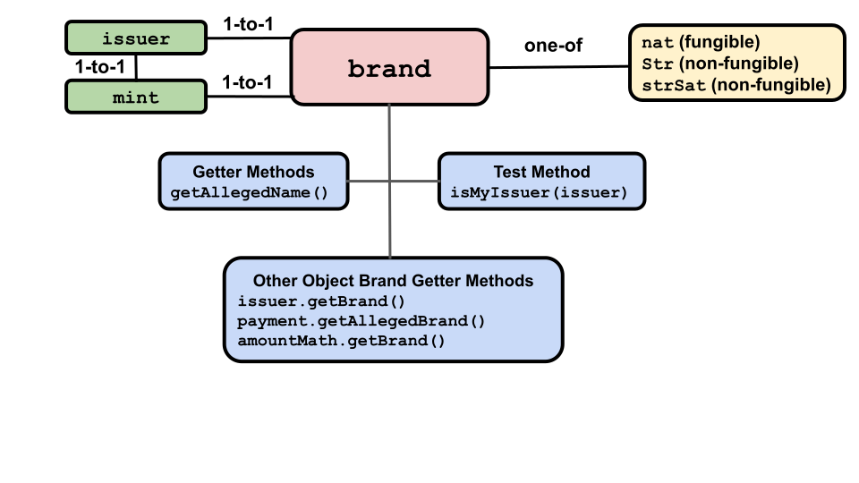
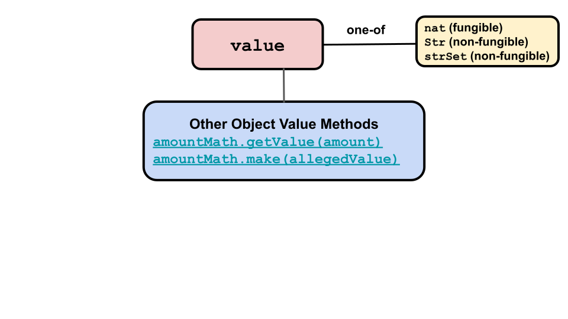

# Amounts, Values, and Brands

## Amounts

Amounts describe digital assets. There are no `amount` API methods.
Instead, an `amount` has two properties, `value` and `brand` with their own API methods.
Use the `amountMath` (covered in-depth [here](./AmountMath.html)) API methods 
to get information about and otherwise manipulate an `amount` as a whole.

`amount` has two properties:
- **Brand**: The kind of digital asset, such as our imaginary `quatloos` currency or,
  in a game, a powerful magic sword.
- **Value**: How much/many of the asset. Fungible values are natural
numbers. Non-fungible values may be represented as strings naming a
particular right, or an arbitrary object representing the rights at
issue (e.g., a theater ticket's date, time, row and seat positions).

Amounts and their values and brands, are manipulated by
the [`amountMath`](https://agoric.com/documentation/glossary/#amountmath)
API. It executes the logic of how amounts are changed when digital 
assets are merged, separated, or otherwise manipulated. For example, 
you make an offer for something, which is declined. You want to change your 
offer, which was represented as an `amount`, to be of a greater `value` by adding to it.

As fungible and non-fungible assets have different kinds of values,
there are three different kinds of `amountMath` methods, one 
for each kind of value. Each implements the same methods.

When you create an `issuer` for a
`brand`, you specify which kind of `amountMath` the brand uses. The
correct kind is automatically used whenever an `amountMath` method
is used on an a`amount` with that `brand`. The possible values are:
- `nat`: Used with fungible assets (the values are natural numbers).
- `strSet`: Used with non-fungible assets (the values are strings).
- `set`: Used with sets of objects, primarily non-fungible assets.

Use
[`makeIssuerKit(allegedName, amountMathKind)`](https://agoric.com/documentation/ertp/api/issuer.html#produceissuer-allegedname-mathhelpername)
 to specify which kind of `amountMath` your contract uses for the `brand`
 associated with the created `issuer`.  The second parameter,
 `amountMathKind`, is optional and defaults to `nat` if not given. For
 example: 
```js
makeIssuerKit('quatloos`); // Defaults to 'nat'
makeIssuerKit('quatloos', 'strSet');
makeIssuerKit('quatloos, 'set');
```

You should make and use a local version of `AmountMath` for any `brand`
your contract works with:
```js
const { issuer, brand } = makeIssuerKit('bucks'); //Defaults to 'nat' 
const amountMathName = issuer.getAmountMathKind(); // 'nat'
const localAmountMath = makeAmountMath(brand, type)
```

From then on, use `localAmountMath.<method>()`, which will in turn use
the appropriate kind of `amountMath` method.

**Note**: Prior to July 2020, Agoric exposed the `mathHelpers` object
type, and users referred to the three kinds of
`mathHelpers` and `mathHelpersName`. `mathHelpers` and its methods
were no longer used by contract developers, their methods being
subsumed by `amountMath` methods. References to `mathHelpersName` were
changed to `amountMathKind` and the `mathHelpers` methods were deprecated.

## Brands

 

A `brand` object is an `amount` object's kind of digital asset, such as
our imaginary qualtoos currency or, in a game, a powerful magic
sword.

As we'll see later, `mint` objects create new asset `payment`
objects. Each `mint` has a one-to-one relationship with an `issuer`
object (also see later). And each `issuer` object has a one-to-one
relationship with a `brand` object. This means:
- `mint`s can only create `payment`s for one specific `brand`, which
  must be the same `brand` as their associated `issuer`.
- `issuer`s can only create new empty `purse` objects
for one specific `brand`, the same as their associated `issuer`.
- `amount`s are either fungible or non-fungible, as determined by which
their `issuer`, and thus their `brand`, was created to be. 

`brand` objects have two associated methods:
- [`brand.isMyIssuer(issuer)`](https://agoric.com/documentation/ertp/api/brand.html#brand-ismyissuer-issuer)
  - Returns `true` if the `issuer` argument matches the `issuer` associated with the brand.
    We have this method because the `issuer` is authoritative and the `brand` is not. You can
    create a `payment`, `purse`, or `amount` with a `brand` that claims a particular `issuer`,
    without that `issuer` having been involved. But if you use that `payment` or `purse`, it won't be 
    accepted by genuine ones. So to know, you have to verify with the `issuer` to see if it agrees
  - ```js
    const isIssuer = brand.isMyIssuer(issuer);
    ```
- [`brand.getAllegedName()`](https://agoric.com/documentation/ertp/api/brand.html#brand-getallegedname)
  - Return the `brand`'s alleged name, but should not be trusted as accurate.
  - ```js
    const name = brand.getAllegedName();
    ```

The following methods on other object types also either operate on or
return a `brand`.

- [`issuer.getBrand()`](https://agoric.com/documentation/ertp/api/issuer.html#issuer-getBrand)
  - Returns the `brand` for the `issuer`. The `brand` is not closely
    held, so this should not be trusted to identify an `issuer`
    alone. Fake digital assets and `amount`s can use the `brand` of another `issuer`.
  - ```js
    const { issuer, brand } = makeIssuerKit('bucks');
    const bucksBrand = issuer.getBrand();
    // brand === bucksBrand
    ```
- [`payment.getAllegedBrand()`](https://agoric.com/documentation/ertp/api/payment.html#payment-getallegedbrand)
  - Return the `payment`s alleged `brand` object. Because a `payment`
  is not trusted, this should be treated with suspicion and verified
  elsewhere. This example code determines if a payment we got from untrusted sources
  is valid. It uses the `brand` to find a `purse` we want to deposit it in, then verifies
  that it's genuine.
  - ```js
    function depositSomewhere(payment) {
      const allegedBrand = payment.getAllegedBrand();
      const probablyAppropriatePurse = brandToPurse.get(allegedBrand);
      if (allegedBrand === probablyAppropriatePurse.getAllegedBrand()) {
         probablyAppropriatePurse.deposit(payment);
      }
    }  
    ```
- [`amountMath.getBrand()`](https://agoric.com/documentation/ertp/api/amount-math.html#amountmath-getbrand)
  - Return the `brand` the `amountMath` object is using for its
  methods.
  - ```js
    const { issuer } = makeIssuerKit('bucks');
    const exampleAmountMath = issuer.getAmountMath();
    const exampleBrand = exampleAmountMath.getBrand();
    ```

## Values

 

Values are the "how many" part of `amount` objects. There are no `value`
methods, but several `amountMath` methods use or return them. 

- [`amountMath.getValue(amount)`](https://agoric.com/documentation/ertp/api/amount-math.html#amountmath-getvalue-amount)
  - Return the `amount` argument's `value`
  - ```js
    const { amountMath } = makeIssuerKit('bucks');
    const fungible123 = amountMath.make(123);
    // returns 123
    const value = amountMath.getValue(fungible123);
    ```
- [`amountMath.make(allegedValue)`](https://agoric.com/documentation/ertp/api/amount-math.html#amountmath-make-allegedvalue)
  - Make an `amount`from a `value` by adding the
  `amountMath`'s associated `brand` to the `value`. 
  - ```js
    const { amountMath } = makeIssuerKit('bucks');
    const amount837 = amountMath.make(837);
    ```
