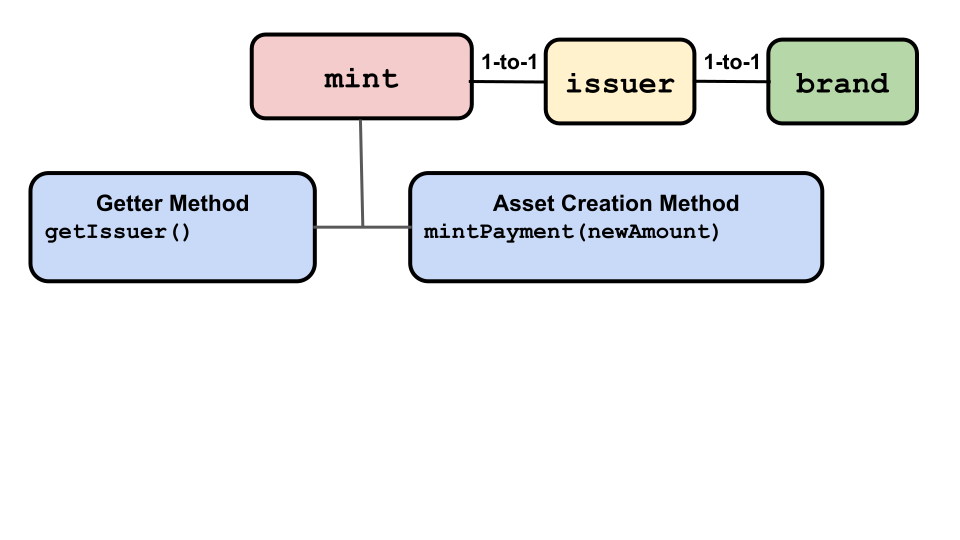

# Issuers and  Mints

## Issuers

  

An `issuer` maps minted digital assets to their location in a `purse`
or `payment`. An `issuer` verifies, moves, and manipulates digital assets. 
Its special admin facet is a `mint` which it has a one-to-one
relationship with. Only a `mint` can issue new digital assets.

An `issuer` also has a one-to-one relationship with a `brand`. So, if
our `brand`'s alleged name (for human reference) is *quatloos*, only
the `issuer` in the one-to-one relationship with the quatloos `brand`
can:
- Create a new empty `purse` that can store quatloos.
- Manipulate a `payment` in quatloos to be claimed, split, combined,
burned, or have its amount gotten.
- Use the operations in its associated `amountMath` on an `amount` of
  quatloos. 

The issuer cannot mint new amounts, but it can create empty purses and
payments. The issuer should be obtained from a trusted source and
then relied upon as the authority as to whether an untrusted payment
is valid.

`issuer` objects have 13 API commands. 4 return information about an
`issuer`, 1 creates a new `issuer`, 1 creates a new `purse`, and 7
which actually operate on their `payment` object argument.

- **Create issuer operation**
  - [`makeIssuerKit(allegedName, amountMathKind)`](https://agoric.com/documentation/ertp/api/issuer.html#makeissuerkit-allegedname-mathhelpername)
    - Makes an `issuer` and its related `amountMath` and `brand`
    objects that are in one-to-one relationships with each
    other. Returns ` { mint, issuer, amountMath, brand }`. The `alledgedName`
    is available from the `brand` to describe assets, but should not
    be trusted. `amountMathKind` specifies if the associated
    `amountMath` is of kind `nat` (the default), `str`, or `strSet`;
    see the [amountMath section]() for details. 
    - ```js
      const { issuer, mint, amountMath } = makeIssuerKit('bucks');
      // This is merely an amount, describing assets.
      const bucks2 = amountMath.make(2);
      const { mint, issuer, amountMath } = makeIssuerKit('alamedaCountyPropertyTitle', 'strSet');
	```
- **Get information about the issuer operations**
  - [`issuer.getBrand()`](https://agoric.com/documentation/ertp/api/issuer.html#issuer-getbrand) 
    - Returns the issuer's `brand` value. The brand is not closely
      held, so it can be used by fake digital assets and amounts. Do
      not trust this method alone to identify an issuer.
    - ```js
      const { issuer, brand } = makeIssuerKit('bucks');
      const bucksBrand = issuer.getBrand();
      // brand === bucksBrand
      ```
  - [`issuer.getAllegedName()`](https://agoric.com/documentation/ertp/api/issuer.html#issuer-getallegedname)
    - Returns the issuer/mint's
    [allegedName](https://agoric.com/documentation/glossary/#allegedname),
	the non-trusted human-readable name of the issuer's associated brand.
    - ```js
      const { issuer } = makeIssuerKit('bucks');
      const issuerAllegedName = issuer.getAllegedName();
      // issuerAllegedName === 'bucks'
       ```
  - [`issuer.getAmountMath()`](https://agoric.com/documentation/ertp/api/issuer.html#issuer-getamountmath) 
    - Gets the issuer's `AmountMath` object. If `payment` is a
    promise, the operation will proceed after the promise resolves. **(tyg todo: The last sentence is in the API description, but
    otherwise there's no specific link from an amountMath to a
    payment. Could someone expand/clarify this please?)**
    - ```js
      const { issuer, amountMath } = makeIssuerKit('bucks');
      const issuerAmountMath = issuer.getAmountMath();
      // amountMath === issuerAmountMath
      ```
  - [`issuer.getAmountMathKind()`](https://agoric.com/documentation/ertp/api/issuer.html#issuer-getmathhelpersname) 
    - Get the kind of `amountMath` for this issuer, either `nat`,
      `str`, or `strSet`.
    - ```js
      const { issuer } = makeIssuerKit('bucks');
      issuer.getAmountMathKind; // 'nat'
      ```
- **Purse operations**
  - [`issuer.makeEmptyPurse()`](https://agoric.com/documentation/ertp/api/issuer.html#issuer-makeemptypurse) 
    - Returns an empy purse for the `brand` associated with the issuer.
    - ```js
      const { issuer } = makeIssuerKit('bucks');
      const purse = exampleIssuer.makeEmptyPurse();
      ```
- **Payment operations**
  - [`issuer.getAmountOf(payment)`](htttps://agoric.com/documentation/ertp/api/issuer.html#issuer-getamountof-payment)
    - Returns an `amount` object containing the `payment` argument's
      balance. Using the issuer rather than the payment lets us trust
      the result. **tyg todo: Should this be "//returns { 100, "bucks"}"?**
    - ```js
      const { issuer, mint, amountMath } = makeIssuerKit('bucks');
      const payment = mint.mintPayment(amountMath.make(100));
      issuer.getAmountOf(payment); // returns 100
      ```
  - [`issuer.burn(payment, optAmount)`](https://agoric.com/documentation/ertp/api/issuer.html#issuer-burn-payment-optamount)
    - Burns (renders invalid) all of the `payment` argument's digital assets.
       If optional argument `optAmount` is present, the `payment`
       balance must be equal to its value.  If `payment` is a promise, the operation 
       happens after the promise resolves.
    - ```js
      const { issuer, mint, amountMath } = makeIssuerKit('bucks');
      const amountToBurn = amountMath.make(10);
      const paymentToBurn = mint.mintPayment(amountToBurn);

      // burntAmount should equal 10
      const burntAmount = issuer.burn(paymentToBurn, amountToBurn);
      ```
  - [`issuer.claim(payment, optAmount)`](https://agoric.com/documentation/ertp/api/issuer.html#issuer-claim-payment-optamount)
    - Transfer all digital assets from `payment` to a new payment and
	burn the original so no other references to this `payment` survive.
    if optional argument `optAmount` is present, the `payment` balance
	must be equal to its balance, otherwise it throws an error. If `payment`
    is a promise, the operation happens after the promise resolves.
    - ```js
      const { mint, issuer, amountMath } = makeIssuerKit('bucks');
      const amountExpectedToTransfer = amountMath.make(2);
      const originalPayment = mint.mintPayment(amountExpectedToTransfer);
      const newPayment = issuer.claim(originalPayment, amountToTransfer);
      ```
  - [`issuer.combine(paymentsArray)`](https://agoric.com/documentation/ertp/api/issuer.html#issuer-combine-paymentsarray)
    - Combine multiple `payment`s into one `payment`. If any `payment`
      in `paymentsArray` is a promise, the operation happens after all
      `payment`s resolve. The `payment`s are all burned except for the
      returned one. You cannot combine `payment`s of different brands.
    - ```js
      const { mint, issuer, amountMath } = makeIssuerKit('bucks');
      // create an array of 100 payments of 1 unit each
      const payments = [];
      for (let i = 0; i < 100; i += 1) {
        payments.push(mint.mintPayment(amountMath.make(1)));
      }
      // combinedPayment equals 100
      const combinedPayment = issuer.combine(payments);
      ```

  - [`issuer.split(payment, paymentAmountA)`](https://agoric.com/documentation/ertp/api/issuer.html#issuer-split-payment-paymentamounta) 
    - Split a single payment into two new payments, A and B, according
      to the `paymentAmountA` argument's value. 
      The original `payment` argument is burned. If the original
      `payment` is a promise, the operation happens when  the promise
      resolves. **(tyg todo: Unclear how this splits "per the value of
      AmountA". In the redone example below, the original is 30 bucks
      and A is 10 bucks. Unclear whether the result is A with 10, as
      specified in the call and B with 20, the remainder when 10 is
      subtracted from 30, or if A is the original minus A's value and
      thus 20, leaving B as 10. Probably the former, but I want to be sure.)**
    - ```js
      const { mint, issuer, amountMath } = makeIssuerKit('bucks');
      const oldPayment = mint.mintPayment(amountMath.make(30));

      const [paymentA, paymentB] = issuer.split(oldPayment, amountMath.make(10));       
      // paymentA
      ```
  - [`issuer.splitMany(payment, paymentAmountArray)`](https://agoric.com/documentation/ertp/api/issuer.html#issuer-splitmany-paymentamountarray) 
    - Returns multiple payments in an array from splitting its single
      `payment` argument. The resulting number of payments is
      specified as the length of the `paymentAmountArray` argument,
      with the newly split payments having `amount`s corresponding
      to those in `paymentAmountArray`. If the `paymentAmountArray`
      argument amounts don't add up to the value of the `payment`
      argument, the operation fails. If the operation is successful,
      the original `payment` is burned. **(tyg todo: Please confirm that
      it's *not* burned if the operation fails)**
    - ```js
      const { mint, issuer, amountMath } = makeIssuerKit('fungible');
      const oldPayment = mint.mintPayment(amountMath.make(100));
      const goodAmounts = Array(10).fill(amountMath.make(10));

      const arrayOfNewPayments = issuer.splitMany(oldPayment, goodAmounts);
      //Note that the total amount in the amountArray must equal the
      //amount in the original payment: 

      const { mint, issuer, amountMath } = makeIssuerKit('fungible');
      const payment = mint.mintPayment(amountMath.make(1000));

      // total amounts in badAmounts equal 20, when it should equal 1000
      const badAmounts = Array(2).fill(amountMath.make(10));

      // throws error
      issuer.splitMany(payment, badAmounts);
      ```
  - [`issuer.isLive(payment)`](https://agoric.com/documentation/ertp/api/issuer.html#issuer-islive-payment])
    - Returns `true` if the `payment` argument is still active
      (i.e. has not been used or burned). If `payment` is a promise,
      the operation happens on its resolution.

**Other objects' `issuer`-related methods:**

- [`mint.getIssuer()`](https://agoric.com/documentation/ertp/api/mint.html#mint-getissuer)
  - Return the `issuer` for the `mint`.
  - ```js
    const { issuer, mint } = makeIssuerKit('bucks');
    const mintIssuer = mint.getIssuer();
    // returns true
    Object.is(issuer, mintIssuer);
    ```
-  [`brand.isMyIssuer(issuer)`](https://agoric.com/documentation/ertp/api/brand.html#brand-ismyissuer-issuer)
  - Returns `true` if the `brand` comes from this `issuer`.
  - ```js
    const isIssuer = brand.isMyIssuer(issuer);
    ```
- [`purse.getIssuer()`](https://agoric.com/documentation/ertp/api/purse.html#purse-getissuer)
  - Returns the `issuer` associated with the `purse`.
  - ```js
    const purseIssuer = purse.getIssuer();
    ```

## Mints

  

A `mint` issues new digital assets of its associated [*brand*]() as a new 
[`payment`]() object. These assets may be currency-like (our imaginary
quatloos currency), goods-like valuables (magic swords for games), or
digital rights (the right to participate in a contract). Only the `mint`object
holder can create a new asset-containing `amount` from it.

A `mint` has a one-to-one relationship with an `issuer`, which in turn has
a one-to-one relationship with a `brand`. Thus, a `mint` has a one-to-one
relationships with its issuer's `brand`. So for quatloos (or any other brand):
- Only one `issuer` can create new quatloos brand `purse` objects.
- Only one `mint` can create brand new quatloos to go into quatloo brand
`purse`s and `payment`s.

**tyg todo: We should have information on how one
creates/establishes a mint, and connects them to our `mint` objects both for our  currencies and for ones we've pegged from elsewhere. Who'd be good for getting info  on this from?"**

There are two `mint` API commands:
- [`mint.getIssuer()`](https://agoric.com/documentation/ertp/api/mint.html#mint-getissuer)
  - Returns the `issuer` object for the mint.
  - ```js
    const { issuer, mint } = makeIssuerKit('bucks');
    const mintIssuer = mint.getIssuer();
    // returns true
    Object.is(issuer, mintIssuer);
    ```
- [`mint.mintPayment(newAmount)`](https://agoric.com/documentation/ertp/api/mint.html#mint-mintpayment-newamount)
  - Returns a new `payment` object containing the newly minted
  `amount` object argument. In other words, it creates the `amount`'s `value`  quantity of new `brand` kind assets.
  - ```js
    const { issuer, mint } = makeIssuerKit('fungible');
    const fungible1000 = amountMath.make(1000);
    const newPayment = mint.mintPayment(fungible1000);
    ```
