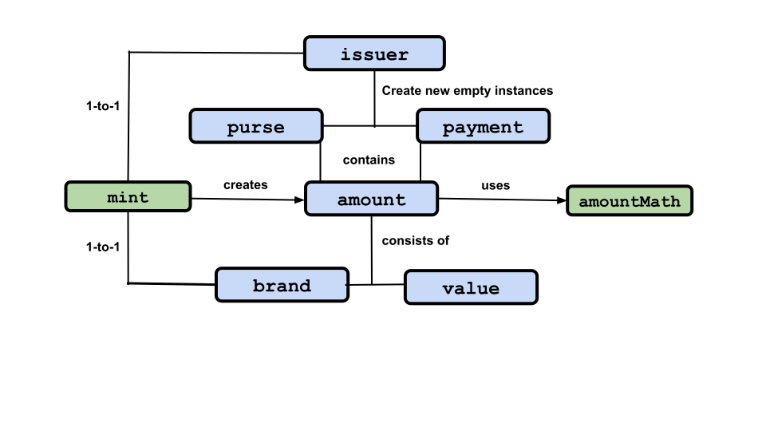

# ERTP Guide

[ERTP](https://agoric.com/documentation/glossary/#ertp) (*Electronic
Rights Transfer Protocol*)
is Agoric's token standard for transferring tokens and other digital assets in
JavaScript. Using the
[ERTP API](https://agoric.com/documentation/ertp/api/),
you can easily create and use digital assets, all of which are
transferred exactly the same way and with exactly the same security properties. 

ERTP uses
*[object capabilities](https://agoric.com/documentation/glossary/#object-capabilities)*
to enforce access control. If your program has a reference to an
object, it can call methods on that object. If it doesn't have a
reference, it can't. For more on object capabilities, see
[Chip Morningstar's post](http://habitatchronicles.com/2017/05/what-are-capabilities/).

## Objects Overview

  

There are eight fundamental ERTP objects, two of which are parts of
another, and one which is used by that same object. For each entry,
the name is linked to its section in this document. 

- **[Amount](#amount)** **[Glossary](https://agoric.com/documentation/glossary/#amount)**:
  The description of an asset, it is not an asset itself, having no economic scarcity or economic value.
  Made up of a:
  *[value](#value)* *[Glossary](https://agoric.com/documentation/glossary/#value)*  (the
  size of the amount) and a
  *[brand](#brand)* *[Glossary](https://agoric.com/documentation/glossary/#brand)* (the
  kind of asset). You can think of these as the "how many" and the
  "what" of an asset.
- **[AmountMath](#amountmath)** **[Glossary](https://agoric.com/documentation/glossary/#amountmath)**:
Methods to do math operations on an `amount`..
- **[Purse](#purse)** **[Glossary](https://agoric.com/documentation/glossary/#purse)**: an
  object for long term `amount` object storage. 
- **[Payment](#payment)** **[Glossary](https://agoric.com/documentation/glossary/#payment)**:
  an object for transfering an `amount` object to another party.
- **[Mint](#mint)** **[Glossary](https://agoric.com/documentation/glossary/#mint)**: an
  object that creates new `payment` objects of a specific `brand`. Each `brand` has
  a one to one relationship with a `mint` and vice versa.
- **[Issuer](#issuer)** **[Glossary](https://agoric.com/documentation/glossary/#issuer)**: 
an object linked to a single `mint` object that creates empty `purse` and
`payment` objects for that mint's brand and operates on payments of
that brand. 

## Fungible and Non-Fungible Assets

There are two kinds of assets,
*[fungible](https://agoric.com/documentation/glossary/#fungible)* and
*[non-fungible](https://agoric.com/documentation/glossary/#non-fungible)*. 

Fungible assets are interchangeable. For example, if you have 100
one-dollar bills and need to pay someone 5 dollars, it doesn't matter
which five of your one-dollar bills you give them. 

Non-fungible assets are of the same type, but are not interchangeable
and specific items must be used. For example, you might have 100
tickets. But someone wanting to buy a ticket from you will want one
for a specific date, a specific theater, a specific time, and let's
say a specific seat (these aren't General Admission tickets). 

You can't just pull out a ticket at random and sell it to them, since
each ticket will have at least one different value from all the
others. This might also affect the price; you'll want to charge more
for a Friday evening third row center ticket than a Wednesday matinee
balcony ticket, even if it's for the same act.

## Security properties

ERTP `purse` objects have a `deposit` method which takes a `payment`
object as its argument. It first checks that the `payment` object is
genuine and the same asset `brand` as the `purse`

If everything passes the checks, the asset moves from 
the `payment` to the `purse`. If there's a problem, it throws an error.

After a successful deposit, ERTP guarantees:
- The `payment` object is empty.
- The `purse` contains the `payment`'s full content.

When the `deposit` call throws an error (i.e. something went wrong), ERTP guarantees:

- The alleged `payment` is in the same state as before the call.
- The `purse` is in the same state as before the call.

## Promises

Several ERTP methods are *asynchronous* and instead of immediately returning their expected value, return a *promise* for that value.

JavaScript implements `Promise` objects, and recently added the two commands `async` and `await` to simplify working with them. For general, and extensive, information about JavaScript's implementation, see either:
- [javascript.info](https://javascript.info/async)
- [Mozilla's Developer Docs](https://developer.mozilla.org/en-US/docs/Learn/JavaScript/Asynchronous)

**tyg todo: Needs beefing up about how Promises, async, and await are
  actually used in contracts**


## Alleged Names

ERTP implements [*object capabilities*](https://agoric.com/documentation/glossary/#object-capabilities). You can only use an object and issue commands to it if you have access to that object, not just its human-readable name or similar. For example, I might know (or make a good guess), that the mint that makes quatloos has the human-understandable name of 'quatloos-mint'. But unless I have the actual object that is a `mint` object associated with the `quatloos` `brand` object, I can't use it to create a million `quatloos` and bet
them all on Captain Kirk to win his gladitorial match on Triskelion (see the[ Wikipedia entry](https://en.wikipedia.org/wiki/The_Gamesters_of_Triskelion)).

**tyg todo: Needs beefing up on how allegedNames are used in contracts
  vs. getting and using the real objects**

## Creating and sending a fungible asset

In ERTP, digital assets are created by a [`mint`](). You must have
access to a `mint` object to create new assets of the `mint` object's
associated `brand`. 

For instance, let's say we want to create a new community
currency called 'BaytownBucks'. You start by getting access to a `mint`
object whose associated brand is 'BaytownBucks'.
```js
import { makeMint } from '@agoric/ertp';
const baytownBucksMint = makeMint('BaytownBucks');
```

Now, use the `mint` to create 1000 new BaytownBucks.

```js
const { issuer, mint } = makeIssuerKit('BaytownBucks');
const BB1000 = amountMath.make(1000);
const newPayment = mint.mintPayment(BB1000);
const BBpurse = issuer.makeEmptyPurse();
const BB1000Amount = BBpurse.deposit(newPayment);
```

The act of minting created 1000 BaytownBucks and stored them together in a
`payment`. We then deposited the `payment` into a `purse` for BaytownBucks.

Now, let's distribute the BaytownBucks to others. To send assets
in ERTP, we withdraw a `payment` from a `purse`.

```js
const paymentForAlice = purse.withdraw(10, `alice's community money`);
```

Like our `purse`, this `payment` contains BaytownBucks, but unlike purses,
payments are used to represent tokens in transit. A `payment` can be
sent to someone else, a `purse` should never be sent to someone else.

Now let's send the `payment` to Alice as a message:

```js
alice.receivePayment(paymentForAlice);
```

Here `alice` is an object reference, and we can call her `receivePayment`method
to ask her to receive this payment. Alice's methods are entirely up to her, 
and are not part of ERTP.


### Receiving the asset

Before she can receive a `payment` in BaytownBucks, Alice needs to 
create an empty `purse` for BaytownBucks and otherwise get ready to
receive payments. 
For this to happen, Alice needs access to `baytownBucksIssuer`.
However, she does not need access to `baytownBucksMint`.
If she had access to the `mint`, she could create BaytownBucks herself
by calling `baytownBucksMint.mint`. 

```js
const myBaytownBucksPurse = baytownBucksIssuer.makeEmptyPurse()

myBaytownBucksPurse.getAmount(); // Empty, so the value is 0

const alice = {
    receivePayment(allegedBaytownBucksPayment){
        myBaytownBucksPurse.depositAll(allegedBaytownBucksPayment)
    }
}
```

Now, when `alice.receivePayment(paymentForAlice)` from earlier 
is called, Alice receives the `payment` and deposits its 1000
BaytownBucks in her purse. 

When Alice wants to exchange something for 300 BaytownBucks, she
creates a `payment` from her `purse`: 
```js
const payment = myBaytownBucksPurse.withdraw(baytownBucks(300));
```
This came naturally without having to express "which" 300 she wanted to withdraw,
since BaytownBucks are fungible.

## Creating a non-fungible asset with ERTP

### Modeling and creating the asset

In ERTP, digital assets are created by a [`mint`](./mint.html). Having
access to the `mint` gives you the power to create more digital assets
of the same brand at  will.

Let's say we own an Opera and want to sell tickets to seats for ballet shows. Tickets are
the non-fungible assets we want to represent. Tickets refer to a
specific seat for a specific show at a specific time and date. 

**tyg todo: This has changed sufficiently from what's in the Guide
that I'd appreciate someone who really knows what they're doing
updating it**

```js
import { noCustomization } from '@agoric/ertp/core/config/noCustomization.js';
import { makeCoreMintKeeper } from '@agoric/ertp/core/config/coreMintKeeper';

import { insist } from '@agoric/insist';
import { mustBeComparable } from '@agoric/same-structure';

const insistOptDescription = optDescription => {
  insist(!!optDescription)`optDescription must be truthy ${optDescription}`;
  mustBeComparable(optDescription);
};

function makeBalletTicketConfig() {
  return harden({
    ...noCustomization,
    makeMintKeeper: makeCoreMintKeeper,
    valueOpsName: 'uniValueOps',
    valueOpsArgs: [insistOptDescription],
  });
}

const balletTicketMint = makeMint('Agoric Ballet Opera tickets', makeBalletTicketConfig);
```

At this Opera, there are [1114](https://fr.wikipedia.org/wiki/Grand_Th%C3%A9%C3%A2tre_(Bordeaux)#Salle_de_spectacle) seats numbered `1` to `1114`.
Objects that represent valid tickets will have the following properties:
- `seat` with a number
- `show` with a string describing the show
- `start` with a string representing a [time/date in ISO format](https://developer.mozilla.org/en-US/docs/Web/JavaScript/Reference/Global_Objects/Date/toISOString)

The first step in creating tickets is to create JavaScript objects,
each representing a ticket. Then, only
[units](https://agoric.com/documentation/ertp/guide/units.html) can be
minted, so let's create units from the JavaScript objects and then,
let's mint the tickets! 

```js
const startDateString = (new Date(2019, 11, 9, 20, 30)).toISOString();

const ticketObjects = Array(1114).fill().map((_, i) => ({
  seat: i+1,
  show: 'The Sofa',
  start: startDateString,
}))

const ticketUnits = ticketObjects.map(ticketValue => balletTicketMint.getAssay().makeUnits(ticketValue));

const balletTicketPurses = ticketUnits.map(ticketUnit => balletTicketMint.mint(ticketUnit))
```

For each ticket unit, we've created a
[purse](https://agoric.com/documentation/ertp/api/purse.html) which
contains digital assets of the corresponding `amount`. The digital assets in
a `purse` can be transferred to other people and used in smart contracts.
