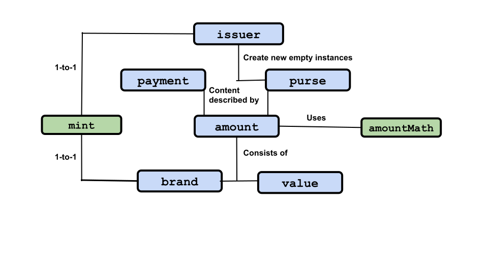

# ERTP Guide

[ERTP](https://agoric.com/documentation/glossary/#ertp) (*Electronic
Rights Transfer Protocol*)
is Agoric's token standard for transferring tokens and other digital assets in
JavaScript. Using the
[ERTP API](https://agoric.com/documentation/ertp/api/),
you can easily create and use digital assets, all of which are
transferred exactly the same way and with exactly the same security properties. 

ERTP uses
*[OCaps (object capabilities)](https://agoric.com/documentation/glossary/#object-capabilities)*
to enforce access control. If your program has a reference to an
object, it can call methods on that object. If it doesn't have a
reference, it can't. For more on object capabilities, see
[Chip Morningstar's post](http://habitatchronicles.com/2017/05/what-are-capabilities/).

## Fungible and Non-Fungible Assets

There are two kinds of assets,
*[fungible](https://agoric.com/documentation/glossary/#fungible)* and
*[non-fungible](https://agoric.com/documentation/glossary/#non-fungible)*. 

Fungible assets are interchangeable. For example, if you have 100
one-dollar bills and need to pay someone 5 dollars, it doesn't matter
which five of your one-dollar bills you give them. 

Non-fungible assets are of the same kind, but are not interchangeable
and specific items must be used. For example, you might have 100
theater tickets. But someone wanting to buy even a General Admission ticket from you will want one
for a specific date and time. This might also affect the price; you'll want to charge more
for a Friday evening ticket than a Wednesday matinee ticket, even if it's for the same show.

## Components Overview

There are eight fundamental ERTP components, two of which are parts of
another, and one which is used by that same object. For each entry,
the name is linked to its primary page in this Guide. 

Asset descriptions have two parts:
 - **[Value](./Amounts.md)** ([glossary](https://agoric.com/documentation/glossary/#value)):  An
  asset's size. You can think of this as the answer to the questions "how many?" or "how much?" about
  an asset.
 - **[Brand](./Amounts.md)** ([glossary](https://agoric.com/documentation/glossary/#brand)): An
  asset's kind. You can think of this as the answer to the question "What is it?" about an asset.
  
These are combined into:
- **[Amount](./Amounts.md)** ([glossary](https://agoric.com/documentation/glossary/#amount)):
  Consists of a `value` and a `brand`. It is a description of an asset, not an asset itself, 
  having no economic scarcity or economic value.
  
So, using the fictional currency Quatloos, you could have an asset described as being "400 Quatloos",
where "400" is the value and "Quatloos" is the brand. For now, we'll just look at fungible assets
whose values have to be non-negative integers. 

The `brand` is a very important component. Most ERTP component instances are defined to work with or on one specific `brand`.
In fact, instances of these next three components are all in one-to-one relationships with each other and a `brand`.
 
- **[Mint](./IssuersAndMints.md)** ([glossary](https://agoric.com/documentation/glossary/#mint)): 
  Creates new assets of a specific `brand`. Each `brand` has
  a one to one relationship with a `mint` and vice versa.
- **[Issuer](./IssuersAndMints.md)** ([glossary](https://agoric.com/documentation/glossary/#issuer)): 
  Has a one-to-one relationship with a `mint`. Used to create empty `purses` to hold assets of the `brand`
  associated with its `mint` and operate on any `payment` of that `brand`. Also used to validate a `brand`.
- **[AmountMath](./AmountMath.md)** ([glossary](https://agoric.com/documentation/glossary/#amountmath)):
Methods to do math operations on an `amount`. Each `brand` has its own `amountMath` in a one-to-one relationship.

 

Let's look at an example. Suppose there is the "Quatloos" `brand`. That means there is also:
- A "Quatloos `mint`" that is the only `mint` that can create new Quatloos assets.
- A "Quatloos `issuer`" that is the only `issuer` that can create a new `purse` to contain Quatloos and 
  operate on a `payment` containing Quatloos.
- A "Quatloos `amountMath`" that is the only `amountMath` whose operations work on an `amount` whose `brand` is Quatloos.

We've already mentioned our final two components:
- **[Purse](./PursesAndPayments.md)** ([glossary](https://agoric.com/documentation/glossary/#purse)): An
  object for holding digital assets of a specific `brand`.
- **[Payment](./PuresAndPayments.md)** ([glossary](https://agoric.com/documentation/glossary/#payment)):
  An object for transfering digital assets of a specific `brand` to another party.
  
Similar to other component instances, a `purse` and a `payment` only work with one
`brand`. So a `purse` or `payment` that holds Quatloos cannot hold an asset of `brand` Moola or vice versa. 
You cannot change the `brand` a `purse` or `payment` was originally associated with. Once you create a
"Quatloos `purse`" or "Quatloos `payment`", they can never hold anything other than Quatloos.

However, unlike the other components, these are not one-to-one relationships. There can be thousands or more
`purses` or `payments` that hold Quatloos or any other `brand`.

## Life of an Asset

Let's look at some asset "lifecycles". While it's very rare for an asset to be destroyed, these "lifecycles"
show assets from their creation through common usage patterns. These are deliberately stripped down to their
basic, core, functionality. Optional parameters and non-core operations are not shown, nor are some significant
concepts which would make this introduction more confusing. These are covered on the component-specific pages.

### Asset creation and storage

```js
const { quatloosIssuer, quatloosMint, quatloosAmountMath, quatloosBrand } = makeIssuerKit('Quatloos');
```
First, you take a string naming a new to the system `brand` and use it as the argument to
`makeIssuerKit()`. The name underestimates its power; in addition to returning a new `issuer`
for the specified `brand`, it also returns a new `mint`, `amountMath`, and formal `brand` object
for the argument. All are in one-to-one associations with each other. 

In this case, you used the string 'Quatloos' to name the `brand`. As good programming style, you
included the `brand` name in the variable names where you store the new `issuer`, `mint`, `amountMath`, and `brand`.

```js
const quatloosSeven = quatloosAmountMath.make(7);;
```
Here you use the Quatloos `amountMath` to make a new `amount` description of the asset you want to create.
Since `amountMath` objects are always one-to-one associated with a `brand`, in this case Quatloos, you 
only have to specify what you want for the `value` of the new `amount`, in this case `7`.

This returns an `amount` description stored in `quatloosSeven`. Remember, an `amount` is only a description
of an asset, not an asset itself. `quatloosSeven` has no worth or intrinsic value.

```js
const quatloosPayment = quatloosMint.mintPayment(quatloosSeven);
```
This creates a new asset of 7 Quatloos. It's returned as a `payment`, so you need a place to store it.
```js
const quatloosPurse = quatloosIssuer.makeEmptyPurse();
quatloosPurse.deposit(quatloosPayment);
```
For long term storage, we prefer using a `purse`. First you create a new empty `purse` for Quatloos using
the Quatloos associated `issuer`. Then you deposit the `payment` into the `purse`. When this happens,
the `payment` is automatically *burned*, such that it no longer exists, and the 7 Quatloos are now resident
in the `purse`. If you'd used an existing `purse` that contained, say, 17 Quatloos, these 7 would have been
added to them so the `purse` balance would be 24 Quatloos. 

### Transfering an asset

Start with your `quatloosPurse` that holds 7 Quatloos. You decide you want to send 5 Quatloos to 
another party, in this case one named Alice.
```js
const quatloosFive = quatloosAmountMath.make(5);
```
First you create a new Quatloos `amount` with a `value` of 5 to describe what you want to withdraw.
Remember, an `amount` is just a description of assets, not the actual assets.
```js
const myQuatloosPayment = quatloosPurse.withdraw(quatloossFive);
```
Now you tell your Quatloos containing `purse` that you want to withdraw the specified `amount` from 
it. The 5 Quatloos goes into a `payment`

You've got your `payment` for 5 Quatloos, but how do you get it to Alice? She needs to
have done some work first so there's somewhere for her to put it and a way of getting it to
her rather than someone else.
```
const aliceQuatloosDepositFacet = aliceQuatloosPurse.makeDepositFacet()
```
Assume Alice already has a Quatloos containing `purse` of her own. To let other
parties safely deposit Quatloos into it, she creates
a *deposit facet* for that `purse`. Anyone who has access to a deposit facet can deposit
assets to its `purse` but cannot either make a withdrawal from the `purse` or get its balance. It's like
being able to send money to a friend via their email address; you can't then take money out
of your friend's accounts or find out how much is in them.
```js
Const aliceQuatloosDepositFacet = 
      await E(board).getValue(aliceQuatloosDepositFacetBoardId);
E(aliceQuatloosDepositFacet.receive(myQuatloosPayment);
```
Alice uses Agoric's *Board* to make her Quatloos `purse` deposit facet generally available.
The Board is a basic bulletin board type system where users can post an Id for a value and
others can get the value just by knowing the Id. Alice can make her key(s) known by any
communication method she likes; private email, an email blast to a mailing list or many individuals,
buying an ad on a website, tv program, or newspaper, listing it on her website, etc.

Alice tells you the Board Id associated with her Quatloos `purse` deposit facet. You get the Id associated value,
which gives you the reference to that deposit facet. You then just tell the facet to receive your Quatloos
`payment`. Your Quatloos `purse` now has 2 Quatloos (7 - 5), Alice's Quatloos `purse` now has 5 more Quatloos
in it, and the 5 Quatloos `payment` was burned when the transfer happened.For this to happen, Alice needs access to `baytownBucksIssuer()`.
However, she does not need access to `baytownBucksMint()`.
If she had access to the `mint()`, she could create BaytownBucks herself
by calling `baytownBucksMint.mint()`. 

```js
const aliceBaytownBucksPurse = baytownBucksIssuer.makeEmptyPurse()
aliceBaytownBucksPurse.getAmount(); // Empty, so the value is 0
```

And here is a more complete example using Agoric's Board, a simple "bulletin board"
for posting and getting Id-value pairs:
```js
// Alice posts an Id-value pair to the Board, where the value is the deposit facet object
// for her `purse`.
// Alice then gives us the boardId to use for the transfer: aliceDepositFacetBoardId
// We retrieve the value from the boardID and then deposit the payment in the deposit facet.
const aliceDepositFacet = await E(board).getValue(aliceDepositFacetBoardId);
E(aliceDepositFacet).receive(payment);
// Alice got her payment automatically deposited in her purse!

-----------------------

-----------------

For this to happen, Alice needs access to `baytownBucksIssuer()`.
However, she does not need access to `baytownBucksMint()`.
If she had access to the `mint()`, she could create BaytownBucks herself
by calling `baytownBucksMint.mint()`. 

```js
const aliceBaytownBucksPurse = baytownBucksIssuer.makeEmptyPurse()
aliceBaytownBucksPurse.getAmount(); // Empty, so the value is 0
```

And here is a more complete example using Agoric's Board, a simple "bulletin board"
for posting and getting Id-value pairs:
```js
// Alice posts an Id-value pair to the Board, where the value is the deposit facet object
// for her `purse`.
// Alice then gives us the boardId to use for the transfer: aliceDepositFacetBoardId
// We retrieve the value from the boardID and then deposit the payment in the deposit facet.
const aliceDepositFacet = await E(board).getValue(aliceDepositFacetBoardId);
E(aliceDepositFacet).receive(payment);
// Alice got her payment automatically deposited in her purse!

-----------------------
## Creating a non-fungible asset with ERTP

Let's say we own a theater and want to sell tickets to seats for a play. Tickets are
the non-fungible assets we want to represent, which refer to a
specific seat for a specific show at a specific time and date. 

```js
import { makeIssuerKit } from '@agoric/ertp';
const { mint: theatreTicketMint, amountMath: theatreTicketAmountMath } = makeIssuerKit('Agoric Theater tickets', 'set');
```

This theater has 1114 seats numbered `1` to `1114`.
Objects that represent valid tickets have these properties:
- `seat` with a number
- `show` with a string describing the show
- `start` with a string representing a [time/date in ISO format](https://developer.mozilla.org/en-US/docs/Web/JavaScript/Reference/Global_Objects/Date/toISOString)

To create tickets, we first create JavaScript objects that each represent a ticket.
Then, only units can be minted, so let's create units from the JavaScript objects and then
mint the tickets! 

```js
const startDateString = (new Date(2019, 11, 9, 20, 30)).toISOString();

const ticketValues = Array(1114).fill().map((_, i) => ({
  seat: i+1,
  show: 'Hamilton',
  start: startDateString,
}))

const ticketAmounts = ticketValues.map(ticketValue => theatreTicketAmountMath.make(ticketValue));
const theaterTicketPayments = ticketAmounts.map(ticketAmount => theatreTicketMint.mintPayment(ticketAmount))
```

For each `amount`, we've created a `payment` which contains digital assets
of the corresponding `amount`. These digital assets can be transferred 
to other people and used in smart contracts.

## Amounts are not assets

**IMPORTANT**: Despite how it may seem, an `amount` is only a description of an asset, not
an asset in and of itself. Actual assets are represented by `purse` and `payment` objects. but the
assets aren't ever embodied in any particular JavaScript object. Instead, what makes the 
assets exist is the issuer having a mapping from the `purse` or `payment` to an `amount` (description).
There is no `amount` object stored in a `purse` or `payment`.

Some analogies may be helpful in understanding this:

- Let's say Caltech replicates its [famous hack of the Rose Bowl scoreboard](https://www.admissions.caltech.edu/pranks).
But this time, instead of changing the team names, they change the score display from 14-7 to 0-21. This does not change
the actual game score (the "asset"); that's part of the game itself and based on record keeping of what's happened
during the game. The score on the scoreboard is just a description of the game's "asset", post-hack an incorrect one.
- A typo in the Wall Street Journal's stock listings results in Google stock being shown as having closed the
previous day at 15 dollars per share rather than the correct 1507 dollars. This does not cause Google stock to be valued at
15; it's not the actual asset, but a description of its value (again, in this case, an incorrect one).

Making a new `amount` or changing an `amount` `value` does not create any new assets. New assets are created by using 
a `mint` to create a new `payment` that contains a newly created asset. In the real world, I can't create a new ten dollar
bill by drawing one; a new one has to be minted (printed) by an authorized government-run facility with its asset status
derived from its government backing. 

So an `amount` just describes an asset along the two axes of how many and
what units it's in (`value` and `brand`). They're used as a way of negotiating
with parties that doesn't involve sending/sharing the actual asset
until a deal is made. In other words, I don't make you an offer that I'll swap you a ticket to *Hamilton* for something
by sending you an actual ticket. Instead I make you an offer by sending you a written description
of what I'm willing to swap, namely a *Hamilton* ticket. If the offer is accepted, then I send you the actual asset, 
in this case an actual *Hamilton* ticket (enjoy the show!).
 
## Object capabilities and ERTP

ERTP implements [*object capabilities*](https://agoric.com/documentation/glossary/#object-capabilities). You can only use an object and issue commands to it if you have access to that object, not just its human-readable name or similar. For example, I might know (or make a good guess), that the mint that makes quatloos has the human-understandable alleged name of 'quatloos-mint'. But unless I have the actual object that is a `mint` object associated with the `quatloos` `brand` object, I can't use it to create a million `quatloos` and bet
them all on Captain Kirk to win his gladiatorial match on Triskelion (see the [Wikipedia entry for the Star Trek episode](https://en.wikipedia.org/wiki/The_Gamesters_of_Triskelion)).

## Security properties

ERTP `purse` objects have a `deposit` method which takes a `payment`
object as its argument. It first checks that the `payment` object is
genuine and the same asset `brand` as the `purse`

If everything passes the checks, the asset moves from 
the `payment` to the `purse`. If there's a problem, it throws an error.

After a successful deposit, ERTP guarantees:
- The `payment` object is deleted from the `issuer`'s records and no longer has any assets associated with it.
- Its `issuer` no longer recognizes the `payment`.
- The `purse` contains all of the `payment`'s digital assets.

When the `deposit` call throws an error (i.e. something went wrong), ERTP guarantees
the `purse` and the alleged `payment` were unaffected by that call.

In addition, you can create a *deposit facet* for any `purse`. This is an object associated
with a specific purse that can be sent to another party instead of a reference to the `purse`.
The security advantage is that the other party can only make deposits to the associated `purse`
via the deposit facet. They cannot make a withdrawal from or ask about the balance of a `purse` via its deposit facet.

## Promises

Several ERTP methods are *asynchronous* and instead of immediately returning their expected value, return a *promise* for that value.

JavaScript implements `Promise` objects, and recently added the two keywords `async` and `await` to simplify working with them. For general, and extensive, information about JavaScript's implementation, see either:
- [javascript.info](https://javascript.info/async)
- [Mozilla's Developer Docs](https://developer.mozilla.org/en-US/docs/Learn/JavaScript/Asynchronous)

**tyg todo: Could use beefing up about how and when Promises, async, and await are
  actually used in contracts**
