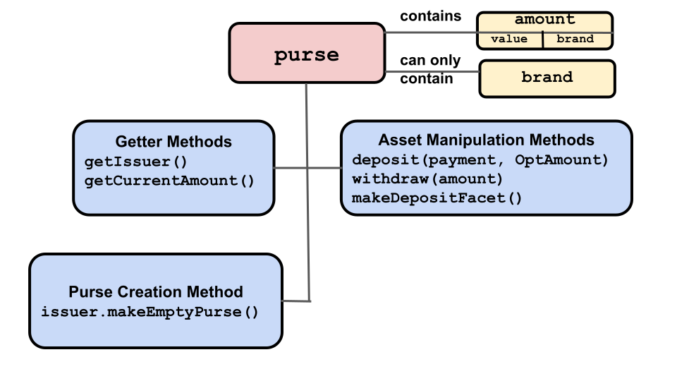
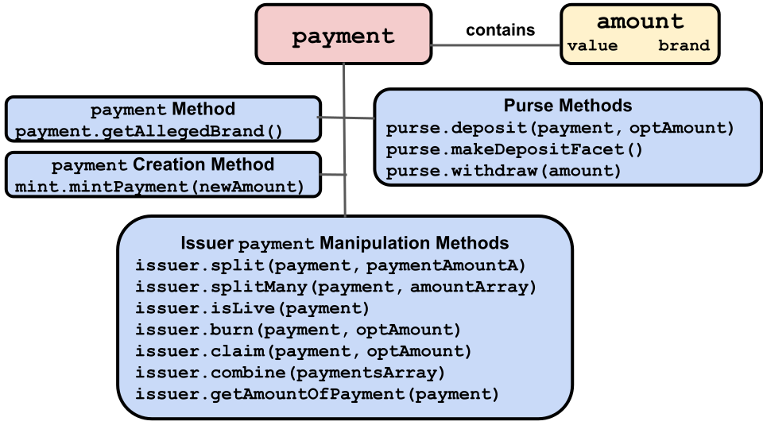

# Purses and Payments

You can store `amount` objects in two kinds of objects:
- **[`purse`](https://agoric.com/documentation/glossary/#purse)**: Hold
  an `amount` of same branded digital assets until you withdraw part or
  all of them into a `payment` for use.
- **[`payment`](https://agoric.com/documentation/glossary/#purse)**:
  Hold an `amount` of digital assets to send to another party. Usually either
  a freshly created `amount` or one taken from a `purse`

Assets in purses and payments do not have to be currency-like, but can
be anything you can construct a digital rights `amount` object for;
swords to use in a game, rights to use a particular contract, theater
tickets, etc.

Each non-empty `purse` and `payment` object contains exactly one
`amount` object. While you may deposit or withdraw an `amount` to a
`purse`, it is repsectively added to the `purse` `amount`or split off into a `payment`
object's `amount`. The same is true for adding to or splitting a
`payment` object's `amount`.  Both a `purse` and a `payment` can only
have an amount of a single `brand`.

With the exception of `mint` objects creating entirely new `payment`
objects with newly created `amount` objects, a `payment` object is
created by making a withdrawal on an `amount` from a `purse`. Note
that the `brand` of the new `payment` must be the same as the
`purse`'s associated `brand`.

Note that you don't transfer directly from `purse`s to
another `purse`. Instead, to send and receive assets in ERTP you do these steps:
- Send assets:
  1. Withdraw an `amount`from a `purse`, creating a `payment`.
  2. Send this `payment` to a recipient object as a message.
- Receive assets:
  1. If you don't already have one, create a `purse` for the asset `brand`
     you'll receive. 
  2. Get access to the asset `brand` you'll receive.
  3. Receive the message with the `payment` and deposit the `payment` in
     your `brand` appropriate `purse`. 

## Purses

  

Purses have five API methods:
- [`purse.getIssuer()`](https://agoric.com/documentation/ertp/api/purse.html#purse-getissuer)
  - Returns the `issuer` for the purse's `brand`. See the [Issuer](#issuers)
  section for more details about what this means and how it is used.
  - ```js
	const purseIssuer = purse.getIssuer();
	```
- [`purse.getCurrentAmount()`](https://agoric.com/documentation/ertp/api/purse.html#purse-getcurrentamount)
  - Returns the current `amount` object stored in the purse. Note that
    purses can be empty.
  - ```js
  const { issuer } = produceIssuer('bucks');
  const purse = issuer.makeEmptyPurse();
  const currentBalance = purse.getCurrentAmount();
  ```
- [`purse.deposit(payment, optAmount)`](https://agoric.com/documentation/ertp/api/purse.html#purse-deposit-payment-optamount)
  - Deposit the `amount` contents of a `payment` into this purse,
    returning the `payment`'s `amount`. If the optional argument
    `optAmount` does not equal the `payment`'s balance,  or if `payment`
    is an unresolved
    [promise](https://agoric.com/documentation/glossary/#promise),
    it throws an error.
  - ```js
     const { issuer, mint, amountMath } = produceIssuer('bucks');
     const purse = issuer.makeEmptyPurse();
	 const payment = mint.mintPayment(amountMath.make(123));
	 const bucks123 = amountMath.make(123);
	 // Deposit a payment for 123 bucks into the purse. Ensure that this is the amount you expect.
	 purse.deposit(payment, bucks123);
	 const secondPayment = mint.mintPayment(amountMath.make(100));
	 // Throws error
	 purse.deposit(secondPayment, fungible123);
     ```
- [`purse.makeDepositFacet()`](https://agoric.com/documentation/ertp/api/purse.html#purse-makedepositfacet)
  - Creates a deposit-only facet on the `purse` that can be given
    to other parties. This lets them make a deposit, but not make
    withdrawals, to your purse.
  - ```js
     const depositOnlyFacet = purse.makeDepositFacet();
     // Give depositOnlyFacet to someone else. They can pass a payment
     // that will be deposited:
     depositOnlyFacet.receive(payment);
     ```
- [`purse.withdraw(amount)`](https://agoric.com/documentation/ertp/api/purse.html#purse-withdraw-amount)
  - Withdraw the `amount` from this purse into a new
    `payment`. Returns the new `payment`.

In addition, other objects, such as `issuer`, have methods which take
purses as arguments or return purses. In particular:
- [`issuer.makeEmptyPurse()`](https://agoric.com/documentation/ertp/api/issuer.html#issuer-makeemptypurse)
  - Returns a new empty `purse` for storing an `amount` of the same `brand` as
  the `issuer`.
  - ```js
	   const { issuer, mint } = produceIssuer('bucks');
	   const purse = issuer.makeEmptyPurse();
   ```

## Payments

   

Payments hold an `amount` of digital assets that are either about to
be sent to another party or which is in transit to another
party. Payments are linear, meaning that either a `payment` has its full
original balance, or it is used up entirely. It is impossible to
partially use a `payment`. In other words, if you create a `payment` with
an `amount` of 10 quatloos, the `payment` will always either have an
`amount` of 10 quatloos or an `amount` of 0 quatloos, never anything
in-between or larger than 10.

Payments can be deposited in purses, split into multiple 
payments, combined, and claimed (getting an exclusive payment and
revoking access from anyone else). 

Payments are often received from other actors and therefore should not
be trusted themselves. To get the balance of a payment, use the
`getAmountOf(payment)` method on the trusted `issuer` for the `brand`
of the `payment`.  **tyg todo: How does one get said trusted issuer?**

To convert a `payment` into a `purse`: 
1. Access a trusted `issuer` for the `payment`'s `brand`.. 
2. Create an empty purse with `issuer.makeEmptyPurse()`
3. Put the payment `amount` in the purse with `purse.deposit(payment)`

Payments have one API method, but many methods for other object
types have `payment` objects as arguments and effectively operate on `payments`.
- [`payment.getAllegedBrand()`](https://agoric.com/documentation/ertp/api/payment.html#payment-getallegedbrand)
  - Returns the `payment`'s `brand`, indicating what digital asset the
  payment purports to be. Note that `payment`s are not trusted, so this
  result should be treated with suspicion and verified before 
  use. **tyg todo: How do I verify?**

Other objects' `payment`-related methods:

- [`issuer.getAmountOfPayment(payment)`](https://agoric.com/documentation/ertp/api/issuer.html#issuer-getamountof-payment)
  - Get the `payment`'s `amount`. The `payment` itself is not trusted,
    so you must use this `issuer` method to be sure of getting the
    true value. 
  ` ```js
	  const { issuer, mint, amountMath } = produceIssuer('bucks');
	  const payment = mint.mintPayment(amountMath.make(100));
	  issuer.getAmountOf(payment); // returns 100
    ```
- [`issuer.burn(payment, optAmount)`](https://agoric.com/documentation/ertp/api/issuer.html#issuer-burn-payment-optamount)
  - Burn all of the digital assets in the `payment`. `optAmount` is
    optional but if present, the `payment` balance must be equal to
    it. If `payment` is a promise, the operation proceeds after it resolves. 
  - ```js
	  const { issuer, mint, amountMath } = produceIssuer('bucks');
	  const amountToBurn = amountMath.make(10);
	  const paymentToBurn = mint.mintPayment(amountToBurn);
	  // burntAmount should equal 10
	  const burntAmount = issuer.burn(paymentToBurn, amountToBurn);
	  ```
- [`issuer.claim(payment, optAmount)`](https://agoric.com/documentation/ertp/api/issuer.html#issuer-claim-payment-optamount)
  - Transfer all assets from the `payment` to a returned new `payment`
    and burn the original. No other references to this payment survive, so 
    the new `payment`'s owner is the exclusive one. If `optAmount` is
    present, `payment`'s balance is equal to `optAmount`'s, or it throsw
    an error. If `payment` is a promise, the operation proceeds after it resolves. 
  - ```js
	  const { mint, issuer, amountMath } = produceIssuer('bucks');
	  const amountExpectedToTransfer = amountMath.make(2);
	  const originalPayment = mint.mintPayment(amountExpectedToTransfer);
	  const newPayment = issuer.claim(originalPayment, amountToTransfer);
	  ```
- [`issuer.combine(paymentsArray)`](https://agoric.com/documentation/ertp/api/issuer.html#issuer-combine-paymentsarray)
  - Combine multiple `payment`s into one, returned, `payment`. If any `payment`
  the array is a promise, the operation proceeds after all `payment`s
  resolve. All `payment`s in the array are burned.
  - ```js
	  const { mint, issuer, amountMath } = produceIssuer('bucks');
	  // create an array of 100 payments of 1 unit each
	  const payments = [];
	  for (let i = 0; i < 100; i += 1) {
	    payments.push(mint.mintPayment(amountMath.make(1)));
	  }
	  // combinedPayment equals 100
	  const combinedPayment = issuer.combine(payments);
	  ```
- [`issuer.split(payment, paymentAmountA)`](https://agoric.com/documentation/ertp/api/issuer.html#issuer-split-payment-paymentamounta)
  - Split one `payment` into two new `payment`s, A and B, returned in
    an array. `paymentAmountA` determines A's value, and whatever is
    left of the original `payment` after subtracting A is B's value. `payment`
    is burned. If `payment` is a promise, the operation proceeds after
    the promise resolves. 
  - ```js
	const { mint, issuer, amountMath } = produceIssuer('bucks');
	const oldPayment = mint.mintPayment(amountMath.make(20));
	const [paymentA, paymentB] = issuer.split(oldPayment, amountMath.make(10));
	```
- [`issuer.splitMany(payment, amountArray)`](https://agoric.com/documentation/ertp/api/issuer.html#issuer-splitmany-payment-amountarray)
  - Split `payment` into multiple `payment`s, returned as an array the
    same length as `amountArray` and with its `payment`s having the
    same values as specified for `amountArray`'s elements. If `payment`
    is a promise, the operation proceeds after it resolves. If
    `payment`'s value is not equal to the sum of `amountArray`'s
    values, the operation fails. On success, the original `payment` is burned.
  - ```js
	  const { mint, issuer, amountMath } = produceIssuer('fungible');
	  const oldPayment = mint.mintPayment(amountMath.make(100));
	  const goodAmounts = Array(10).fill(amountMath.make(10));
	  const arrayOfNewPayments = issuer.splitMany(oldPayment, goodAmounts);
	  ```
- [`issuer.isLive(payment)`](https://agoric.com/documentation/ertp/api/issuer.html#issuer-islive-payment)
  - Returns `true` if `payment` has value. If `payment` is a promise,
	 the operation proceeds upon resolution.
- [`mint.mintPayment(newAmount)`](https://agoric.com/documentation/ertp/api/mint.html#mint-mintpayment-newamount)
  - Returns a new `payment` containing the newly minted amount. Note
    that unlike creating a new `payment` with an existing `amount`,
    this creates new digital assets of the specified in `newAmount` `brand`.
  - ```js
	  const { issuer, mint } = produceIssuer('fungible');
	  const fungible1000 = amountMath.make(1000);
	  const newPayment = mint.mintPayment(fungible1000);
	  ```
- [`purse.deposit(payment, optAmount)`](https://agoric.com/documentation/ertp/api/purse.html#purse-deposit-payment-optamount)
  - Deposit all of `payment` into this `purse`, returning the deposit
    `amount`. If optional `optAmount` does not equal the `payment`'s balance
     or if `payment` is an unresolved promise, it throws an error.
  - ```js
	  const { issuer, mint, amountMath } = produceIssuer('bucks');
	  const purse = issuer.makeEmptyPurse();
	  const payment = mint.mintPayment(amountMath.make(123));
	  const bucks123 = amountMath.make(123);
	  // Deposit a payment for 123 bucks into the purse. Ensure that this is the amount you expect.
	  purse.deposit(payment, bucks123);
	  const secondPayment = mint.mintPayment(amountMath.make(100));
	  // Throws error
	  purse.deposit(secondPayment, fungible123);
      ```
- [`purse.makeDepositFacet()`](https://agoric.com/documentation/ertp/api/purse.html#purse-makedepositfacet)
  - Creates a deposit-only facet on the `purse` that can be given to
    other parties that lets them deposit a `payment` (but not
    withdraw) into the `purse`. 
  - ```js
	  const depositOnlyFacet = purse.makeDepositFacet();
	  // Give depositOnlyFacet to someone else. They can pass a payment that will be deposited:
	  depositOnlyFacet.receive(payment);
	  ```

## `purse` and `payment` example

The following code creates a new purse for the `bucks` brand, deposits
10 bucks into the purse, withdraws 3 bucks from the purse into a
payment, and finally returns the amount currently in the purse, 7 bucks.

```js
// Create a purse with a balance of 10 amount
const { issuer, mint } = produceIssuer('bucks');
const purse = issuer.makeEmptyPurse();
const payment = mint.mintPayment(amountMath.make(10));
const fungible10 = amountMath.make(10);
purse.deposit(payment, fungible10);

// Withdraw 3 amount from the purse
const fungible3 = amountMath.make(3);
const withdrawalPayment = purse.withdraw(fungible3);

// The balance of the withdrawal payment is 3 amount
issuer.getAmountOf(withdrawalPayment);

// The new balance of the purse is 7 amount
purse.getCurrentAmount();
```
