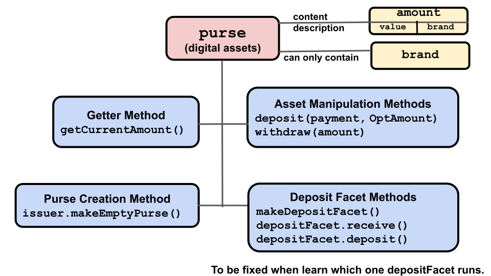
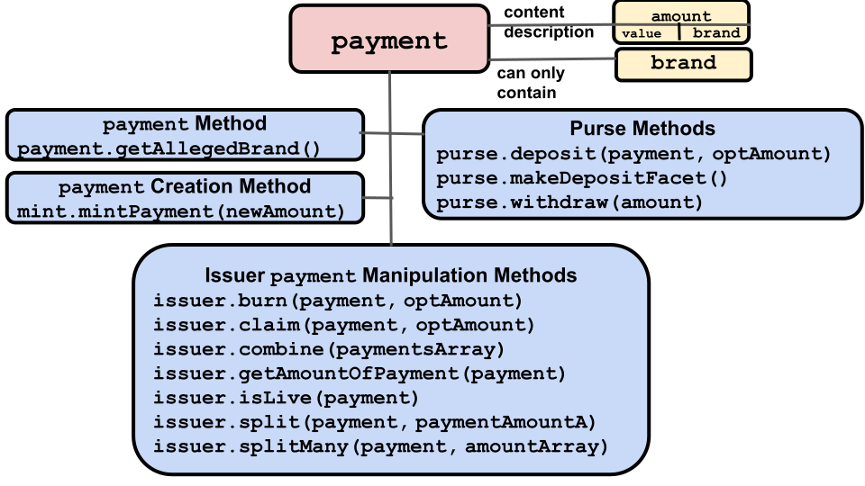

# Purses and Payments

Digital assets exist in either a `purse` or a `payment`:
- **[`purse`](https://agoric.com/documentation/glossary/#purse)**: Hold
  a quantity of same-branded digital assets until part or
  all of them are withdrawn into a `payment` for use. A `purse` can only
  hold the same `brand` as that of the `issuer` that created it.
- **[`payment`](https://agoric.com/documentation/glossary/#payment)**:
  Hold a quantity of digital assets to send to another party. Created either
  with new assets by a `mint` or by withdrawing assets from a `purse`.

Assets in `purses` and `payments` do not have to be currency-like, but can
be any kind of digital asset; swords to use in a game, rights to use 
a particular contract, theatre tickets, etc.

Each non-empty `purse` and `payment` object contains exactly one
quantity of its digital asset. 

So, for example, a single `purse` can contain assets of
5 Quatloos, but not two separated assets of 2 Quatloos and 3 Quatloos. If you want to
hold multiple, separated, quantities of same-branded assets you have to have multiple
`purses` for that `brand`. This is similar to how in the real world, you might have two
bank accounts, both of which hold dollars. You want to keep them separated since 
one is for everyday expenses, and the other is your emergency fund.

When you deposit additional assets into a `purse` or `payment`, they are added to
whatever assets already exist in the `purse` or `payment`. So if you deposit 3 Quatloos 
into a `purse` with 8 Quatloos, you end up with a `purse` with 11 Quatloos. Similarly, 
if you withdraw 6 Quatloos from the `purse` into a new `payment`, the `purse` has 5 Quatloos 
left and the `payment` has 6 Quatloos. 

When adding a `payment` to a `purse`, you must add the entire `payment`. If you
only want to add part of a `payment` to a `purse`, you must first use `payment.split()` 
or `payment.splitMany()` to split the `payment` into one or more `payments`.

With the exception of a `mint` creating an entirely new `payment`
containing digital assets, you create a `payment` by making a withdrawal from
a `purse` or by splitting an existing `payment`. Note that the `brand` of the new `payment` is the same as the
associated `brand` of its originating `purse` or `payment`.

Note that you don't transfer assets directly from one `purse` to
another `purse`. Instead, you do something like these steps to send and receive assets in ERTP.
The actual send operation is up to you; ERTP does not implement a way of 
sending object-containing messages between parties.
- Send assets:
  1. Withdraw assets described by an `amount`from a `purse`, creating a `payment`.
  2. Send this `payment` to a recipient object as a message.
- Receive assets:
  1. If you don't already have one, create a `purse` for the asset `brand`
     you'll receive. 
  2. Receive the message with the `payment` and deposit the `payment` in
     your `brand` appropriate `purse`. 
     
In addition, you can create a *deposit facet* for a `purse`. These are sent
to another party and lets the other party deposit a `payment` into the `purse` the 
deposit facet object represents. The benefit of sending a deposit facet instead of 
providing access to its `purse` is deposit facets only accept deposits; a party 
with a deposit facet object cannot use it to make a withdrawal or get a balance.

If you receive a deposit facet, you can make a deposit to its associated `purse` by calling 
`depositOnlyFacet.receive(payment);`. Note that the `payment` must be the same `brand` as what
the associated `purse` object can contain. Otherwise it throws an error. If you send a party a 
deposit facet object, you should also tell them what `brand` of assets it accepts.

## Purses

  

Purses have four API methods:
- [`purse.getCurrentAmount()`](https://agoric.com/documentation/ertp/api/purse.html#purse-getcurrentamount)
  - Returns a description of the digital assets currently stored in the `purse` as an `amount`. Note that a `purse` can be empty.
  - ```js
    const quatloosPurse = quatloosIssuer.makeEmptyPurse();
    // Balance should be 0 Quatloos.
    const currentBalance = quatloosPurse.getCurrentAmount();
    // Deposit a payment of 5 Quatloos
    quatloosPurse.deposit(quatloosPayment5);
    // Balance should be 5 Quatloos
    const newBalance = quatloosPurse.getCurrentAmount());
    ```
- [`purse.deposit(payment, optAmount)`](https://agoric.com/documentation/ertp/api/purse.html#purse-deposit-payment-optamount)
  - Deposit the digital asset contents of the `payment` into this `purse`,
    returning a description of the `payment` balance as an `amount`. If the optional argument
    `optAmount` does not equal the `payment` balance,  or if `payment`
    is an unresolved promise, it throws an error.
  - ```js
    const quatloosPurse = quatloos.Issuer.makeEmptyPurse();
    const quatloosPayment = quatloosMint.mintPayment(quatloosAmountMath.make(123));
    const quatloos123 = quatloosmountMath.make(123);
    // Deposit a payment for 123 quatloos into the purse. Ensure that this is the amount you expect.
    quatloosPurse.deposit(quatloosPayment, quatloos123);
    const secondPayment = quatloosMint.mintPayment(quatloosAmountMath.make(100));
    // Throws error since secondPayment is 100 Quatloos and quatloos123 is 123 Quatloos
    quatloosurse.deposit(secondPayment, quatloos123);
    ```
- [`purse.makeDepositFacet()`](https://agoric.com/documentation/ertp/api/purse.html#purse-makedepositfacet)
  - Creates a deposit-only facet on the `purse` that can be given
    to other parties. This lets them make a deposit to the `purse`, but not make
    withdrawals from it or get its balance. Note that the command to add a `payment`'s
    assets via a `DepositFacet` is not `deposit()` but `receive()` as shown here.
  - ```js
     const depositOnlyFacet = purse.makeDepositFacet();
     // Give depositOnlyFacet to someone else. They can pass a payment
     // that will be deposited:
     depositOnlyFacet.receive(payment);
     ```
- [`purse.withdraw(amount)`](https://agoric.com/documentation/ertp/api/purse.html#purse-withdraw-amount)
  - Withdraw the assets described by `amount` from this `purse` into a new
    `payment`. Returns the new `payment`.

In addition, the method to create a new, empty, `purse` is called on an `issuer`:
- [`issuer.makeEmptyPurse()`](https://agoric.com/documentation/ertp/api/issuer.html#issuer-makeemptypurse)
  - Returns a new empty `purse` for storing digital assets of the `brand` the `issuer` is associated with.
  - ```js
    // The new purse can only contain assets of the Quatloos brand.
    const quatloosPurse = quatloosIssuer.makeEmptyPurse();
    ```
To add the assets from a `payment` to a `depositFacet`, use the receive() method.
There is **not** a `DepositFacet` deposit() method.

## Payments

   

Payments hold digital assets intended to be transferred to another party.
They are linear, meaning that either a `payment` has its full
original balance, or it is used up entirely. It is impossible to
partially use a `payment`. In other words, if you create a `payment` containing
10 Quatloos, the `payment` will always either contain 
10 Quatloos or it will be deleted from its `issuer` records and no
longer have any value. While a `payment` can be either combined with others or
split into multiple `payments`, in both case the original `payment(s)`
is/are deleted and the results put in one or more new `payments`.

A `payment` can be deposited in purses, split into multiple 
`payments`, combined, and claimed (getting an exclusive `payment` and
revoking access from anyone else). 

A `payment` is often received from other parties and therefore should not
be trusted. To get the balance of a `payment`, use the
`getAmountOf(payment)` method on the trusted `issuer` for the `brand`
of the `payment`. To get the `issuer` for a `brand` you didn't create, 
ask someone you trust. For example, the venue creating tickets for shows
can be trusted to give you the tickets' `issuer`. Or, a friend might have 
a cryptocurrency they like, and, if you trust them, you might accept 
that the `issuer` they give you is valid.

To convert a `payment` into a `purse`: 
1. Access a trusted `issuer` for the `payment`'s `brand`. 
2. Create an empty purse with `issuer.makeEmptyPurse()`.
3. Transfer the digital assets from the `payment` to the `purse` with `purse.deposit(payment)`.

Payments have one API method, but many methods for other ERTP components
have `payment` objects as arguments and effectively operate on a `payment`.
- [`payment.getAllegedBrand()`](https://agoric.com/documentation/ertp/api/payment.html#payment-getallegedbrand)
  - Returns a `brand`, indicating what kind of digital asset the
  `payment` purports to be. Since a `payment` is not trusted, this result should be treated with suspicion. Either verify 
  the value before holding on to it, or check the result when you use it. Any successful operation by 
  the `issuer` for that `brand` done on the `payment` verifies the `payment`.

Other objects' `payment`-related methods:

- [`issuer.getAmountOf(payment)`](https://agoric.com/documentation/ertp/api/issuer.html#issuer-getamountof-payment)
  - Get a description of a `payment` balance as an `amount`. The `payment` itself is not trusted,
    so you must use the `issuer` method associated with its `brand` to be sure of getting the
    true value. 
    ```js
    const { quatloosIssuer, quatloosMint, quatloosAmountMath } = makeIssuerKit('quatloos');
    const quatloosPayment = quatloosMint.mintPayment(quatloosAmountMath.make(100));
    quatloosIssuer.getAmountOf(quatloosayment); // returns an amount with 100 value `quatloos` brand
    ```
- [`issuer.burn(payment, optAmount)`](https://agoric.com/documentation/ertp/api/issuer.html#issuer-burn-payment-optamount)
  - Burn all of the digital assets in the `payment`. `optAmount` is
    optional but if present, the `payment` balance must be equal to
    it. If `payment` is a promise, the operation proceeds after it resolves. 
  - ```js
    const { quatloosIssuer, quatloosMint, quatloosAmountMath } = makeIssuerKit('quatloos');
    const amountToBurn = quatloosAmountMath.make(10);
    const paymentToBurn = quatloosMint.mintPayment(amountToBurn);
    // burntAmount should equal 10
    const burntAmount = quatloosIssuer.burn(paymentToBurn, amountToBurn);
    ```
- [`issuer.claim(payment, optAmount)`](https://agoric.com/documentation/ertp/api/issuer.html#issuer-claim-payment-optamount)
  - Transfer all assets from the `payment` to a returned new `payment`
    and burn the original. No other references to the argument `payment` survive, so 
    the new `payment` is the exclusive one. If `optAmount` is
    present, the `payment` balance must be equal to it or it throws
    an error. If `payment` is a promise, the operation proceeds after it resolves. 
  - ```js
    const { quatloosMint, quatloosIssuer, quatloosAmountMath } = makeIssuerKit('quatloos');
    const amountExpectedToTransfer = quatloosAmountMath.make(2);
    const originalPayment = quatloosMint.mintPayment(amountExpectedToTransfer);
    const newPayment = quatloosIssuer.claim(originalPayment, amountToTransfer);
    ```
- [`issuer.combine(paymentsArray)`](https://agoric.com/documentation/ertp/api/issuer.html#issuer-combine-paymentsarray)
  - Combine multiple `payments` into one, returned, `payment`. If any `payment` in
  the array is a promise, the operation proceeds after every `payment`
  resolves. All `payments` in the array are burned on successful completion.
  - ```js
    const { quatloosMint, quatloosIssuer, quatloosAmountMath } = makeIssuerKit('quatloos');
    // create an array of 100 payments of 1 unit each
    const payments = [];
    for (let i = 0; i < 100; i += 1) {
      payments.push(quatloosMint.mintPayment(quatloosAmountMath.make(1)));
    }
    // combinedPayment equals 100
    const combinedPayment = quatloosIssuer.combine(payments);
    ```
- [`issuer.split(payment, paymentAmountA)`](https://agoric.com/documentation/ertp/api/issuer.html#issuer-split-payment-paymentamounta)
  - Split one `payment` into two new ones, A and B, returned in
    an array. `paymentAmountA` determines A's value, and whatever is
    left of the original `payment` after subtracting A is B's value. 
    If `paymentAmountA` has a larger `value` than `payment`, it throws an error.
    
    The `payment`
    argument is burned. If `payment` is a promise, the operation proceeds after
    the promise resolves. 
  - ```js
    const { quatloosMint, quatloosIssuer, quatloosAmountMath } = makeIssuerKit('quatloos');
    const oldPayment = quatloosMint.mintPayment(quatloosAmountMath.make(20));
    // Results in paymentA = 5 and paymentB = 15 (20 -5)
    const [paymentA, paymentB] = quatloosIssuer.split(oldPayment, amountMath.make(5));
    ```
- [`issuer.splitMany(payment, amountArray)`](https://agoric.com/documentation/ertp/api/issuer.html#issuer-splitmany-payment-amountarray)
  - Split `payment` into multiple `payments`, returned as an array the
    same length as `amountArray` and with its `payments` having the
    same values as specified for `amountArray`'s elements. If `payment`
    is a promise, the operation proceeds after it resolves. If
    the `payment` value is not equal to the sum of `amountArray`'s
    values, the operation fails. On success, the original `payment` is burned.
  - ```js
    const { quatloosMint, quatloosIssuer, quatloosAmountMath } = makeIssuerKit('quatloos');
    const oldPayment = quatloosMint.mintPayment(quatloosAmountMath.make(100));
    const goodAmounts = Array(10).fill(quatloosAmountMath.make(10));
    // Results in an array of 10 payments, each with value 10.
    const arrayOfNewPayments = quatloosIssuer.splitMany(oldPayment, goodAmounts);
    ```
- [`issuer.isLive(payment)`](https://agoric.com/documentation/ertp/api/issuer.html#issuer-islive-payment)
  - Returns `true` if `payment` has value. If `payment` is a promise,
    the operation proceeds upon resolution.
- [`mint.mintPayment(newAmount)`](https://agoric.com/documentation/ertp/api/mint.html#mint-mintpayment-newamount)
  - Returns a new `payment` containing the newly minted assets corresponding to the `newAmount` argument. Note
    that unlike creating a new `payment` by withdrawing existing assets from a `purse`,
    this creates new digital assets of the specified in `newAmount` `brand`.
  - ```js
    const { quatloosIssuer, quatloosMint } = makeIssuerKit('quatloos');
    const quatloos1000 = quatloosAmountMath.make(1000);
    const newPayment = quatloosMint.mintPayment(quatloos1000);
    ```
- [`purse.deposit(payment, optAmount)`](https://agoric.com/documentation/ertp/api/purse.html#purse-deposit-payment-optamount)
  - Deposit all of `payment` into this `purse`, returning the deposit
    `amount` description. If optional `optAmount` does not equal the `payment`'s balance
     or if `payment` is an unresolved promise, it throws an error.
  - ```js
    const { quatloosIssuer, quatloosMint, quatloosAmountMath } = makeIssuerKit('quatloos');
    const quatloosPurse = quatloosIssuer.makeEmptyPurse();
    const quatloosPayment = quatloosMint.mintPayment(quatloosAmountMath.make(123));
    const quatloos123 = quatloosAmountMath.make(123);
    // Deposit a payment for 123 quatloos into the purse. Ensure that this is what you expect.
    quatloosPurse.deposit(quatloosPayment, quatloos123);
    const secondPayment = quatloosint.mintPayment(quatloosmountMath.make(100));
    // Throws error
    quatloosPurse.deposit(secondPayment, quatloos123);
    ```
- [`purse.makeDepositFacet()`](https://agoric.com/documentation/ertp/api/purse.html#purse-makedepositfacet)
  - Creates a deposit-only facet on the `purse` that can be given to
    other parties that lets them deposit a `payment` (but not
    withdraw) into the `purse`. **tyg todo: May need to rewrite source code depending on whether d-os take .receive or .deposit**
  - ```js
    const depositOnlyFacet = purse.makeDepositFacet();
    // Give depositOnlyFacet to someone else. They can pass a payment that will be deposited:
    depositOnlyFacet.receive(payment);
    ```
## `purse` and `payment` example

The following code creates a new `purse` for the `quatloos` brand, deposits
10 Quatloos into the `purse`, withdraws 3 Quatloos from the `purse` into a
`payment`, and finally returns an `amount` describing what's currently in the `purse`, 7 Quatloos.

```js
// Create a purse with a balance of 10 Quatloos
const { issuer: quatloosIssuer, mint: quatloosMint } = makeIssuerKit('quatloos');
const quatloosPurse = quatloosIssuer.makeEmptyPurse();
const quatloosPayment = quatloosMint.mintPayment(quatloosAmountMath.make(10));
const quatloos10 = quatloosAmountMath.make(10);
// If the two arguments aren't equal (i.e. both need to be for 10 Quatloos),
// throws an error. But they are both for 10 Quatloos, so no problem.
quatloosPurse.deposit(quatloosPayment, quatloos10);

// Withdraw 3 Quatloos from the purse into a payment
const quatloos3 = quatloosAmountMath.make(3);
const withdrawalPayment = quatloosPurse.withdraw(quatloos3);

// The balance of the withdrawal payment is 3 Quatloos
quatloosIssuer.getAmountOf(withdrawalPayment);

// The new balance of the purse is 7 Quatloos
quatloosPurse.getCurrentAmount();
```
