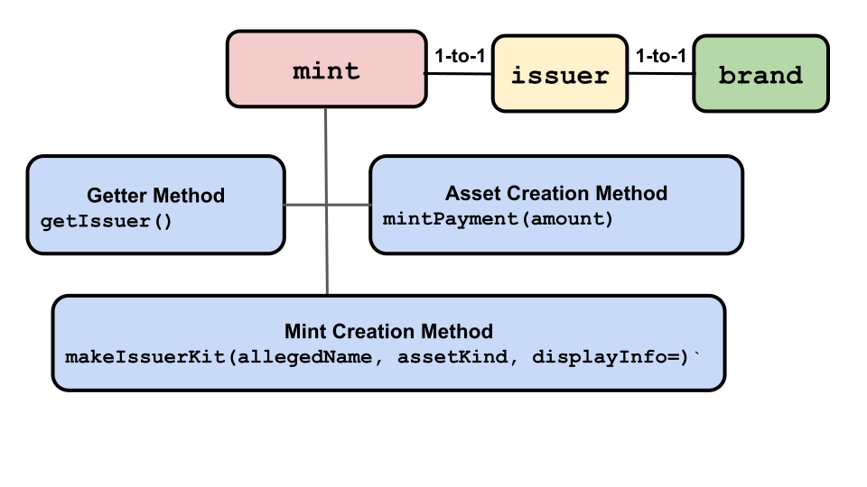

# Issuers and  Mints

## Issuers


Behind the scenes, an `issuer` maps minted digital assets to their location in a `purse`
or `payment`. An `issuer` verifies, moves, and manipulates digital assets. 
Its special admin facet is a `mint` which it has a one-to-one
relationship with. Only a `mint` can issue new digital assets; an `issuer` cannot.

An `issuer` also has a one-to-one relationship with a `brand`. So, if
our `brand` is the imaginary currency Quatloos, only
the `issuer` in the one-to-one relationship with the Quatloos `brand`
can:
- Create a new empty `purse` that can store Quatloos.
- Manipulate a `payment` in Quatloos to be claimed, split, combined,
burned, or have its amount gotten.

An `issuer` should be obtained from a trusted source and
then relied upon as the authority as to whether an untrusted `payment`
of the same `brand` is valid.
 


`Issuer` methods:
- Return information about an `issuer`.
- Create a new `issuer`.
- Create a new `purse`. 
- Operate on `payment` arguments.

The following is
a brief description and example of each `Issuer` method. For
more detail, click the method's name to go to its entry in the [ERTP
API Reference](https://agoric.com/documentation/ertp/api/#ertp-api).

- **Create issuer operation**
  - <router-link to="./api/issuer.html#makeissuerkit-allegedname-mathhelpername">`makeIssuerKit(allegedName, amountMathKind)`</router-link>
  - Makes an `issuer` and its related `mint`, `amountMath` and `brand`.
    Returns ` { mint, issuer, amountMath, brand }` The `mint` and
    `brand` are in unchangeable one-to-one relationships with the `issuer`
    and each other. The `amountMath` is in a many-to-one relationship
    with the `issuer`, `brand`, and `mint`.
    
    The `allegedName` is available from the `brand` to describe assets, but should not
    be trusted. 
    
    `amountMathKind` specifies if the associated `amountMath` is of kind `MathKind.NAT` (`nat`) 
    (the default value), `MathKind.STR` (`str`), or `MathKind.STRING_SET` (`strSet`);
    see the <router-link to="./amount-math.html">`amountMath` page</router-link> for details. 
    - ```js
      import { makeIssuerKit } from '@agoric/ertp';
      const { 
          issuer: quatloosIssuer, mint: quatloosMint, 
	  amountMath: quatloosAmountMath, brand: quatloosBrand 
	  } = 
            makeIssuerKit('quatloos');
      // This is merely an amount, describing assets. 
      // It does not create new assets.
      const quatloos2 = quatloosAmountMath.make(2);
      // Non-fungible asset, which needs an amountMath 
      // of kind 'MathKind.STRING_SET'
      const { 
          mint: titleMint, issuer: titleIssuer, 
	  amountMath: titleAmountMath 
	  } = 
            makeIssuerKit('alamedaCountyPropertyTitle', MathKind.STRING_SET);
      ```
- **Get information about the issuer operations**
  - <router-link to="./api/issuer.html#issuer-getbrand">`issuer.getBrand()`</router-link>
    - Returns the `brand` the `issuer` is in a one-to-one relationship with. The `brand` is not closely
      held, so it can be used by fake digital assets and `amounts`. Do
      not trust this method alone to ensure the `issuer` has the right `brand`.
    - ```js
      import { makeIssuerKit } from '@agoric/ertp';
      const { issuer: quatloosIssuer, brand: quatloosBrand } = makeIssuerKit('quatloos');
      // myQuatloosBrand == quatloosBrand
      const myQuatloosBrand = quatloosIssuer.getBrand();
      ```
  - <router-link to="./api/issuer.html#issuer-getallegedname">`issuer.getAllegedName()`</router-link>
    - Returns the `issuer`/`mint`'s
      <router-link to="../documentation/glossary/#allegedname">`allegedName`</router-link>,
	the non-trusted human-readable name of the `issuer`'s associated `brand`.
    - ```js
      import { makeIssuerKit } from '@agoric/ertp';
      const { issuer: quatloosIssuer } = makeIssuerKit('quatloos');
      const quatloosIssuerAllegedName = quatloosIssuer.getAllegedName();
      // quatloosissuerAllegedName === 'quatloos'
      ```
  - <router-link to="./api/issuer.html#issuer-getamountmathind">`issuer.getAmountMathKind()`</router-link>
    - Get the kind of `amountMath` for this `issuer`, either `MathKind.NAT` (`nat`),
      `MathKind.STR` (`str`), or `MathKind.STRING_SET` (`strSet`).
    - ```js
      import { makeIssuerKit, getAmountMathKind } from '@agoric/ertp';
      const { issuer: quatloosIssuer } = makeIssuerKit('quatloos');
      quatloosIssuer.getAmountMathKind; // 'nat', the default value for makeIssuerKit()
      ```
- **Purse operation**
  - <router-link to="./api/issuer.html#issuer-makeemptypurse">`issuer.makeEmptyPurse()`</router-link>
    - Returns a new empty `purse` for the `brand` associated with the `issuer`. The `purse` only accepts valid 
      deposits of its associated `brand`, so you can retroactively identify a valid `payment` of that `brand`
      by successfully depositing it into this `purse`.
    - ```js
      import { makeIssuerKit, makeEmptyPurse } from '@agoric/ertp';
      const { issuer: quatloosIssuer } = makeIssuerKit('quatloos');
      // The new empty purse contains 0 Quatloos
      const quatloosPurse = quatloosIssuer.makeEmptyPurse();
      ```
- **Payment operations**
  - <router-link to="./api/issuer.html#issuer-getamountof-payment">`issuer.getAmountOf(payment)`</router-link>
    -  Returns the `payment` balance, an `amount`. Using the `issuer` rather than the `payment` lets us trust
      the result even if someone we do not trust sent us the `payment`.
    - ```js
      import { makeIssuerKit } from '@agoric/ertp';
      const { issuer: quatloosIssuer, mint: quatloosMint, amountMath: quatloosAmountMath } = makeIssuerKit('quatloos');
      const quatloosPayment = quatloosMint.mintPayment(quatloosAmountMath.make(100));
      quatloosIssuer.getAmountOf(quatloosPayment); // returns 100 quatloos
      ```
  - <router-link to="./api/issuer.html#issuer-burn-payment-optamount">`issuer.burn(payment, optAmount)`</router-link>
    - Burns (destroys) all of the `payment` argument's digital assets and deletes all mention of the `payment` from the `issuer`.
       If optional argument `optAmount` is present, the `payment`
       balance must be equal to `optAmount`'s value.  If `payment` is a promise, the operation 
       happens after the promise resolves. Returns the value of the burned `payment`.
    - ```js
      import { makeIssuerKit } from '@agoric/ertp';
      const { issuer: quatloosIssuer, mint: quatloosMint, amountMath: quatloosAmountMath } = makeIssuerKit('quatloos');
      const amountToBurn = quatloosAmountMath.make(10);
      const paymentToBurn = quatloosMint.mintPayment(amountToBurn);
      // burntAmountValue equals 10
      const burntAmountValue = quatloosIssuer.burn(paymentToBurn, amountToBurn);
      ```
  - <router-link to="./api/issuer.html#issuer-claim-payment-optamount">`issuer.claim(payment, optAmount)`</router-link>
    - Transfer all digital assets from the `payment` argument to a new `payment` and
      burn the original so no other references to this `payment` survive. Returns the new `payment`
      If optional argument `optAmount` is present, the `payment` balance
      must be equal to `optAmount`'s balance, otherwise it throws an error. If `payment`
      is a promise for a payment, the operation happens after the promise resolves.
    - ```js
      import { makeIssuerKit } from '@agoric/ertp';
      const { mint: quatloosMint, issuer: quatloosIssuer, amountMath: quatloosAmountMath } = makeIssuerKit('quatloos');
      const amountExpectedToTransfer = quatloosAmountMath.make(2);
      const originalPayment = quatloosMint.mintPayment(amountExpectedToTransfer);
      const newPayment = quatloosIssuer.claim(originalPayment, amountToTransfer);
      ```
  - <router-link to="./api/issuer.html#issuer-combine-paymentsarray">`issuer.combine(paymentsArray)`</router-link>
    - Combine multiple `payments` into one `payment`. If any `payment`
      in `paymentsArray` is a promise for a payment, the operation happens after all
      promises resolve. Every `payment` is burned except for the
      returned one. If you try to combine `payments` of different `brands`,
      it throws an exception and each `payment` is unaffected.
    - ```js
      import { makeIssuerKit } from '@agoric/ertp';
      const { mint: quatloosMint, issuer: quatloosIssuer, amountMath: quatloosAmountMath } 
            = makeIssuerKit('quatloos');
      // create an array of 100 payments of 1 unit each
      const payments = [];
      for (let i = 0; i < 100; i += 1) {
        payments.push(quatloosMint.mintPayment(quatloosAmountMath.make(1)));
      }
      // combinedPayment equals 100
      const combinedPayment = quatloosIssuer.combine(payments);
      ```

  - <router-link to="./api/issuer.html#issuer-split-payment-paymentamounta">`issuer.split(payment, paymentAmountA`)</router-link>
    - Split a single `payment` into two new `payments`, A and B, according
      to the `paymentAmountA` argument's value. In other words, the result
      has A equal to `paymentAmountA` and B equal to the original `payment`
      minus `paymentAmountA`. 
      The original `payment` argument is burned. If the original
      `payment` is a promise, the operation happens when the promise
      resolves. 
    - ```js
      import { makeIssuerKit } from '@agoric/ertp';
      const { mint: quatloosMint, issuer: quatloosIssuer, amountMath: quatloosAmountMath } 
            = makeIssuerKit('quatloos');
      const oldPayment = quatloosMint.mintPayment(quatloosAmountMath.make(30));
      const [paymentA, paymentB] = quatloosIssuer.split(oldPayment, quatloosAmountMath.make(10));       
      // paymentA is 10 quatloos, payment B is 20 quatloos.
      ```
   - <router-link to="./api/issuer.html#issuer-splitmany-payment-paymentamountarray">`issuer.splitMany(payment, paymentAmountArray)`</router-link>
     - Returns multiple `payments` in an array from splitting its single
       `payment` argument. The resulting number of `payments` is
       specified as the length of the `paymentAmountArray` argument,
       with the newly split `payments` having `amounts` corresponding
       to those in `paymentAmountArray`. If the `paymentAmountArray`
       argument `amounts` don't add up to the `value` of the `payment`
       argument, the operation fails. If the operation is successful,
       the original `payment` is burned. If the operation fails, the
       original `payment` is *not* burned.
     - ```js     
       import { makeIssuerKit } from '@agoric/ertp';
       const { mint: quatloosMint, issuer: quatloosIssuer, amountMath: quatloosAmountMath } = 
             makeIssuerKit('quatloos');
       const oldQuatloosPayment = quatloosMint.mintPayment(quatloosAmountMath.make(100));
       const goodQuatloosAmounts = Array(10).fill(quatloosAmountMath.make(10));

       const arrayOfNewPayments = quatloosIssuer.splitMany(oldQuatloosPayment, goodQuatloosAmounts);
       //Note that the total amount in the amountArray must equal the
       //amount in the original payment, in the above case, 100 Quatloos in each.

       const quatloosPayment = quatloosMint.mintPayment(quatloosAmountMath.make(1000));
       // total amounts in badQuatloosAmounts equal 20, when it should equal 1000
       const badQuatloosAmounts = Array(2).fill(quatloosAmountMath.make(10));
       // throws error
       issuer.splitMany(quatloosPayment, badQuatloosAmounts);
       ```
  - <router-link to="./api/issuer.html#issuer-islive">`issuer.isLive(payment)`</router-link>
    - Returns `true` if the `payment` argument is still active
      (i.e. has not been used or burned and was issued by this `issuer`). If `payment` is a promise,
      the operation happens on its resolution.
    - ```
      import { makeIssuerKit } from '@agoric/ertp';
      const isItLive = issuer.isLive(payment);

**Related Methods:**

**Note**: None of these methods return a canonical result. If the `issuer` itself doesn't acknowledge that
the `mint`, `brand` or `purse` are associated with it, then they're invalid. These methods help you find 
the right `issuer`, but aren't authoritative.

- <router-link to="./api/mint.html#mint-getissuer">`mint.getIssuer()`</router-link> 
  - Return the associated `issuer` for the `mint`.
  - ```js
    const { issuer: quatloosIssuer, mint: quatloosMint } = makeIssuerKit('quatloos');
    const quatloosMintIssuer = quatloosMint.getIssuer();
    // returns true
    issuer === quatloosMintIssuer);
    ```
- <router-link to="./api/brand.html#brand-ismyissuer-issuer">`brand.isMyIssuer(issuer)`</router-link> 
  - Returns `true` if the `brand` comes from this `issuer`.
  - ```js
    const isIssuer = brand.isMyIssuer(quatloosIssuer);
    ```
- <router-link to="./api/purse.html#purse-getissuer">`purse.getIssuer()`</router-link>
  - Returns the `issuer` associated with the `purse`.
  - ```js
    const purseIssuer = purse.getIssuer();
    ```

## Mints


A `mint` issues new digital assets of its associated `brand` as a new 
`payment` object. These assets may be currency-like (our imaginary
Quatloos currency), goods-like valuables (magic swords for games), or
electronic rights (the right to participate in a contract). Only a
holder of a `mint`object can create new assets from it. 

In other words, let's say there
are 1000 Quatloos in circulation. Only holders of the Quatloos associated
`mint` can make any more Quatloos that'd boost the amount in circulation to, say, 2000.

Since these relationships are one-to-one and unchangeable:
- A `mint` created to make an asset `brand`, say Quatloos, can only create that `brand` asset.
For example, only Quatloos, not Moola or anything else.
- A `mint` that creates an asset `brand` is the only `mint` that can create that `brand`. Only
the one Quatloos `mint` can create new Quatloos.
- A `mint` that creates an asset `brand` can never be changed to create a different `brand`.
So a Quatloos `mint` can never become a Moola `mint`, or any other non-Quatloos asset.

There are two `mint` API commands. Click the method's name to go to its entry in the [ERTP
API Reference](./api/#ertp-api).
- [`mint.getIssuer()`](./api/mint.html#mint-getissuer)
  - Returns the `issuer` uniquely associated with the `mint`.
  - ```js
    import { makeIssuerKit } from '@agoric/ertp';
    const { issuer: quatloosIssuer, mint: quatloosMint } = makeIssuerKit('quatloos');
    const quatloosMintIssuer = quatloosMint.getIssuer();
    // returns true
    quatloosIssuer === quatloosMintIssuer;
    ```
- [`mint.mintPayment(newAmount)`](./api/mint.html#mint-mintpayment-newamount)
  - Returns a new `payment` containing newly minted assets with a balance equal to `newAmount`. In other words,
    it mints `newAmount` of digital assets and creates a `payment` to hold those new assets. The assets are of
    the `mint`'s associated `brand`.
    
    **Important**: `mint.mintPayment()` is the only way in ERTP to create new digital assets. There is no other way.
    The Zoe Contract Facet (`zcf`) can also create a mint in Zoe that can create new digital assets.
  - ```js
    import { MathKind, makeIssuerKit, makeLocalAmountMath } from '@agoric/ertp';    
    const { issuer: quatloosIssuer, mint: quatloosMint} = makeIssuerKit('quatloos');
    const quatloosLocalAmountMath = await makeLocalAmountMath(quatloosIssuer);
    const quatloos1000 = quatloosLocalAmountMath.make(1000);
    const newPayment = quatloosMint.mintPayment(quatloos1000);
    ```
