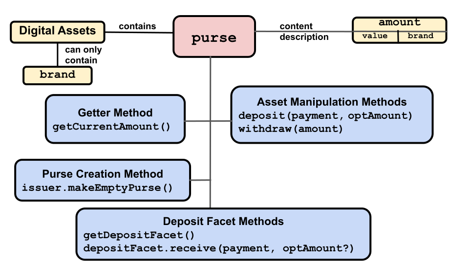

# Purses and Payments
 
Digital assets can be any of:
- Currency-like, such as our imaginary Quatloos currency.
- Goods-like digital assets, such as magic weapons for use in a game or theater tickets.
- Other kinds of rights, such as the right to participate in a particular contract.

In ERTP, digital assets exist in either a `purse` or a `payment`:
- **[`purse`]**: Holds
  an amount of same-branded digital assets until part or
  all of them are withdrawn into a `payment`. A new `purse` is created
  by an `issuer` and can only hold assets of that `issuer`'s `brand`. 
- **[`payment`]**:
  Holds a quantity of same-branded digital assets to transfer to another party. 
  A new `payment` is created either with new assets by a `mint` or by 
  withdrawing assets from a `purse`. It can only hold assets of the same `brand` as
  that `mint` or `purse`.

For any `brand`, any number of `purses` or `payments` can hold assets
of that `brand`. Neither a `purse` nor a `payment` can ever change their
associated `brand`.

Each `purse` and `payment` object contains a specific single amount of digital assets, which may be none at all (`empty` in amountMath terms). In the same way 
you might have separate bank accounts for different purposes, 
you can have different purses for the same brand of digital asset. 
One purse might hold 2 Quatloos and another purse might hold 3 Quatloos. 

When you deposit assets into a `purse` or `payment`, they are added to
whatever assets already exist there. So a 3 Quatloos deposit 
into a `purse` with 8 Quatloos, results in a `purse` with 11 Quatloos. Similarly, 
then withdrawing 6 Quatloos from that `purse` into a new `payment` leaves the `purse` 
with 5 Quatloos and the new `payment` has 6 Quatloos. 

When adding a `payment` to a `purse`, you must add the entire `payment`. To
only add part of a `payment`, you must first use `payment.split()` 
or `payment.splitMany()` to split the `payment` into two or more new `payments`.

`mints` create entirely new digital assets and put them in a new `payment`. 
You also create a `payment` by withdrawing assets from a `purse`, by splitting an 
existing `payment`, or by combining multiple `payments` into one new one. Note 
the `brand` of the new `payment` is the same as the associated `brand` of its originating `mint`, `purse` or `payment`. 

You don't transfer assets directly from one `purse` to
another `purse`. Instead, in ERTP you do something like these steps to send and receive assets. The actual send operation is up to you; ERTP does not 
implement a way of sending object-containing messages between parties.
- Send assets:
  1. Withdraw assets described by an `amount`from a `purse`, creating a `payment`.
  2. Send this `payment` to a recipient as a message.
- Receive assets:
  1. If you don't already have one, create a `purse` for the asset `brand`
     you'll receive. 
  2. Receive the message with the `payment`.
  3. Deposit the `payment` in a `brand` appropriate `purse`. 
     
## Purses

You change a purse's balance by calling either `deposit()` (to add assets) or
`withdraw()` (to remove assets) on it. A purse can be empty, which for
fungible assets means it has a value of 0. For non-fungible 
assets, such as theatre tickets, it doesn't have any tickets.

Unlike `payments`, `purses` are not meant to be sent to others. To transfer 
digital assets, you should withdraw a `payment` from a `purse` and send 
the `payment` to another party.

You can create a *deposit facet* for a `purse`. Deposit facets are either sent to other parties or made publicly known. Any party can deposit a `payment` into the 
deposit facet, which deposits it into its associated `purse`. However, no one can
use a deposit facet to either make a withdrawal from its `purse` or get the `purse`'s balance. 

If you have a deposit facet, you make a deposit to its associated `purse` by calling 
`depositFacet.receive(payment);`. Note that you add a `payment` to a `purse` with a `deposit()` method, while you add a `payment` to a `depositFacet` with a `receive()` method. 

The `payment` must be the same `brand` as what
the associated `purse` object can contain. Otherwise it throws an error. 
When sending a party a 
deposit facet object, you should tell them what assets `brand` it accepts.

  

The following is a brief description and example of each `purse` method. For
more detail, click the method's name to go to its entry in the [ERTP
API Reference](./api/#ertp-api).
- [`purse.getCurrentAmount()`](./api/purse.html#purse-getcurrentamount)
- Returns a description of the digital assets currently stored in the `purse` as an `amount`. Note that a `purse` can be empty.
  - ```js
    const quatloosPurse = quatloosIssuer.makeEmptyPurse();
    // Balance should be 0 Quatloos.
    const currentBalance = quatloosPurse.getCurrentAmount();
    // Deposit a payment of 5 Quatloos
    quatloosPurse.deposit(quatloosPayment5);
    // Balance should be 5 Quatloos
    const newBalance = quatloosPurse.getCurrentAmount());
    ``` 
- [`purse.withdraw(amount)`](./api/purse.html#purse-withdraw-amount)
  - Withdraw the assets described by `amount` from this `purse` into a new
    `payment`. Returns the new `payment`.
  - ```js
    // Withdraw 3 Quatloos from a purse.
    const newPayment = quatloosPurse.withdraw(quatloosAmountMath.make(3));
    ```
- [`purse.deposit(payment, optAmount)`](./api/purse.html#purse-deposit-payment-optamount)
  - Deposit the digital asset contents of the `payment` into this `purse`,
    returning a description of the `payment` balance as an `amount`. If the optional argument
    `optAmount` does not equal the `payment` balance,  or if `payment`
    is an unresolved promise, it throws an error.
  - ```js
    const quatloosPurse = quatloosIssuer.makeEmptyPurse();
    const quatloosPayment = quatloosMint.mintPayment(quatloosAmountMath.make(123));
    const quatloos123 = quatloosmountMath.make(123);
    // Deposit a payment for 123 quatloos into the purse. Ensure that this is the amount you expect.
    quatloosPurse.deposit(quatloosPayment, quatloos123);
    const secondPayment = quatloosMint.mintPayment(quatloosAmountMath.make(100));
    // Throws error since secondPayment is 100 Quatloos and quatloos123 is 123 Quatloos
    quatloosPurse.deposit(secondPayment, quatloos123);
    ```
- [`purse.getDepositFacet()`](./api/purse.html#purse-makedepositfacet)
  - Returns a deposit-only facet on the `purse` that can be given
    to other parties. This lets them make a deposit to the `purse`, but not make
    withdrawals from it or get its balance. Note that the command to add a `payment`'s
    assets via a `DepositFacet` is not `deposit()` but `receive()` as shown here.
  - ```js
     const depositOnlyFacet = purse.getDepositFacet();
     // Give depositOnlyFacet to someone else. They can pass a payment
     // that will be deposited:
     depositOnlyFacet.receive(payment);
     ```

In addition, the method to create a new, empty, `purse` is called on an `issuer`:
- [`issuer.makeEmptyPurse()`](./api/issuer.html#issuer-makeemptypurse)
  - Returns a new empty `purse` for storing digital assets of the `brand` the `issuer` is associated with.
  - ```js
    // The new purse can only contain assets of the Quatloos brand.
    const quatloosPurse = quatloosIssuer.makeEmptyPurse();
    ```
## Payments

   

Payments hold digital assets intended to be transferred to another party.
They are linear, meaning that either a `payment` has its full
original balance, or it is used up entirely. It is impossible to
partially use a `payment`. 

In other words, if you create a `payment` containing
10 Quatloos, the `payment` will always either contain 
10 Quatloos or it will be deleted from its `issuer` records and no
longer have any value. While a `payment` can be either combined with others or
split into multiple `payments`, in both cases the original `payment(s)`
is/are deleted and the results put in one or more new `payments`.

A `payment` can be deposited in purses, split into multiple 
`payments`, combined with other `payments`, and claimed (getting an exclusive `payment` and revoking access from anyone else). 

A `payment` is often received from other parties. Since they are not
self-verifying, you cannot trust `payments`. To get the verified balance
of a `payment`, use the `getAmountOf(payment)` method on the trusted `issuer` 
for the `payment`'s `brand`. 

To get the `issuer` for a `brand` you didn't create, 
ask someone you trust. For example, the venue creating tickets for shows
can be trusted to give you the tickets' `issuer`. Or, a friend might have 
a cryptocurrency they like, and, if you trust them, you might accept 
that the `issuer` they give you is valid.

To convert a `payment` into a new `purse`:
1. Get the `payment`'s trusted `issuer`.
2. Use the `issuer` to create an empty `purse` for that `brand`.
3. Deposit the `payment` into the new `purse`. `purse.deposit(payment)` deletes the `payment`.

`Payments` have only one API method, but many methods for other ERTP components
have `payments` as arguments and effectively operate on a `payment`. The following is a 
brief description and example of each `payment`-related method. For
more detail, click the method's name to go to its entry in the [ERTP
API Reference](./api/#ertp-api).
- [`payment.getAllegedBrand()`](./api/payment.html#payment-getallegedbrand)
  - Returns a `brand`, indicating what kind of digital asset the
  `payment` purports to be. Since a `payment` is not trusted, this result should be   
   treated with suspicion. Either verify the value, or check 
   the result when you use it. Any successful operation by 
   the `issuer` for that `brand` done on the `payment` verifies the `payment`.

Other objects' `payment`-related methods:

- [`issuer.getAmountOf(payment)`](./api/issuer.html#issuer-getamountof-payment)
  - Get the amount of digital assets in the `payment` as an `amount`. 
    The `payment` itself is not trusted, so you must use the `issuer` method associated
    with its `brand` to be sure of getting the true value. 
    ```js
    const quatloosPayment = quatloosMint.mintPayment(quatloosAmountMath.make(100));
    quatloosIssuer.getAmountOf(quatloosPayment); // returns an amount with 100 value `quatloos` brand
    ```
- [`issuer.burn(payment, optAmount)`](./api/issuer.html#issuer-burn-payment-optamount)
  - Burn all of the digital assets in the `payment`. `optAmount` is
    optional but if present, the `payment` balance must be equal to
    it. If `payment` is a promise, the operation proceeds after it resolves. 
  - ```js
    const amountToBurn = quatloosAmountMath.make(10);
    const paymentToBurn = quatloosMint.mintPayment(amountToBurn);
    // burntAmount should equal 10
    const burntAmount = quatloosIssuer.burn(paymentToBurn, amountToBurn);
    ```
- [`issuer.claim(payment, optAmount)`](./api/issuer.html#issuer-claim-payment-optamount)
  - Transfer all assets from the `payment` to a returned new `payment`
    and delete the original from the `issuer`'s records. Any references to the old
    `payment` outside the `issuer` will still exist, but if anyone attempts to use the
    old `paymen`t, an error is thrown.  
    
    If `optAmount` is
    present, the `payment` balance must be equal to it or it throws
    an error. If `payment` is a promise, the operation proceeds after it resolves. 
  - ```js
    const amountExpectedToTransfer = quatloosAmountMath.make(2);
    const originalPayment = quatloosMint.mintPayment(amountExpectedToTransfer);
    const newPayment = quatloosIssuer.claim(originalPayment, amountToTransfer);
    ```
- [`issuer.combine(paymentsArray)`](./api/issuer.html#issuer-combine-paymentsarray)
  - Combine multiple `payments` into one, returned, `payment`. If any `payment` in
  the array is a promise, the operation proceeds after every `payment`
  resolves. All `payments` in the array are burned on successful completion.
  - ```js
    // create an array of 100 payments of 1 unit each
    const payments = [];
    for (let i = 0; i < 100; i += 1) {
      payments.push(quatloosMint.mintPayment(quatloosAmountMath.make(1)));
    }
    // combinedPayment equals 100
    const combinedPayment = quatloosIssuer.combine(payments);
    ```
- [`issuer.split(payment, paymentAmountA)`](./api/issuer.html#issuer-split-payment-paymentamounta)
  - Split one `payment` into two new ones, A and B, returned in
    an array. `paymentAmountA` determines A's value, and whatever is
    left of the original `payment` after subtracting A is B's value. 
    If `paymentAmountA` has a larger `value` than `payment`, it throws an error.
    
    The `payment` argument is deleted from the issuer's records. If `payment` is
    a promise, the operation proceeds after the promise for a payment resolves. 
  - ```js
    const oldPayment = quatloosMint.mintPayment(quatloosAmountMath.make(20));
    // Results in paymentA = 5 and paymentB = 15 (20 -5)
    const [paymentA, paymentB] = quatloosIssuer.split(oldPayment, amountMath.make(5));
    ```
- [`issuer.splitMany(payment, amountArray)`](./api/issuer.html#issuer-splitmany-payment-amountarray)
  - Split `payment` into multiple `payments`, returned as an array the
    same length as `amountArray` and with its `payments` having the
    same values as specified for `amountArray`'s elements. If `payment`
    is a promise for a payment, the operation proceeds after it resolves. If
    the `payment` value is not equal to the sum of `amountArray`'s
    values, the operation fails. On success, the original `payment` is 
    deleted from the issuer's records.
  - ```js
    const oldPayment = quatloosMint.mintPayment(quatloosAmountMath.make(100));
    const goodAmounts = Array(10).fill(quatloosAmountMath.make(10));
    // Results in an array of 10 payments, each with value 10.
    const arrayOfNewPayments = quatloosIssuer.splitMany(oldPayment, goodAmounts);
    ```
- [`issuer.isLive(payment)`](./api/issuer.html#issuer-islive-payment)
  - Returns `true` if `payment` has value. If `payment` is a promise for payment,
    the operation proceeds upon resolution.
- [`mint.mintPayment(newAmount)`](./api/mint.html#mint-mintpayment-newamount)
  - Returns a new `payment` containing the newly minted assets corresponding to the `newAmount` argument. Note
    that unlike creating a new `payment` by withdrawing existing assets from a `purse`,
    this creates new digital assets of the specified in `newAmount` `brand`.
  - ```js
    const quatloos1000 = quatloosAmountMath.make(1000);
    const newPayment = quatloosMint.mintPayment(quatloos1000);
    ```
- [`purse.deposit(payment, optAmount)`](./api/purse.html#purse-deposit-payment-optamount)
  - Deposit all of `payment` into this `purse`, returning the deposit
    `amount` description. If optional `optAmount` does not equal the `payment`'s balance
     or if `payment` is an unresolved promise, it throws an error.
  - ```js
    const quatloosPurse = quatloosIssuer.makeEmptyPurse();
    const quatloosPayment = quatloosMint.mintPayment(quatloosAmountMath.make(123));
    const quatloos123 = quatloosAmountMath.make(123);
    // Deposit a payment for 123 quatloos into the purse. Ensure that this is what you expect.
    quatloosPurse.deposit(quatloosPayment, quatloos123);
    const secondPayment = quatloosint.mintPayment(quatloosmountMath.make(100));
    // Throws error
    quatloosPurse.deposit(secondPayment, quatloos123);
    ```
- [`purse.makeDepositFacet()`](./api/purse.html#purse-makedepositfacet)
  - Creates a deposit-only facet on the `purse` that can be given to
    other parties that lets them deposit a `payment` (but not
    withdraw) into the `purse`.
  - ```js
    const depositOnlyFacet = purse.makeDepositFacet();
    // Give depositOnlyFacet to someone else. 
    // They can pass a payment that will be deposited:
    depositOnlyFacet.receive(payment);
    ```
## `purse` and `payment` example

The following code creates a new `purse` for the `quatloos` brand, deposits
10 Quatloos into the `purse`, withdraws 3 Quatloos from the `purse` into a
`payment`, and finally returns an `amount` describing what's currently in the `purse`, 7 Quatloos.

```js
// Create a purse with a balance of 10 Quatloos
const { issuer: quatloosIssuer, mint: quatloosMint 
        amountMath: quatloosAmountMath } = 
      makeIssuerKit('quatloos');
const quatloosPurse = quatloosIssuer.makeEmptyPurse();
const quatloos10 = quatloosAmountMath.make(10);
const quatloosPayment = quatloosMint.mintPayment(quatloos10);
// If the two arguments aren't equal (i.e. both need to be for 10 Quatloos),
// throws an error. But they are both for 10 Quatloos, so no problem.
quatloosPurse.deposit(quatloosPayment, quatloos10);

// Withdraw 3 Quatloos from the purse into a payment
const quatloos3 = quatloosAmountMath.make(3);
const withdrawalPayment = quatloosPurse.withdraw(quatloos3);

// The balance of the withdrawal payment is 3 Quatloos
quatloosIssuer.getAmountOf(withdrawalPayment);

// The new balance of the purse is 7 Quatloos
quatloosPurse.getCurrentAmount();
```
