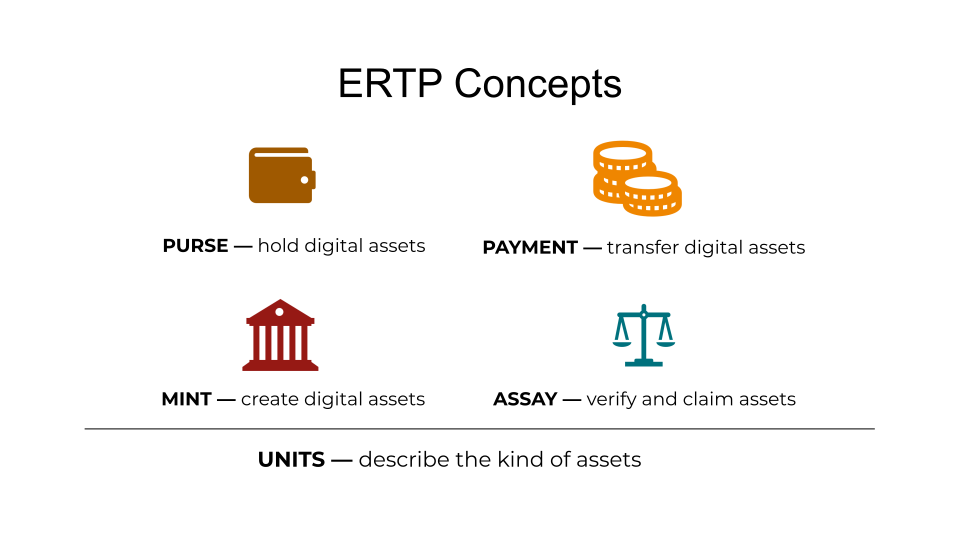

# Electronic Rights Transfer Protocol - ERTP

## Introduction

Bitcoin has unspent transactions. Ethereum has account balances.
Agoric has ERTP.



ERTP is a uniform way of transferring tokens and other digital assets in JavaScript. All kinds of digital assets can be easily created, but importantly, they can be transferred in exactly the same ways, with exactly the same security properties.

You are currently reading the guide. There is also an [ERTP API reference](/ertp/api/) available.

## How It Works

ERTP, or the Electronic Rights Transfer Protocol, is a smart contract
framework. ERTP itself doesn't have any concept of cryptography.
Instead, it uses object capabilities to enforce access control.
Instead of having to prove ownership of a corresponding private key,
in the world of object capabilities, if your program has a reference
to an object, it can call methods on that object. If it doesn't have a
reference, it can't. For more on object capabilities, see [Chip
Morningstar's
post](http://habitatchronicles.com/2017/05/what-are-capabilities/).

ERTP is the top layer of the Agoric stack. You can find out more about this stack in this introductory video:
<iframe width="560" height="315" src="https://www.youtube.com/embed/52SgGFpWjsY" frameborder="0" allow="accelerometer; autoplay; encrypted-media; gyroscope; picture-in-picture" allowfullscreen></iframe>

## A quick tutorial

Let's look at an example. In ERTP, all digital assets, including fungible and
non-fungible tokens, are created by a [`mint`](./mint.html). Having access to the mint
gives you the power to create more digital assets of the same type at
will. For instance, let's say we want to create a new community
currency called 'BaytownBucks'.
You would first install the [ertp JavaScript package](https://www.npmjs.com/package/@agoric/ertp)
(`npm install @agoric/ertp`) and then:

```js
import { makeMint } from '@agoric/ertp/core/mint';

const baytownBucksMint = makeMint('BaytownBucks');
```

Great! Now let's use our mint to create 1000 new BaytownBucks.

```js
const purse = baytownBucksMint.mint(1000, 'community treasury');
```

The act of minting created 1000 BaytownBucks and stored them together in a
`purse`. [Purses](./mint.html#purses) in ERTP only hold one type of digital asset, so this
purse can only ever hold BaytownBucks.

Let's distribute the BaytownBucks to members of the community. To send
money in ERTP, we withdraw [`payments`](./mint.html#payments) from purses.

```js
const paymentForAlice = purse.withdraw(10, `alice's community money`);
```

Like our purse, this payment contains BaytownBucks, but unlike purses,
payments are used to represent tokens in transit. A payment can be
sent to someone else, a purse never should be.

Now let's send the payment to Alice as message:

```js
alice.receivePayment(paymentForAlice);
```

This may seem strange, but ERTP is built on top of [an
infrastructure](https://github.com/Agoric/SwingSet) in which
everything is an object. In this example, we have a reference to the
object `alice`, and can call her `receivePayment` to ask her to
receive this payment. Alice's methods are entirely up to her, and are
not part of ERTP.

## Security Properties

How does Alice know that she got paid real money? She could have been
sent fake money, or she could have been sent money that was
[double-spent](https://en.wikipedia.org/wiki/Double-spending).

When alice receives an alleged payment, she can call a method to know
that the alleged payment was valid, and get a new payment that is
exclusively hers:

```js
const myExclusivePayment = BaytownBucksIssuer.claimAll(allegedPayment);
```

The BaytownBucksIssuer is associated with the BaytownBucksMint, but
the issuer is the public-facing version that is accessible to anyone.
By holding the reference to a mint, you can mint more tokens. By
holding a reference to the issuer for a mint, you can check that a
payment is valid and exclusively claim it in a new payment to yourself.

That's the basic use case for a fungible token. `makeMint` in
[issuers.js](core/issuers.js) takes
in an optional configuration that allows for many more possibilities.

## Pixel Demo

For a demo on how ERTP can be used, check out our [Pixel Demo](/Documentation/getting-started/pixel-demo.html#installation).

### A preemption hierarchy of rights

All of the pixels (individual squares) on the demo webpage are owned by the gallery, the code that administrates the pixels. The gallery has the power to revoke the pixels from any user at any time. When a user calls `gallery!tapFaucet()`, the gallery takes the least recently colored pixel from its current holder (if anyone holds it) and gives it to the user in the form of an ERTP payment. The gallery is able to revoke the pixels held by users because the pixel demo creates a customized version of ERTP in which rights are hierarchical. Hierarchical rights are familiar in property. For instance, a property owner might lease an apartment to a tenant, who might in turn, lease it to a subtenant. Anyone higher in the hierarchy can take away access from anyone lower in the hierarchy, and give it to someone else.

## More ERTP resources

Mark Miller explained ERTP on Oct 10, 2018 in his [Programming Secure Smart Contracts][watch] presentation
during San Francisco Blockchain Week at a
[SF Cryptocurrency Devs meetup](https://www.meetup.com/SF-Cryptocurrency-Devs/events/253457222/).

[][watch]

[watch]: https://www.youtube.com/watch?v=YXUqfgdDbr8

## Higher Order Smart Contracts

The `contractHost` tests detail the composition of a covered call option
with an escrow exchange contract.

```sh
npx tape -r esm test/swingsetTests/contractHost/test-contractHost.js
```

For more examples, please see the code for Alice and Bob in `test/swingsetTests/contractHost/`.


