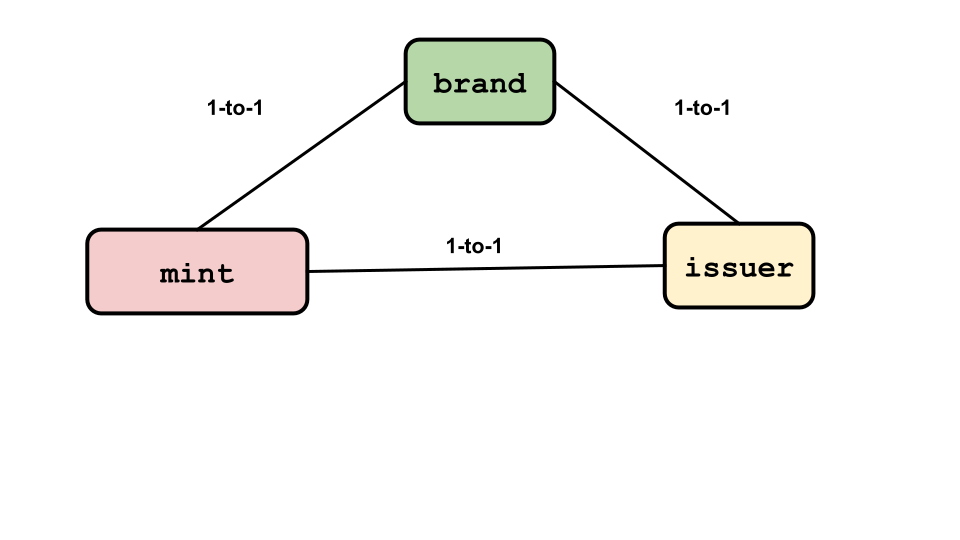
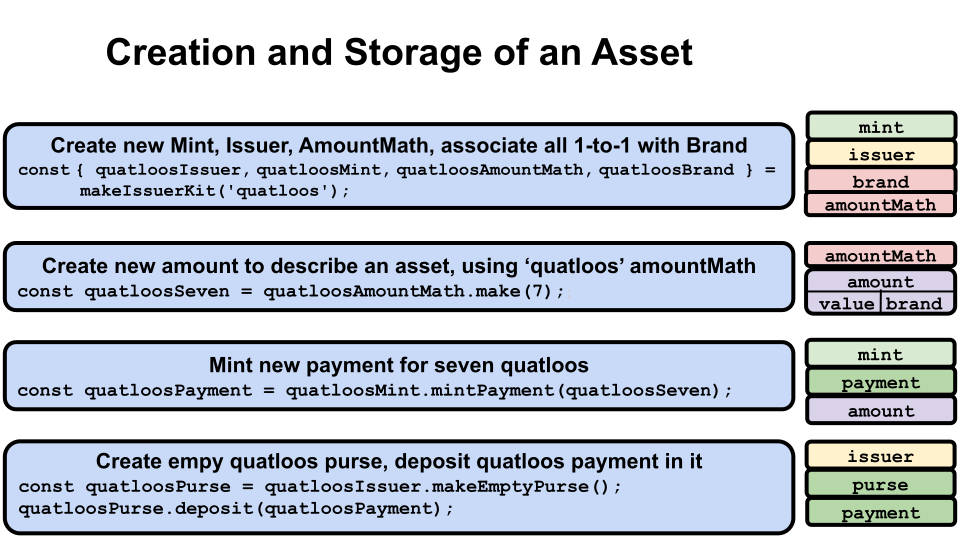
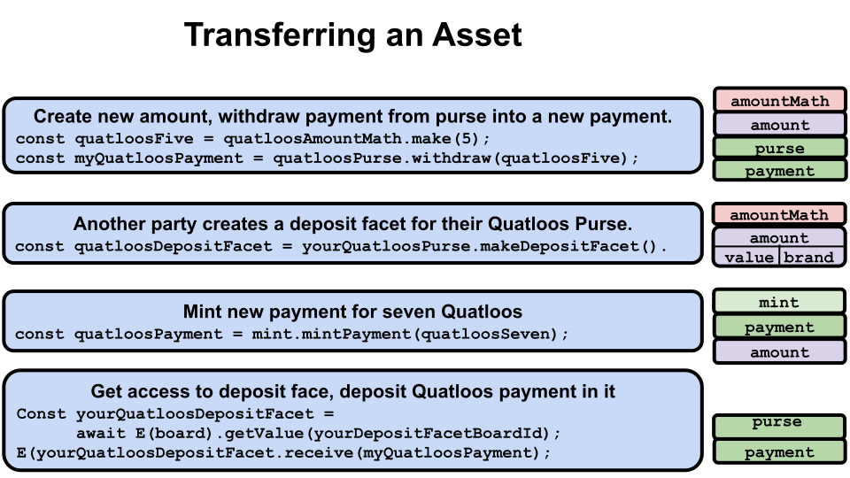

# ERTP Guide

ERTP (*Electronic
Rights Transfer Protocol*)
is Agoric's token standard for transferring tokens and other digital assets in
JavaScript. Using the
[ERTP API](../api/),
you can easily create and use digital assets, all of which are
transferred exactly the same way and with exactly the same security properties. 

ERTP uses
*[OCaps (object capabilities)](https://agoric.com/documentation/glossary/#object-capabilities)*
to enforce access control. If your program has a reference to an
object, it can call methods on that object. If it doesn't have a
reference, it can't. For more on object capabilities, see
[Chip Morningstar's post](http://habitatchronicles.com/2017/05/what-are-capabilities/).

## Fungible and Non-Fungible Assets

There are two kinds of assets,
*[fungible](https://agoric.com/documentation/glossary/#fungible)* and
*[non-fungible](https://agoric.com/documentation/glossary/#non-fungible)*. 

Fungible assets are interchangeable. For example, if you have 100
one-dollar bills and need to pay someone 5 dollars, it doesn't matter
which five of your one-dollar bills you give them. 

Non-fungible assets have the same brand, but are not interchangeable. For example, you might have 100
theatre tickets. But someone wanting to buy even a General Admission ticket from you will want one
for a specific date and time. This might also affect the price; you'll want to charge more
for a Friday evening ticket than a Wednesday matinee ticket, even if it's for the same show.

## ERTP Concepts Overview

Asset descriptions have two parts:
 - **[Value](./Amounts.md)**:  An
  asset's size. You can think of this as the answer to the questions "how many?" or "how much?" about
  an asset.
 - **[Brand](./Amounts.md)**: An
  asset's kind. You can think of this as the answer to the question "What is it?" about an asset.
  
These two make up:
- **[Amount](./Amounts.md)**:
  Consists of a `value` and a `brand`. It is a description of an asset, not an asset itself, 
  as it has no economic scarcity or economic value.
  
So, using the fictional currency Quatloos, you could have an asset described as being "400 Quatloos",
where `400` is the `value` and `Quatloos` is the `brand`. For now, we'll just look at fungible assets
whose values have to be non-negative integers. 

The `brand` is a very important component. Most ERTP objects work with or on one specific `brand`.
In fact, instances of these next three components all only work on one `brand`. Note also that their
relationships with a `brand` are established at their creation and can never be changed. If they are 
initially associated with Quatloos, they will always be associated with Quatloos and Quatloos only. 
 
- **[Mint](./IssuersAndMints.md)**: 
  The only way to create digital assets of a particular `brand`. Each `brand` has
  a one to one relationship with a `mint` and vice versa. The created assets are stored in `payments`.   
- **[Issuer](./IssuersAndMints.md)**: 
  The source of truth of how many digital assets each `purse` and `payment` holds. An `issuer`
  is used to validate `payments` received from untrusted parties. Specifically, it validates
  `payments` of the `brand` the `issuer` is associated with. Has a one-to-one relationship
  with both a `brand` and a `mint`. 
- **[AmountMath](./AmountMath.md)**:
  Methods to do math operations on `amounts`. Each `brand` can be associated with many `amountMaths`,
  but each `amountMath` is permanently associated with only one `brand`.

 

Let's look at an example. Suppose there is the "Quatloos" `brand`. That means there is also:
- A "Quatloos `mint`" that is the only ERTP `mint` that can ever create new Quatloos assets.
- A "Quatloos `issuer`" that is the only `issuer` that can create a new `purse` to contain Quatloos and 
  operate on a `payment` containing Quatloos.
- "Quatloos `amountMaths`" whose operations only work on an `amount` whose `brand` is Quatloos.

 

We've already mentioned our final two components:
- **[Purse](./PursesAndPayments.md)**: An
  object for holding digital assets of a specific `brand`.
- **[Payment](./PursesAndPayments.md)**:
  An object for transferring digital assets of a specific `brand` to another party.
  
Similar to other component instances, a `purse` and a `payment` only work with one
`brand`. So a `purse` or `payment` that holds Quatloos cannot hold an asset of `brand` Moola or vice versa. 
You cannot change the `brand` a `purse` or `payment` was originally associated with. Once you create a
Quatloos purse or Quatloos payment, they can never hold anything other than Quatloos.

However, these are not one-to-one relationships. There can be thousands or more
`purses` or `payments` that hold Quatloos or any other `brand`.

## Method Naming Structure

ERTP methods use a template for their names. Knowing what a particular method name prefix represents
can help you when reading code.

- `make<Foo>()`: Creates a new Foo object and returns only that object.
- `make<Foo>Kit()`: Creates a new Foo object as well as other things. It returns some combination of useful things, usually including the new
  Foo object. But not always; sometimes Foo is conceptual, and, for example, instead of a single object, two facets are returned.
- `create<Foo>()`: Creates a new Foo, but doesn't return it. 
- `get<Foo>()`: Returns a Foo that already exists. 
- `provide<Foo>()`: If Foo already exists, it returns it. If not, it creates a new Foo and returns that.

## Life of Assets

Let's look at some asset operation lifecycles. While it's very rare for an asset to be destroyed, as opposed to being
redistributed, these lifecycles show assets from their creation through common usage patterns. These are 
deliberately stripped down to their basic, core, functionality. Optional parameters and non-core operations 
are not shown, nor are some significant concepts which would make this introduction more confusing. Those 
are covered on the component-specific pages.

### Asset creation and storage


```js
const { 
    issuer: quatloosIssuer, 
    mint: quatloosMint, 
    amountMath: quatloosAmountMath, 
    brand: quatloosBrand 
} = makeIssuerKit('quatloos');
```
First, you pass a string naming a new `brand` to
`makeIssuerKit()`. As noted above, a `make<Foo>Kit()` method creates both a new Foo, in this case an `issuer`, and some other things.
Here it also creates a new `mint`, `amountMath`, and formal `brand` 
for the argument, and returns all four new objects. The `mint`, `issuer`, and `brand` 
are in one-to-one associations with each other. 

Note: Usually you'd want to create a `localAmountMath` via other means. See the [Amount Math page](./AmountMath.md).

In this case, you used the string 'quatloos' to name the `brand`.

```js
const quatloosSeven = quatloosAmountMath.make(7);;
```
Here you use the Quatloos `amountMath` to make a new `amount` description of the asset you want to create.
Since `amountMath` objects are always associated with a single `brand`, in this case Quatloos, you 
only have to specify what you want for the `value` of the new `amount`, in this case `7`.

This returns an `amount` description stored in `quatloosSeven`. Remember, an `amount` is only a description
of an asset, not an asset itself. `quatloosSeven` has no worth or intrinsic value.

```js
const quatloosPayment = quatloosMint.mintPayment(quatloosSeven);
```
This mints a new asset of 7 Quatloos. In this case, since it's a `mint` operation, you are creating
a new digital asset of 7 Quatloos. It's returned as a `payment`, so you want a place to store it for 
the longer term. 
```js
const quatloosPurse = quatloosIssuer.makeEmptyPurse();
quatloosPurse.deposit(quatloosPayment);
```
For long term storage, we prefer using a `purse`. `payments` are generally used to transfer assets rather than
hold them for extended periods. First you create a new empty `purse` for Quatloos using
the Quatloos associated `issuer`. Then you deposit the `payment` into the `purse`. When this happens,
the `payment` is automatically deleted and the 7 Quatloos are now resident
in the `purse`. If you'd used an existing `purse` that contained, say, 17 Quatloos, these 7 would have been
added to them so the `purse` balance would be 24 Quatloos. 

### Transferring an asset


Start with your `quatloosPurse` that holds 7 Quatloos. You decide you want to send 5 Quatloos to 
another party named Alice.
```js
const quatloosFive = quatloosAmountMath.make(5);
```
First you create a new Quatloos branded `amount` with a `value` of 5 to describe what you want to withdraw.
Remember, an `amount` is just a description of assets, not the actual assets.
```js
const myQuatloosPayment = quatloosPurse.withdraw(quatloosFive);
```
Now you tell your Quatloos containing `purse` that you want to withdraw the specified `amount` from 
it. The withdrawn 5 Quatloos goes into a `payment`

You've got your `payment` for 5 Quatloos, but how do you get it to Alice? She needs to
have done some work first so there's somewhere for her to put it and a way of getting it to
her rather than someone else.
```
const aliceQuatloosDepositFacet = aliceQuatloosPurse.makeDepositFacet()
```
Assume Alice already has a Quatloos containing `purse` of her own. To let other
parties safely deposit Quatloos into it, she creates
a *deposit facet* for that `purse`. Anyone who has access to a deposit facet can deposit
assets to its `purse` but cannot either make a withdrawal from the `purse` or get its balance. It's like
being able to send money to a friend via their email address; you can't then take money out
of your friend's accounts or find out how much is in them.
```js
const aliceQuatloosDepositFacetId = E(board).getId(aliceQuatloosDepositFacet);
```
Alice puts her deposit facet on Agoric's *Board*, a key-value "bulletin board" that lets her make it generally available for use.

The Board is a basic bulletin board type system where users can post an Id for a value and
others can get the value just by knowing the Id. Alice can make her Id(s) known by any
communication method she likes; private email, an email blast to a mailing list or many individuals,
buying an ad on a website, tv program, or newspaper, listing it on her website, etc.
```js
const aliceQuatloosDepositFacet = 
      await E(board).getValue(aliceQuatloosDepositFacetBoardId);
E(aliceQuatloosDepositFacet).receive(myQuatloosPayment);
```
Remember, ERTP's use of OCaps requires that you have access to an object in order 
to run methods on it. So someone who wants to use Alice's deposit facet 
has to first get it off the Board.
 
Alice tells you the Board Id associated with her Quatloos `purse` deposit facet. You get the Id associated value,
which gives you the reference to that deposit facet. You then just tell the facet to receive your `payment`
of 5 Quatloos. 

Things end up with your Quatloos `purse` having 2 Quatloos (7 - 5), Alice's Quatloos `purse` having 5 more Quatloos
in it, and the 5 Quatloos `payment` deleted when the transfer happened. 

The [`E()` notation](https://agoric.com/documentation/distributed-programming.html#communicating-with-remote-objects-using-e)
is a local "bridge" function that lets you invoke methods on remote objects. It takes a local 
representative (a proxy) for a remote object as an argument and sends messages to it. The local proxy 
forwards all messages to the remote object to deal with. `E` must be used to send a message to the remote object. This
is explained in more detail at the preceding link.

### Creating and using non-fungible assets

Say you own the Agoric Theatre and want to sell tickets to seats for a play. Tickets are non-fungible assets, 
as they refer to a specific seat for a specific show at a specific time and date. It matters to
buyers which ticket they get.

The Agoric Theatre has 1114 seats numbered `1` to `1114`.
Objects representing valid tickets have the properties:
- `seat`: A number
- `show`: A string describing the show
- `start`: A string representing a [time/date in ISO format](https://developer.mozilla.org/en-US/docs/Web/JavaScript/Reference/Global_Objects/Date/toISOString)

```js
const startDateString = (new Date(2019, 11, 9, 20, 30)).toISOString();

const ticketValues = Array(1114).fill().map((_, i) => ({
  seat: i+1,
  show: 'Hamilton',
  start: startDateString,
}))
```
To create tickets, you first create JavaScript objects that each represent a ticket.
Then, because you need to specify the amount of digital assets to be minted, 
you can use `amountMath` to make an amount. In this case, you're making tickets
for one performance of *Hamilton*.
```js
const { 
    mint: agoricTheatreTicketMint, 
    amountMath: agoricTheatreTicketAmountMath 
 } = makeIssuerKit('Agoric Theater tickets', MathKind.SET);
```
As before, you use `makeIssuerKit()` to create a `mint` that can create Agoric Theatre ticket assets. 
The difference from when you created the fungible asset is that you have to use a second argument,
in this case `MathKind.SET`.

There are three kinds of `amountMath`. Each kind polymorphicly implements the same set of methods. 
- `MathKind.NAT`: Works with natural number `value` and fungible assets. Default value for `makeIssuerKit()`.
- `MathKind.STRING_SET`: Used with non-fungible assets, operates on an array of string identifiers
- `MathKind.SET`: Used with non-fungible assets, operates on an array of records (objects) with keys and values

```js
const ticketAmounts = ticketValues.map(ticketValue =>
      agoricTheatreTicketAmountMath.make(ticketValue));
const agoricTheatreTicketPayments = ticketAmounts.map(ticketAmount =>
      agoricTheatreTicketMint.mintPayment(ticketAmount))
```
First you define an `amount` description for each ticket you want to issue. 

Then you use your `mint` for the appropriate `brand` to create an asset for each ticket. Each ticket asset
is a separate `payment`. You can transfer and deposit a non-fungible asset `payment` just like a fungible one.

## Amounts are not assets

**IMPORTANT**: Despite how it may seem, an `amount` is only a description of an asset, not
an asset in and of itself. 
An asset is held by a `purse` or `payment` in the same way a bank account holds money; not because of anything physical, 
but because of a record held by an authoritative source. In ERTP, the `issuer` for each `brand` of asset 
is the source of truth of what assets of that `brand` are held by what `purses` and `payments`.
There is no `amount` stored in a `purse` or `payment`.

For example, if I want to make you an offer to buy an asset, let's say a magic sword in a game, I'll send you
an `amount` describing the asset of 5 Quatloos I'm willing to trade for your sword. I don't send you the actual 
5 Quatloos; that only happens when we agree on the trade terms and I send you a `payment` of 5 Quatloos, the
actual asset.

If you reject my offer, I can change it so that the `amount` I specify is for 10 Quatloos. I haven't added actual 
assets of 5 Quatloos to what I send you, only the description of assets in the offer I'm making for the sword.

Making a new `amount` does not create any new assets. Nor does adding two `amounts`; since an `amount` is immutable, the
addition just creates a new `amount` while the original two still exist. Since an `amount` is just a description of an 
asset, it's the same as how you can't create a new ten dollar
bill by drawing one; a new one has to be minted (printed) by an authorized government-run facility with its asset status
derived from its government backing. Similarly, `mints` create new assets in ERTP 
by creating a new `payment` that contains a newly created asset. 

So an `amount` just describes an asset along the two axes of how many and
what units it's in (`value` and `brand`). They're used as a way of negotiating
with parties that doesn't involve sending/sharing the actual asset
until a deal is made. 

In other words, I don't make you an offer that I'll swap you a ticket to *Hamilton* for $300
by sending you an actual ticket any more than you sent me $300 before finding out what I'd give you for it. Instead, 
I make you an offer by sending you a written description
of what I'm willing to swap ("I will swap a *Hamilton* ticket for $300"). If the offer is accepted, then I send you the actual asset, 
in this case an actual *Hamilton* ticket (enjoy the show!) and you send me the actual $300 (I'll enjoy spending it!).
 
## Object capabilities and ERTP

ERTP uses [*object capabilities*](https://agoric.com/documentation/glossary/#object-capabilities). 
You can only use an object and issue commands to it if you have access to that object, not just its human-readable name or similar. For example, I might know (or make a good guess), that the mint that makes quatloos has the human-understandable alleged name of 'quatloos-mint'. But unless I have the actual `mint` object associated with the `quatloos` `brand` object, I can't use it to create a million `quatloos` and bet
mint'. But unless I have the actual `mint` object associated with the `quatloos` `brand` object, I can't use it to create a million `quatloos` and bet
them all on Captain Kirk to win his gladiatorial match on Triskelion (see the [Wikipedia entry for the Star Trek episode](https://en.wikipedia.org/wiki/The_Gamesters_of_Triskelion)).

## Security properties

ERTP `purses` have a `deposit` method which takes a `payment`
as its argument. It first checks that the `payment` is
genuine and the same asset `brand` as the `purse`

If everything passes the checks, the asset moves from 
the `payment` to the `purse`. If there's a problem, it throws an error.

After a successful deposit, ERTP guarantees:
- The `payment` is deleted from its `issuer`'s records and no longer has any assets associated with it.
- Its `issuer` no longer recognizes that `payment`.
- The `purse` contains all digital assets that were in the `payment`.

When the `deposit` call throws an error (i.e. something went wrong), ERTP guarantees
the `purse` and the alleged `payment` were unaffected by that call.

In addition, you can create a *deposit facet* for any `purse`. This is an object associated
with a specific `purse` that can be sent to another party instead of a reference to the `purse`.
The security advantage is that the other party can only make deposits to the associated `purse`
via the deposit facet. They cannot make a withdrawal from or ask about the balance of a `purse` via its deposit facet.

## Promises

Several ERTP methods are *asynchronous* and instead of immediately returning their expected value, return a *promise* for that value.

JavaScript implements `Promise` objects, and recently added the two keywords `async` and `await` to simplify working with them. For general, and extensive, information about JavaScript's implementation, see either:
- [javascript.info](https://javascript.info/async)
- [Mozilla's Developer Docs](https://developer.mozilla.org/en-US/docs/Learn/JavaScript/Asynchronous)
