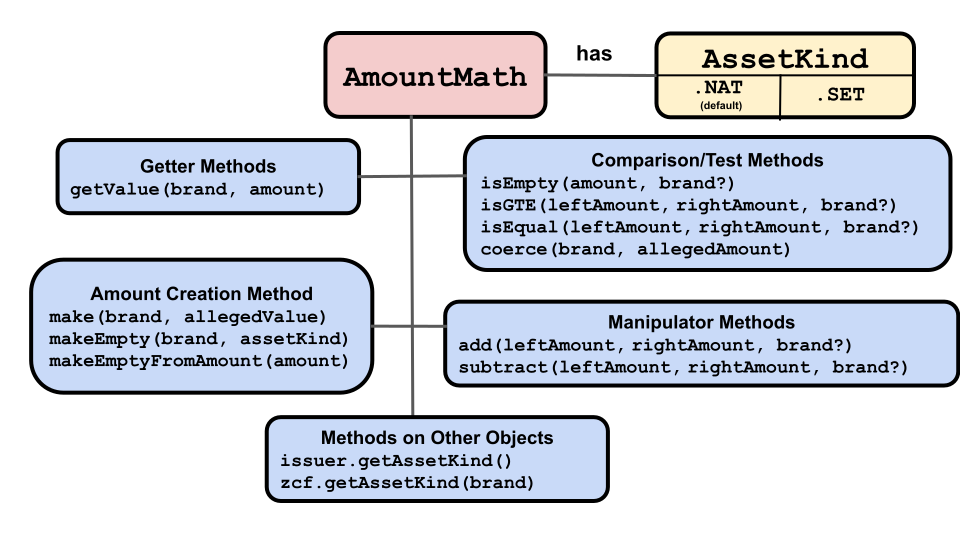

# Amount Math

 

Depositing and withdrawing assets from a
`purse` and manipulating `payment` amounts 
all require adding and subtracting digital assets. ERTP
uses `amountMath` methods for all these operations. 

`amountMath` methods also check their arguments' `brand`, 
throwing an error if the wrong `brand` was used.

An `amountMath` is one of three different kinds, each of which
implements the same methods. Which kind is used for a particular `brand` depends
on what was specified when the `brand` and its `issuer` were 
created. The kinds are: 
- `MathKind.NAT` (`nat`): Used with fungible assets. `amount` `values` are natural numbers (non-negative BigInts).
- `MathKind.STRING_SET` (`strSet`): Used with non-fungible assets. `amount` `values` are strings.
- `MathKind.SET` (`set`): Used with non-fungible assets. `amount` `values` are objects or records with multiple properties.

`makeIssuerKit(allegedName, amountMathKind)` creates a new `issuer`,
`mint`, `brand`, and `amountMath`. 
The second, optional, argument specifies which kind
of `amountMath` is used for the `brand` in a one-to-one
association with the new `issuer`. It defaults to `MathKind.NAT`. 

For example: 

<<< @/snippets/ertp/guide/test-amount-math.js#allMathKinds

## AmountMath Methods
The following is a brief description and example of each `amountMath` method. For
more detail, click the method's name to go to its entry in the [ERTP
API Reference](../api/).

- **Information Getting Methods**
  - [amountMath.getValue(amount)](../api/amount-math.md#amountmath-getvalue-amount)
    - Returns the `value` of the `amount` argument. For fungible assets, this will be a `BigInt`.
    - <<< @/snippets/ertp/guide/test-amount-math.js#getValue
  - [amountMath.makeEmpty()](../api/amount-math.md#amountmath-getempty)
    - Returns an `amount` representing an empty `amount` (which is the identity
       element for the `amountMath` `add()` and `subtract()`
       operations. Note that this value varies depending on the
       `brand` and its `amountMath` kind (`MathKind.NAT` or `MathKind.STR`).
    - <<< @/snippets/ertp/guide/test-amount-math.js#makeEmpty
- **Comparison Methods**
  - [amountMath.isEmpty(amount)](../api/amount-math.md#amountmath-isempty-amount)
    - Returns `true` if its `amount` argument is empty, otherwise `false`.
    - <<< @/snippets/ertp/guide/test-amount-math.js#isEmpty
  - [amountMath.isGTE(leftAmount, rightAmount)](../api/amount-math.md#amountmath-isgte-leftamount-rightamount)
    - Returns `true` if the `leftAmount` argument is greater than or equal
       to the `rightAmount` argument, otherwise `false`.
    - <<< @/snippets/ertp/guide/test-amount-math.js#isGTE
  - [amountMath.isEqual(leftAmount, rightAmount)](../api/amount-math.md#amountmath-isequal-leftamount-rightamount)
    - Returns `true` if the `leftAmount` argument equals the
	`rightAmount` argument
    - <<< @/snippets/ertp/guide/test-amount-math.js#isEqual
  - [amountMath.coerce(allegedAmount)](../api/amount-math.md#amountmath-coerce-allegedamount)
    - Takes an `amount` and returns it if it's a valid `amount`.
      If invalid, it throws an error.
    - <<< @/snippets/ertp/guide/test-amount-math.js#coerce
- **Manipulator Methods**

  - [amountMath.add(leftAmount, rightAmount)](../api/amount-math.md#amountmath-add-leftamount-rightamount)
    - Returns an `amount` that is the union of the `leftAmount` and `rightAmount`
       `amount` arguments. For a fungible `amount`, this means add their
       values.  For a non-fungible `amount`, it usually means
       including all elements from both `leftAmount` and `rightAmount`.
    - <<< @/snippets/ertp/guide/test-amount-math.js#add
  - [amountMath.subtract(leftAmount, rightAmount)](../api/amount-math.md#amountmath-subtract-leftamount-rightamount)
    - Returns a new `amount` that is the `leftAmount` argument minus
      the `rightAmount` argument  (i.e. for strings or objects
      everything in `leftAmount` not in `rightAmount`). If `leftAmount`
      doesn't include the contents of `rightAmount`, it throws an error. 
    - <<< @/snippets/ertp/guide/test-amount-math.js#subtract
- **Amount Creation Methods**
  - [amountMath.make(allegedValue)](../api/amount-math.md#amountmath-make-allegedvalue)	
    - Takes a `value` argument and returns an `amount` by making a record
      with the `value` and the `brand` associated with the `amountMath`. The `value`
      argument should be represented as a `BigInt` e.g. 10n rather than 10.
    - <<< @/snippets/ertp/guide/test-amount-math.js#make
  - [amountMath.makeEmpty()](../api/amount-math.md#amountmath-getempty)
    - Returns an `amount` representing an empty `amount` (which is the identity
       element for the `amountMath` `add()` and `subtract()`
       operations. Note that this value varies depending on `amountMath`'s associated
       `brand` and whether `amountMath` is of kind `MathKind.NAT` or `MathKind.STR`.
    - <<< @/snippets/ertp/guide/test-amount-math.js#makeEmpty
 
## Methods on other objects

These methods either use or return `amountMath` objects:
- [makeIssuerKit(allegedName, amountMathKind)](../api/issuer.md#makeissuerkit-allegedname-amountmathkind)
  - Creates a new `amountMath` that uses the `amountMath` kind
    designated by the `amountMathKind` argument (`MathKind.NAT`, `MathKind.STR`,
    `MathKind.STRING_SET`). Also creates a new `mint`, `issuer`, and `brand`.
  - <<< @/snippets/ertp/guide/test-amount-math.js#makeIssuerKit
- [issuer.getAmountMathKind()](../api/issuer.md#issuer-getamountmathkind)
  - Returns the kind of `amountMath` (`MathKind.NAT`, `MathKind.STR`, or `MathKind.STRING_SET`).
  - <<< @/snippets/ertp/guide/test-amount-math.js#getAmountMathKind2
- [zcf.getAmountMath(brand)](/zoe/api/zoe-contract-facet.md#zcf-getamountmath-brand)
  - Returns the `amountMath` object associated with the `brand` argument.
  - <<< @/snippets/ertp/guide/test-amount-math.js#zcfGetAmountMath
