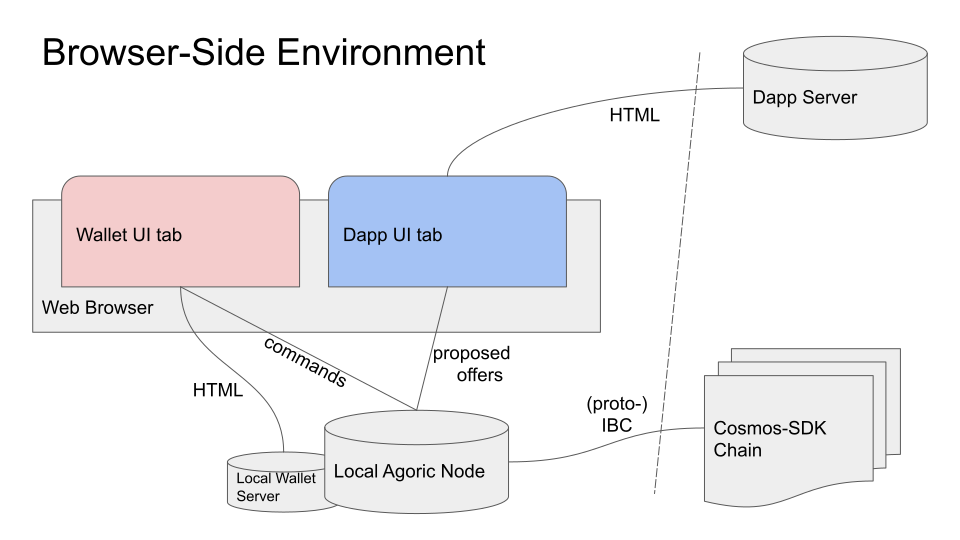
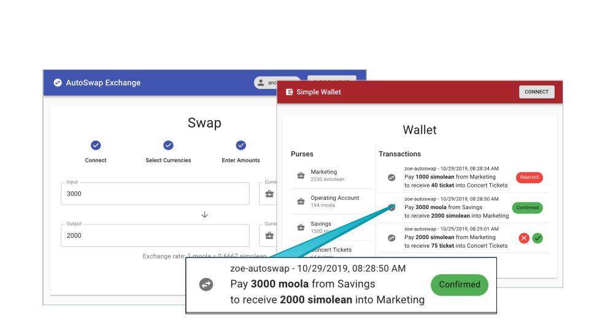

# Getting Started with the Agoric CLI


This tutorial will show you how to:
1) __Write smart contracts on Zoe, the Agoric platform.__

   Our pre-made contracts that you can copy include a Uniswap implementation
   (called autoswap), a second-price auction, and a simple exchange
   with an order book.

2) __Create dapp user interfaces that interact with the smart contracts
   and the user wallet.__

   Our pre-made UI that you can work with is the
   UI for autoswap, the Uniswap implementation.

Note that this environment does not connect to the Agoric testnet chain and
also does not create a local chain. We are working on adding the
ability to run contracts on chain to the Agoric CLI, but you can find
[more information on running on chain here](../manual-setup/README.md).

## Prerequisites

First, install [Node.js](http://nodejs.org/), and [Yarn 1](https://legacy.yarnpkg.com/en/docs/install).  You’ll need to have **Node 10.16.0 or later**.

For now, you will need to set up the Agoric CLI as part of a checked-out Agoric SDK, as `npx agoric` doesn't yet work.  Run:

```sh
# Get the latest Agoric SDK in the agoric-sdk directory.
git clone https://github.com/Agoric/agoric-sdk
# Change to the agoric-sdk directory.
cd agoric-sdk
# Install NPM dependencies.
yarn install
# Build sources that need compiling.
yarn build
# You can install the agoric CLI anywhere in your $PATH,
# here is how to do it as /usr/local/bin/agoric
yarn link-cli /usr/local/bin/agoric
```

## Quick Overview

After installing the [Prerequisites](#prerequisites), to create and start a project, run:

```sh
agoric init demo
cd demo
agoric install
agoric start
```

In another shell, from the same project directory:

```sh
cd demo
agoric deploy ./contract/deploy.js ./api/deploy.js
cd ui
yarn install
yarn start
```

Then open:
- [http://localhost:3000](http://localhost:3000) to see our demo DApp.<br>
- [http://localhost:8000/](http://localhost:8000/) to see the Simple Wallet and your REPL (Read-Eval-Print Loop).<br>

## Your First Agoric Dapp



### 1. Creating a project directory
Let's install the default smart contracts and UI.

```sh
# Initialize your dapp project.
# Note: Change the `demo` name to something meaningful.
# Remember to prefix this with `npx` if you chose that option.
agoric init demo
# Go to its directory.
cd demo
```
`init` creates a folder with the name you specify and copies over all
the files you might need.

### 2. Installing the dependencies
Next, let's install the necessary JavaScript packages. This step might
take a while.

```sh
# Install Javascript dependencies.
agoric install
```

### 3. Launching the Agoric server
Next, let's start up the Agoric VM. This creates the "vats" in which
our smart contract code will be run.

```sh
# Run the local vat machine.
agoric start
```

### 4. Installing a contract
Let's deploy our dapp on the Agoric VM.
```sh
# Install your smart contract and web api (can be done separately)
agoric deploy ./contract/deploy.js ./api/deploy.js
```
And navigate to our wallet
[http://localhost:8000/wallet/](http://localhost:8000/wallet/)

### 5. Launching a demo DApp server
Now let's start up the Autoswap frontend, our demo DApp:

```sh
cd ui
yarn install
yarn start  
```

This launches the React development server and opens a tab in your default browser, and will allow you to
trade using the autoswap front-end and contract. We've given you a few
purses to use in your trades.

## Writing a smart contract

Ready to write your own? We've given you a stripped down version of
the autoswap contract to get you started. It currently allows you to
trade 1 moola for 1 simolean and vice versa, but you can add more
functionality and redeploy.


If you take a look at the `demo` folder that you had just created,
you should see folders like:

* api
* contract
* ui

Go ahead and open up `contract/myFirstDapp.js`. To learn more about
writing a smart contract on Zoe, please see the [Zoe
guide](../zoe/guide/).

Once you've made changes to the smart contract, deploy:

```sh
# Redeploy
agoric deploy ./contract/deploy-myfirstdapp.js ./api/deploy.js
```

## Editing the demo DAppp



All of the code for the demo DAppp is under `/ui`. Once  changes
will automatically propagate to the browser tab.

Happy hacking!
