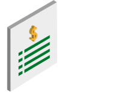

# Agoric Alpha	
Release Version: Adriatic


Decentralized Finance (DeFi) is the new frontier of financial services. Like many frontiers, it's exciting but dangerous. Agoric is building a public blockchain to make it more exciting and less dangerous. Welcome to the first step: **the Agoric alpha release**. 

The Agoric alpha release introduces our smart contract platform. It enables JavaScript developers to start working on DeFi quickly and easily. Our object-based approach to smart contracts enables DeFi legos that are directly reusable. The smart contract framework leapfrogs existing technologies while providing a secure, stable infrastructure. Now developers can build, deploy, and operate sophisticated dApps and DeFi markets. It's live now, so get started.

[Start Coding](https://agoric.com/documentation/getting-started/)
[Join Our Community](https://discord.gg/gC9z6US)

## What You Can Build in Alpha


### Fungible and non-fungible tokens
Create tokens that are not mutually interchangeable by their individual specification.


### Atomic swap
Enable the exchange of one cryptocurrency for another without using centralized intermediaries.


### Covered call
Create an option contract that enables the holder to buy a specific, previously escrowed, asset at a predetermined strike price (before expiration).


### Simple exchange
A basic exchange with an order book for one asset, priced in a second asset.


### Automated market maker (“autoswap”)
Build a smart contract that acts as an on-chain automated DEX with liquidity. 

## Smart Contract Code Sample: Call Option

As an example, the covered call option is the right (with no obligation) to buy digital assets at a predetermined price, called the strike price. This call option is "covered," meaning that the owner escrowed the digital assets for the call option. Escrow guarantees that the assets can be transferred without relying on the owner to keep their promise. The call option has an expiration date, which is when the opportunity is cancelled. The digital assets owner cannot remove the assets from escrow before the expiration date. 

```
const proposal = {
    give: { StrikePrice: moola(25) },
    want: { Asset: concertTicket("E4") }, 
    exit: { afterDeadline: { deadline: time, timer: myTimer } },
};
```

This deadline is the expiration date for the covered call option. If the option has not been exercised by the deadline, as specified in the above code example, its underlying assets are paid out to the contract's creator as a refund of their escrowed assets.  

## Developer Experience
Agoric is a team of engineers. We've based our developer experience on our decades of open-source software experience. In our alpha, you can expect the following:

* VS Code with debugging support
* Ability to build and test locally
* Types included to accelerate your local development
* Rapid testing iteration with the Ava test infrastructure

### Ready to get started?
[Start Coding](https://agoric.com/documentation/getting-started/)

### Stuck on something?
Chat with our engineers on [Agorc Discord](https://discord.gg/gC9z6US).

### Want to connect on socials? 
Follow us on [Twitter](https://twitter.com/agoric), [Telegram](https://t.me/agoricsystems) and [LinkedIn](https://www.linkedin.com/company/agoric/).