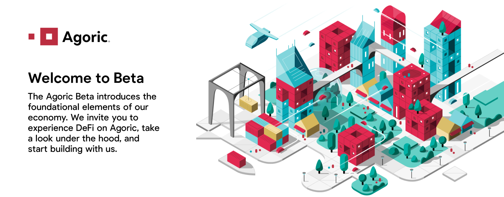

# Agoric Beta
Release Version: Baltic



### Welcome to Phase 1 of the Agoric Beta!

This documentation site goes into detail about the Agoric system. For Beta, we recommend everyone start by interacting
with the deployed application as a user. You'll start by getting your wallet set up, including getting some mock assets to play with

## Set Up A Wallet (Agoric Solo Machine) ##

Unlike other blockchains, your Agoric "wallet" is actually a solo machine (process) that maintains some additional state 
about your account. For now, this requires that you run some processes locally. For instructions on setting up your wallet:

[Agoric Wallet Set-up Guide (Docker)](https://github.com/Agoric/agoric-sdk/wiki/Setting-up-an-Agoric-Dapp-Client-with-docker-compose)

[Agoric Wallet Set-up Video Walkthrough](https://www.youtube.com/watch?v=e5LQx0EqR0o)

Don't worry, this'll get much easier soon. After it passes reviews, the wallet will 
be available via a downloadable application. On mainnet launch, Agoric will be integrated 
with leading wallet providers via a simple plugin.

## Head to the Vault App ##

Play around with the mock assets we've kindly pre-stocked your wallet with.

[Vault Application](https://treasury.agoric.app)

## Start Building Things ##

Learn more about [getting started](/getting-started/before-using-agoric.md) with the Agoric SDK.

After your environment is set up, you can [start building](/getting-started/start-a-project.md) your own smart contracts and dapps.

[Join Our Discord Community](https://agoric.com/discord) and chat with us and other developers.

## What You Can Build in Beta

<div class="two-col-table">

| Fungible and non-fungible tokens | Atomic swap |
| ------ | ----------- |
| <div style="text-align: center"> </div> <br>Create and use either fungible or non-fungible digital assets with your contracts. | <div style="text-align: center"> </div> <br>Enable the exchange of one cryptocurrency for another without using centralized intermediaries. |

| Covered call | Simple exchange |
| ------ | ----------- |
| <div style="text-align: center"> </div> <br>Create an option contract that enables the holder to buy a specific, previously escrowed, asset at a predetermined strike price (before expiration). | <div style="text-align: center"> </div> <br>A basic exchange with an order book for one asset, priced in a second asset. |

| Automated market maker |
| ------ |
| <div style="text-align: center"> </div> <br>Build a smart contract that acts as an on-chain automated DEX with liquidity. |

</div>

## Smart Contract Code Sample: Call Option

As an example, a *covered call option* is the right (with no obligation) to buy digital 
assets at a predetermined price, called the *strike price*. This call option is *covered*, 
meaning that the owner escrowed the digital assets for the call option. *Escrow* guarantees
the assets can be transferred between parties without relying on an asset's owner to keep 
their promise. The call option has an *expiration date*, when the opportunity is cancelled. 
The digital assets owner cannot remove the assets from escrow before the expiration date.

A covered call proposal looks like:
```js
const proposal = {
    give: { StrikePrice: moola(25) },
    want: { Asset: concertTicket("E4") },
    exit: { afterDeadline: { deadline: time, timer: myTimer } },
};
```

The *deadline* is the option's expiration date. The above code specifies that if the option 
has not been exercised by the deadline, its underlying assets are paid to the contract's creator 
as a refund of their escrowed assets.

## Developer Experience
Agoric is a team of engineers. We've based our developer experience on our decades of open-source software experience to make [getting started](/getting-started/) as easy as possible. In our beta, you can expect the following:

* VS Code with debugging support
* Ability to build and test locally
* Types included to accelerate your local development
* Rapid testing iteration with the Ava test infrastructure

### Stuck on something?
Be sure to check out our guide to [Installing the Agoric SDK](/getting-started/), ensure you have `agoric` available from your command line, and then you'll be ready to [get started](/getting-started/) building your vision with a complete security architecture at your fingertips.

You're welcome to come chat with our engineers on [Agoric Discord](https://agoric.com/discord).

### Connect with us on socials?
Follow us on [Twitter](https://twitter.com/agoric), [Telegram](https://t.me/agoricsystems) and [LinkedIn](https://www.linkedin.com/company/agoric/).
