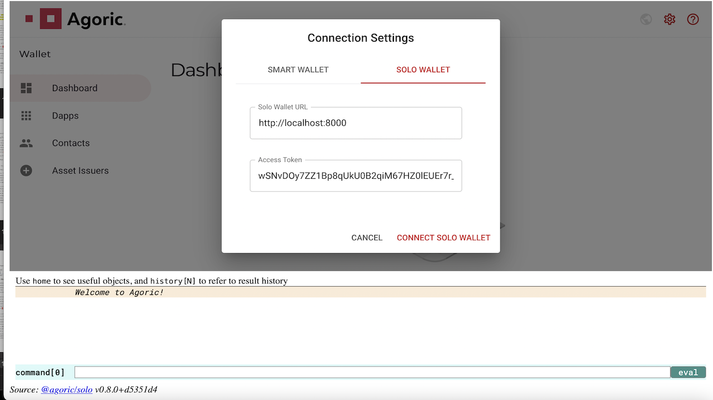
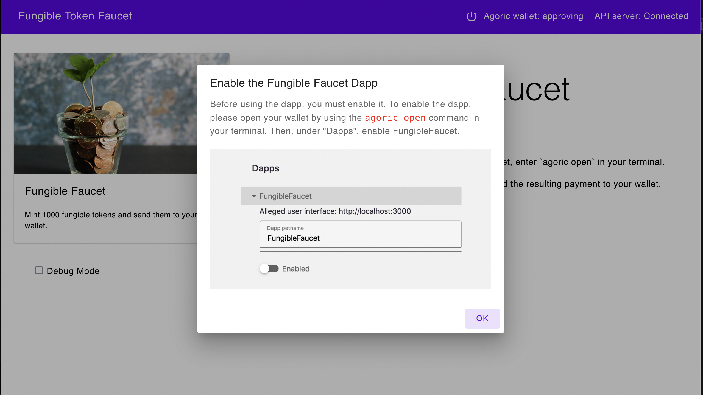
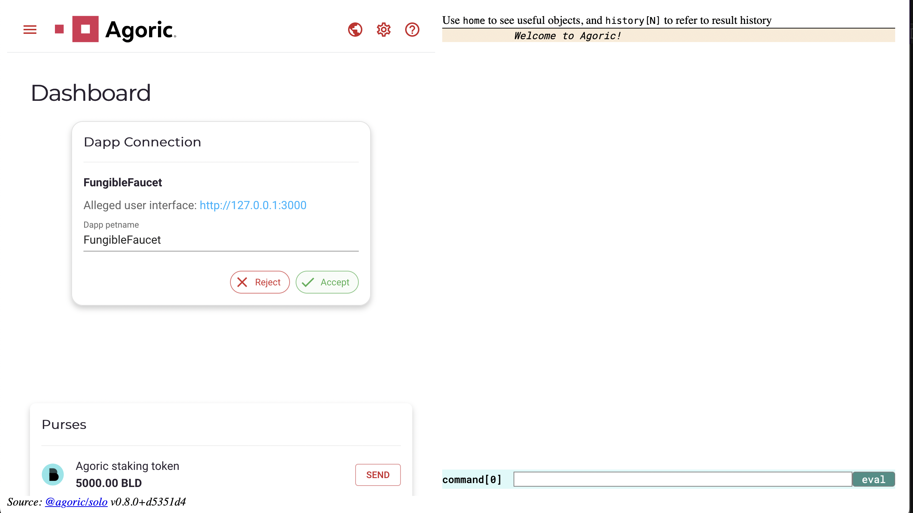
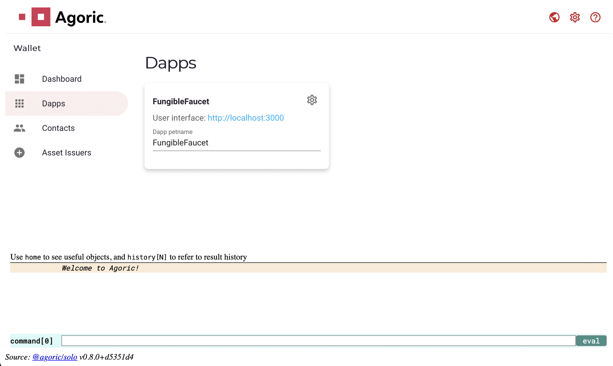
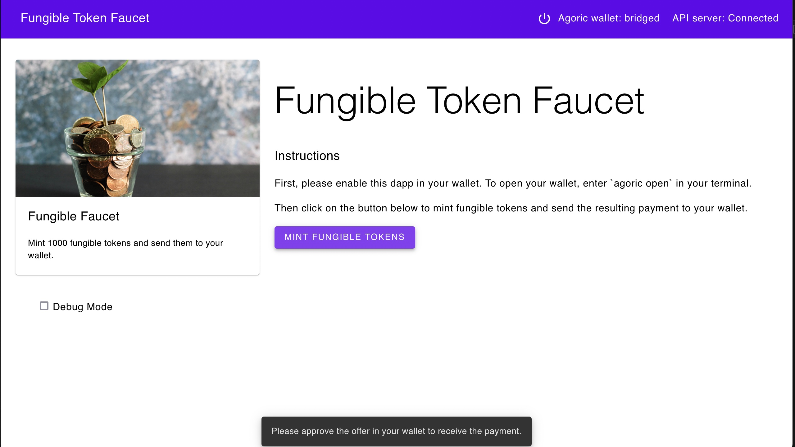
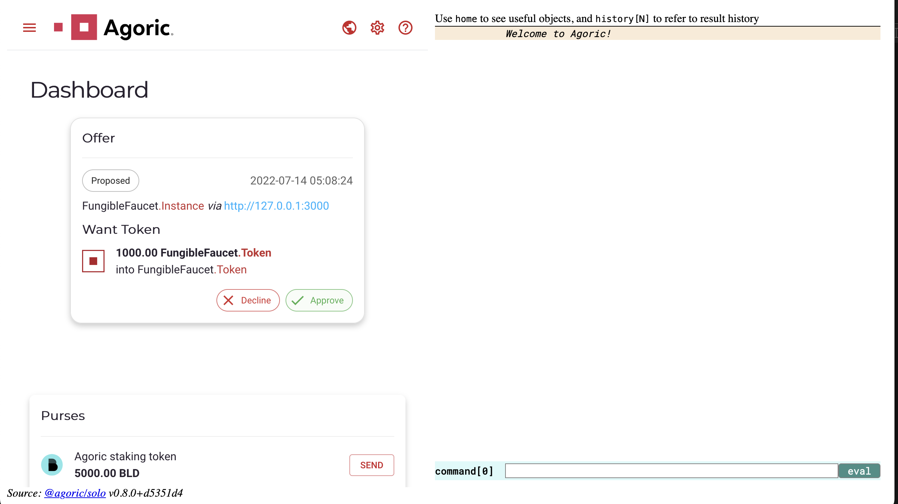
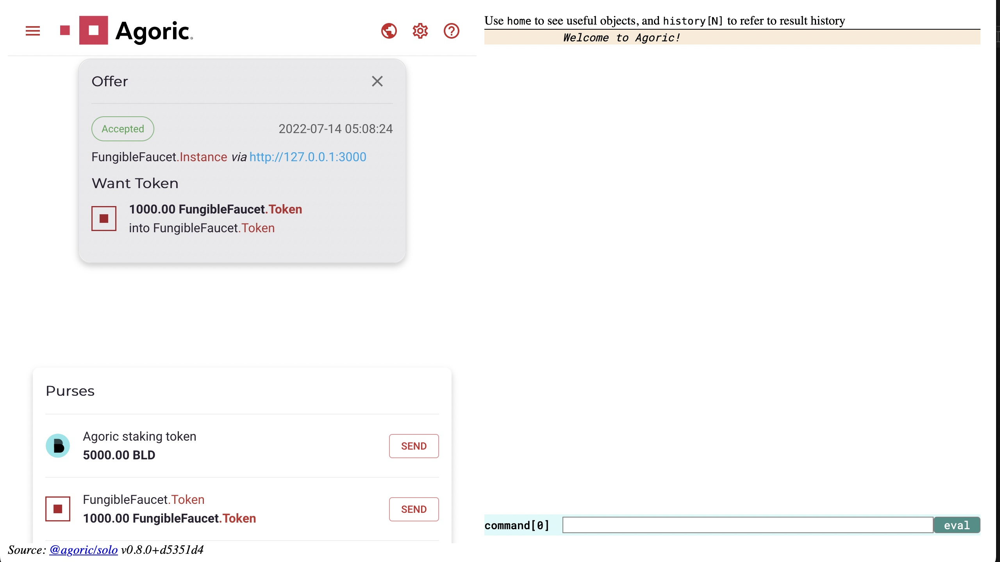

# Starting a Project

::: tip Beta status
The Agoric platform is at the beta stage. It is in the process of being formally evaluated for vulnerabilities, and is undergoing security treatment and hardening to support mainnet-1 launch. Do not use for production purposes. 
:::

Do not proceed unless you've [installed the Agoric SDK](/getting-started/before-using-agoric.md).
If `agoric --version` is available, then you're ready for our first Agoric _Dapp_ (decentralized application)!

We'll be running **three terminal windows**. See below: 

 1. ```sh
    # Terminal 1: simulated blockchain and "solo" client
    ```
 2. ```sh secondary style2
    # Terminal 2: contract interaction
    ```
 3. ```sh secondary style3
    # Terminal 3: web user interface
    ```

::: tip Watch: Prepare Your Agoric Environment (November 2020)
This presentation includes starting a project, but note an outdated detail:

 - In the REPL `x~.go()` tildot support has been postponed; use `E(x).go()`.

<iframe width="560" height="315" src="https://www.youtube.com/embed/w0By22jYhJA" title="YouTube video player" frameborder="0" allow="accelerometer; autoplay; clipboard-write; encrypted-media; gyroscope; picture-in-picture" allowfullscreen></iframe>
:::

## Initialize `demo` from Dapp Template

Use the [Agoric CLI](/guides/agoric-cli/commands.md) to fetch from a Dapp template
and put it in a `demo` directory _not located in your `agoric-sdk` clone_:

```sh
# Terminal 1
# Don't use your agoric-sdk as the parent of the demo directory.
cd $HOME
agoric init demo # use `agoric init $DIRNAME` with any name you like
cd demo
agoric install
agoric start --verbose # `agoric start --reset` to start over
```

The name `demo` is an arbitrary suggestion. The default template is the [Fungible Faucet Dapp](https://github.com/Agoric/dapp-fungible-faucet).

Learn more about the [available dapp templates](/dapps/dapp-templates.md).

It may take a minute or so to install all the dependencies.

::: tip Mac Dev Tools
On a Mac, you must first install
[Xcode](https://apps.apple.com/us/app/xcode/id497799835)
:::

Leave this process and its logs running in its own terminal window.


## Open the Agoric Wallet and REPL

```sh secondary style2
# Terminal 2
cd demo # new terminal window
agoric open --repl
```

This should automatically open [http://127.0.0.1:8000](http://127.0.0.1:8000) in a new browser window or tab.

To begin using the wallet, click the "Connect Solo Wallet" button.



After your solo wallet is connected, then you're ready to deploy the contract and API. 

## Deploy the Contract and API

In our second terminal, deploy the contract to the simulated blockchain
and the API to the solo client.

```sh secondary style2
# Terminal 2
cd demo # if not already there
agoric deploy ./contract/deploy.js 
agoric deploy ./api/deploy.js
```

We'll cover [deploying smart contracts](/getting-started/deploying.md)
in detail later.

## Start the Dapp User Interface

The web user interface communicates with the API in the solo client as well as the wallet.

```sh secondary style3
# Terminal 3
cd demo # if not already there
cd ui && yarn start 
```

Leave this running in its own terminal window and visit [http://localhost:3000](http://localhost:3000) in a web browser.

Once here, you will be asked to enable the dapp in your Agoric wallet.



## Connect the Dapp to the Agoric Wallet

Navigate back to [http://127.0.0.1:8000](http://127.0.0.1:8000) and accept the Dapp's request to connect to your wallet.



Navigating to the "Dapps" section of the Agoric Wallet should now show that you have successfully connected.



## Use the Dapp to collect your (simulated) tokens

Once your wallet has been connected, return to [http://localhost:3000](http://localhost:3000) and click the "Mint Fungible Tokens" button.



Navigate back to [http://127.0.0.1:8000](http://127.0.0.1:8000) to approve the offer and collect the tokens.



Your wallet's FungibleFaucet purse will now hold 1000 FungibleFaucet tokens.



Visit the documentation's [wallet UI](/guides/wallet/ui.md#wallet-ui) section to learn more.