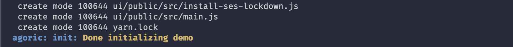
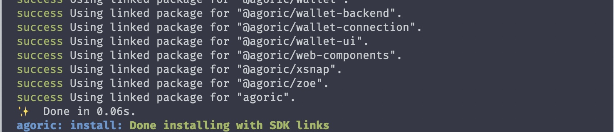
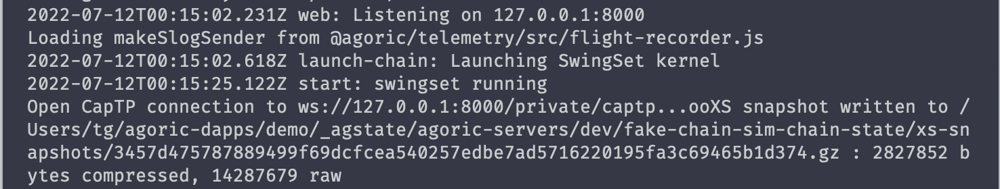
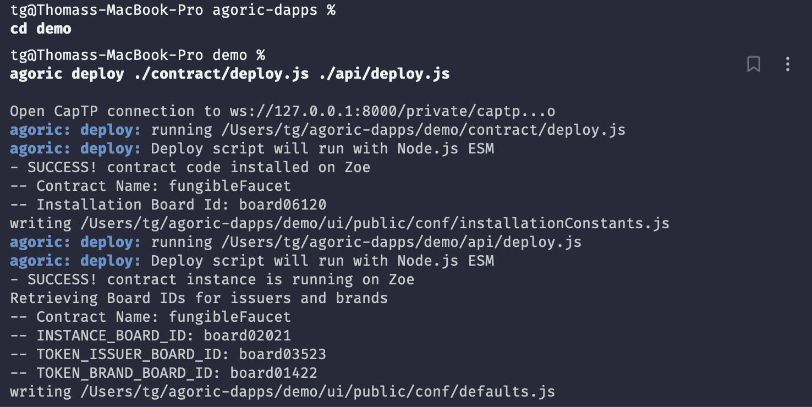
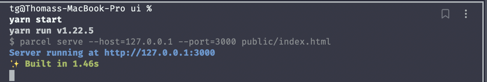
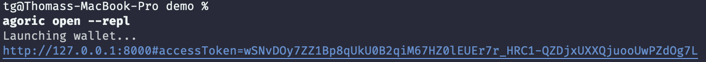

# Starting a Project

::: tip Beta status
The Agoric platform is at the beta stage.
It has not yet been formally tested or hardened.
Do not use for production purposes.
:::

Now that you have [installed the Agoric SDK](/getting-started/before-using-agoric.md),
let's try out your first Agoric _Dapp_ (decentralized application).

We'll be running **three terminal windows**, and
[dapp template initialization](#initialize-demo-from-dapp-template) in the first
window will create their shared working directory.


 1. ```sh
    # Terminal 1: simulated blockchain and "solo" client
    ```
 2. ```sh secondary style2
    # Terminal 2: contract interaction
    ```
 3. ```sh secondary style3
    # Terminal 3: web user interface
    ```

::: tip Watch: Prepare Your Agoric Environment (November 2020)
This presentation includes starting a project, but note an outdated detail:

 - In the REPL `x~.go()` tildot support has been postponed; use `E(x).go()`.

<iframe width="560" height="315" src="https://www.youtube.com/embed/w0By22jYhJA" title="YouTube video player" frameborder="0" allow="accelerometer; autoplay; clipboard-write; encrypted-media; gyroscope; picture-in-picture" allowfullscreen></iframe>
:::

## Initialize `demo` from Dapp Template

Use the [Agoric CLI](/guides/agoric-cli/commands.md) to fetch from a Dapp template
and put it in a `demo` directory _not located in your `agoric-sdk` clone_:


```sh
# Terminal 1
# Don't use your agoric-sdk clone as the parent of the demo directory.
# It doesn't have to be your home directory; any other directory will do.
cd $HOME
agoric init demo
```

The name `demo` is an arbitrary suggestion; in general,
use `agoric init $DIRNAME` with any name you like.

If the install is successful, the result produced in your terminal should look like the following:



The default template is the [Fungible Faucet Dapp](https://github.com/Agoric/dapp-fungible-faucet).
Learn more about the [available dapp templates](/dapps/dapp-templates.md).

### Install the Agoric SDK in the Dapp

```sh
# Terminal 1
cd demo
agoric install
```

It may take a minute or so to install all the dependencies. 

If the install is successful, the result produced in your terminal should look like the following:



::: tip Mac Dev Tools
On a Mac, you must first install
[Xcode](https://apps.apple.com/us/app/xcode/id497799835)
:::

## Start the Agoric Solo Client and Simulated Blockchain

```sh
# Terminal 1
cd demo # if not already there
agoric start

# if the process was interrupted or crashed
# rerun the command above and it should resume

# to reset and start over
agoric start --reset
```

If `agoric start` is successful, you should see the following result in your terminal:

 

Leave this process and its logs running in its own terminal window.
## Deploy the Contract and API

In a separate terminal, deploy the contract to the simulated blockchain
and the API to the solo client.

```sh secondary style2
# Terminal 2
cd demo # if not already there
agoric deploy ./contract/deploy.js ./api/deploy.js
```

If the deployments are successful, the result produced in your terminal should look like the following:



We'll cover [deploying smart contracts](/getting-started/deploying.md)
in detail later.

## Start the Dapp User Interface

The web user interface communicates with the API in
the solo client as well as the wallet (below).

```sh secondary style3
# Terminal 3
cd demo # if not already there
cd ui && yarn start
```

If successful, the result produced in your terminal should look like the following:



Leave this running in its own terminal window and
visit [http://localhost:3000](http://localhost:3000)
in a web browser.

## Open the Agoric Wallet and REPL

```sh secondary style2
# Terminal 2
cd demo # if not already there
agoric open --repl
```

If successful, the result produced in your terminal should look like the following:



This should automatically open [http://127.0.0.1:8000](http://127.0.0.1:8000)
in a new browser window or tab.

## Use the Dapp to collect your (simulated) tokens

Use the wallet to grant the Dapp's request to connect. See also the [wallet UI](/guides/wallet/ui.md#wallet-ui) section.

Then use the Fungible Faucet Dapp to collect your tokens.
