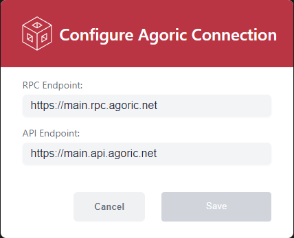

## Welcome the Agoric UI Component Library!

You'll find a collection of ready-to-use or pre-coded user interface elements that help accelerate your Agoric Dapp-building. These pre-designed elements include wallet connect buttons, chain selector, node selector, amount input and wallet provisioning.
Utilization of these building blocks ensures best practices in design and accessibility of your Agoric dapp UI.

## Installation and Setup

See [Introduction to Agoric UI Kit](https://a0a31cba.documentation-7tp.pages.dev/guides/getting-started/how-to-use-ui-kit#introduction-to-agoric-ui-kit) for installation and setup how-to.

Once complete you'll need to run this yarn command: 

```sh
yarn add @agoric/react-components
```

## UI Components List

The following is a list of available React UI components that you can immediately integrate into your dapp UI:

- Connect Wallet
- Smart Wallet Provisioning
- Amount Input
- Chain Selector
- Node Selector

## Connect Wallet


  

  

- [Connecting with Wallet Connect Button](https://github.com/Agoric/ui-kit/tree/main/packages/react-components#integrating)
- [Connecting without Wallet Connect Button](https://github.com/Agoric/ui-kit/tree/main/packages/react-components#connecting-without-connectwalletbutton) 
- [Using a Custom Chain Provider](https://github.com/Agoric/ui-kit/tree/main/packages/react-components#connecting-without-connectwalletbutton)

Customizable Parameters
| Parameter | Type | Description |
|----------|----------|----------|
| ClassName   | string   | CSS class name for the underlying `<button>` element   |

## Smart Wallet Provisioning


[Smart Wallet Provisioning](https://github.com/Agoric/ui-kit/tree/main/packages/react-components#smart-wallet-provisioning) 

See `AgoricProviderLite` component  -> `provisionNoticeContent` prop:  

Customizable Parameters
| Parameter | Type | Description |
|----------|----------|----------|
| provisionNoticeContent   | undefined | (fee?: bigint) => JSX.Element   | The main content to show in the provision notice dialog (default shown in screenshot)   |

### Amount Input


[Amount Input](https://github.com/Agoric/ui-kit/tree/main/packages/react-components#amount-inputs) 

Customizable Parameters
| Parameter | Type | Description |
|----------|----------|----------|
| value   | bigint | null   | The current value of the input   |
| decimalPlace   | number   | The number of decimal places used for displaying the denominated value   |
| className   | string | undefined   | CSS class name for the underlying `<input>` element   |
| onChange   | undefined | (value: bigint) => void   | Callback for handling input changes   |
| disabled   | boolean | undefined   | Whether or not the input is disabled. Defaults to false.   |

## Chain Selector


  

- [Network Dropdown](https://github.com/Agoric/ui-kit/tree/main/packages/react-components#network-dropdown)

Customizable Parameters
| Parameter | Type | Description |
|----------|----------|----------|
| networkConfigs   | NetworkConfig[]   | The list of Agoric network configs to choose from.   |
| label   | ChangeChainCombobox[‘label’]   | See [ChangeChainCombobox](https://storybook.cosmology.zone/?path=/docs/swap-changechaincombobox--docs)   |
| size  | ChangeChainCombobox[‘size’]   | See [ChangeChainCombobox](https://storybook.cosmology.zone/?path=/docs/swap-changechaincombobox--docs)   |
| appearance   | ChangeChainCombobox[‘appearance’]   | See [ChangeChainCombobox](https://storybook.cosmology.zone/?path=/docs/swap-changechaincombobox--docs)   |
| maxHeight   | ChangeChainCombobox[‘maxHeight’]   | See [ChangeChainCombobox](https://storybook.cosmology.zone/?path=/docs/swap-changechaincombobox--docs)   |

## Node Selector



- [Node Selector](https://github.com/Agoric/ui-kit/tree/main/packages/react-components#node-selector)

Customizable Parameters
| Parameter | Type | Description |
|----------|----------|----------|
| isOpen   | boolean | undefined   | Whether or not the modal is open   |
| onClose   | () => void   | Triggered when the user tries to close the modal   |

## Leap Elements


- [Leap Elements](https://github.com/Agoric/ui-kit/tree/main/packages/react-components#amount-inputs)
