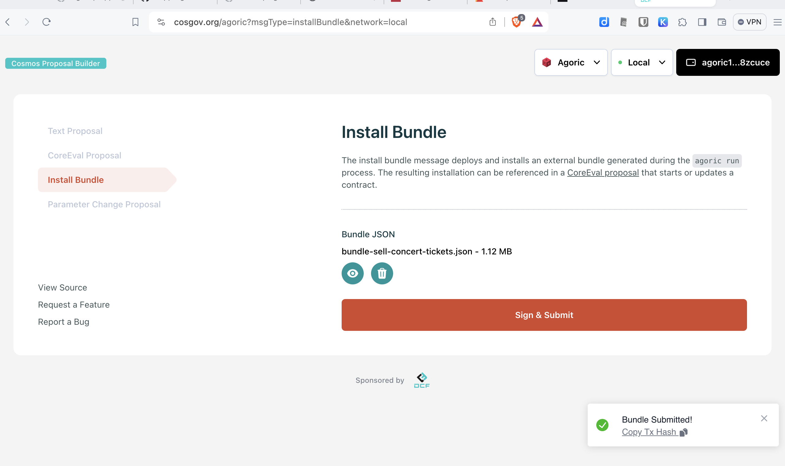
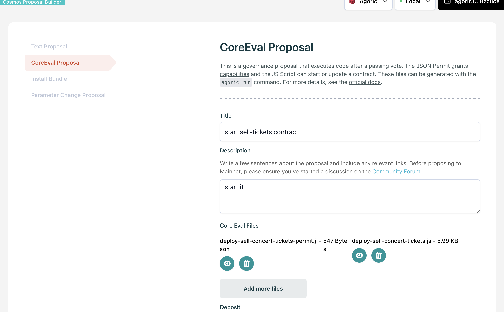

# Deploying Contracts using Core Eval Proposals

To deploy a contract:

1. Check access and governance norms for your target network / chain.
   - `agoriclocal` is operated by you and entirely under your control.
   - [testnets such as `devnet`](#deploying-to-testnets-devnet-emerynet) are shared resources.
   - _Mainnet deployment is out of scope of this document; see [Mainnet 2 Deployment Checklist #8280](https://github.com/Agoric/agoric-sdk/discussions/8280)._
2. Build the transaction contents.
3. Sign and broadcast the transactions using a web UI or CLI tools.

## Deploying to a local agoric blockchain

1. Ensure that you have [started your local agoric blockchain](../getting-started/#starting-a-local-agoric-blockchain):
   use `yarn docker:logs` to check that your chain is running; if not, use `yarn start:docker` to start it.

2. Use `yarn start` to automatically
   1. Build the transaction contents (contract bundle, core eval script).
   2. Ensure you have enough IST to pay to for the `install-bundle` transaction.
   3. Sign and broadcast the transactions (`install-bundle`, `submit-proposal`), plus
   4. Vote on the submitted proposal.

## Bundling Contracts and Core Eval Scripts with Rollup Plugins

Core eval scripts are evaluated, not loaded as modules; so any `import` or `export` declarations are syntax errors. In **dapp-agoric-basics**, we use [rollup](https://rollupjs.org/) to support developing
a core-eval script and permit as a module:

- `import { E } from '@endo/far'`
  A bundle strips this declaration during bundling
  since the core-eval scope includes exports of `@endo/far`.
- `bundleID = ...` is replaced using updated/cached bundle hash
- `main` is appended as the script completion value
- the `permit` export is emitted to a `.json` file

See [rollup.config.mjs](https://github.com/Agoric/dapp-agoric-basics/blob/main/contract/rollup.config.mjs) for details on using the
`moduleToScript`, `configureBundleID`, and `emitPermit` rollup plug-ins.

Running it looks something like this:

```console
dapp-agoric-basics/contract$ yarn build:deployer
yarn run v1.22.19
$ rollup -c rollup.config.mjs

./src/sell-concert-tickets.proposal.js → bundles/deploy-sell-concert-tickets.js...
bundles add: sell-concert-tickets from ./src/sell-concert-tickets.contract.js
bundles bundled 141 files in bundle-sell-concert-tickets.js at 2024-03-09T16:22:08.531Z
created bundles/deploy-sell-concert-tickets.js in 2.4s
...

dapp-agoric-basics/contract$ cd bundles
dapp-agoric-basics/contract/bundles$ ls deploy-sell* bundle-sell*
bundle-sell-concert-tickets.js          deploy-sell-concert-tickets-permit.json deploy-sell-concert-tickets.js
```

## Ensuring you have enough IST to install a bundle

The price to install a contract is subject to chain governance.
As of [proposal #61](https://agoric.explorers.guru/proposal/61) Nov 2023, it's 0.02IST per kilobyte.

On a local chain, `yarn start` includes a `yarn docker:make mint100` step to get 100 IST, which should be enough. _`mint100` works by sending some ATOM from a `validator` account and using the ATOM to open a vault._

## Installing, submitting to agoriclocal with `scripts/deploy-contract.js`

In **dapp-agoric-basics**, [contract/scripts/deploy-contract.js](https://github.com/Agoric/dapp-agoric-basics/blob/main/contract/scripts/deploy-contract.js) automates much of the process. `yarn start` automatically runs it. The `--install src/sell-concert-tickets.contract.js` option tells it to install the contract (using [agd tx swingset install-bundle](/guides/agoric-cli/agd-query-tx#agd-tx-swingset-install-bundle) from within the docker container), after bundling it if necessary:

```
dapp-agoric-basics/contract$ yarn start
yarn run v1.22.19
$ yarn docker:make clean start-contract print-key
$ docker compose exec agd make -C /workspace/contract clean start-contract print-key
make: Entering directory '/workspace/contract'
yarn node ./scripts/deploy-contract.js --service . \
        --install src/sell-concert-tickets.contract.js \
        --eval ./src/sell-concert-tickets.proposal.js
yarn node v1.22.21
bundles add: sell-concert-tickets from src/sell-concert-tickets.contract.js
bundles bundled 141 files in bundle-sell-concert-tickets.js at 2024-03-09T16:49:54.859Z
installing sell-concert-tickets b1-8dd96
$$$ agd tx swingset install-bundle @bundles/bundle-sell-concert-tickets.json --gas auto --keyring-backend test --chain-id agoriclocal --from agoric1uddt8l5y2sfanzal42358az5dus563f2wk7ssm --broadcast-mode block --gas auto --gas-adjustment 1.4 --yes --output json
gas estimate: 53922087
{
  id: 'b1-8dd96',
  installTx: 'F18DF8CE296D29BD0283780C402D7C3D22345E13DD04D6B12CEE6AE5B4B9212B',
  height: '1594'
}
follow { delay: 2 } ...
{
  name: 'sell-concert-tickets',
  id: 'b1-8dd96',
  installHeight: '1594',
  installed: true
}
...
```

As a by-product, it writes a `bundles/bundle-sell-concert-tickets.json.installed` file. If you run `yarn start` again, `deploy-contract.js` uses the `Makefile` to check whether the `.installed` file is up-to-date and only repeats `agd tx swingset install-bundle` if you change the contract.

The `--eval ./src/sell-concert-tickets.proposal.js` option tells it to submit a `swingset-core-eval` governance proposal, after building the script and permit if necessary:

```console
...
submit proposal sell-concert-tickets
[
  'bundles/deploy-sell-concert-tickets-permit.json',
  'bundles/deploy-sell-concert-tickets.js'
]
await tx [
  'bundles/deploy-sell-concert-tickets-permit.json',
  'bundles/deploy-sell-concert-tickets.js'
]
$$$ agd tx gov submit-proposal swingset-core-eval bundles/deploy-sell-concert-tickets-permit.json bundles/deploy-sell-concert-tickets.js --title sell-concert-tickets --description sell-concert-tickets --deposit 10000000ubld --keyring-backend test --chain-id agoriclocal --from agoric1jkfphfd8fd7vd7erdttne3k4c0rucu8l22ndhk --broadcast-mode block --gas auto --gas-adjustment 1.4 --yes --output json
gas estimate: 1443920
{
  txhash: '010C912FFC47AE59C33A36906DA5096C8EA8A64247699ABF958F58600E57C59E',
  code: 0,
  height: '1626',
  gas_used: '1028352'
}
...
```

The `deploy-contract.js` automates adding a deposit and voting on the proposal and waiting for voting to complete:

```
...
await voteLatestProposalAndWait [
  'bundles/deploy-sell-concert-tickets-permit.json',
  'bundles/deploy-sell-concert-tickets.js'
]
{ before: 'deposit', on: '13', delay: 1 } ...
$$$ agd tx gov deposit 13 50000000ubld --keyring-backend test --chain-id agoriclocal --from validator --broadcast-mode block --gas auto --gas-adjustment 1.4 --yes --output json
gas estimate: 418391
$$$ agd tx gov vote 13 yes --keyring-backend test --chain-id agoriclocal --from validator --broadcast-mode block --gas auto --gas-adjustment 1.4 --yes --output json
gas estimate: 105278
Waiting for proposal 13 to pass (status=PROPOSAL_STATUS_VOTING_PERIOD)
...
Waiting for proposal 13 to pass (status=PROPOSAL_STATUS_PASSED)
13 2024-03-09T16:50:36.973940196Z PROPOSAL_STATUS_PASSED
{ step: 'run', propsal: '13', delay: 1 } ...
{
  proposal_id: '13',
  content: {
    '@type': '/agoric.swingset.CoreEvalProposal',
    title: 'sell-concert-tickets',
    description: 'sell-concert-tickets',
    evals: [ [Object] ]
  },
  status: 'PROPOSAL_STATUS_PASSED',
  final_tally_result: { yes: '5000000000', abstain: '0', no: '0', no_with_veto: '0' },
  submit_time: '2024-03-09T16:50:26.973940196Z',
  deposit_end_time: '2024-03-11T16:50:26.973940196Z',
  total_deposit: [ { denom: 'ubld', amount: '60000000' } ],
  voting_start_time: '2024-03-09T16:50:26.973940196Z',
  voting_end_time: '2024-03-09T16:50:36.973940196Z'
}
```

When the proposal passes, `deploy-contract.js` writes a `deploy-sell-concert-tickets.js.done` file to avoid running it again unnecessarily.

::: tip Troubleshooting Local Core Eval Proposals

Use `yarn docker:logs` to check for any errors in the execution of the core eval script.

:::

## Deploying to testnets (devnet, emerynet, ...)

For testnet access and governance norms, see [Guide to Agoric Testnets \- Agoric Community Forum](https://community.agoric.com/t/guide-to-agoric-testnets/515). In particular:

- Community developers who are interested to move beyond testing in a local chain are welcome to try their apps on **devnet**. https://devnet.agoric.net/ provides details such as curreint chain-id, RPC endpoints, software version, explorer, and faucet.
- Feel free to join us at [office hours](https://github.com/Agoric/agoric-sdk/wiki/Office-Hours), whether you're just getting started or you're struggling with a detailed issue.
- Let the community know what you propose to deploy by posting to [community.agoric.com](https://community.agoric.com/).
- Choose appropriate and distinct names for any entries in the [agoricNames](../integration/name-services#agoricnames-agoricnamesadmin-well-known-names) name service.
- Chat with peers on [Agoric Discord](https://agoric.com/discord). See [#get-roles](https://discord.com/channels/585576150827532298/966411985833050164) to add roles for access to channels such as `#dev` and `#devnet`.
- For troubleshooting, access to network node logs is important. Contact a [devnet validator](https://devnet.explorer.agoric.net/agoric/uptime) or [operate your own follower node](https://github.com/Agoric/agoric-sdk/wiki/Validator-Guide-for-Devnet).
- `emerynet` is primarily used for the qualification of production-ready software before it is promoted to mainnet.

In [Getting Started](/guides/getting-started/), we [set up a keplr wallet demo account](/guides/getting-started/#setting-up-a-keplr-wallet-demo-account) with a previously generated key and address for use on the `agoriclocal` chain. You should have your own account and address for **devnet** and other chains. Generate a key and address with [Keplr](https://www.keplr.app/) or [other wallets](https://agoric.com/ecosystem/category/wallets) or with [agd keys add](../agoric-cli/agd-query-tx#agd-keys-add).

With the [devnet faucet](https://devnet.faucet.agoric.net/), you can

- get BLD to stake and vote on your proposal
- get IST to pay for contract storage and execution.

### Installing, submitting with **cosgov** Web UI

The Cosmos Proposal Builder at [cosgov.org](https://cosgov.org) is a convenient way to submit the transactions. It supports deploying to the local chain as well as **devnet** etc.

You'll need a `.json` formatted contract bundle:

```console
dapp-agoric-basics/contract$ yarn bundle-source --cache-json bundles/ src/sell-concert-tickets.contract.js sell-concert-tickets
bundles/ add: sell-concert-tickets from src/sell-concert-tickets.contract.js
bundles/ bundled 141 files in bundle-sell-concert-tickets.json at 2024-03-09T20:48:43.784Z
```



Then drop your permit and core eval script on the **CoreEval Proposal** tab:



Note the required deposit and voting period.

## Voting on Core Eval Proposals

As usual with cosmos governance, stakers vote on proposals. A deposit is required to start the voting period. The deposit is returned unless the proposal is vetoed. Governance parameters such as the minimum deposit and voting period are subject to chain governance. Use an explorer or `agd query gov params` to find the current value. Typical values are:

| chain         | voting time | deposit (min) |
| ------------- | ----------- | ------------- |
| `agoriclocal` | 10 sec      | 1 BLD         |
| **devnet**    | 5 min       | 1 BLD         |
| **emerynet**  | 2 hrs       | 1 BLD         |
| **mainnet**   | 3 days      | 5000 BLD      |

On **devnet**, it's best to get others to vote on your proposal as well,
though if your community post is well received, it's reasonable to
stake enough BLD to unilaterally pass your proposal.

To vote on a proposal in devnet, find it among [Governance Proposals](https://devnet.explorer.agoric.net/agoric/gov) in the devnet explorer and use Keplr to vote. Or use [agd tx gov vote](../agoric-cli/agd-query-tx.md#agd-tx-gov-vote).
