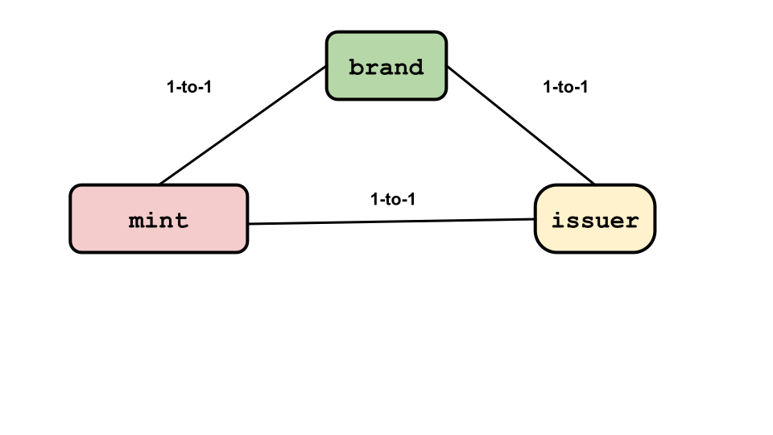
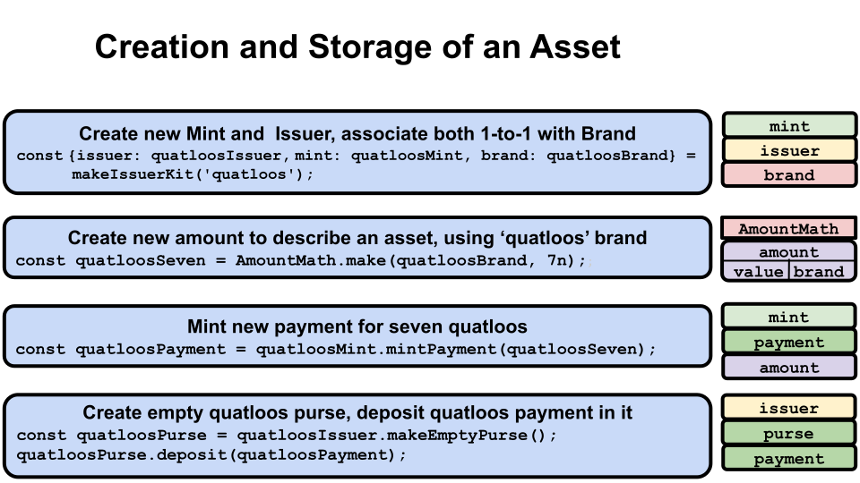

# ERTP Overview

ERTP (*Electronic Rights Transfer Protocol*)
is Agoric's token standard for transferring tokens and other digital assets in
JavaScript.

## Object Capabilities

ERTP uses [OCaps (object capabilities)](../../glossary/#object-capabilities)
to enforce access control. In an Ocaps system, there aren't any
Access Control Lists(ACLs). Instead, your capabilities are defined by the object references you hold. 
Thus, if your program has a reference to an
object, it can call methods on that object. If it doesn't have a
reference, it can't. For more on object capabilities, see
[Chip Morningstar's post](http://habitatchronicles.com/2017/05/what-are-capabilities/).

## ERTP Concepts Overview

ERTP has the following structure:


### Digital Assets

There are three kinds of digital assets: fungible, non-fungible, and semi-fungible.

Fungible assets are interchangeable. For example, if you have 100
one-dollar bills and need to pay someone 5 dollars, it doesn't matter
which five of your one-dollar bills you give them.

Non-fungible assets have the same **[Brand](/reference/ertp-api/brand.md)**, but are not
interchangeable. For example, you might have 100 theater tickets. But someone wanting to buy 
even a General Admission
ticket from you will want one for a specific date and time. This might also affect the price;
you'll want to charge more for a Friday evening ticket than a Wednesday matinee ticket,
even if it's for the same show.

Semi-fungible assets have distinct forms which are not interchangeable
with each other, but in which instances of a single form may be interchangeable with
other instances of the same form.
For example, theater tickets for a single show might be partitioned into General Admission
and Balcony sections, where a holder may sit in any seat of the respective section.

### ERTP Components

At the center of ERTP, there are three basic components: **[Issuer](/reference/ertp-api/issuer.md)**, 
**[Mint](/reference/ertp-api/mint.md)**, and **[Brand](/reference/ertp-api/brand.md)**. 
Here's the relationship between these three components:

 

As you can see there's a one-to-one relationship between every **Issuer**, **Mint**, and **Brand**.
This one-to-one relationship is very important to keep the system secure. Hence, these objects are
immutable once they're created.

* **Issuer**: The source of truth for the digital asset. Issuer is the authority everyone trusts when trading this currency.
* **Brand**: A unique object that is used to identify the digital asset we're working with.
* **Mint**: The only way to print digital assets of the **Brand** associated with this **Mint** object.

There are a couple additional ERTP components:

* **[Amount](/reference/ertp-api/ertp-data-types.md#amount)**: A representation of the actual asset. **Amounts** are not assets; they're just an abstraction to make working with assets secure and easier. See the [Amounts](./amounts.md#amounts) documentation for additional information.
* **[Payment](/reference/ertp-api/payment.md)**: The form that digital assets take during a transfer. See the [Payment](./purses-and-payments.md#payments) documentation for additional information.
* **[Purse](/reference/ertp-api/purse.md)**: The form of digital assets in a non-transfer state. See the [Purse](./purses-and-payments.md#purses) documentation for additional information.

### AmountMath

ERTP uses the **[AmountMath](/reference/ertp-api/amount-math.md)** library for operations such as adding, subtracting,
and comparing **[Amount](/reference/ertp-api/ertp-data-types.md#amount)** values (such as when
depositing to or withdrawing assets from a **[Purse](/reference/ertp-api/purse.md)**). See the [AmountMath](./amount-math.md) documentation for additional information.

## Creation and Storage of an Asset



1. Pass a string into **[makeIssuerKit()](/reference/ertp-api/issuer.md#makeissuerkit-allegedname-assetkind-displayinfo-optshutdownwithfailure-elementshape)**
naming a new **[Brand](/reference/ertp-api/brand.md)**. (In this example, we're naming the new
**Brand** *quatloos*.) The function will return a new **[Issuer](/reference/ertp-api/issuer.md)**,
**[Mint](/reference/ertp-api/mint.md)**, and **Brand**. These 3 objects are all in unchangeable 
one-to-one relationships with each other.

	<<< @/snippets/ertp/guide/test-readme.js#makeIssuerKit

2. Use the **[make()](/reference/ertp-api/amount-math.md#amountmath-make-brand-allegedvalue)** method
in the **[AmountMath()](/reference/ertp-api/amount-math.md)** library to make a new
**[Amount](/reference/ertp-api/ertp-data-types.md#amount)** of the asset you want to create. You need
to specify what **Brand** the asset will be, as well as its
**[Value](/reference/ertp-api/ertp-data-types.md#value)** formatted as a **BigInt**.

	This returns an **Amount**, which is then stored in *quatloosSeven*.

	<<< @/snippets/ertp/guide/test-readme.js#seven

3. Mint new assets by using the **Amount** we created in Step 2 above. The assets are returned as a
**[Payment](./purses-and-payments.md#payments)**, which is stored in *quatloosPayment*.

	<<< @/snippets/ertp/guide/test-readme.js#mintPayment

4. ERTP expects that **[Purses](/reference/ertp-api/purse.md)** will be used for long term storage;
**Payments** are generally used to transfer assets rather than hold them for extended periods, while
**Purses** have various methods that facilitate long sterm storage of assets. Thus, if we want to store
the assets we created above in Step 3, we need to first create a **Purse** to hold the *Quatloos* by
calling the **[makeEmptyPurse()](/reference/ertp-api/issuer.md#anissuer-makeemptypurse)** on the
**Issuer** we created in Step 1 above.

	<<< @/snippets/ertp/guide/test-readme.js#purse

5. We now deposit our *Quatloos* assets into the **Purse** we just created. The *quatloosPayment*
**Payment** that contain the *Quatloos* will be automatically consumed, while the 7 *Quatloos* will be
contained in the **Purse**.

	<<< @/snippets/ertp/guide/test-readme.js#deposit

## Transferring an Asset


Start with your *quatloosPurse* that holds 7 *Quatloos*. Let's say you decide you want to send 5
*Quatloos* to another party named Alice.

1. Create a new *Quatloos*-branded **[Amount](/reference/ertp-api/ertp-data-types.md#amount)** with a
**[Value](/reference/ertp-api/ertp-data-types.md#value)** of 5 to describe what you want to withdraw.

	<<< @/snippets/ertp/guide/test-readme.js#five

2. Tell your **[Purse](/reference/ertp-api/purse.md)** containing *Quatloos* that you want to withdraw
the specified **Amount** from it. The withdrawn 5 *Quatloos* goes into a 
**[Payment](/reference/ertp-api/payment.md)**.

	<<< @/snippets/ertp/guide/test-readme.js#withdraw

3. Alice now needs to do some work first so there's somewhere for her to put the 5 *Quatloos*
**Payment**. Let's assume Alice already has a *Quatloos* **Purse** of her own. To let other parties
safely deposit *Quatloos* into it, Alice needs to create a
[deposit facet](../../glossary/#deposit-facet) for that **Purse**.

	Anyone who has access to a deposit facet can deposit assets to its **Purse** but can't either make
a withdrawal from the **Purse** or get its balance. It's like being able to send money to a friend via
their email address; you can't then take money out of your friend's accounts or find out how much is in
them.

	<div class="language-js secondary">

	<<< @/snippets/ertp/guide/test-readme.js#depositFacet

	</div>

4. Alice puts her deposit facet on Agoric's [Board](/glossary/#board-agoric-board),
a key-value "bulletin board" that lets her make it generally available for use.

	The Board is a basic bulletin board type system where users can post an Id for a value and
others can get the value just by knowing the Id. Alice can make her Id(s) known by any
communication method she likes; private email, an email blast to a mailing list or many individuals,
buying an ad on a website, tv program, or newspaper, listing it on her website, etc.

	<div class="language-js secondary">

	<<< @/snippets/ertp/guide/test-readme.js#getId

	</div>

5. Get a reference to Alice's deposit facet from the Board. Alice tells you the Board Id
associated with her *Quatloos* **Purse** deposit facet. You get the Id associated value, which
gives you the reference to that deposit facet. You then just tell the facet to receive your
**Payment** of 5 *Quatloos*.

	<<< @/snippets/ertp/guide/test-readme.js#getValue

6. After all this, your *Quatloos* **Purse** has 2 *Quatloos* (7 - 5), while Alice's *Quatloos*
**Purse** has 5 additional *Quatloos* in it. Your 5 *Quatloos* **Payment** was consumed when
the transfer happened.

The `E()` notation is a local "bridge" that lets you invoke methods on remote objects.
It takes a local representative (a [presence](../../glossary/#presence)) for a remote object
as an argument and sends messages to the remote object. This is explained in more detail at the
[`E()` section in the Distributed JavaScript page](../js-programming/eventual-send.md).

## Security Properties

ERTP `purses` have a `deposit` method which takes a `payment`
as its argument. It first checks that the `payment` is
genuine and the same asset `brand` as the `purse`

If everything passes the checks, the asset moves from 
the `payment` to the `purse`. If there's a problem, it throws an error.

After a successful deposit, ERTP guarantees:
- The `payment` is deleted from its `issuer`'s records and no longer has any assets associated with it.
- Its `issuer` no longer recognizes that `payment`.
- The `purse` contains all digital assets that were in the `payment`.

When the `deposit` call throws an error (i.e. something went wrong), ERTP guarantees
that neither the `purse` nor the alleged `payment` are affected by it.

In addition, you can create a [deposit facet](../../glossary/#deposit-facet) for any `purse`. This is an object associated
with a specific `purse` that can be sent to another party instead of a reference to the `purse`.
The security advantage is that the other party can only use the deposit facet to make deposits to the associated `purse`. They cannot use it to make a withdrawal from or ask about the balance of a `purse`.

## Promises

Several ERTP methods are asynchronous. Rather than immediately returning their expected object,
they instead return a **Promise** for that object.

JavaScript implements **Promise** objects and recently added the keywords `async` and `await` to
simplify working with them. For information about JavaScript's implementation of **Promise** objects,
`async`, and `await`, see [javascript.info](https://javascript.info/async) or
[MDN](https://developer.mozilla.org/en-US/docs/Learn/JavaScript/Asynchronous).


## Table of Content
* ### ERTP
  * What is an electronic right?
  * Electronic right vs eright
  * What is ERTP?
  * Implementing sample `eright`s
  * ERTP in Agoric

* ### Zoe
  * Context
  * Structure Of A Zoe Contract
  * Offers
  * Two Sides Of Zoe
  * Contract Development Experience

## ERTP

### What is an electronic right?
* #### Object Capabilities
  In order to understand what an `electronic right` is we first need to take a look at the concept called `Object Capabilities`.

  !Figure 1: Granovetter Diagram(../literatureWork/images/granovetterOperator.png)

  The diagram above demonstrates the social relationships between people and was designed by The sociologist Mark Granovetter. The Object Capabilities 
discipline refers to this diagram as `Granovetter Operator` and uses it to illustrate the relationships between objects.

  In its essence, an `ocaps` (Object Capabilities) system authorizes users according to the object references they have. In an `ocaps` system, there's no 
Access Control Lists(ACLs). Simply your capabilities are defined by the object references you hold. 

* #### A Word On 'Rights'

  "Rights help people coordinate plans and resolve conflicts over the use of resources.
Rights partition the space of actions to avoid interference between separately formulated
plans, thus enabling cooperative relationships despite mutual suspicion and competing
goals [15]. This rights-based perspective can shed light on the problem of securing distributed computational systems"[2]

* #### From Objects To Electronic Rights
  The object references represent a right to perform a set of operations on a specific, designated resource.
In this context, we can use electronic rights to address the real-world problems which are currently being 
resolved by the rights we know as `normal`. Using contracts, law, courts, etc.

### Electornical right vs eright
Let's imagine Alice, Bob, and Carol from the `Granovetter Operator` are some objects living in a `ocap` environment.
- Alice has the `right` to invoke a resource from Carol.
- Alice knows Bob so she can pass her right to invoke Carol to Bob. Bob has no way of invoking Carol if Alice refuses to
pass this right to him.
- Carol has no authority to invoke any resource neither from Alice or Bob.

The type of `right` we're inspecting above has these features;
* Shareable
* Exercisable
* Opaque
* Specific

Here's what Mark Miller has to say about the differences between electronic rights and erights in [erights.org](http://erights.org/smart-contracts/index.html#ERTP);

"_Capabilities are electronic rights of a sort, but by themselves lack 2 crucial features needed for tradable electronic rights:_

* _Exclusive rights transfer._
* _Assayability (so a 3rd party can determine if a trade is mutually acceptable)._

_The next layer above distributed capabilities, ERTP, does provide these properties. 
The ERTP protocol accommodates fungible & non-fungible rights, exclusive & non-exclusive rights, 
and blinded or non-blinded transfer. **Only electronic rights manipulable via ERTP are called erights.**_"

So If we compare the rights we inspected above to the definition of `eright` from Mark Miller, we can see that the right
transfer from `Granovetter Operator` lacks the two main features for an electronic right to be called `eright`. Why?

1. An object reference is shareable but an eright has to be exclusive. What do we mean? <br>
   If Alice drops the capability after passing it to Bob, Bob
   happens to have exclusive access to Carol, but this isn’t an __*exclusive*__ right since Bob
   is unable to know that he is the only one who has it.[1]
2. A capability is opaque, but an eright has to be assayable. Meaning; <br>
   Assayability is needed for trade, since you must be able to determine what you would
   be getting before deciding to purchase. However, exclusive rights can only be reliably
   assayed by actually obtaining exclusive access to them, since otherwise, after you’ve
   assayed them, someone else may gain the exclusive, cutting you out. Trade of
   exclusives may therefore require a trusted third party who can hold them in escrow.[1]

If we're going to trade electronic rights in a distributed environment securely, the common features for all those rights are;
* Exclusive
* Assayable

But there are other features for an `eright` can possess;
* Fungible vs Non-fungible: We can implement both `Money` and something like a `Ticket` as `erights` where money is fungible and a ticket is non-fungible.
* Exercisable vs Symbolic: Money is symbolic, you cannot do anything with it other than trading it for something else. But something like a `Covered Call Option` is 
exercisable where you can exercise your right to `Buy` the covered asset before a deadline. Both `Money` and `Covered Call Option` can be implemented as `eright`s.

### What is ERTP?
ERTP is the protocol that transforms an electronic right into an `eright` by making it `Exclusive` and `Assayable`.

Here are some sample `eright` implementations via ERTP;
* #### Money
  [Sample Money Implementation](http://erights.org/elib/capability/ode/ode-capabilities.html#simple-money)
* #### Covered Call Option
  [Sample Covered Call Implementation](http://erights.org/elib/capability/ode/ode-bearer.html#options-contract)

### ERTP In Agoric
> **Note**: This section uses materials(code samples, diagrams, etc.) from [Agoric Docs ERTP](https://docs.agoric.com/guides/ertp/#ertp-concepts-overview).
> Visit the site for more in-depth learning materials. 

Agoric uses ERTP to trade `eright`s like money, NFTs etc. The version of ERTP Agoric uses has the following structure;


At the center of the above structure, there are three basic components: `Issuer`, `Mint` and `Brand`. 
Here's the relationship between these three components;


As you can see there's a `one-to-one` relationship between every `Issuer`, `Mint` and `Brand`. 

* **Issuer**: The source of truth for the digital asset. Issuer is the authority everyone trusts when trading
this currency. Below is a diagram showing how the issuer manages to be the source of truth.
  
* **Brand**: A unique object that is used to identify the digital asset we're working with. Brand information
can be shared publicly.
* **Mint**: The only way to print money of the `Brand` associated with this mint object.

This `one-to-one` relationship between `Issuer`, `Mint` and `Brand` is very important to keep the system secure.
Hence, they're immutable.

There are some other components that we must mention if we're going to talk about ERTP. They are,
* **Amount**: A representation of the actual asset. Amounts are not money. They're just an abstraction to make working with digital assets secure and easier.
* **Payment**: The form that an actual digital asset takes during a transfer. 
* **Purse**: The form of digital asset in a non-transfer state.

Let's take a look at how we can make use of the ERTP protocol to create fungible and non-fungible tokens;
* ##### How to create fungible tokens with ERTP?
  Initially;
  ```js
  const {
     issuer: quatloosIssuer,
     mint: quatloosMint,
     brand: quatloosBrand,
  } = makeIssuerKit('quatloos');  
  ```
  We call `makeIssuerKit` in order to get a fresh set of `Issuer`, `Mint` and `Brand` objects. Then we've to creat
the amount to be minted;
  ```js
  const quatloosSeven = AmountMath.make(quatloosBrand, 7n);  
  ```
  Once we have the amount, we can actually print the money using the `Mint` object,
  ```js
  const quatloosPayment = quatloosMint.mintPayment(quatloosSeven);
  ```
  A successful mint results in a `Payment` object. Payments are the money `on-the-go`, we should put it in a `Purse`
if we want to park our money. To put a payment inside a purse;
  ```js
  const quatloosPurse = quatloosIssuer.makeEmptyPurse();
  quatloosPurse.deposit(quatloosPayment);
  ```

* ##### How to create non-fungible tokens with ERTP?
  Our first step is very similar to the one we created a fungible asset but with only one difference;
  ```js
  const {
    mint: popMint,
    brand: popBrand,
    issuer: popIssuer,
   } = makeIssuerKit('POP', AssetKind.COPY_SET);
  ```
  The argument `AssetKind.COPY_SET` is specified when we want to create non-fungible tokens. The argument for fungible
tokens are `AssetKind.NAT` but we did not specify that because it's the default option. See the docs page for 
[other possible AssetKind options](https://docs.agoric.com/reference/ertp-api/ertp-data-types.html#assetkind). Once we have out issuerKit 
we can move on to the next step which is creating the amount to be minted;
  ```js
  const popAmount = AmountMath.make(popBrand, harden([{
        organization: 'Chainboard Academy',
        courseName: 'Agoric Bootcamp',
        studentId: '12',
      }]));
  ```
  The data of an NFT is wrapped around an array. This is particularly useful when we want to add/subtract non-fungible
amounts. Now we can move on to the minting phase;
  ```js
  const popPayment = popMint.mintPayment(popAmount);  
  ```
  We can store NFTs just like we store fungible tokens;
  ```js
  const popPurse = popIssuer.makeEmptyPurse();
  popPurse.deposit(popPayment);
  ```
