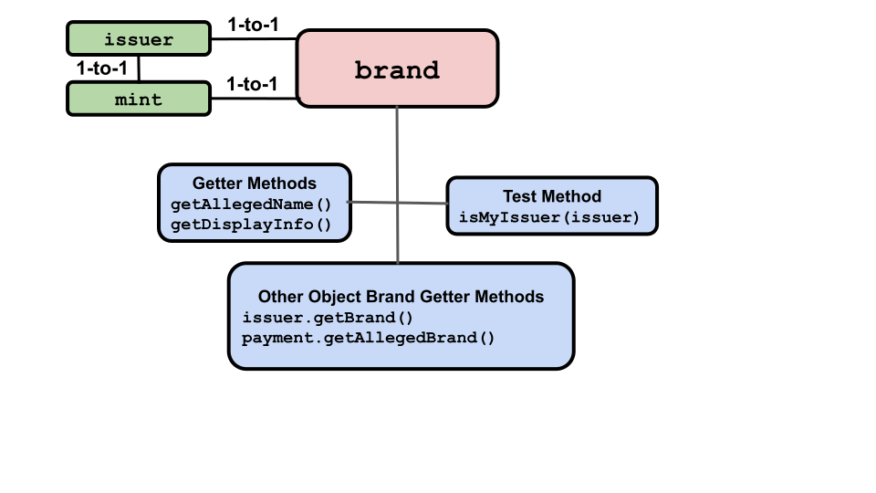

# Amounts, Values, and Brands

## Amounts

 

An `amount` describes digital assets. There are no `amount` API methods,
but [AmountMath](/reference/ertp-api/amount-math) methods take `amounts` as arguments
to get information about and manipulate them.

`AmountMath.make()` is generally how you make new `amounts`.
However, you can also make an `amount` as an object literal by making a record of
a `brand` and a `value`. While `AmountMath.make()` is recommended for proper 
object-oriented programming, this produces the same result:

<<< @/../snippets/ertp/guide/test-amounts.js#manualMake
Each `amount` has two properties:
- **brand**: The type of digital asset, such as our imaginary `Quatloos` currency or,
  in a game, a powerful magic sword with a brand of `Plus3Sword-ABCGames` or similar.
- **value**: How much/many of the asset. Fungible values are natural
numbers represented as BigInts. Non-fungible values may be represented as strings naming a
particular right, or an arbitrary object representing the rights at
issue (e.g., a theater ticket's date, time, row, and seat positions).

`amounts` and their `values` and `brands` can be manipulated by the
`AmountMath` library. It executes the logic of how `amounts` change when
digital assets are merged, separated, or otherwise manipulated. For
example, you make an offer for something, which is declined. You want
to change your offer, represented as an `amount`, to be of a greater
`value` by adding to it.

## Brands

 

A `brand` object is an `amount` object's type of digital asset, such as
our imaginary Quatloos currency or, in a game, a powerful magic
sword.

In ERTP, `mint` objects create new asset `payment`
objects. Each `mint` has a one-to-one relationship with an `issuer`
object. And each `issuer` object has a one-to-one
relationship with a `brand` object. This means:
- A `mint` can only create a `payment` for one specific `brand`, which
  must be the same `brand` as their associated `issuer`.
- An `issuer` can only create a new empty `purse`
for one specific `brand`.
- An `amount` is either *fungible* or *non-fungible*, as determined by which
its `issuer`, and thus its `brand`, was created to be. 

A `brand` has three associated methods. The following is a brief description 
and example of each `brand` method. For more detail, click the method's name 
to go to its entry in the [ERTP
API Reference](/reference/ertp-api/). 

- [aBrand.isMyIssuer()](/reference/ertp-api/brand#abrand-ismyissuer-allegedissuer)
  - Returns `true` if the `issuer` argument matches the `issuer` associated with the `brand`.
    We have this method because the `issuer` is authoritative and the `brand` is not. You can
    create a `payment`, `purse`, or `amount` with a `brand` that claims a particular `issuer`,
    without that `issuer` having been involved. But if you use that `payment` or `purse`, it won't be 
    accepted by genuine ones. So to know, you have to verify with the `issuer` to see if it agrees.
  - <<< @/../snippets/ertp/guide/test-amounts.js#isMyIssuer
- [aBrand.getAllegedName()](/reference/ertp-api/brand#abrand-getallegedname)
  - Returns the `brand`'s alleged name, but should not be trusted as accurate.
  - <<< @/../snippets/ertp/guide/test-amounts.js#getAllegedName
- [aBrand.getDisplayInfo()](/reference/ertp-api/brand#abrand-getdisplayinfo)
  - Returns the `DisplayInfo` associated with the `brand`. The `DisplayInfo`
    tells the UI how to correctly display `values` associated with the `brand`.
  - <<< @/../snippets/ertp/guide/test-amounts.js#getDisplayInfo

The following methods on other ERTP components also either operate on or
return a `brand`.

- [anIssuer.getBrand()](/reference/ertp-api/issuer#anissuer-getbrand)
  - Returns the `brand` for the `issuer`. The `brand` is not closely
    held, so this should not be trusted to identify an `issuer`
    alone. Fake digital assets and `amount`s can use the `brand` of another `issuer`.
  - <<< @/../snippets/ertp/guide/test-amounts.js#getBrand
- [aPayment.getAllegedBrand()](/reference/ertp-api/payment#apayment-getallegedbrand)
  - Return the `payment`'s alleged `brand`. Because a `payment`
  is not trusted, this should be treated with suspicion and verified
  elsewhere. This example code determines if a `payment` we got from untrusted sources
  is valid. It uses the `brand` to find a `purse` we want to deposit it in, then verifies
  that it's genuine.
  - <<< @/../snippets/ertp/guide/test-amounts.js#depositSomewhere

## AmountValues

 

AmountValues are the "how many" part of an `amount`. 

Note that number values (for fungible assets) are represented as `BigInt`s and
not `Number`s. Write `10n` rather than `10`.

There are no `value`
methods, but two `AmountMath` methods use or return them. 
- [AmountMath.getValue(brand, amount)](/reference/ertp-api/amount-math#amountmath-getvalue-brand-amount)
  - Return the `amount` argument's `value`
  - <<< @/../snippets/ertp/guide/test-amounts.js#getValue
- [AmountMath.make(brand, allegedValue)](/reference/ertp-api/amount-math#amountmath-make-brand-allegedvalue)
  - Make an `amount`from a `brand` and a `value`. 
  - <<< @/../snippets/ertp/guide/test-amounts.js#make
    
