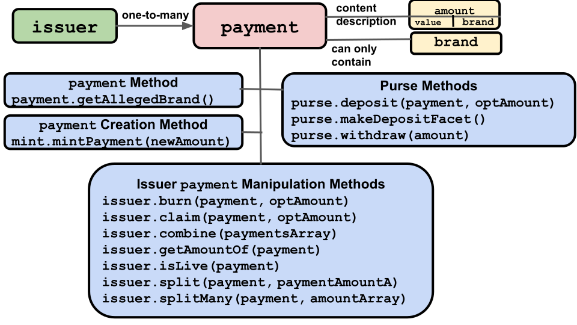

# Purses and Payments

In ERTP, digital assets always exist in either a **Purse** or a **Payment** object.
- **[Purse](/reference/ertp-api/purse.md)**: Holds
  an amount of same-branded digital assets until part or
  all of them are withdrawn into a **Payment**. A new **Purse** is created
  by an **[Issuer](/reference/ertp-api/issuer.md)** and can only hold assets of that **Issuer**'s **[Brand](/reference/ertp-api/brand.md)**.
- **[Payment](/reference/ertp-api/payment.md)**:
  Holds a quantity of same-branded digital assets to transfer to another party.
  A **Payment** is created containing either new assets from a **[Mint](/reference/ertp-api/mint.md)** or existing assets
  withdrawn from a **Purse** or transferred from one or more other consumed **Payments**.
  It can only hold assets of the same **Brand** as its source(s).

Any number of **Purses** or **Payments** can hold assets
of any particular **Brand**. Neither a **Purse** nor a **Payment** can ever change their
associated **Brand**.

Each **Purse** and **Payment** object contains a specific amount of digital assets,
which may be none at all ("empty" in [AmountMath](/reference/ertp-api/amount-math.md) terms). In the same way
you might have separate bank accounts for different purposes,
you can have separate **Purses** for the same **Brand** of digital asset.
One of your **Purses** might hold 2 *Quatloos* while another holds 9000 *Quatloos*.

When you deposit assets into a **Purse**, they are added to
whatever assets already exist there. So a 3 *Quatloos* deposit
into a **Purse** with 8 *Quatloos* results in a **Purse** with 11 *Quatloos*.

When adding a **Payment** to a **Purse**, you must add the entire **Payment**. To
only add part of a **Payment**, you must first call **[anIssuer.split()](/reference/ertp-api/issuer.md#anissuer-split-payment-paymentamounta)**
or **[anIssuer.splitMany()](/reference/ertp-api/issuer.md#anissuer-splitmany-payment-amountarray)**
to split it into two or more **Payments**.

**[Mints](/reference/ertp-api/mint.md)** create entirely new digital assets and put them in a new **Payment**.
You also create a **Payment** by withdrawing assets from a **Purse**, by splitting an
existing **Payment**, or by combining multiple **Payments** into asingle new one. Note
the **Brand** of the new **Payment** is the same as the associated **Brand** of its originating **Mint**, **Purse**, or **Payment**.

In ERTP, assets are not transferred directly from one **Purse** to another.
Instead, the transfer must be mediated by a **Payment**.
In the Agoric stack, the actual send and receive operations are provided by
**[E()](../js-programming/eventual-send.md)**.
- Sender:
  1. Withdraw assets described by an **[Amount](/reference/ertp-api/ertp-data-types.md#amount)** from a **Purse**, creating a **Payment**.
  2. Send this **Payment** to a recipient.
- Recipient:
  1. If you don't already have one, create a **Purse** for the asset **Brand**
     you'll receive.
  2. Receive the message with the **Payment**.
  3. Deposit the **Payment** into a **Brand**-appropriate **Purse**.

## Purses

You change a **[Purse](/reference/ertp-api/purse.md)**'s balance by calling either 
**[Purse.deposit()](/reference/ertp-api/purse.md#apurse-deposit-payment-optamount)** (to add assets) or
**[Purse.withdraw()](/reference/ertp-api/purse.md#apurse-withdraw-amount)** (to remove assets) on it. 
A **Purse** can be empty, which for
fungible assets means it has a value of 0. For non-fungible
assets, such as theater tickets, it doesn't have any tickets.

Unlike **[Payments](/reference/ertp-api/payment.md)**, **Purses** are not meant to be sent to others. To transfer 
digital assets, you should withdraw a **Payment** from a **Purse** and send 
the **Payment** to another party.

You can create a [deposit facet](../../glossary/#deposit-facet) for a **Purse**.
Deposit facets are either sent to other parties or made publicly known. Any party can deposit a **Payment** into the
deposit facet, which deposits it into its associated **Purse**. However, no one can
use a deposit facet to either make a withdrawal from its **Purse** or get the **Purse**'s balance.

If you have a deposit facet, you make a deposit to its associated **Purse** by calling 
**[DepositFacet.receive()](/reference/ertp-api/purse.md#adepositfacet-receive-payment-optamount)**.
Note that you add a **Payment** to a **Purse** with a **Purse.deposit()** method, while you add a
**Payment** to a **depositFacet** with a **DepositFacet.receive()** method.

The **Payment**'s **[Brand](/reference/ertp-api/brand.md)** must match that of the **Purse**.
Otherwise it throws an error.
When sending a deposit facet object
to a party, you should tell them what **Brand** it accepts.

  

The following is a brief description of the **Purse** methods.
- [aPurse.getCurrentAmount()](/reference/ertp-api/purse.md#apurse-getcurrentamount)
  - Describes the **Purse**'s current balance expressed as an **[Amount](/reference/ertp-api/ertp-data-types.md#amount)**. Note that a **Purse** can be empty.
  - <<< @/snippets/ertp/guide/test-purses-and-payments.js#getCurrentAmount
- [aPurse.withdraw()](/reference/ertp-api/purse.md#apurse-withdraw-amount)
  - Withdraws the **Amount** of specified digital assets from this **Purse** into a new **Payment**.
  - <<< @/snippets/ertp/guide/test-purses-and-payments.js#withdraw
- [aPurse.deposit()](/reference/ertp-api/purse.md#apurse-deposit-payment-optamount)
  - Deposits all the contents of a **Payment** into this **Purse** returning an **Amount** describing the
**Payment**.
  - <<< @/snippets/ertp/guide/test-purses-and-payments.js#deposit
- [aPurse.getDepositFacet()](/reference/ertp-api/purse.md#apurse-getdepositfacet)
  - Returns a deposit-only facet on the **Purse**. Note that the command to add a **Payment**'s
    assets via a **DepositFacet** is not **aPurse.deposit()** but rather **[aDepositFacet.receive()](/reference/ertp-api/purse.md#adepositfacet-receive-payment-optamount)** as shown here.
  - <<< @/snippets/ertp/guide/test-purses-and-payments.js#getDepositFacet

In addition, the method to create a new, empty, **Purse** is called on an **[Issuer](/reference/ertp-api/issuer.md)**:
- [anIssuer.makeEmptyPurse()](/reference/ertp-api/issuer.md#anissuer-makeemptypurse)
  - Makes and returns an empty **Purse** that holds assets of the **Brand** associated with the **Issuer**.
  - <<< @/snippets/ertp/guide/test-issuers-and-mints.js#makeEmptyPurse

## Payments

   

**[Payments](/reference/ertp-api/payment.md)** hold digital assets intended to be transferred to another party.
They are linear, meaning that either a **Payment** has its full
original balance, or it is used up entirely. It is impossible to
partially use a **Payment**. 

In other words, if you create a **Payment** containing
10 *Quatloos*, the **Payment** will always either contain 
10 *Quatloos* or it will be deleted from its **[Issuer](/reference/ertp-api/issuer.md))** records and no
longer have any value. While a **Payment** can be either combined with others or
split into multiple **Payments**, in both cases the original **Payment(s)**
are consumed and the results put in one or more new **Payments**.

A **Payment** can be deposited into a **[Purse](/reference/ertp-api/purse.md)**, split into multiple
**Payments**, combined with other **Payments**, or claimed (i.e., getting an exclusive **Payment** and revoking access from anyone else).

A **Payment** is often received from other parties, but is not self-verifying
and cannot be trusted to provide its own true value.
To get the verified balance
of a **Payment**, use the **[anIssuer.getAmountOf()](/reference/ertp-api/issuer.md#anissuer-getamountof-payment)** method on the trusted **Issuer**
for the **Payment**'s **[Brand](/reference/ertp-api/brand.md)**.

To get the **Issuer** for a **Brand** you didn't create, 
ask someone you trust. For example, the venue creating tickets for shows
can be trusted to give you the tickets' **Issuer**. Alternately, a friend might have 
a cryptocurrency they like, and, if you trust them, you might accept 
that the **Issuer** they give you is valid.

To consume a **Payment** into a new **Purse**:
1. Get the **Payment**'s trusted **Issuer**.
2. Use the **Issuer** to create an empty **Purse** for that **Brand**.
3. Deposit the **Payment** into the new **Purse**.

**Payments** have only one method, but many methods for other ERTP components
have **Payments** as arguments and effectively operate on a **Payment**. The following is a
brief description and example of each **Payment**-related method.
- [aPayment.getAllegedBrand()](/reference/ertp-api/payment.md#apayment-getallegedbrand)
  - Returns the **Brand** indicating the kind of digital asset this **Payment** purports to be
    and which **Issuer** to use with it.
    Because **Payments** are not trusted, any method calls on them should be treated
    with suspicion and verified elsewhere. Any successful operation by an **Issuer** on a **Payment** verifies it.

### Other Objects' Payment-Related Methods

- [anIssuer.burn()](/reference/ertp-api/issuer.md#anissuer-burn-payment-optamount)
  - Destroys all of the digital assets in the **Payment**.
  - <<< @/snippets/ertp/guide/test-issuers-and-mints.js#burn
- [anIssuer.claim()](/reference/ertp-api/issuer.md#anissuer-claim-payment-optamount)
  - Transfers all digital assets from the **Payment** argument to a new **Payment**.
  - <<< @/snippets/ertp/guide/test-issuers-and-mints.js#claim
- [anIssuer.combine()](/reference/ertp-api/issuer.md#anissuer-combine-paymentsarray-opttotalamount)
  - Combines multiple **Payments** into one new **Payment**.
  - <<< @/snippets/ertp/guide/test-issuers-and-mints.js#combine
- [anIssuer.getAmountOf()](/reference/ertp-api/issuer.md#anissuer-getamountof-payment)
  - Describes the **Payment**'s balance as an **[Amount](/reference/ertp-api/ertp-data-types.md#amount)**.
  - <<< @/snippets/ertp/guide/test-issuers-and-mints.js#getAmountOf
- [anIssuer.isLive()](/reference/ertp-api/issuer.md#anissuer-islive-payment)
  - Returns **true** if the **Payment** was created by the **Issuer** and is available for use (i.e., it hasn'y been consumed or burned).
- [anIssuer.split()](/reference/ertp-api/issuer.md#anissuer-split-payment-paymentamounta)
  - Splits a single **Payment** into two new **Payments**.
  - <<< @/snippets/ertp/guide/test-issuers-and-mints.js#split
- [anIssuer.splitMany()](/reference/ertp-api/issuer.md#anissuer-splitmany-payment-amountarray)
  - Splits a single **Payment** into multiple **Payments**.
  - <<< @/snippets/ertp/guide/test-issuers-and-mints.js#splitManyConcise
- [aMint.mintPayment()](/reference/ertp-api/mint.md#amint-mintpayment-newamount)
  - Creates new digital assets of the **[Mint](/reference/ertp-api/mint.md))**'s associated **Brand**.
  - <<< @/snippets/ertp/guide/test-issuers-and-mints.js#mintMintPayment
- [aPurse.deposit()](/reference/ertp-api/purse.md#apurse-deposit-payment-optamount)
  - Deposits all the contents of **Payment** into **Purse**.
  - <<< @/snippets/ertp/guide/test-purses-and-payments.js#deposit
- [aPurse.getDepositFacet()](/reference/ertp-api/purse.md#apurse-getdepositfacet)
  - Creates and returns a new deposit-only facet of the **Purse** that allows arbitrary other parties to deposit **Payments** into **Purse**.
  - <<< @/snippets/ertp/guide/test-purses-and-payments.js#getDepositFacet
- [aPurse.withdraw()](/reference/ertp-api/purse.md#apurse-withdraw-amount)
  - Withdraws the **Amount** of specified digital assets from **Purse** into a new **Payment**.
  - <<< @/snippets/ertp/guide/test-purses-and-payments.js#withdraw

## Purse and Payment Example

The following code creates a new **[Purse](/reference/ertp-api/purse.md)** for the 
*Quatloos* **[Brand](/reference/ertp-api/brand.md)**, deposits 10 *Quatloos* into the **Purse**,
withdraws 3 *Quatloos* from the **Purse** into a **[Payment](/reference/ertp-api/payment.md)**,
and finally returns an **[Amount](/reference/ertp-api/ertp-data-types.md#amount)** describing 
what's currently in the **Purse** (i.e., 7 *Quatloos*).

<<< @/snippets/ertp/guide/test-purses-and-payments.js#example
