# Getting Started

In these steps you will be getting your first Agoric dapp up and running!


## Your First Agoric Dapp - Offer Up

The Offer Up Dapp allows users to view all listed items up for sale in a marketplace. The Dapp shows 3 items by default (maps, potions, and scrolls). As a user you are able to choose up to 3 total items (in any combination). You can then create an offer for an amount of at least 0.25 IST. Once you sign the transaction, you will see the 3 items in your wallet and your wallet amount deducted by the Offer amount.

## How to Get Help

Before getting started, there are some resources you might want to keep handy in case you get stuck, have questions, or are curious about any of the components. Getting in contact with us is easy!

- Join us for our Weekly [Developer Office Hours](https://github.com/Agoric/agoric-sdk/wiki/Office-Hours)
- Come chat with us and other developers on the Official [Agoric Discord](https://agoric.com/discord)
- Search and post [Q & A](https://github.com/Agoric/agoric-sdk/discussions/categories/q-a) in [agoric-sdk discussions](https://github.com/Agoric/agoric-sdk/discussions)
- Send us a message on [X](https://twitter.com/agoric)
- Send an Email to [Developer Relations](mailto://devrel@agoric.com)

::: tip Video Walkthrough

As you're going through this tutorial it may be helpful to watch this video walkthrough, showing you all the steps and the desired outcome of each.

<iframe width="560" height="315" src="https://www.youtube.com/embed/huTI9_Gq2ow" title="YouTube video player" frameborder="0" allow="accelerometer; autoplay; clipboard-write; encrypted-media; gyroscope; picture-in-picture" allowfullscreen></iframe>

:::

## Platform Requirements

Currently Agoric supports macOS and Linux (including [Windows Subsystem for Linux](https://learn.microsoft.com/en-us/windows/wsl/about)). This tutorial is based on an installation of [Ubuntu 22.04 LTS](https://ubuntu.com/download/desktop). If you're using a different operating system, some variation may be required.


## Installing Prerequisites

In this section you'll be installing prerequisite components into your environment. If you're working with your own environment rather than using a fresh Ubuntu install, you may already have some or all of these components already installed.

### Installing NVM and Node

<details>
<summary>Installing NVM and Node on Ubuntu</summary>

At this point the Node Version Manager (NVM) utility will be installed. `nvm` makes it easy to select the specific version of [Node](https://nodejs.org/) that will be required for this tutorial (v18.16.0).

```sh
curl -o- https://raw.githubusercontent.com/nvm-sh/nvm/v0.39.7/install.sh | bash
```

or

```sh
wget -O- https://raw.githubusercontent.com/nvm-sh/nvm/v0.39.7/install.sh | bash
```

Next, run the command:

```sh
source ~/.bashrc
```

Finally, install Node with the command:

```sh
nvm install v18.16.0
```

</details>

### Installing Yarn

<details>
<summary>Installing Yarn on Ubuntu</summary>
  
Run the `corepack enable` command.

```sh
corepack enable
```

Now run the `yarn --version` command.

```sh
yarn --version
```

</details>

### Installing Docker

<details>
<summary>Installing Docker on Ubuntu</summary>

Now you'll install Docker using the two steps below. This first block of commands will add the Docker GPG keys to your system, then add the repository to Apt for installation.

```sh
# Install Docker
# Add Docker's official GPG key:
sudo apt-get update
sudo apt-get install ca-certificates curl gnupg
sudo install -m 0755 -d /etc/apt/keyrings
curl -fsSL https://download.docker.com/linux/ubuntu/gpg | sudo gpg --dearmor -o /etc/apt/keyrings/docker.gpg
sudo chmod a+r /etc/apt/keyrings/docker.gpg

# Add the repository to Apt sources:
echo \
  "deb [arch=$(dpkg --print-architecture) signed-by=/etc/apt/keyrings/docker.gpg] https://download.docker.com/linux/ubuntu \
  $(. /etc/os-release && echo "$VERSION_CODENAME") stable" | \
  sudo tee /etc/apt/sources.list.d/docker.list > /dev/null
sudo apt-get update
```

Now you can install Docker!

```sh
sudo apt-get install docker-ce docker-ce-cli containerd.io docker-buildx-plugin docker-compose-plugin
```

Now that Docker has been installed you'll need to add your user account to the Docker group.

```sh
sudo usermod -aG docker $USER
```

Since your user account was just added to the docker group, run the following command to re-evaluate group memberships.

```sh
exec su -l $USER
```

Now test that Docker works by running the `hello-world` sample.

```sh
docker run hello-world
```

The output of the `hello-world` example should be:

```
Hello from Docker!
This message shows that your installation appears to be working correctly.

To generate this message, Docker took the following steps:
 1. The Docker client contacted the Docker daemon.
 2. The Docker daemon pulled the "hello-world" image from the Docker Hub.
    (amd64)
 3. The Docker daemon created a new container from that image which runs the
    executable that produces the output you are currently reading.
 4. The Docker daemon streamed that output to the Docker client, which sent it
    to your terminal.

To try something more ambitious, you can run an Ubuntu container with:
 $ docker run -it ubuntu bash

Share images, automate workflows, and more with a free Docker ID:
 https://hub.docker.com/

For more examples and ideas, visit:
 https://docs.docker.com/get-started/
```

</details>

::: tip Using a Mac?

If you're using a Apple Mac with a Apple Silicon processor you will need to enable gRPC Fuse and disable Virtualization Framework in Docker desktop. To accomplish this first open Docker Desktop. Once open, click on the gear icon in the top right hand corner of the application to open Docker Desktop settings.

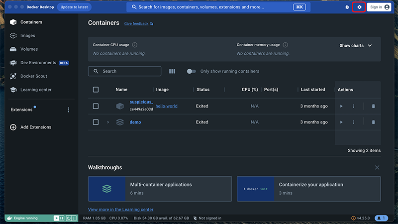


Next, select the option for gRPC Fuse. Once selected you should then be able to uncheck the box labeled "Use Virtualization framework".

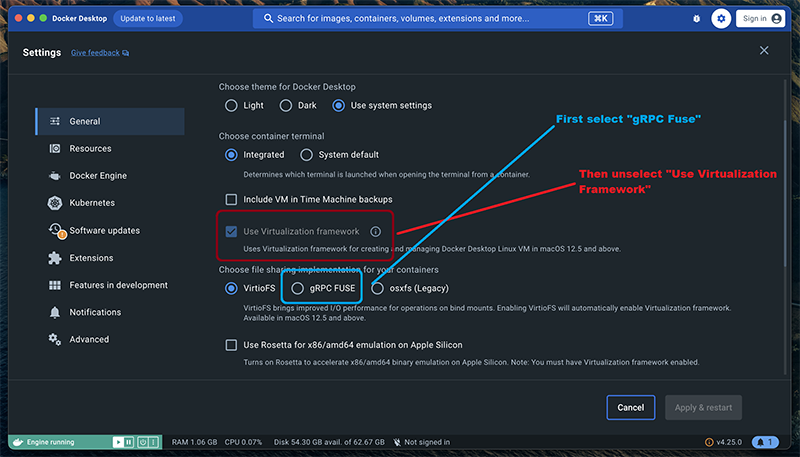


Finally click the "Apply & restart" button to apply your changes.

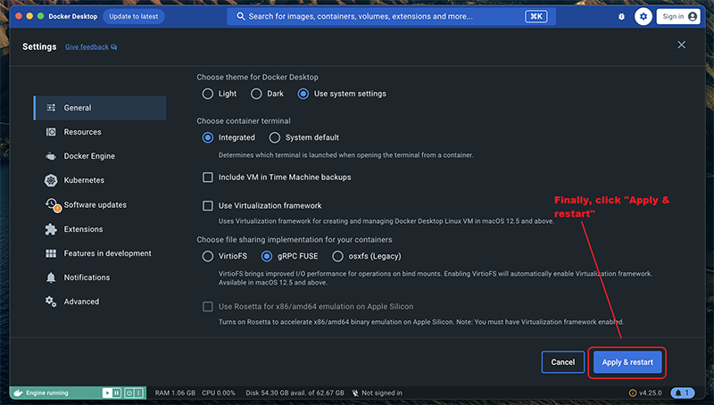

:::

## Creating Your Dapp From a Template

Now you'll use yarn to pull down the sample dapp. The sample dapp will be placed in a subfolder named `demo`.

```sh
yarn create @agoric/dapp --dapp-template dapp-offer-up demo
```

## Install Dapp Dependencies

Now navigate to the `demo` directory and run the `yarn install` command to install any solution dependencies.

Downloading all the required dependencies may take several minutes. The UI depends on the React framework, and the contract depends on the Agoric framework. The packages in this project also have development dependencies for testing, code formatting, and static analysis.

```sh
cd demo
```

```sh
yarn install
```

<details>
 <summary>Troubleshooting yarn install</summary>
  
 If you run into errors during `yarn install`, check that you are on a [supported platform](#platform-requirements) and not native Windows. 
  
 Then make sure you have the relevant developer tools installed. For example, on Debian or Ubuntu Linux, run `sudo apt get install build-essential`. 
 On macOS, be sure to install [Xcode](https://apps.apple.com/us/app/xcode/id497799835). 
  
  </details>

## Starting a Local Agoric Blockchain

Now go ahead and start a local Agoric blockchain using the `yarn start:docker` command. Note: This container is several gigabytes in size and may take a few minutes to download.

```sh
yarn start:docker
```

Once the network has started you can check the logs. Once you see messages showing blocks with a status of `commit` you can rest assured the network is running properly.

```sh
yarn docker:logs
```

Your output should resemble this:

```
demo-agd-1  | 2023-12-27T04:08:06.384Z block-manager: block 1003 begin
demo-agd-1  | 2023-12-27T04:08:06.386Z block-manager: block 1003 commit
demo-agd-1  | 2023-12-27T04:08:07.396Z block-manager: block 1004 begin
demo-agd-1  | 2023-12-27T04:08:07.398Z block-manager: block 1004 commit
demo-agd-1  | 2023-12-27T04:08:08.405Z block-manager: block 1005 begin
demo-agd-1  | 2023-12-27T04:08:08.407Z block-manager: block 1005 commit
```

::: details Note: logs include benign error messages

You can disregard messages such as:

- `v5: TypeError: target has no method "getDisplayInfo"`

These are artifacts of replaying historical events.

:::

## Starting the Dapp Smart Contract

Use control-C to exit the logs, then start the smart contract. Starting the contract may take a minute or two, so after running this command proceed to the next step.

```sh
yarn start:contract
```

This `start:contract` script will do a number of things that we will cover in more detail later <small>(_[transaction commands](../agoric-cli/agd-query-tx.md#transaction-commands), [permissioned deployment](../coreeval/)_)</small>:

1. Bundle the contract with `agoric run ...`
2. Collect some ATOM with `agd tx bank send ...`.
3. Use the ATOM to open a vault to mint enough IST to pay to install the bundles on chain with `agops vaults open ...`.
4. Install the bundles on chain with `agd tx swingset install-bundle ...`.
5. Collect enough BLD to pay for a governance deposit with `agd tx bank send ...`
6. Make a governance proposal to start the contract with `agd tx gov submit-proposal swingset-core-eval ...`.
7. Vote for the proposal; wait for it to pass.

While it's doing all that...

## Setting up a Keplr Wallet Demo Account

Next, ensure you have the [Keplr wallet plug-in](https://www.keplr.app/download) installed.

<details><summary>Installing Keplr Wallet</summary>

Open up your browser and navigate to [https://www.keplr.app/download](https://www.keplr.app/download). Select the version appropriate to your browser.

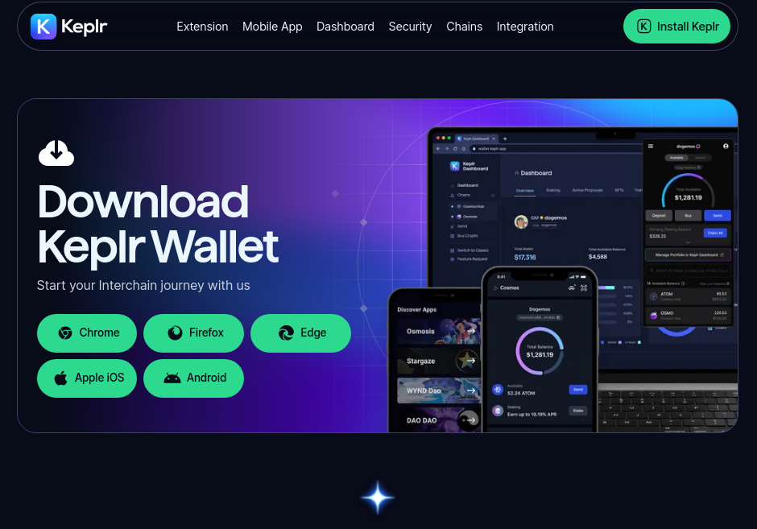

</details>

::: warning

Remember, this is just a demo. In real-world scenarios ensuring proper security around mnemonic phrases is critical!

- For any mnemonic phrase you use to secure your own assets, **take care to keep it strictly confidential!** The mnemonic here is only for testing.
- Using a **separate browser profile** is a good way to avoid accidentally using the wrong account when testing vs. with real assets.

:::

Once the plug-in has been installed, open Keplr and select the option to **Import an existing wallet**. Then choose the option to **Use recovery phrase or private key**.


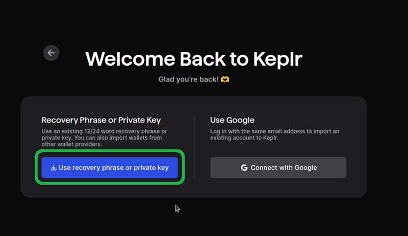

To import your wallet, you'll need to copy your mnemonic phrase into Keplr. You can find this series of 24 words back on your terminal window. Copy from this window into your Keplr wallet, then hit the "Import" button.

Please note that your phrase might not be the same as the one shown in this guide!

Note the mnemonic phrase in the output below:

```
waiting for block...
1
block produced
done
Waiting for proposal to pass (status=PROPOSAL_STATUS_VOTING_PERIOD)
Waiting for proposal to pass (status=PROPOSAL_STATUS_VOTING_PERIOD)
Waiting for proposal to pass (status=PROPOSAL_STATUS_VOTING_PERIOD)
Waiting for proposal to pass (status=PROPOSAL_STATUS_VOTING_PERIOD)
Waiting for proposal to pass (status=PROPOSAL_STATUS_VOTING_PERIOD)
Waiting for proposal to pass (status=PROPOSAL_STATUS_VOTING_PERIOD)
Waiting for proposal to pass (status=PROPOSAL_STATUS_VOTING_PERIOD)
Import the following mnemonic into Keplr:
survey thank matrix joke trim more make gossip spread yellow unfold under cash beach harsh fire blush achieve oak swamp pluck clock rocket leg

The resulting address should be: agoric1xe269y3fhye8nrlduf826wgn499y6wmnv32tw5

make: Leaving directory '/workspace/contract'
Done in 34.95s.
```

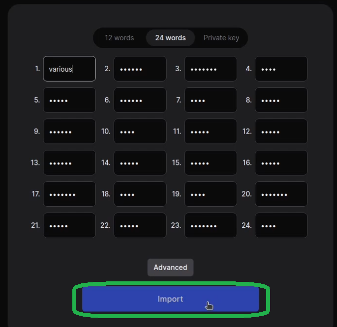

<details><summary>As usual, give your new wallet a name and a password.</summary>

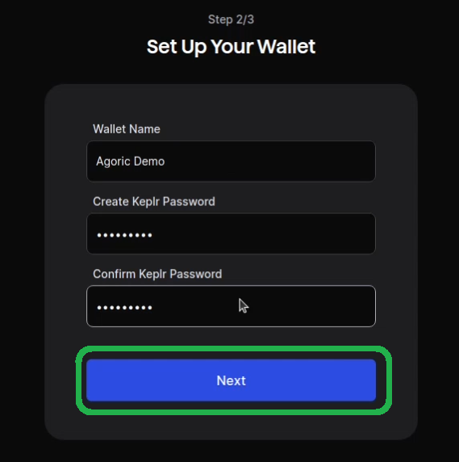

Click "Save".

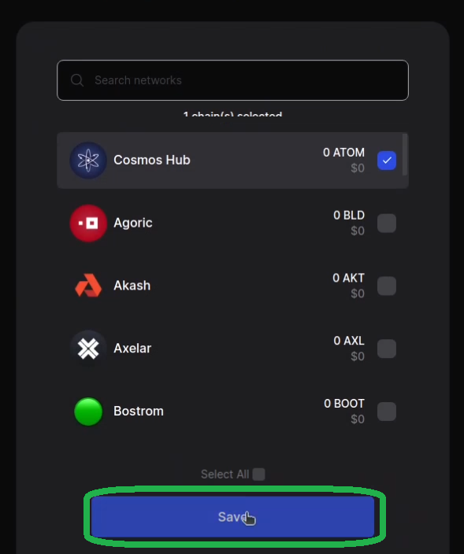

</details>

## Starting the Dapp

Start the UI for the sample dapp.

```sh
yarn start:ui
```

Note the localhost link that appears on your terminal window. Open this link in your browser.


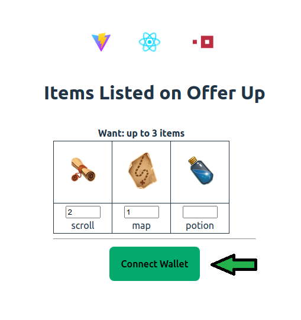

From the browser UI, click the "Connect Wallet" button to connect your Keplr wallet.

<details><summary>Adding Agoric local to Keplr</summary>

Like any [non-native chain](https://chains.keplr.app/), the first time you use the local Agoric blockchain, Keplr will ask you to approve it:

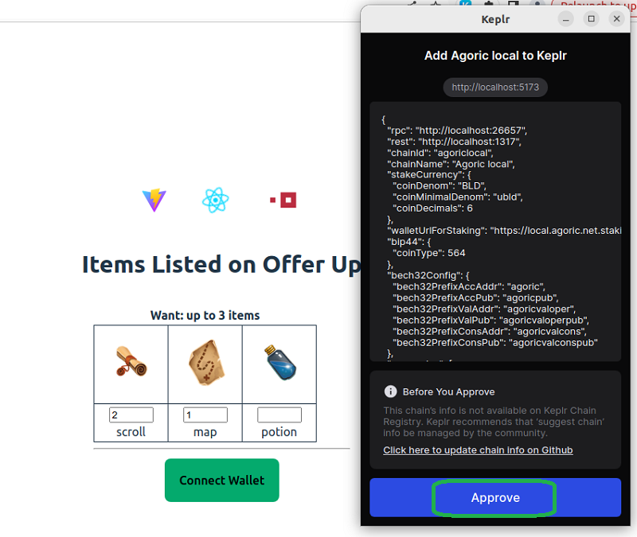

</details>

## Making an Offer

Once your wallet is connected, click on the "Make Offer" button to purchase 3 properties. Approve the transaction in your Keplr wallet.


When the transaction is complete you will notice some IST has been debited from your wallet, and you are the owner of three new properties. Feel free to experiment with offering less than the required 0.25 IST or attemping to purchase more than three items. You'll see these offers will not be accepted. Conditional offers like this are a key part of the Agoric platform!

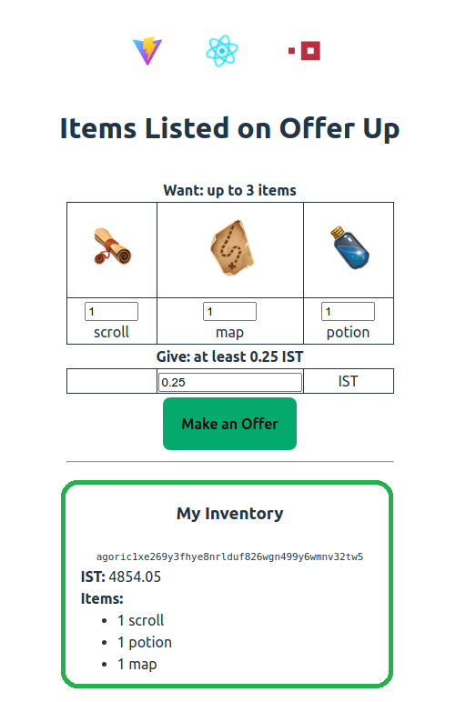

Congratulations! You got your first Agoric dapp up and running! Now that you've got your first Agoric dapp up and running, let's focus on some key takeaways from this exercise:
- **Starting an Agoric Chain**: You have gained experience starting a local Agoric blockchain. 

- **Deploying a Contract**: You have deployed a smart contract onto the Agoric platform!

- **Making an Offer**: Finally, you've learned to make an offer and seen that offer constraints are enforced by the Agoric platform. This means user interface can't attempt to fool a user by showing a 0.25 IST when actually charging them a much higer amount, such as 500 IST. It's also important to note that the contract cannot take the 0.25 IST without satisfying the want constraint, nor can the contract take more than the 0.25 cents in the give contraint.

This tutorial serves as an essential stepping stone for developers looking to delve into decentralized app development on the Agoric platform. To learn more about building Agoric dapps, check out the rest of the docs on this site!
