# Your First Agoric Dapp


# How to Get Help
Before getting started, there are some resources you might want to keep handy in case you get stuck, have questions, or are curious about any of the components. Getting in contact with us is easy! 
- Join us for our Weekly [Developer Office Hours](https://github.com/Agoric/agoric-sdk/wiki/Office-Hours)
- Come chat with us and other developers on the Official [Agoric Discord](https://agoric.com/discord)
- Search and post [Q & A](https://github.com/Agoric/agoric-sdk/discussions/categories/q-a) in [agoric-sdk discussions](https://github.com/Agoric/agoric-sdk/discussions)
- Write to us at https://twitter.com/agoric
- Send an Email to [Developer Relations](mailto://kbennett@agoric.com)


# Welcome!
In this tutorial you will install the Agoric SDK as well as a simple application to test the functionality of Agoric.
Currently Agoric supports [Windows Subsystem for Linux](https://learn.microsoft.com/en-us/windows/wsl/about), MacOS, and Linux. This tutorial is based on an installation of [Ubuntu 22.04 LTS](https://ubuntu.com/download/desktop). If you're using a different operating system, some variation may be required.


# Installing Curl
Begin by installing the `curl` utility, if it's not already installed. If using Ubuntu you'll first need to run the command below to prevent an error when installing `curl`.
`sudo apt-get update --fix-missing`

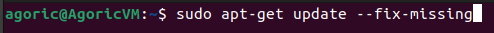

Install the `curl` utility.
`sudo apt install curl`


# Installing NVM and Node v18.16.0
At this point the Node Version Manager (NVM) utility will be installed. NVM makes it easy to select the specific version of Node that will be required (v18.16.0).
`curl -o- https://raw.githubusercontent.com/nvm-sh/nvm/v0.39.7/install.sh | bash`

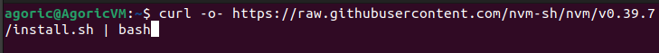

Next, run the command:
`source ~/.bashrc`

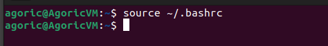

Finally, install NVM with the command:
`nvm install v18.16.0`

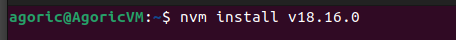


# Installing Yarn
Run the `corepack enable` command.
`corepack enable`

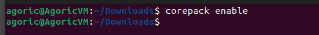

Now run the `yarn –version` command
`yarn –version`

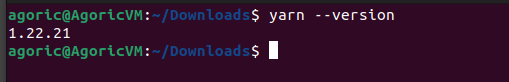


# Installing Docker
Now you'll install Docker using the two commands below. This first command will add the Docker GPG keys to your system, then add the repository to Apt for installation.
```
# Install Docker
# Add Docker's official GPG key:
sudo apt-get update
sudo apt-get install ca-certificates curl gnupg
sudo install -m 0755 -d /etc/apt/keyrings
curl -fsSL https://download.docker.com/linux/ubuntu/gpg | sudo gpg --dearmor -o /etc/apt/keyrings/docker.gpg
sudo chmod a+r /etc/apt/keyrings/docker.gpg

# Add the repository to Apt sources:
echo \
  "deb [arch=$(dpkg --print-architecture) signed-by=/etc/apt/keyrings/docker.gpg] https://download.docker.com/linux/ubuntu \
  $(. /etc/os-release && echo "$VERSION_CODENAME") stable" | \
  sudo tee /etc/apt/sources.list.d/docker.list > /dev/null
sudo apt-get update
```
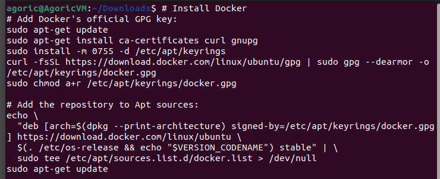

Now you can install Docker!
`sudo apt-get install docker-ce docker-ce-cli containerd.io docker-buildx-plugin docker-compose-plugin`


Now that Docker has been installed you'll need to add your user account to the Docker group.
`sudo usermod -aG docker $USER`


Now go ahead and reboot your image.

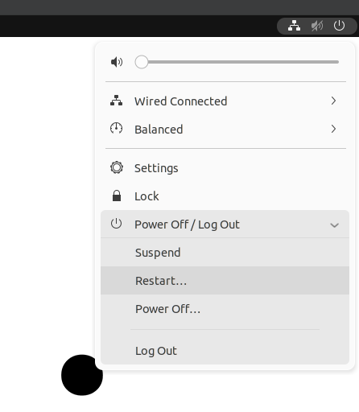

Once your image has rebooted and you've logged back on, test that Docker works by running the `hello-world` sample.
`docker run hello-world`

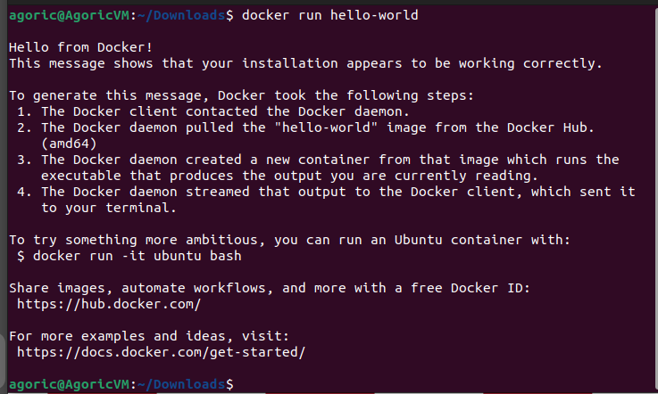


# Installing the Sample Dapp
Now you'll use yarn to pull down the sample dapp. The sample dapp will be placed in a subfolder named `demo`.
`yarn create @agoric/dapp --dapp-base https://github.com/agoric-labs/ --dapp-template dapp-game-places demo`

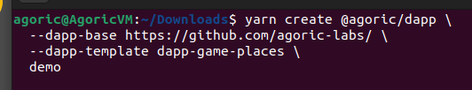


# Install Dapp Dependencies
Now navigate to the `demo` directory and run the `yarn install` command to install any solution dependencies.
`cd demo`
`yarn install`


# Starting the Network
Now go ahead and start the network using the `yarn start` command.
`yarn start:docker`

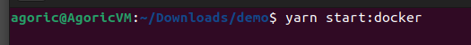

Once the network has started you can check the logs. Once you see messages showing blocks with a status of `commit` you can rest assured the network is running properly.
`yarn docker:logs`

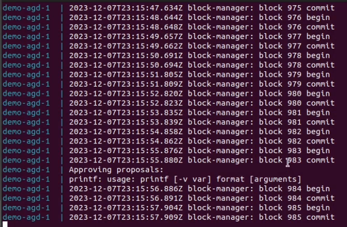


# Starting the Dapp Smart Contract
Exit the log window and start the smart contract by running the `yarn start` command.
`yarn start:contract`

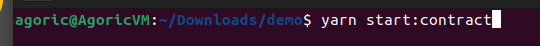


# Installing Keplr Wallet
Next, you'll install the Keplr wallet plug-in. Open up your browser and navigate to [https://www.keplr.app/download](https://www.keplr.app/download). Select the version appropriate to your browser. 


Once the plug-in has been installed, open Keplr and select the option to "Import an existing wallet". Then choose the option to "Use recovery phrase or private key".


To import your wallet, you'll need to copy your mnemonic phrase into Keplr. You can find this series of 24 words back on your terminal window. Copy from this window into your Keplr wallet, then hit the "Import" button. Note that your phrase will NOT be the same as the one shown in this guide, all phrases are unique!

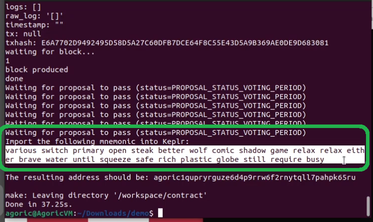


Give your new wallet a name and a password.


Ensure the "Cosmos Hub" chain is selected, then click "Save".


Starting the Dapp
To start the UI for the sample dapp, run the `yarn start:ui` command. Note the localhost link that appears on your terminal window. Open this link in your browser.


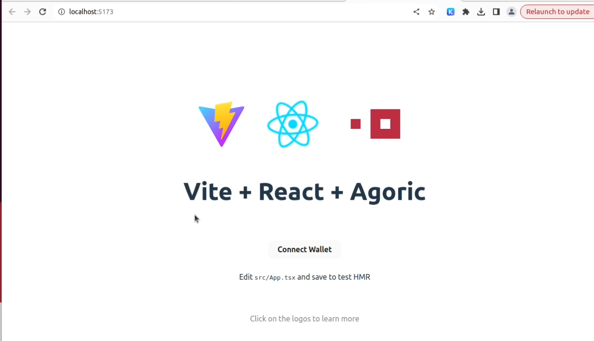

From the browser UI, click the "Connect Wallet" button to connect your Keplr wallet. You will be asked to approve this connection.

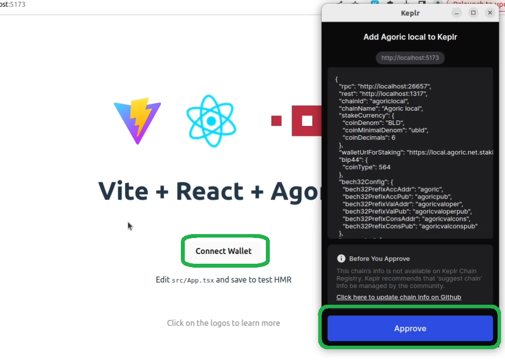

Once your wallet is connected, click on the "Make Offer" button to purchase 3 properties. Approve the transaction in your Keplr wallet.

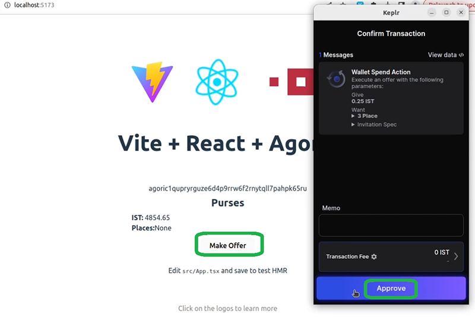

When the transaction is complete you will notice some IST has been debited from your wallet, and you are the owner of three new properties.

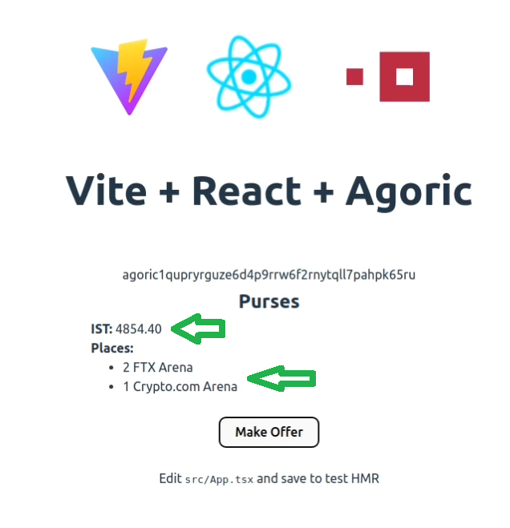

Congratulations! You've just completed your first Agoric dapp!
