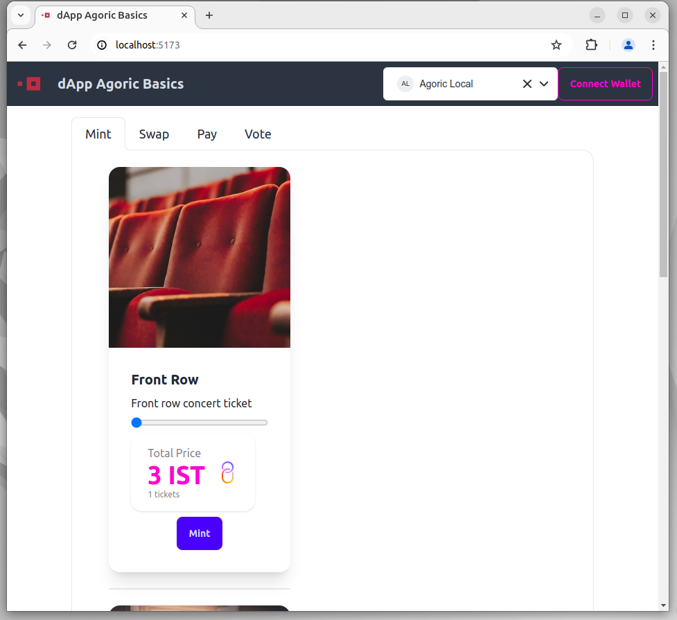
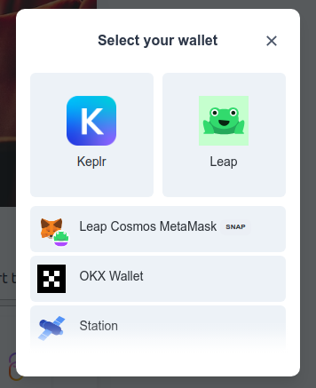
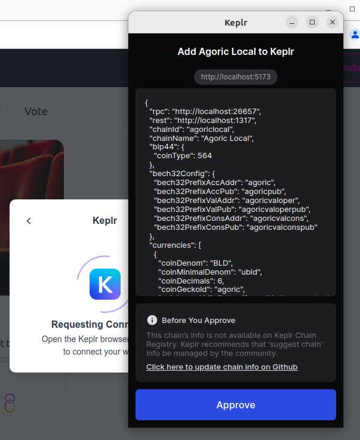
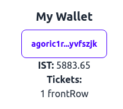

# The `dapp-agoric-basics` Tutorial

## Introduction
In this tutorial you will install the `dapp-agoric-basics` dapp. This dapp allows a user to purchase concert tickets for an event. This event has three types of tickets:
- Tickets near the front are the most expensive
- Tickets in the middle are priced between expensive and cheap tickets
- Tickets in the back are the cheapest priced tickets

To begin, you will need an environment with the pre-requisite components installed as outlined in the [Getting Started](index.md) guide. If you have already completed the Getting Started tutorial you can use the same environment.

## Downloading the dapp
Pull down the dapp from Github:
```bash
yarn create @agoric/dapp --dapp-template dapp-agoric-basics agoric-basics --dapp-branch 977-mint-tickets-ui
```

## Installing dapp components

Next, run the `yarn install` command from the `agoric-basics` directory:
```bash
cd agoric-basics
yarn install
```

## Starting the Docker Container

Start the Docker container:
```bash
yarn start:docker
```

After a few minutes, check to make sure blocks are being produced by viewing the Docker logs:
```bash
yarn docker:logs
```

## Starting the dapp

Start the `dapp-agoric-basics` contract:
```bash
yarn start:contract
```

Start the user interface:
```bash
yarn start:ui
```

Next, open a browser and navigate to `localhost:5173`:

  
From the UI, select the 'Connect Wallet' option. Choose 'Keplr' from the 'Select your wallet' screen:
dapp-agoric-basics-002


Approve the connection in Keplr:
dapp-agoric-basics-003


Select a ticket to purchase and click the 'Mint` button to mint a ticket. Approve the transaction in Keplr:


Once the transaction has completed, you will notice the tickets in your wallet:



