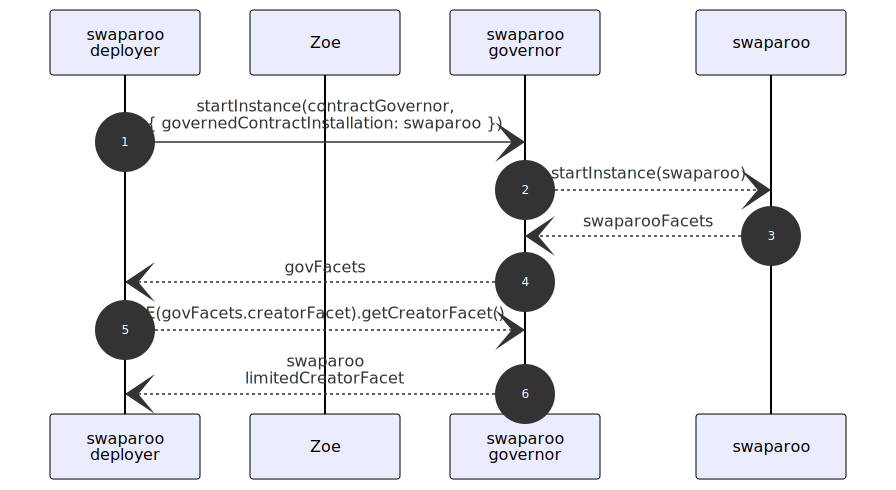
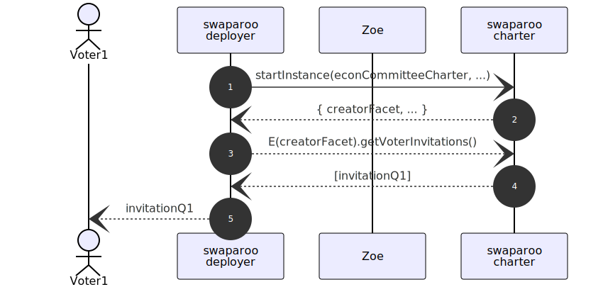
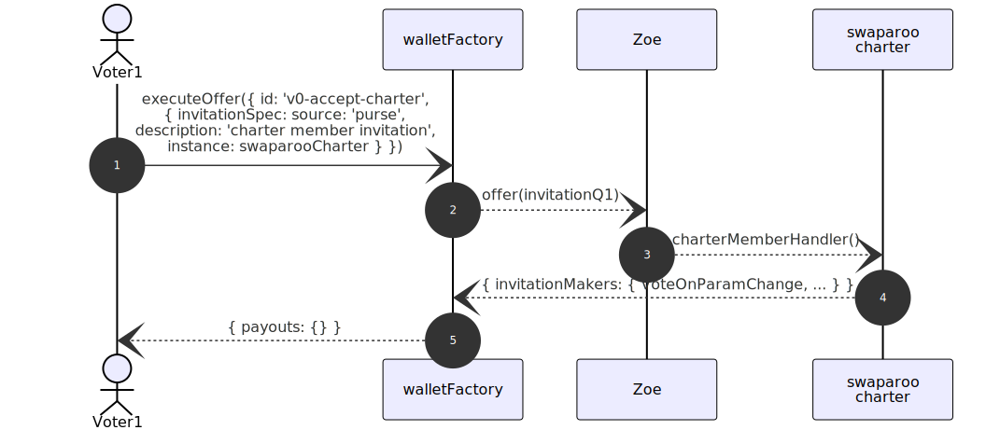
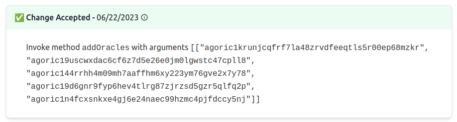

# Contract Governance

To help build systems with a good balance of decentralization and executive control, the Agoric platform includes, in addition to chain-wide governance included in the Cosmos SDK platform, an [@agoric/governance](https://github.com/Agoric/agoric-sdk/blob/master/packages/governance/#readme) package with a flexible architecture supporting 3 main forms of control over a contract:

- **Parameter Governance**: control of parameter values
- **API governance**: capability to invoke particular methods called out by the contract's authors
- **Offer filters**: capability to disable the use of some offers/invitations to deal with emergencies

::: tip Governance Package Aims

The emphasis, throughout the design of the governance package, is on ensuring that clients of a contract have visibility into who can make changes, what changes they can make, and what the current state of the controlled values is.

An [Attacker's Guide](https://github.com/Agoric/agoric-sdk/blob/master/packages/governance/docs/AttackGuide.md) explains the assurances that the governance package aims to support.

:::

## Parameter Governance

In [Starting a Contract Instance](../zoe/#starting-a-contract-instance), we saw that contracts are parameterized by _terms_. Parameter governance supports
having an authorized party, the _Electorate_, change such parameters while the contract is running.

In [dapp-agoric-basics](https://github.com/Agoric/dapp-agoric-basics), the
swaparoo contract has a governed `Fee` amount parameter:

```js
const paramTypes = harden(
  /** @type {const} */ ({
    Fee: ParamTypes.AMOUNT
  })
)
```

## Reusing Contracts for Electorate, Election Manager

This dapp uses the `committee.js` contract from `@agoric/governance` for its
electorate. The core eval deployment script starts the swaparoo committee,
gets invitations, and sends them to the the smart wallets of the voters.
In `test-vote-by-committee.js`, the committee consists of just 1 voter.


## Adding Parameter Governance to a Contract

Adding parameter governance to a contract consists mainly of using `handleParamGovernance(...)`.
We pass it `zcf` so that it can `getTerms()` for initial parameter values, and we
pass `paramTypes` to specify governed parameters and their types. `initialPoserInvitation`
is necessary to set up replacing the electorate. `storageNode` and `marshaller` are used
to [publish values of the parameters to vstorage](../zoe/pub-to-storage).

```js
import { handleParamGovernance } from '@agoric/governance/src/contractHelper.js';

export const start = async (zcf, privateArgs, baggage) => {
...
  const { publicMixin, makeDurableGovernorFacet, params } =
    await handleParamGovernance(
      zcf,
      privateArgs.initialPoserInvitation,
      paramTypes,
      privateArgs.storageNode,
      privateArgs.marshaller,
    );
...
}
```

We get back

- `params`: read-only parameter access. `params.getFee().value` gives us the current value of the `Fee` parameter at any time, for example.
- `publicMixin`: to make the parameter values available via the contract `publicFacet`
- `makeDurableGovernorFacet`: to combine the contract's existing creator facet methods (known as the `limitedCreatorFacet`) with methods for _changing parameter values_.

```js
export const start = async (zcf, privateArgs, baggage) => {
...
  const publicFacet = Far('Public', {
    makeFirstInvitation,
    ...publicMixin,
  });
  const limitedCreatorFacet = Far('Creator', {
    makeCollectFeesInvitation() {
      return makeCollectFeesInvitation(zcf, feeSeat, feeBrand, 'Fee');
    },
  });
  const { governorFacet } = makeDurableGovernorFacet(
    baggage,
    limitedCreatorFacet,
  );
  return harden({ publicFacet, creatorFacet: governorFacet });
}
```

## Starting a Governed Contract via its Governor

Changing parameter values is something only the electorate is authorized to do.
To enforce this, a governed contract is started by a _contract governor_.
The contract governor holds the fully-functional creator facet that includes
the capability to change the parameters. The caller that starts the governor
gets only the `limitedCreatorFacet`.



_For clarity, some Zoe API details are ommitted from this figure._

## Putting a question via an Election Manager

An _ElectionManager_ is responsible for letting an appropriate party call `addQuestion()`. The `econCommitteeCharter.js` contract from `@agoric/inter-protocol` is sufficiently general to handle most forms of parameter
governance, so we reuse it here. Swaparoo core eval deployment likewise
starts this contract, asks it for invitations, and sends them to the voters:



_For clarity, some Zoe API details are ommitted from this figure._

The committee participant then instructs their smart wallet to
redeem the charter invitation to get a capability to put a question using `VoteOnParamChange`,
using `v0-accept-charter` to identify this offer:

```js
test.serial('Voter0 accepts charter, committee invitations', async t => {
...
  await victor.acceptCharterInvitation('v0-accept-charter');
...
});
```



To exercises their `VoteOnParamChange` capability,
the committee participant makes a [continuing invitation](/glossary/#continuing-invitation-pattern),
referring back to `v0-accept-charter` as `charterAcceptOfferId`:

```js
const makeVoter = (t, wallet, wellKnown) => {
...
    const putQuestion = async (offerId, params, deadline) => {
    const instance = await wellKnown.instance[contractName]; // swaparoo instance handle
    const path = { paramPath: { key: 'governedParams' } };

    /** @type {import('@agoric/inter-protocol/src/econCommitteeCharter.js').ParamChangesOfferArgs} */
    const offerArgs = harden({ deadline, params, instance, path });

    /** @type {import('@agoric/smart-wallet/src/offers.js').OfferSpec} */
    const offer = {
        id: offerId,
        invitationSpec: {
          source: 'continuing',
          previousOffer: NonNullish(charterAcceptOfferId),
          invitationMakerName: 'VoteOnParamChange',
        },
        offerArgs,
        proposal: {},
    };
    return doOffer(offer);
    };
};
```

The `offerArgs` include a deadline and details of the params to change:

```js
test.serial('vote to change swap fee', async t => {
...
  const targetFee = IST(50n, 100n); // 50 / 100 = 0.5 IST
  const changes = { Fee: targetFee };
...
  const deadline = BigInt(new Date(2024, 6, 1, 9, 10).valueOf() / 1000);
  const result = await victor.putQuestion('proposeToSetFee', changes, deadline);
  t.log('question is posed', result);
...
});
```

## Voting on a question

The voter likewise executes an offer to accept their invitation to participate in the committee,
using `v0-join-committee` to identify this offer:

```js
test.serial('Voter0 accepts charter, committee invitations', async t => {
...
  await victor.acceptCommitteeInvitation('v0-join-committee', 0);
...
});
```

To exercise their capability to vote, they make a continuing invitation
referring back to `v0-join-committee` as `committeeOfferId`:

```js
const makeVoter = (t, wallet, wellKnown) => {
...
  const vote = async (offerId, details, position) => {
    const chosenPositions = [details.positions[position]];

    /** @type {import('./wallet-tools.js').OfferSpec} */
    const offer = {
      id: offerId,
      invitationSpec: {
        source: 'continuing',
        previousOffer: NonNullish(committeeOfferId),
        invitationMakerName: 'makeVoteInvitation',
        invitationArgs: harden([chosenPositions, details.questionHandle]),
      },
      proposal: {},
    };
    return doOffer(offer);
  };
...
};
```

Each question has a unique `questionHandle` object, part of the `details`
published to vstorage.

```js
test.serial('vote to change swap fee', async t => {
...
  const details = await vstorage.get(`published.committee.swaparoo.latestQuestion`);
  t.is(details.electionType, 'param_change');
  const voteResult = await victor.vote('voteToSetFee', details, 0);
  t.log('victor voted:', voteResult);
...
});
```

Once the deadline is reached, the contract governor is notified that the question
carried. It instructs the swaparoo contract to change the fee.

```js
test.serial('vote to change swap fee', async t => {
...
  const swapPub = E(zoe).getPublicFacet(
    swapPowers.instance.consume[contractName],
  );
...
  const after = await E(swapPub).getAmount('Fee');
  t.deepEqual(after, targetFee);
});
```

The swaparoo contract also publishes its updated parameters to vstorage.

## API Governance

Just as parameter governance lets an electorate change parameters of a
governed contract, API governance lets the electorate exercise contract APIs;
in particular: creator facet methods on a governed contract.

For example, in Inter Protocol, the Economic Committee can add and remove
oracle operators:



For details, see:

- [dapp-econ-gov](https://github.com/Agoric/dapp-econ-gov)
- `vaultFactory` contract in `@agoric/inter-protocol`

## Offer Filters

An electorate can instruct a contract to have Zoe filter the offers that
will be passed to the ocntract. See

- [zcf.setOfferFilter(strings)](/reference/zoe-api/zoe-contract-facet#zcf-setofferfilter-strings).
- [How to add a contract level pause feature? · agoric-sdk · Discussion #8172](https://github.com/Agoric/agoric-sdk/discussions/8172)
