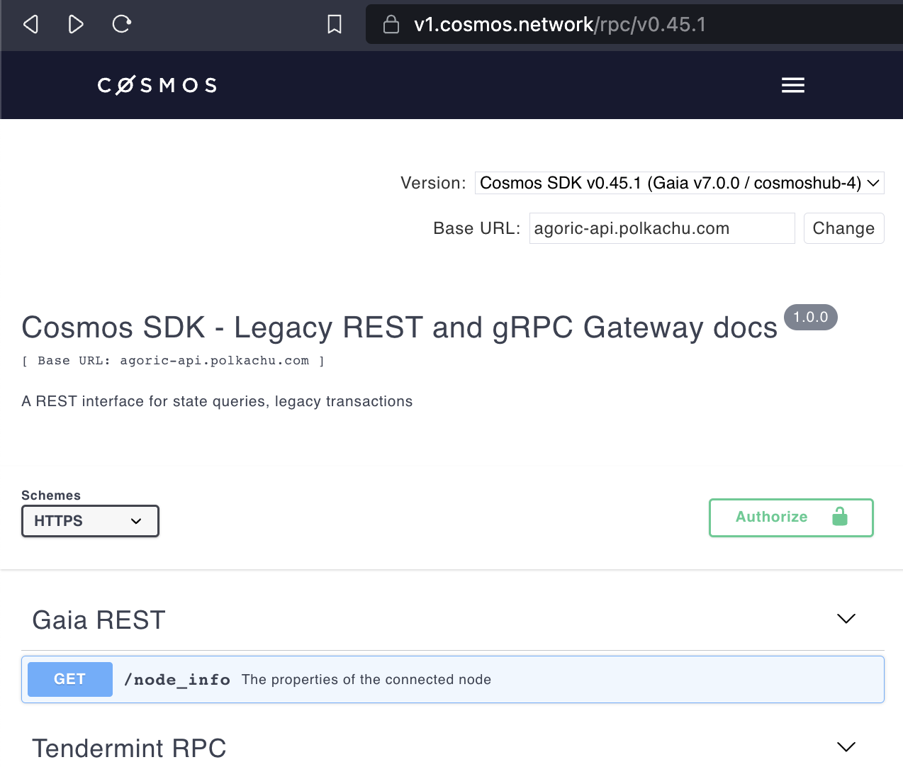

# Integrating with Agoric Network

The Agoric network builds a blockchain for smart contracts in JavaScript using the `cosmos-sdk`. Cosmos-sdk is software that provides the widely-used Tendermint/CometBFT consensus and best-in-class support for chain operations like staking and governance. For simplicity of chain integration, the Agoric Network works identically to the Cosmos Hub, except using different parameters (e.g., `ubld` instead of `uatom`).

## TL;DR for Cosmos-experienced

This section points at relevant reference documentation for the underlying `cosmos-sdk` and CometBFT/Tendermint consensus engine, and summarizes the differences.

The Agoric Network currently uses `cosmos-sdk` v0.45. The general Cosmos documentation for this version can be [found here](https://docs.cosmos.network/v0.45/), including structure and`golang` documentation, and REST API documentation.

Use the [v0.45.1 version of the REST API](https://v1.cosmos.network/rpc/v0.45.1) for accessing the chain. To use the "Try it out" functionality, change the Base URL to `agoric-api.polkachu.com`:

|  |
| --------------------------------------------- |

The chain can also be accessed via JavaScript using the [`cosmjs` library](https://github.com/cosmos/cosmjs) (and [associated tutorials](https://tutorials.cosmos.network/tutorials/7-cosmjs/1-cosmjs-intro.html)), or using [CosmosKit](https://cosmoskit.com/).

## Chain resources

- The base network entry points for the Agoric chain are specified in the [network config](https://main.agoric.net/network-config).
- Additional chain information, including tokens and their logos, gas fee information for wallets, additional entry points, and explorers is maintained in the Cosmos [Chain Registry](https://github.com/cosmos/chain-registry/tree/master/agoric).
- The source code for the Agoric Network runtime and contracts is in [the Agoric open source repository](https://github.com/Agoric/agoric-sdk) on GitHub.
- The base unit for staking is `ubld` (corresponding to `uatom` for Cosmos Hub)
- The command utility of the agoric chain is `agd` (corresponding to [`simd` for the Cosmos Hub](https://docs.cosmos.network/v0.45/run-node/interact-node.html)).

---

# Tools

## Building `agd`

The `agd` command line tool can be built as described in the Agoric [getting-started documentation](https://docs.agoric.com/guides/getting-started#build-the-cosmic-swingset-package). The linked step builds `agd`. To confirm that `agd` is in your `$PATH`, execute

```
agd version --long
```

# FAQ

- How are transactions encoded?
  [Cosmos SDK v0.45 Docs - Encoding](https://docs.cosmos.network/v0.45/core/encoding.html)
- What data is needed to create a transaction (last block hash, nonce, sender public key, etc.)?
  [Cosmos SDK v0.45 Docs - Transaction Generation](https://docs.cosmos.network/v0.45/core/transactions.html#transaction-generation)
- What data is signed and how is that data obtained (for example truncated SHA256 of transaction data)?
  [Cosmos SDK v0.45 Docs - Transaction Generation](https://docs.cosmos.network/v0.45/core/transactions.html#transaction-generation)
- Do transactions expire?
  Transaction do not expire unless you specify --timeout-height: [Cosmos SDK v0.45 Docs - Transaction Generation](https://docs.cosmos.network/v0.45/core/transactions.html#transaction-generation)
  However they do have a sequence number and may be invalidated if another transaction with the same sequence number is processed by the chain
- How are addresses generated?
  [Cosmos SDK v0.45 Docs - Accounts](https://docs.cosmos.network/v0.45/basics/accounts.html)
- How is the blockchain queried?
  JSON-RPC, gRPC, REST [Cosmos SDK v0.45 Docs - Interact with Node](https://docs.cosmos.network/v0.45/run-node/interact-node.html)
