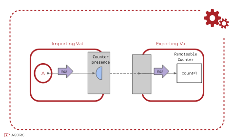

# Far(), Remotable, and Marshaling

Let's look more closely at an [eventual send](./eventual-send) between vats:



In the exporting vat, we'll take the `makeCounter` [Hardened JavaScript example](./hardened-js#example-hardened-javascript-code) and refine it to make _remotable_ counters
by marking them with [Far](#far-api):

<<< @/../snippets/test-distributed-programming.js#makeFarCounter

## Marshaling by Copy or by Presence

Recall that the first step in an [eventual send](./eventual-send#eventual-send) is
to _marshal_ the method name and arguments. [Marshalling](https://en.wikipedia.org/wiki/Marshalling_%28computer_science%29) is transforming a data structure into a format suitable for storage or transmission.
The [@endo/marshal](https://github.com/endojs/endo/tree/master/packages/marshal#readme) package uses [JSON](https://developer.mozilla.org/en-US/docs/Web/JavaScript/Reference/Global_Objects/JSON), but it can handle
Javascript values that cannot be expressed directly as JSON,
such as `undefined` and `BigInt`s.

<<< @/../snippets/test-marshal.js#marshal-json-steroids

Also, while many forms of data are copied between vats,
remotables are marshalled so that they become remote _presences_ when unmarshaled.
Another vat can then make and use the exported counters:

<<< @/../snippets/test-distributed-programming.js#useFarCounter

## Pass Styles and harden

Calls to remote presences must only contain _passable_ arguments and return _passable_ results.
A Passable is a [hardened](/glossary/#harden) value that can be marshalled.
There are four broad kinds of Passable:

- Pass-by-copy **primitive** values: `undefined`, `null`, booleans `true` and `false`, numbers,
  [BigInts](https://developer.mozilla.org/en-US/docs/Web/JavaScript/Reference/Global_Objects/BigInt),
  strings, and symbols that are either
  [well-known](https://developer.mozilla.org/en-US/docs/Web/JavaScript/Reference/Global_Objects/Symbol#well-known_symbols) or
  [registered](https://developer.mozilla.org/en-US/docs/Web/JavaScript/Reference/Global_Objects/Symbol#shared_symbols_in_the_global_symbol_registry).
- Acyclic pass-by-copy **containers** that recursively terminate in non-container passables.
  Such containers include _CopyArrays_ like `harden(['foo', 'bar'])`,
  _CopyRecords_ like `harden({ keys: [0, 1], values: ['foo', 'bar'] })`, and
  _CopyTaggeds_ representing types like CopySet, CopyBag, and CopyMap
  (which extend the `passStyleOf` level of abstraction with
  [tag-specific shapes and semantics](https://github.com/endojs/endo/blob/master/packages/patterns/docs/marshal-vs-patterns-level#kindof-vs-passstyleof))
- Pass-by-reference "**PassableCaps**":
  - _Remotables_: objects that can be shared with remote systems which can then
    invoke methods using e.g. `E()` eventual send notation. Remotables are created by [`Far()`](#far-api)
    and related functions.
  - _Promises_ for Passables.
- As a special case, **Errors** are treated as pass-by-copy data that can also contain other Passables.

Every object exported from a smart contract, such as `publicFacet` or
`creatorFacet`, must be passable. All objects used in your contract's external API must
be passable.

All Passables must be hardened. Consider what might happen if we had a remote `item` and we did not harden
some pass-by-copy data that we passed to it:

```js
let amount1 = { brand: brand1, value: 10n };
await E(item).setPrice(amount1); // Throws an error, but let's imagine it doesn't.
amount1.value = 20n;
```

Now `amount1` is supposedly both in the local and the remote vat, but the `value`
is `20n` in the local vat but `10n` in the remote vat. (Worse: the remote vat
might be the same as the local vat.) Requiring `harden()` for pass-by-copy
data leads to behavior across vats that is straightforward to reason about.

## passStyleOf API

<<< @/../snippets/test-distributed-programming.js#import-pass-style

`passStyleOf(passable)` returns a `PassStyle` string that categorizes `passable`.

- `passable` `{Passable}`
- Returns: `{PassStyle}`

`PassStyle` values correspond with the different kinds of Passable:

- Pass-by-copy **primitive** values: `"undefined"`, `"null"`, `"boolean"`, `"number"`, `"bigint"`, `"string"`, or `"symbol"`.
- Pass-by-copy **containers**: `"copyArray"`, `"copyRecord"`, or `"copyTagged"`.
- Pass-by-reference **PassableCaps**: `"remotable"` or `"promise"`.
- Pass-by-copy **Errors**: `"error"`.

If `passable` is not passable (for example, because it has not been hardened or has
a non-trivial prototype chain), then `passStyleOf` will throw an error.

::: tip Check `passStyleOf` when handling untrusted structured data
Just as you would use `typeof` to check that an argument is
a string or number, use `passStyleOf` when you expect, say, a `copyRecord`;
this prevents malicious clients from playing tricks with cyclic data etc.
:::

## Far() API

<<< @/../snippets/test-distributed-programming.js#importFar

`Far(farName, objectWithMethods)` marks an object as Remotable.

- `farName` `{ String }`
- `objectWithMethods` `{ Object }` - Optional.
- Returns: A `Remotable` object.

The `farName` parameter gives the `Remotable` an _interface name_ for debugging purposes, which only shows
up when logged through the `console`, for example with `console.log`.

The optional `objectWithMethods` parameter should be an object
whose properties are the functions serving as the object's methods.
It MUST NOT already be hardened or even frozen (though `Far()` will harden it before returning successfully).
If not provided, a new empty object will be used.

Before succeeding, the `Far()` function:

- Checks that each of the object's property values are functions and throws an error otherwise.
  - Accessors (i.e., `get()` and `set()`) are not allowed.
- Records the interface name in the object.
- Hardens the object.

::: tip Avoid accidental exports
If an object should never be exposed to other vats, you should make it
a point **not** to use `Far()` on it. If an object is not marked as a Remotable but is accidentally
exposed, an error is thrown. This prevents any vulnerability from such accidental exposure.
:::
