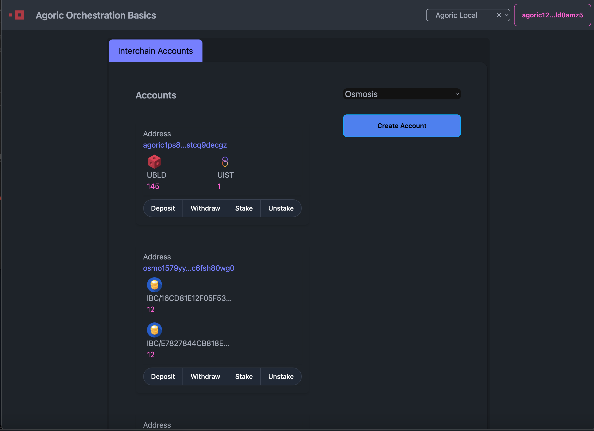

# Orchestration Basics Dapp Template
To get started with developing using the Orchestration API, developers can make use of our [dapp-orchestration-basics](https://github.com/Agoric/dapp-orchestration-basics) template.

Following the dApp pattern of our existing dapp templates, `dapp-orchestration-basics` contains both ui & contract folders within a single yarn workspace. 

This dapp template can be used to become familiar with using the API, build on top of it, and obtain hands-on experience with how the API works.

## Project Structure
Here is the directory structure for `ui/` and `contract`:

```console
tree dapp-orchestration-basics
├── ui
├── contract
```

## User Interface Preview
