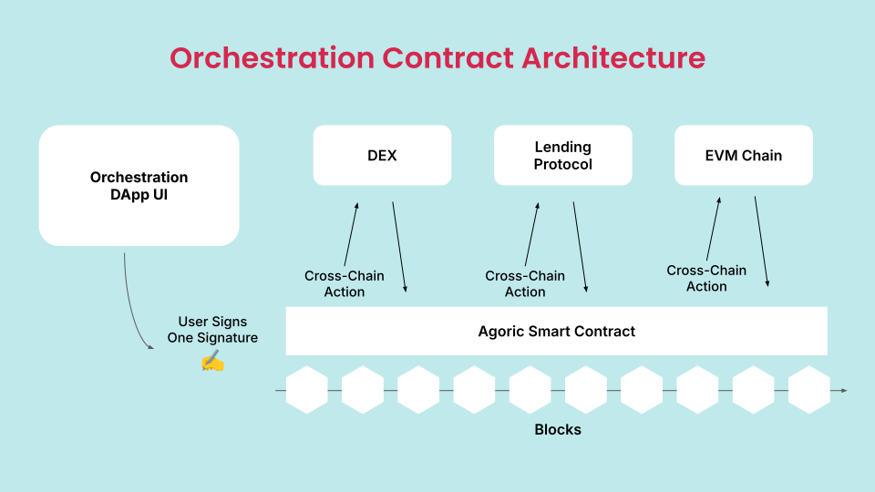

# How Orchestration Works

Orchestration relies on protocols and mechanisms that allow blockchains to
communicate and transact with each other securely and efficiently. The primary
objectives of Orchestration are:

- **Interoperability:** Enabling different blockchain networks to interact and
  transact with one another.
- **Scalability:** Facilitating the collaboration of multiple blockchains
  without compromising performance.
- **Security:** Ensuring that cross-chain transactions are secure and
  trustworthy.

To achieve these goals, several foundational technologies and protocols have
been developed, with the [Inter-Blockchain Communication (IBC) protocol](https://ibcprotocol.org/) being
one of the most prominent.

<br/>

<br/>

### Inter-Blockchain Communication (IBC)

The [Inter-Blockchain Communication (IBC) protocol](https://ibcprotocol.org/)
is often compared to the TCP/IP protocol of the internet. Just as TCP/IP enables
different computer networks to communicate across the internet, IBC allows
blockchains to communicate securely with each other.

#### How IBC Works

IBC operates on a straightforward premise: by adhering to a common set
of communication protocols, blockchains can securely transfer data and
tokens between one another. Here's a high-level overview of how IBC
achieves this:

- **Light Client Verification:** Each blockchain maintains a
  [light client](https://github.com/cosmos/ibc-go/blob/34628eb0c1ca0ca9721c6e3923cf048e1172b8b0/docs/docs/03-light-clients/01-developer-guide/01-overview.md)
  of the other blockchain. A light client is a simplified version of a
  blockchain client that only retains enough information to verify
  transactions and proofs, without needing to store the entire blockchain
  history.
- **Relayer:** A [relayer](https://github.com/cosmos/relayer) is an
  off-chain process that listens for transactions on one blockchain and
  relays them to another. The relayer facilitates communication between
  blockchains but does not have any special permissions or abilities—it
  merely passes messages between chains.
- **IBC Handshake:** Before two blockchains can communicate, they perform
  a handshake, establishing a trusted channel between them. This involves
  verifying each other's consensus state using light clients.
- **Packet Transfer:** Once the connection is established, IBC allows
  the transfer of data packets. These packets can represent tokens, smart
  contract commands, or other data. The receiving blockchain uses light
  client verification to ensure the data is valid and hasn’t been tampered
  with.
- **Finality and Acknowledgement:** After a packet is successfully
  processed by the receiving blockchain, an acknowledgment is sent back
  to the originating blockchain, confirming the transaction's completion.

The modularity of the IBC protocol allows it to be adapted for various
use cases and blockchain types, making it a versatile tool for blockchain
orchestration.

### Interchain Accounts (ICA)

[Interchain Accounts (ICA)](https://github.com/cosmos/ibc/blob/main/spec/app/ics-027-interchain-accounts/README.md)
is a feature built on top of IBC that allows one blockchain (the
controller chain) to control an account on another blockchain (the
host chain). This enables seamless cross-chain operations and automation,
allowing for complex interactions between blockchains.

#### How ICA Works

The ICA protocol enables a controller chain to request the creation of an
account on a host chain. The host chain creates the account and delegates
control of it to the controller chain.

- **Account Creation:** The controller chain (e.g., Agoric) requests an
  account on the host chain (e.g., Osmosis) using the IBC protocol. The
  host chain then creates the account and delegates control to the
  controller chain.
- **Reification in Agoric:** When the controller chain is Agoric, control
  of the account and Chain objects within its Orchestration
  API are reified as JavaScript objects. For example,
  ```
  const chain = orch.getChain('osmosis')
  ```
  creates an object that represents the host chain Osmosis. A call to
  `chain.makeAccount()` results in the Agoric chain acting as the controller
  and requesting the creation of an Interchain Account (ICA) on the Osmosis
  chain. This operation produces an `OrchestrationAccount` object, which
  provides access to control the ICA.
- **Access Control:** Whoever has access to the JavaScript object can
  control the account. In Agoric's architecture, access to this object is
  only passed to authorized parties. In particular, the party that called
  `chain.makeAccount()` gets access to it, ensuring secure access
  delegation.
- **Transaction Execution:** The controller chain (e.g., Agoric) can now
  send IBC messages to execute transactions on the host chain (e.g., Osmosis)
  as if it were a local user. This includes transferring tokens, interacting
  with smart contracts, and performing other blockchain operations.
- **Automation:** Using ICA, the controller chain can automate operations
  on the host chain. For instance, Agoric can programmatically manage assets
  on another chain, automating workflows that span multiple blockchains.

### Interchain Queries (ICQ)

Interchain Queries (ICQ) is another powerful feature that enables a contract on
one blockchain to query the state of an account another blockchain in a
trustless manner. For example, a DeFi application on Agoric could use ICQ to
fetch the balance of an account from other chains like Osmosis or Cosmos Hub
without the need for autorization, enabling more sophisticated cross-chain
trading interactions. ICQ enhances the interoperability of
blockchain networks by facilitating secure and efficient data sharing between
chains, opening up new possibilities for cross-chain applications and services.
Below is an example of an ICQ invocation to get balance of a remote account on
`osmosis`:

```js
const remoteChainBalance = await remoteAccount.getBalance('uosmo');
```

While ICA is a cross-chain write, ICQ is a cross-chain read.

### Why Agoric's Approach Stands Out

Agoric's unique programming model, which is already distributed and
asynchronous, makes it particularly well-suited for Interchain Accounts and
Interchain Queries. When contracts on Agoric interact, the system is designed
to handle cases where the other contract may reside on a remote machine or
another blockchain. This inherent architecture allows Agoric to seamlessly
control and manage Interchain Accounts, further enhancing the Orchestration
capabilities.

By leveraging ICA and ICQ, Orchestration becomes more flexible and
powerful, enabling direct, programmable interactions between blockchains. This
unlocks a wide range of possibilities, from decentralized finance (DeFi) to
supply chain management and beyond.
