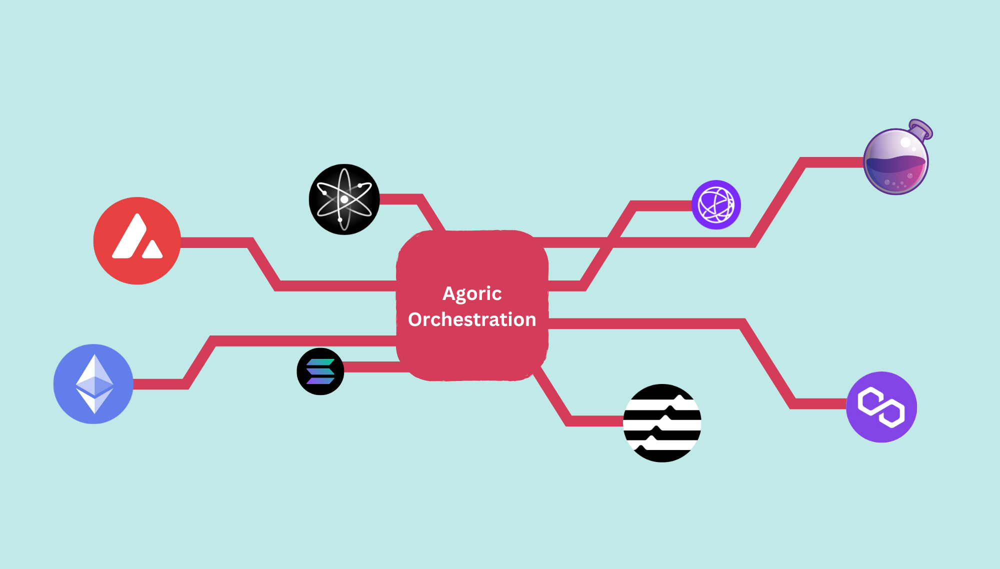

# What is Agoric Orchestration?

Agoric's Orchestration capability allows developers to easily build cross-chain
interactions into existing applications or to create novel cross-chain-focused
products.

<br/>

<br/>

**From a user's perspective**, your contract or dapp can coordinate actions across
multiple chains without burdening the user to jump through multiple UIs or signing
steps. The Orchestration API _handles the complexity behind the scenes_. This
empowers smart contracts to, for example,

:::tip Key Orchestration Use Cases

- **Perform Inter-Chain Staking** 🌐
  Leverage delegated proof-of-stake opportunities on remote Cosmos chains.

- **Automate Multi-Hop Transfers** 🚀
  Bridge tokens from Ethereum to Stride, then stake them or perform actions on
  Osmosis.

- **Support Scheduled Operations** ⏰
  Enable recurring and delayed tasks like rent collection and subscription services
  through the on-chain Timer Service.
  :::

The Orchestration API sits on top of Agoric's novel VM that provides three key
elements that make multichain applications possible:

- **Remote account control and transfer**: Use the Orchestration APIs to easily
  create accounts on remote chains, transfer assets, and invoke contracts. Your
  Agoric contract orchestrates all behavior directly.
- **Multiblock execution with `async` and `await`**: Agoric applications
  communicate asynchronously and await responses which may come in the same block
  or many blocks (or weeks!) later. Contracts simply continue executing when the
  response arrives.
- **On-chain Timers**: Contracts can set timers for regular or scheduled
  execution, making recurring activities such as subscriptions straightforward to
  implement.

Agoric's Orchestration APIs simplify controlling accounts on remote chains, moving
assets, and using capabilities on any chain the API reaches.

## Orchestration API Flow

Orchestration allows us to seamlessly create accounts on remote chains by accessing
their chain objects. We can then use these chain objects to create accounts, get
addresses, and transfer assets between chains. Let's walk through two common
scenarios using the Orchestration API:

### 1. Creating Remote Accounts

The following example shows how to create and interact with an account on the
Stride chain:

```js
// Get Chain objects
const stride = await orch.getChain('stride');

// Create account
const strideAccount = await stride.makeAccount();

// Get address
const strideAddr = strideAccount.getAddress();
```

### 2. Cross-Chain Asset Transfers and Staking

This example demonstrates a complete flow of transferring and staking assets across
multiple chains:

```js
// Transfer funds from Osmosis to Agoric
const osmoToAgoricTransfer = await osmoAccount.transfer(agoricAddr, amount);

// Forward funds from Agoric to Stride
const agoricToStrideTransfer = await agoricAccount.transfer(strideAddr, amount);

// Create liquid stake message for Stride
const liquidStakeMsg = Any.toJSON(
  MsgLiquidStake.toProtoMsg({
    creator: strideAccount.value,
    amount: amount.toString(),
    denom: 'uosmo'
  })
);

// Execute staking transaction on Stride
await strideAccount.executeEncodedTx([liquidStakeMsg]);

// Transfer staked tokens back to user's Osmosis address
const finalTransfer = await strideAccount.transfer(userOsmoAddress, amount);
```

These examples demonstrate how Orchestration enables seamless cross-chain
operations while abstracting away the underlying complexity. Developers can focus
on building their applications' logic while the Orchestration API handles the
intricate details of cross-chain communication.
