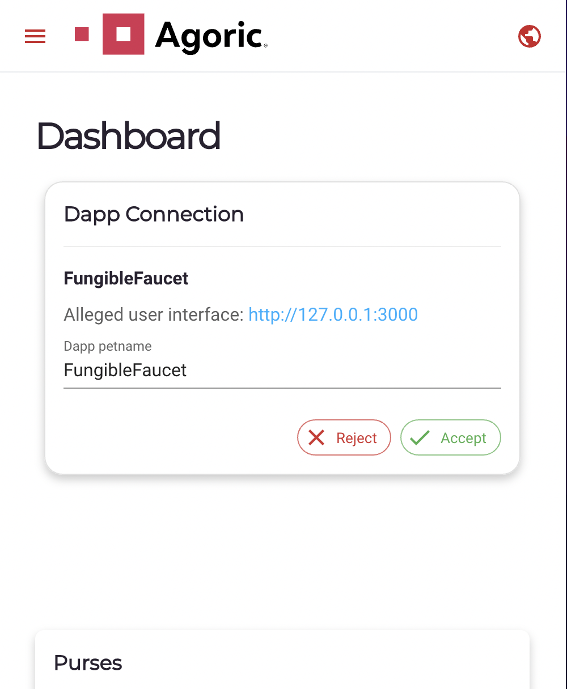
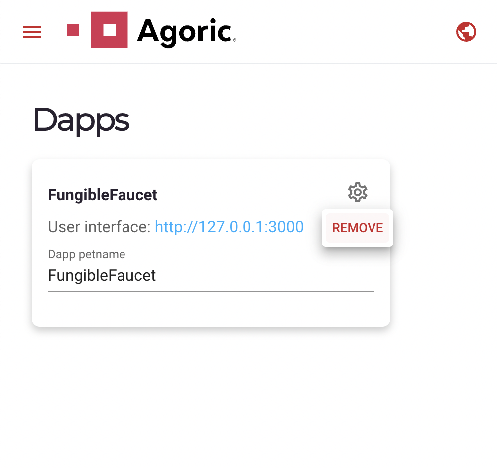
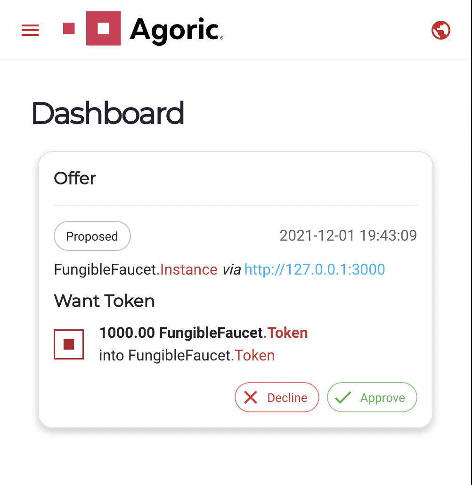
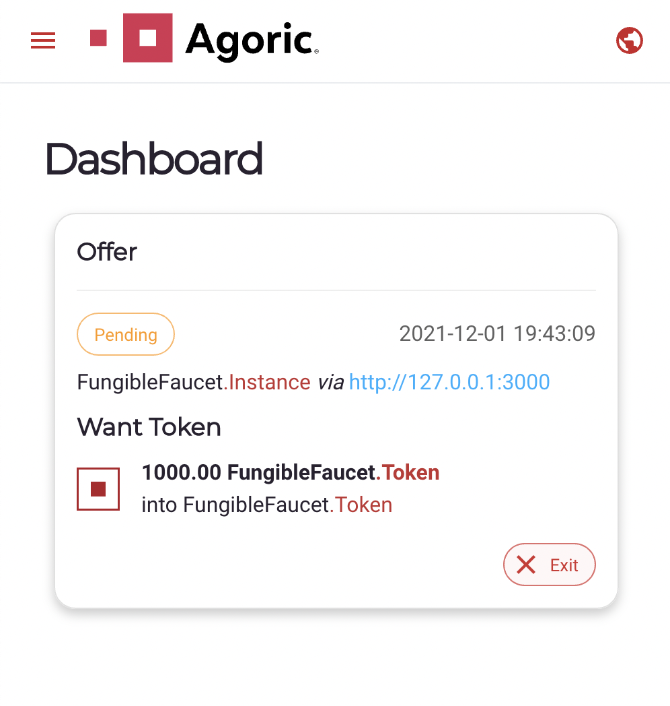
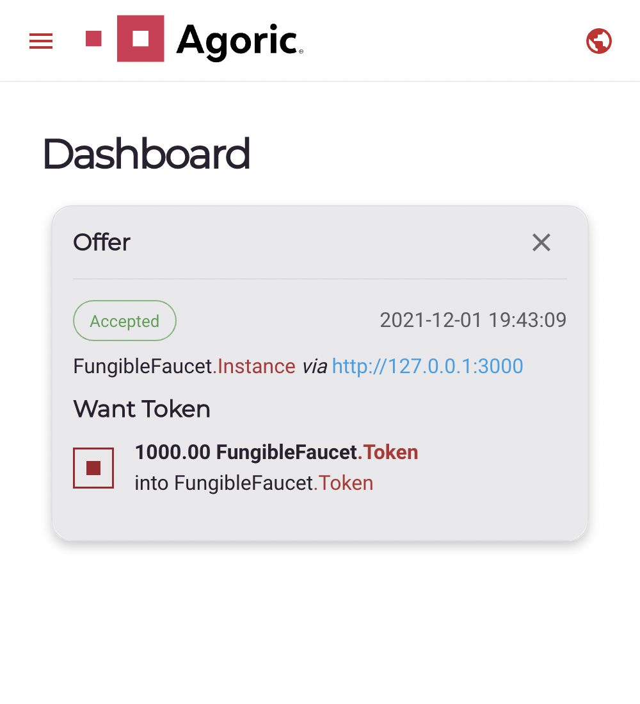
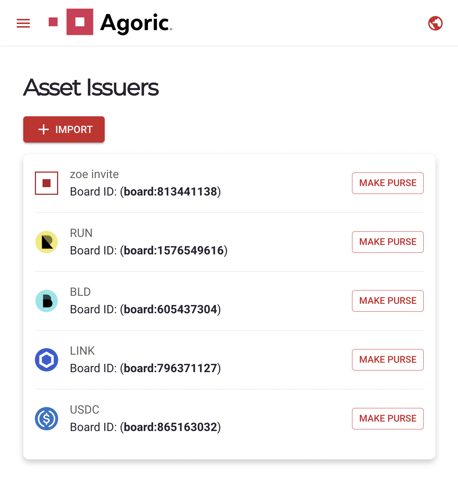
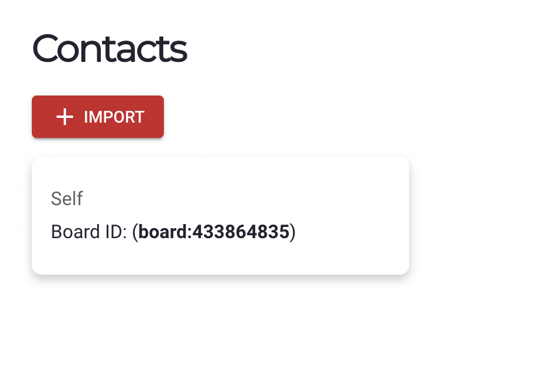
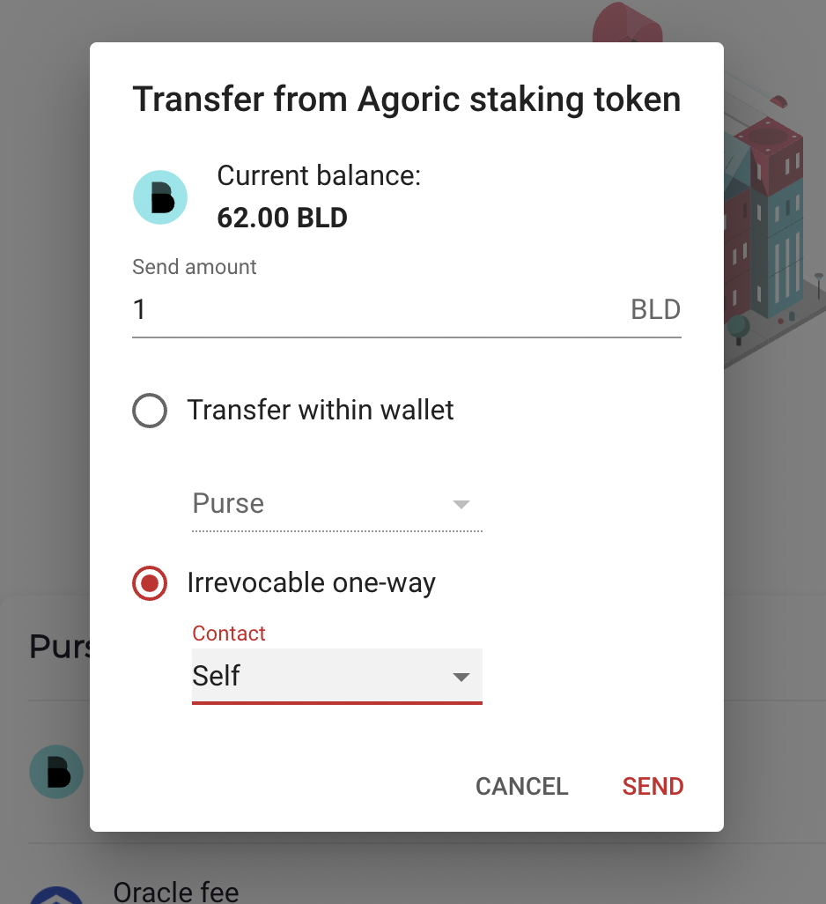

# Wallet UI

From a shell window, run `agoric open` to open the Wallet UI in a browser tab.

The wallet facilitates several core user interactions within the Agoric ecosystem, described in the below sections.

## Dapps

To interact with a dapp, it first must be connected in the wallet. The dapp will attempt to connect to the wallet instance registered at https://local.agoric.com/.

Before the dapp is able to make offers, the connection must be accepted from the wallet. Incoming dapp connections can be managed from the Dashboard view:

Once accepted, they can be viewed and managed from the Dapps view:

The petname is a string used to personally identify the dapp and should be unique. It can be modified as desired with the text field. It can be thought of like a contact name in a cellphone.

Dapps can be removed so that they are no longer able to propose offers.

## Offers

After connecting to a dapp, it is able to propose offers in the user's wallet. Offers are a unique concept to Agoric's Zoe framework. Users are guaranteed to receive that they are asking for in an offer, or get a full refund (a property called "[Offer Safety](/guides/zoe/README.md#offer-safety)").

When an offer is proposed (usually from some interaction in a dapp), it will appear in the dashboard view:

If the offer is approved, it will show as pending:

Depending on the terms of the smart contract being interacted with, some offers may be "exited" before completion. Exiting an offer does not revert any asset transfers that have already taken place, but may prevent the contract from executing any future planned transfers (e.g. a user may "exit" to withdraw a bid from an auction before the deadline).

Completed offers will either show up in an accepted or rejected state, and can be dismissed by the user.

## Transfers

The wallet can be used to transfer funds to and from other wallets, as well as between purses within the same wallet.

Every type of asset can be identified by a unique "Brand", and there exists one global Issuer for each Brand. If a user wants to send or receive a tokens of a particular Brand, its Issuer must be imported from the "Asset Issuers" view:

Some issuers are imported by default in the wallet as shown above. The user can make as many purses as they want for each issuer. The purses are where the actual tokens are held, and can be managed from the "Dashboard" view:

Tokens can be freely sent between purses within the same wallet. To send tokens to another wallet, that wallet's Board ID must be imported in the "Contacts" view:

Then, a user can select the "Irrevocable one-way" transfer option to send their tokens to another wallet in their contacts:

