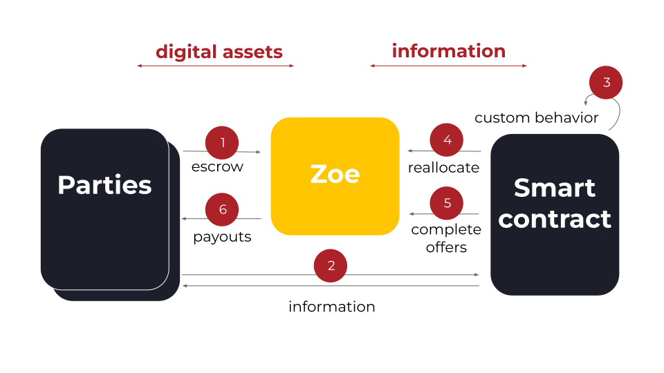

# Zoe Overview

The Zoe service and smart contract API support credibly trading assets with reduced risk.

- **Zoe is Safer for Users:** Zoe guarantees that when you make an offer, you get either
  what you said you wanted or a full refund of the assets you put in,
  even if the contract is buggy or malicious.

- **Zoe is Safer for Developers**: For a given offer, if you
  make a mistake with the amount of assets you take or give,
  Zoe guarantees that your users will either get what they say
  they wanted or get a refund.

## High Level Trading Flow

Trading with a contract using Zoe typically goes through these steps:

1. Parties call [E(zoe).offer(invitation, proposal, assets)](/reference/zoe-api/zoe#e-zoe-offer-invitation-proposal-paymentpkeywordrecord-offerargs). Zoe escrows the assets.
2. Zoe relays the proposal to the contract identified in the invitation.
3. The contract handles proposals using its custom business logic.
4. The contract instructs Zoe to [reallocate](/reference/zoe-api/zoe-contract-facet#zcf-reallocate-seats) assets among the parties.
5. The contract completes (aka [exits](/reference/zoe-api/zcfseat#azcfseat-exit-completion)) the offers.
6. Zoe pays out assets to the parties.

Note that in this flow, _assets are not sent to the contract_; only information about them. _For more on this distinction, see [The Settlers of Blockchain](https://agoric.com/blog/technology/the-settlers-of-blockchain) Jun 2021._

::: tip Watch: Offer Safety: Partitioning Risk in Smart Contracts (20 min. Sep 2019)

<iframe width="400" height="225" src="https://www.youtube.com/embed/T6h6TMuVHKQ?si=NzWre0vhlxjBxG-5&amp;controls=0" title="YouTube video player" frameborder="0" allow="accelerometer; autoplay; clipboard-write; encrypted-media; gyroscope; picture-in-picture; web-share" allowfullscreen></iframe>

:::

## Building and Using Contracts

- [Zoe Smart Contract Basics](./contract-basics.md)
- [A Complete Contract Walk-Through: offer-up](./contract-walkthru)

## Live Coding and Example Contracts

::: tip Watch: How To Build a Composable DeFi Contract (1:47 Dec 2020)

<iframe width="560" height="315" src="https://www.youtube.com/embed/e9dMkC2oFh8?si=3Luwp25R8d23elAa" title="YouTube video player" frameborder="0" allow="accelerometer; autoplay; clipboard-write; encrypted-media; gyroscope; picture-in-picture; web-share" allowfullscreen></iframe>

Agoric has written [a number of example contracts that you can
use](./contracts/index), including:

- an [Automated Market Maker (AMM)
  implementation](./contracts/constantProductAMM)
- a [covered call option contract](./contracts/covered-call)
- an [OTC Desk market maker contract](./contracts/otc-desk)
- contracts for [minting fungible](./contracts/mint-payments) and
  [non-fungible tokens](./contracts/mint-and-sell-nfts)

::: warning Beta Features

These contracts may depend on features from our Beta release
that are not available in mainnet.

:::
