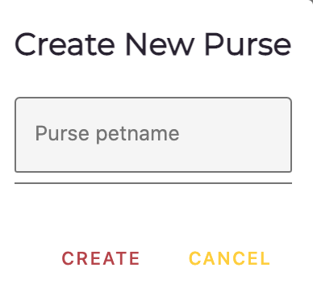
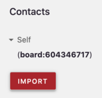
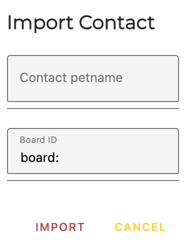
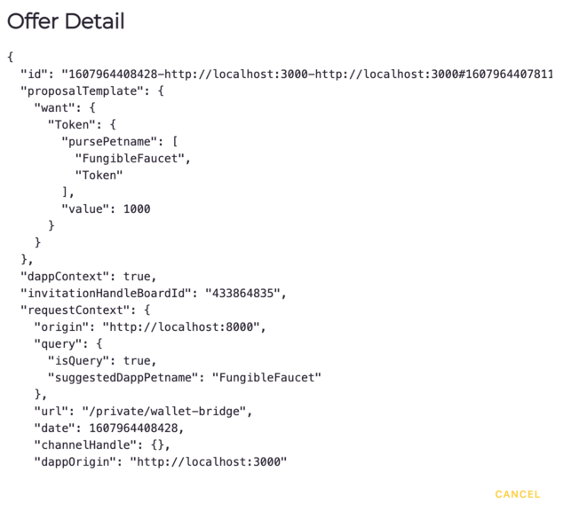

# Agoric Wallet

This page documents that *Agoric Wallet*, including its use of *petnames*, its place in the Agoric Platform
architecture, accessing it via the *REPL* (*Read-Eval-Print Loop*), and the Wallet API. 

## Wallet and Agoric Architecture

The Agoric System consists of interconnected Agoric VMs. Some are 
on the blockchain, some are local. The Wallet is a user's trusted 
agent for interacting with the Agoric VM network.

We also have Dapps (*Decentralized applications*), which are Web UIs 
that interact with Agoric VMs. Dapps have their own agendas...which
may include wanting to steal assets from Wallets. 

An *Ag-Solo* is a single off-chain Agoric VM. They have their own UI
and way of communicating with chains (including multiple chains and
network connections). They serve as entry points into the Agoric System.

When you run `agoric start`, you get a private ag-solo that runs your 
private wallet. The wallet is a user's *trusted agent*. It lets you
enable or disable inbound connections from Dapps and approve or decline
proposals from those Dapps you enabled. The Wallet is visible 
when you run `agoric open`.

The way this works in the Wallet's UI is via the *proposals* that are
part of a Zoe *offer*; a Dapp says it wants the user to offer something.
The wallet expresses that request/offer in a popup, and the user indicates
if they want to enact or decline it. 

Dapps can be anywhere; they can be web apps interacting with wallets, 
usually because they want your money and/or help you exchange something
with someone else. They may even want to give you something for free. 
But a Dapp's main use is exchanging something on the chain, in addition
to controlling what access they have and managing the proposals.

## Wallet Bridge protocol

The *wallet bridge* is a web page with direct access to an Agoric Wallet. It provides
the Dapp with a facet of an API. Dapps never talk directly to a Wallet, only to
this bridge that knows where the Wallet is. So, for example, if a Dapp is running in
your browser at `https://encouragement.example.com` and the Wallet is running locally, 
they don't communicate directly. They do so by sending JSON-encoded messages through 
the wallet bridge.

## Petnames and paths

Before we get into the Wallet itself, you should know about *petnames*,
which are your personal names for objects. No one else can see or
modify a petname without your permission. You can think of them as
your phone's contacts list. The actual phone number is what your phone
uses to call someone, but for you to more easily tell who a number is
associated with, you've assigned a petname to it, such as Mom,
Grandpa, Kate S., etc. Different people can have different petnames for
different objects. For example, the same person is "Mom" to you, "Mimi"
to her granddaughter, and "Mrs. Watson" to many others.

Your Wallet manages your petnames for Dapps, asset types, issuers, etc. 

The wallet bridge protocol is migrating petnames to *paths*. All former petnames
are now either a *path* or still a plain string. A path is an array of strings
whose first element is the user's petname for a Dapp. Dapps must be able to
work with either plain string petnames or array-of-strings paths. 

They can do this via `JSON.stringify(petnameOrPath)` before using the `petnameOrPath` in
a programmatic string-only context (such as a key in a Map or Set, or an HTML element's 
attribute value, such as an ID).  When displaying a path to users, you should join its
elements with `'.'`. If in a UI, you should ideally color the first element 
differently from the dots and other elements. The first element is a trusted, 
user-assigned petname for the Dapp, while the other elements were automatically 
generated by the Dapp or wallet. Thus, they have no special relationship to the user.

### Dapp-specific path suggestions

Your Dapp should suggest names for any Installations, Instances, or Issuers wallet users
will interact with. When a wallet accepts them, it returns them to the Dapp as paths (arrays 
of strings) that start with the user's petname for the Dapp.

For example, here are [the messages that the Fungible Faucet Dapp 
sends](https://github.com/Agoric/dapp-fungible-faucet/blob/6092d6648a7a773d299c79fecd44bb650f6cfa06/ui/public/src/main.js#L145) 
over the wallet bridge:

```js
    // Our issuer will default to something like `FungibleFaucet.Installation`.
    walletSend({
      type: 'walletSuggestInstallation',
      petname: 'Installation',
      boardId: INSTALLATION_BOARD_ID,
    });
    // Our issuer will default to something like `FungibleFaucet.Instance`.
    walletSend({
      type: 'walletSuggestInstance',
      petname: 'Instance',
      boardId: INSTANCE_BOARD_ID,
    });
    // Our issuer will default to something like `FungibleFaucet.Assurance`.
    walletSend({
      type: 'walletSuggestIssuer',
      petname: 'Token',
      boardId: TOKEN_ISSUER_BOARD_ID,
    });
 ```

## The Agoric Board

Several Wallet API methods use *Agoric's Board*, a key-value "bulletin board" that
lets users make data generally available. Users can obtain an Id by posting a value and 
others can get the value just by knowing the Id. You can make Id(s) known by any 
communication method you like; private email, an email blast to a mailing list 
or many individuals, buying an ad on a website, tv program, or newspaper, 
listing it on her website, etc.

<<< @/snippets/ertp/guide/test-readme.js#getValue

To get an object, such as a depositFacet, using the Board, first you have
to be told what Board Id is associated with it. Using the `getValue()` method,
you retrieve the reference to the depositFacet and can deposit payments into it. 

## The Wallet UI

From a shell window, run `agoric open` to open the Wallet UI in a browser tab.

### Menu Bar

At the top of the UI is a menu bar with four items.


- **Inbox**
  - 
  - Shows your offers, impending payments, Dapps, and purses.
  - Lets you send payments, enable/disable Dapps and change their petname, approve/decline offers, or deposit impending payments.
- **Transfers**
  - 
  - Shows your purses and contacts.
  - Lets you send payments, import contacts by Board ID and give them a petname.
- **Setup**
  - 
  - Shows your Dapps, issuers, and contacts. 
  - Lets you create empty purses, import contacts by Board ID and give them a petname, and enable/disable Dapps and change their petname.
- **Connected/Disconnect**
  - 
  - Shows if the Wallet UI is connected to your ag-solo.
  - Lets you connect the Wallet to or disconnect the Wallet UI from your ag-solo.

As there are only six page components, several of which are repeated on the three pages making up the Wallet UI,
we will cover the components in detail rather than the pages.

### Purses


The Purses component shows all purses in the wallet and their current balances (both the value and the brand).
It also shows the special default purse that holds Zoe invitations.


If you expand a purse entry, you'll see a red **SEND** button for that purse. Clicking it opens the above
popup. From the popup, you can specify how much of the purse's shown current balance you would like to 
send elsewhere. 

You can transfer assets to another purse within your wallet. However, there must already be a purse that accepts
assets of that brand to select. Otherwise, your only option is to send the assets back to the same purse they came
from, which can be used for testing.

Or you can transfer assets from the purse to any contact you already have. As noted, this is an irrevocable one way
transfer. If the contact doesn't have an auto-deposit purse that accepts this asset type, it just sits under their
Incoming Payments until an appropriate purse is created and it is manually deposited.  Only one purse can be 
designated the auto-deposit purse for its asset type.

When you are finished specifying how much the payment is and where it's going, click the **Send** button at the bottom
of the popup. Otherwise click the **Cancel** button to cancel the prospective transfer and close the popup.

If you enable a Purse's **AutoDeposit** by sliding its button
to the right, causing it to turn red, any incoming Payments of that Purse's Brand are automatically deposited into it.  
Doing so disables any other auto-deposit purses for that Brand. Sliding the button to the left, causing it to turn white, 
means you have to manually approve the deposit.

### Dapps


The Dapps component shows all Dapps that can communicate with the Wallet. An expanded entry
shows an alleged URL for that Dapp's UI, its Petname, and a toggle to enable/disable the Dapp
from communicating with the Wallet. Note that like the other entries with an on/off slider,
a Dapp is enabled when the button is slid to the right and turns red, and disabled when slid to the 
left and turns white.

### Issuers


The Issuers component shows all Issuers known to the Wallet, along with their associated Brands.
An expanded entry shows that Issuer's Board ID and a **Make Purse** button. When **Make Purse** is
clicked the following popup appears:



The Issuer creates a new empty Purse, that holds its Brand of assets, in the Wallet, giving it the Petname
you specify. Remember there can be more than one Purse in a Wallet that holds assets of a specific Brand.

If you click the **Import** button at the bottom of the Issuers list, this popup appears:


You specify a Petname and the Board ID (obtained from a trusted source) of an Issuer, and it's imported
into the Wallet and can be used to create new empty Purses to store assets of its associated Brand. 

### Contacts



The Contacts component shows all entities known to the Wallet, including the Wallet itself as "Self". An
expanded entry shows the contact's Board ID. If you click on the **Import** button, this popup appears:



You specify a Petname and the Board ID (obtained from a trusted source) of a Contact, and it's imported
into the Wallet. 

### Offers


The Offers component shows any pending offers known to the Wallet. Click the green **Accept** button
to accept the offer, or click the red **Decline** button to decline it.

Note the small, red, `<>` at the far right
of an offer. Clicking it opens a popup with the JSON representation of that offer, for example:



### Incoming Payments


The Incoming Payments component shows any pending incoming payments not yet deposited in a purse.
A Deposit To value of "Automatic" means to deposit the payment in the apprpriate purse that has
auto-deposit enabled. Otherwise, you need to select into which of your purses for that brand of asset you
want to deposit the payment. Note that you can't divide the payment or otherwise make a partial
deposit; it's all or nothing. 

Note the small, red, `<>` at the far right
of a payment. Clicking it opens a popup with the JSON representation of that payment, for example:


## Wallet API Overview

You can interact with a Wallet via the JavaScript *REPL* (*Read-Eval-Print Loop*),
which is visible at the bottom of the Wallet UI display. 
In the REPL, you send message to `home.wallet`, which is the Wallet running on that
page/process. Typing `E(home.wallet).foo()` in the REPL returns the names of all the Wallet
API methods by the clever method of asking it to evaluate a non-existent API method and
getting an error message listing all the valid methods.

Running `agoric open --repl==only` opens a browser tab that shows only the REPL, and not
the combination of Wallet UI and REPL area. When issuing commands to the Wallet from the
REPL, they must be of the form `E(home.wallet).<Wallet API command and arguments>`. For more
information about `E()`, see the [`E()` section](/distributed-programming.md#communicating-with-remote-objects-using-e) in 
the Distributed JavaScript Programming Guide.

There are two objects on which the Wallet API commands work:
- `WalletUser`: The presence exposed as `local.wallet` (and `home.wallet` for backwards compatibility).  
  It provides a place for Wallet API commands.
- `WalletBridge`: Its methods can be used by an untrusted
  Dapp without breaching the wallet's integrity.  These methods are also
  exposed via the iframe/WebSocket bridge that a Dapp UI can use to access the
  wallet.
  
## WalletUser API commands

### `getBridge()`
- Returns: `{Promise<WalletBridge>}`

Returns the wallet bridge that bypasses Dapp-authorization. This should 
only be used within the REPL or deployment scripts that want to use the
WalletBridge API without the effort of calling `getScopedBridge`.
Since your REPL and deployment scripts already run using the ag-solo's full authority, 
it doesn't really make a difference to have them use a more restricted bridge.

### `getScopedBridge(suggestedDappPetname, dappOrigin)`
- `suggestedDappPetname` `{Petname}`
- `dappOrigin` `{String}`
- Returns: `{Promise<WalletBridge>}`

Returns a wallet bridge corresponding to an origin that must be approved in the wallet UI. 
This is available for completeness to provide the underlying API that's available over the
standard wallet-bridge.html.

### `addPayment(payment)`
- `id` `{ERef<Payment>}`
- Returns: `void`

Adds a payment to the Wallet for deposit to the user-specified purse,
either via an autodeposit or manually approved.

### `getDepositFacet(brandBoardId)`
- `brandBoardId` `{String}`
- Returns: `{Promise<string>}`

Returns the board ID for the deposit facet of the user's Wallet that accepts payments
of the brand specified by the `brandBoardId` parameter.

### `getIssuers()`
- Returns: `{Array<[Petname, Issuer]>}`

Returns an array of all the Issuers and their petnames associated with this Wallet.

### `getIssuer(petname)`
- `petname` `{Petname}`
- Returns: `{Issuer}`

Returns the issuer with the specified petname associated with this Wallet.

### `getPurses()`
- Returns: `{Array<[Petname, Purse]>}`

Returns all the purses associated with this wallet.

### `getPurse(pursePetname)`
- `pursePetName`  `{String}`
- Returns `{Purse}`
- Errors: Throws an error if there is no purse with the given petname.

Returns the `purse` object with the given petname
    
## WalletBridge API commands    
    
These methods can be used by an untrusted Dapp without breaching the wallet's 
integrity.  They are also exposed via the iframe/WebSocket bridge that a 
Dapp UI can use to access a Wallet.
 
### `addOffer(offer)`
- `offer` `{OfferState}`
- Returns: `{Promise<string>}`

Adds an offer to the Wallet, returning the offer's unique private ID in the Wallet.
This ID is not stored in the Board.

### `addOfferInvitation(offer, invitation)`
- `offer` `{OfferState}`
- `invitation` `{ERef<Payment>}`
- Returns: `{Promise<string>}`

Add the specified invitation to the specified offer, returning the offer's private ID in the Wallet.  
This ID is not stored in the Board.

### `getDepositFacetId(brandBoardId`
- `brandBoardId` `{string}`
- Returns: `{Promise<string>}`

Returns the Board ID to use to receive payments of the specified by its Board ID brand.

### `getPursesNotifier()`
- Returns: `{Promise<Notifier<Array<PursesFullState>>>}`

Returns a notifier that follows changes the purses in the Wallet.

### `getOffersNotifier()`
- Returns: `{Promise<Notifier<array<OfferState>>>}`

Returns a notifier that follows changes to the offers received by the Wallet.

### `suggestIssuer(petname, issuerBoardId)`
- `petname` `{Petname}`
- `issuerBoardId` `{string}`
- Returns: `void`

Introduce an ERTP issuer with a suggested petname to the Wallet.

### `suggestInstallation(petname, installationBoardID)`
- `petname` `{Petname}`
- `installationBoardId` `{string}`
- Returns: `void`

Introduce a Zoe contract installation with a suggested petname to the Wallet.

### `suggestInstance(petname, instanceBoardId)
- `petname` `{Petname}`
- `instanceBoardId` `{string}`
- Returns: `void`

Introduce a Zoe contract instance with a suggested petname to the Wallet.
