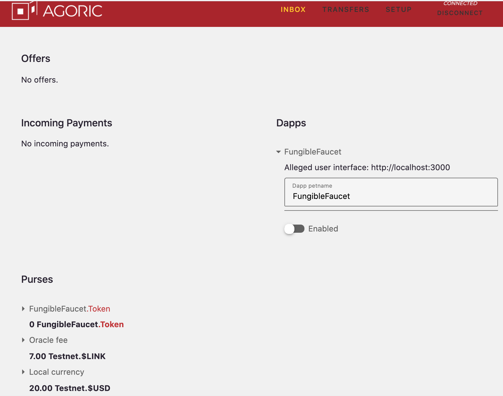
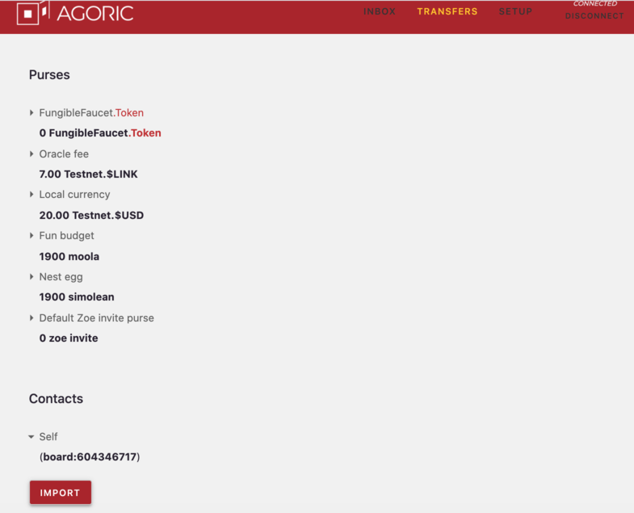
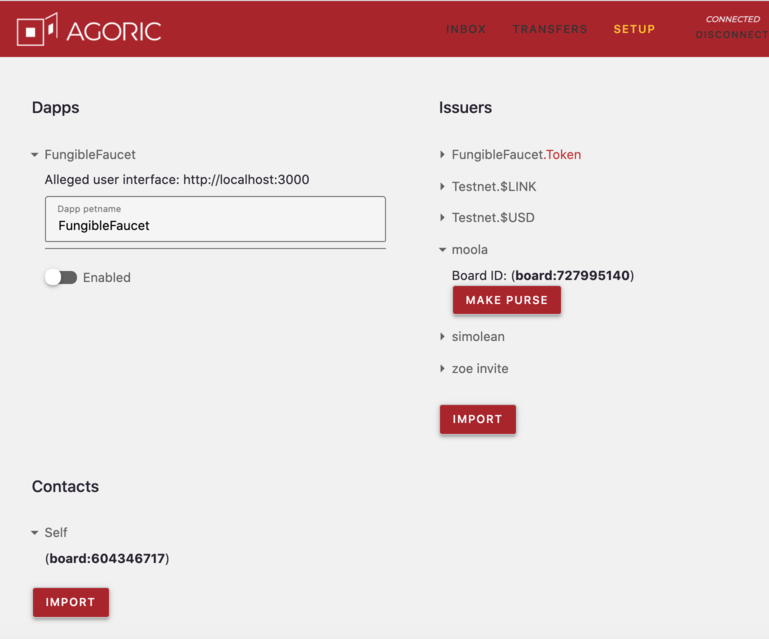
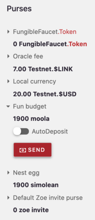
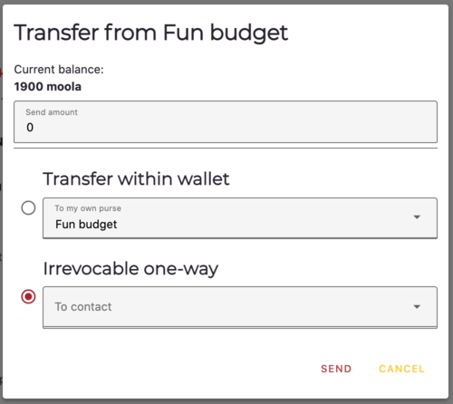
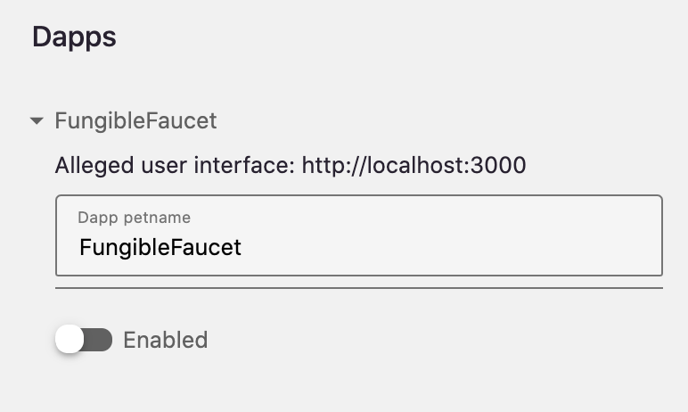
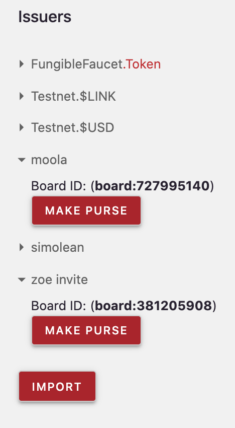
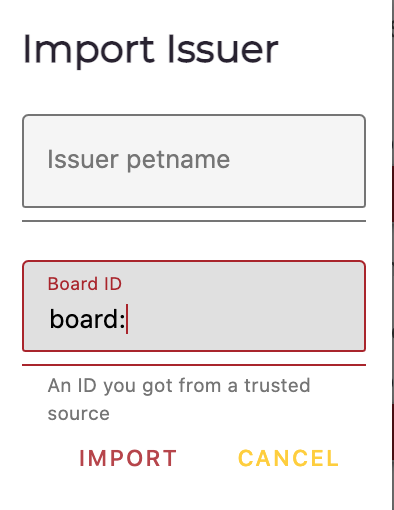

# Agoric Wallet

This page documents that *Agoric Wallet*, including its use of *petnames*, its place in the Agoric Platform
architecture, accessing it via the *REPL* (*Read-Eval-Print Loop*), and the Wallet API. 

## Wallet and Agoric Architecture

The Agoric System consists of interconnected Agoric VMs. Some are 
on the blockchain, some are local. The Wallet is a user's trusted 
agent for interacting with the Agoric VM network.

We also have Dapps (*Decentralized applications*), which are Web UIs 
that interact with Agoric VMs. Dapps have their own agendas...which
may include wanting to steal assets from Wallets. 

An *Ag-Solo* is a single off-chain Agoric VM. They have their own UI
and way of communicating with chains (including multiple chains and
network connections). They serve as entry points into the Agoric System.

When you run `agoric start`, you get a private ag-solo that runs your 
private wallet. The wallet is a user's *trusted agent*. It lets you
enable or disable inbound connections from Dapps and approve or decline
proposals from those Dapps you enabled. The Wallet is visible 
when you run `agoric open`.

The way this works in the Wallet's UI is via the *proposals* that are
part of a Zoe *offer*; a Dapp says it wants the user to offer something.
The wallet expresses that request/offer in a popup, and the user indicates
if they want to enact or decline it. 

Dapps can be anywhere; they can be web apps interacting with wallets, 
usually because they want your money and/or help you exchange something
with someone else. They may even want to give you something for free. 
But a Dapp's main use is exchanging something on the chain, in addition
to controlling what access they have and managing the proposals.

## Wallet Bridge protocol

The *wallet bridge* is a web page with direct access to an Agoric Wallet. It provides
the Dapp with a facet of an API. Dapps never talk directly to a Wallet, only to
this bridge that knows where the Wallet is. So, for example, if a Dapp is running in
your browser at `https://encouragement.example.com` and the Wallet is running locally, 
they don't communicate directly. They do so by sending JSON-encoded messages through 
the wallet bridge.

## Petnames and paths

Before we get into the Wallet itself, you should know about *petnames*,
which are your personal names for objects. No one else can see or
modify a petname without your permission. You can think of them as
your phone's contacts list. The actual phone number is what your phone
uses to call someone, but for you to more easily tell who a number is
associated with, you've assigned a petname to it, such as Mom,
Grandpa, Kate S., etc. Different people can have different petnames for
different objects. For example, the same person is "Mom" to you, "Mimi"
to her granddaughter, and "Mrs. Watson" to many others.

Your Wallet manages your petnames for Dapps, asset types, issuers, etc. 

The wallet bridge protocol is migrating petnames to *paths*. All former petnames
are now either a *path* or still a plain string. A path is an array of strings
whose first element is the user's petname for a Dapp. Dapps must be able to
work with either plain string petnames or array-of-strings paths. 

They can do this via `JSON.stringify(petnameOrPath)` before using the `petnameOrPath` in
a programmatic string-only context (such as a key in a Map or Set, or an HTML element's 
attribute value, such as an ID).  When displaying a path to users, you should join its
elements with `'.'`. If in a UI, you should ideally color the first element 
differently from the dots and other elements. The first element is a trusted, 
user-assigned petname for the Dapp, while the other elements were automatically 
generated by the Dapp or wallet. Thus, they have no special relationship to the user.

### Dapp-specific path suggestions

Your Dapp should suggest names for any Installations, Instances, or Issuers wallet users
will interact with. When a wallet accepts them, it returns them to the Dapp as paths (arrays 
of strings) that start with the user's petname for the Dapp.

For example, here are [the messages that the Fungible Faucet Dapp 
sends](https://github.com/Agoric/dapp-fungible-faucet/blob/6092d6648a7a773d299c79fecd44bb650f6cfa06/ui/public/src/main.js#L145) 
over the wallet bridge:

```js
    // Our issuer will default to something like `FungibleFaucet.Installation`.
    walletSend({
      type: 'walletSuggestInstallation',
      petname: 'Installation',
      boardId: INSTALLATION_BOARD_ID,
    });
    // Our issuer will default to something like `FungibleFaucet.Instance`.
    walletSend({
      type: 'walletSuggestInstance',
      petname: 'Instance',
      boardId: INSTANCE_BOARD_ID,
    });
    // Our issuer will default to something like `FungibleFaucet.Assurance`.
    walletSend({
      type: 'walletSuggestIssuer',
      petname: 'Token',
      boardId: TOKEN_ISSUER_BOARD_ID,
    });
 ```

## The Agoric Board

Several Wallet API methods use *Agoric's Board*, a key-value "bulletin board" that
lets users make data generally available. Users can obtain an Id by posting a value and 
others can get the value just by knowing the Id. You can make Id(s) known by any 
communication method you like; private email, an email blast to a mailing list 
or many individuals, buying an ad on a website, tv program, or newspaper, 
listing it on her website, etc.

<<< @/snippets/ertp/guide/test-readme.js#getValue

To get an object, such as a depositFacet, using the Board, first you have
to be told what Board Id is associated with it. Using the `getValue()` method,
you retrieve the reference to the depositFacet and can deposit payments into it. 

## The Wallet UI

The WalletUI is visible in a browser tab set to `localhost:8000`. 

### Menubar

At the top of the UI is a menu bar with four items.


- **Inbox**
  - 
  - Shows your offers, impending payments, enablable Dapps, and purses.
  - Lets you send payments, enable/disable Dapps and change their petname, approve/decline offers, or deposit impending payments.
- **Transfers**
  - 
  - Shows your purses and contacts.
  - Lets you send payments, import contacts by Board ID and give them a petname.
- **Setup**
  - 
  - Shows your enablable Dapps, issuers, and contacts. 
  - Lets you create empty purses, import contacts by Board ID and give them a petname, and enable/disable Dapps and change their petname.
- **Connected/Disconnet**
  - 
  - Shows if the Wallet UI is connected to your ag-solo.
  - Lets you connect the Wallet to or disconnect the Wallet UI from your ag-solo.

As there are only six page components, several of which are repeated on the three pages making up the Wallet UI,
we will cover the components in detail rather than the pages.

### Purses



The Purses component shows all purses in the wallet and their current balances (both the value and the brand).
It also shows the special default purse that holds Zoe invitations.



If you expand a purse entry, you'll see a red **SEND** button for that purse. Clicking it opens the above
popup. From the popup, you can specify how much of the purse's shown current balance you would like to 
send elsewhere. 

You can transfer assets to another purse within your wallet. However, there must already be a purse that accepts
assets of that brand to select. Otherwise, your only option is to send the assets back to the same purse they came
from, which can be used for testing.

Or you can transfer assets from the purse to any contact you already have. As noted, this is an irrevocable one way
transfer. If the contact doesn't have an auto-deposit purse that accepts this asset type, it just sits under their
Incoming Payments until an appropriate purse is created and it is manually deposited.  Only one purse can be 
designated the auto-deposit purse for its asset type.

When you are finished specifying how much the payment is and where it's going, click the **Send** button at the bottom
of the popup. Otherwise click the **Cancel** button to cancel the prospective transfer and close the popup.

If you enable a Purse's **AutoDeposit** by sliding its button
to the right, causing it to turn red, any incoming Payments of that Purse's Brand are automatically deposited into it.  
Doing so disables any other auto-deposit purses for that Brand. Sliding the button to the left, causing it to turn white, 
means you have to manually approve the deposit.

### Dapps



The Dapps component shows all Dapps that can communicate with the Wallet. An expanded entry
shows an alleged URL for that Dapp's UI, its Petname, and a toggle to enable/disable the Dapp
from communicating with the Wallet. Note that unlike the other entries with an on/off slider,
a Dapp is enabled when the button is slid to the right and turns red, and disabled when slid to the 
left and turns white. **tyg todo: Should probably be consistent about this throughout the Wallet**

### Issuers



The Issuers component shows all Issuers known to the Wallet, along with their associated Brands.
An expanded entry shows that Issuer's Board ID and a **Make Purse** button. When **Make Purse** is
clicked the following popup appears:


The Issuer creates a new empty Purse, that holds its Brand of assets, in the Wallet, giving it the Petname
you specify. Remember there can be more than one Purse in a Wallet that holds assets of a specific Brand.

If you click the **Import** button at the bottom of the Issuers list, this popup appears:



You specify a Petname and the Board ID (obtained from a trusted source) of an Issuer, and it's imported
into the Wallet and can be used to create new empty Purses to store assets of its associated Brand. 

### Contacts


The Contacts component shows all entities known to the Wallet, including the Wallet itself as "Self". An
expanded entry shows the contact's Board ID. If you click on the **Import** button, this popup appears:


You specify a Petname and the Board ID (obtained from a trusted source) of a Contact, and it's imported
into the Wallet. 

### Offers

**tyg todo: Not sure what this looks like as default Faucet Wallet doesn't list any.
Need to rework things **

### Incoming Payments

**tyg todo: Not sure what this looks like as default Faucet Wallet doesn't list any**

## Wallet API Overview

You can interact with a Wallet via the JavaScript *REPL* (*Read-Eval-Print Loop*),
which is visible at the bottom of the Wallet UI display. 
In the REPL, you send message to `home.wallet`, which is the Wallet running on that
page/process. Typing `E(home.wallet).foo()` in the REPL returns the names of all the Wallet
API methods by the clever method of asking it to evaluate a non-existant API method and
getting an error message listing all the valid methods.

Running `agoric open --repl==only` opens a browser tab that shows only the REPL, and not
the combination of Wallet UI and REPL area. When issuing commands to the Wallet from the
REPL, they must be of the form `E(home.wallet).<Wallet API command and arguments>`. See 
the [`E()` section](/distributed-programming.html#communicating-with-remote-objects-using-e) in 
the Distributed JavaScript Programming Guide for more information about `E()`.

**tyg todo: New API stuff starts here **

There are two objects on which the Wallet API commands work:
- `WalletUser`: The presence exposed as `local.wallet` (and `home.wallet` for backwards compatibility).  
  It provides a place for Wallet API commands.
- `WalletBridge`: Its methods can be used by an untrusted
  Dapp without breaching the wallet's integrity.  These methods are also
  exposed via the iframe/WebSocket bridge that a Dapp UI can use to access the
  wallet.
  
## WalletUser API commands

### `getBridge()`
- Returns: `{Promise<WalletBridge>}`

Returns the wallet bridge that bypasses Dapp-authorization. This should 
only be used within the REPL or deployment scripts that want to use the
WalletBridge API without the effort of calling `getScopedBridge`.
**tyg todo: Why is this an effort? How severe is it that we're recommedning 
they not do it?**

### `getScopedBridge(suggestedDappPetname, dappOrigin)`
- `suggestedDappPetname` `{Petname}`
- `dappOrigin` `{String}`
- Returns: `{Promise<WalletBridge>}`

Returns a wallet bridge corresponding to an origin that must be approved in the wallet UI. 
This is available for completeness to provide the underlying API that's available over the
standard wallet-bridge.html.

### `addPayment(payment)`
- `id` `{ERef<Payment>}`
- Returns: `void`

Adds a payment to the Wallet for deposit to the user-specified purse,
either via an autodeposit or manually approved.

### `getDepositFacet(brandBoardId)`
- `brandBoardId` `{String}`
- Returns: `{Promise<string>}`

Returns the board ID for the deposit facet of a purse in the user's Wallet that accepts payments
of the brand specified by the `brandBoardId` parameter. **tyg todo: What if
the Wallet has more than one purse for the specified by board ID brand? Or is
the parameter really the id for a purse that takes that brand?**

### `getIssuers()`
- Returns: `{Array<[Petname, Issuer]>}`

Returns an array of all the Issuers and their petnames associated with this Wallet.

### `getIssuer(petname)`
- `petname` `{Petname}`
- Returns: `{Issuer}`

Returns the issuer with the specified petname associated with this Wallet.

### `getPurses()`
- Returns: `{Array<[Petname, Purse]>}`

Returns all the purses associated with this wallet.

### `getPurse(pursePetname)`
- `pursePetName`  `{String}`
- Returns `{Purse}`
- Errors: Throws an error if there is no purse with the given petname.

Returns the `purse` object with the given petname
    
## WalletBridge API commands    
    
These methods can be used by an untrusted Dapp without breaching the wallet's 
integrity.  They are also exposed via the iframe/WebSocket bridge that a 
Dapp UI can use to access a Wallet.
 
### `addOffer(offer)`
- `offer` `{OfferState}`
- Returns: `{Promise<string>}`

Adds an offer to the Wallet, returning the offer's unique Board ID. 

### `addOfferInvitation(offer, invitation)`
- `offer` `{OfferState}`
- `invitation` `{ERef<Payment>}`
- Returns: `{Promise<string>}`

Add the specified invitation to the specified offer, returning the offer's unique Board ID. 

### `getDepositFacetId(brandBoardId`
- `brandBoardId` `{string}`
- Returns: `{Promise<string>}`

Returns the Board ID to use to receive payments of the specified by its Board ID brand.

### `getPursesNotifier()`
- Returns: `{Promise<Notifier<Array<PursesFullState>>>}`

Returns a notifier that follows changes the purses in the Wallet.

### `getOffersNotifier()`
- Returns: `{Promise<Notifier<array<OfferState>>>}`

Returns a notifier that follows changes to the offers received by the Wallet.

### `suggestIssuer(petname, issuerBoardId)`
- `petname` `{Petname}`
- `issuerBoardId` `{string}`
- Returns: `void`

Introduce an ERTP issuer with a suggested petname to the Wallet.

### `suggestInstallation(petname, installationBoardID)`
- `petname` `{Petname}`
- `installationBoardId` `{string}`
- Returns: `void`

Introduce a Zoe contract installation with a suggested petname to the Wallet.

### `suggestInstance(petname, instanceBoardId)
- `petname` `{Petname}`
- `instanceBoardId` `{string}`
- Returns: `void`

Introduce a Zoe contract instance with a suggested petname to the Wallet.
 

**tyg todo: old API stuff starts here. Should any of it be retained?**

Wallet API commands work with the following object types:
- `purse`: Stores assets until you withdraw them into a payment for use 
- `issuer`: Creates empty purses and payments and maps minted assets
  to them when assets are added or removed. Issuers verify and move
  digital assets.
- `offer`: Consists of what amount of what [brand](/ertp/guide/amounts.md#brands)
  you're willing to give, and what amount of what brand you want, as well as the
  conditions under which the offer holder can cancel it.
- `seat`:
- `instance`:
- `installation`:

## Purse API Methods

### `deposit(pursePetname, payment)`
- `pursePetname`  `{ String }`
- `payment`  `{ Payment }`
- Returns: The deposited amount.

Deposits the specified payment into the specified purse in the wallet. Returns the deposited amount.

**Note**: `deposit()` has a special case. Since Zoe invitations are represented as ERTP payments,
a wallet receives invitations and uses `deposit()` to put them in an invitation-branded purse.

```js
wallet.deposit('myQuatloosPurse', quatloosPayment);
```

### `enableAutoDeposit(pursePetname)`
- `pursePetname` `{String}`
- Returns: **tyg todo: Not sure**

**tyg todo: Unclear what this does**

### `disableAutoDeposit()`
- `pursePetname` `{String}`
- Returns: **tyg todo: Not sure**

**tyg todo: Unclear what this does**

### `getDepositFacetId(_brandBoardId)`
- `_brandBoardId`:  **tyg todo: Doesn't seem to actually be used in the method?**
- Returns: The Board id for the generic depositFacet. **tyg todo: Not sure what's meant by this generic thing?**

### `getPurses()`
- Returns:  Promises for all `purse` objects in the wallet and their 
petnames via an array of [petname, promise] arrays.

The returned array of arrays can be turned into a `Map` (`new Map(getPurses())`).
```js
const walletPurses = await wallet.getPurses();
```

### `getPurse(pursePetname)`
- `pursePetName`  `{String}`
- Returns: A promise for the `purse` object with the given petname
- Errors: Throws an error if there is no purse with the given petname.

Returns a promise for the `purse` object associated with the given petname.

```js
const quatloosPurse = await wallet.getPurse('myQuatloosPurse');
```
**Note**: Since Zoe invitations are ERTP payments, wallets hold invitations
in purses associated with an invitation brand. To access the default purse
for invitations, do:
```js
const invitePurse = wallet.getPurse(ZOE_INVITE_PURSE_PETNAME); 
```

### `getPurseIssuer(petname)`
-  `petname`  `{String}`
- Returns: The `issuer` object associated with the purse.
- Errors: Throws an error if given an invalid purse petname. 

Given a purse's petname, returns the `issuer` object associated with the purse. 

### `makeEmptyPurse(brandPetname, pursePetname)`
- `brandPetname` `{String}`
- `pursePetname` `{String}`
- Returns: A new, empty, `purse` object.
- Errors: There is already a purse in this wallet with the name of `pursePetname`'s value.   

Creates and returns a new, empty, purse object with the specified petname, which contains assets 
of the specified brand petname, and uses that brand's associated issuer.
```js
const myFunMoneyQuatloosPurse = await wallet.makeEmptyPurse('quatloos', 'fun money');
```
### `enableAutoDeposit(pursePetname)
- `pursePetname` `{String}`
- Returns: 


## Issuer API Methods

Note: Click [`getPurseIssuer()`](#getpurseissuer-petname) to see its documentation.

### `addIssuer(issuerPetname, issuer, brandRegKey)(petnameForBrand, issuer, makePurse = false)`
- `petnameForBrand` `{String}`
- `issuer` `{Issuer}`
- `makePurse` `{Boolean}` Optional
- Returns: The string `issuer ${q(petnameForBrand)} successfully added to wallet`

Adds the specified issuer to the wallet. The issuer's associated brand is given the specified
petname. If the optional `makePurse` argument is `true`, it makes a new purse in the wallet for
the issuer's brand. 
```js
await wallet.addIssuer('quatloos', quatlooIssuer);
```

### `getIssuer(petname)`
- `petname` `{String}`
- Returns: The issuer in the wallet with the specified petname.
```
const quatloosIssuer = wallet.getIssuer('quatloosIssuer');
```

### `getIssuers()`
- Returns: All issuers associated with the wallet and their petnames as an 
  array of arrays of the format `[[issuerPetname, issuer], ...]`. 

Use `getIssuers()` to make a new map of petnames to issuers by doing `new Map(getIssuer())` 
```js
const walletIssuers = wallet.getIssuers();
```
### `publishIssuer(brand)`
- `brand` `{Brand}`
- Returns: The Board ID of the issuer associated with the specified brand.

Gets the issuer associated with the specified brand. If that issuer has an associated Board ID,
the ID is returned. If not, the issuer is given a new board ID, which is returned.

### `renameIssuer(petname, issuer)`
- `petname` `{String}`
- `issuer` `{Issuer}`
- Returns: `issuer ${q(petname)} successfully renamed in wallet`

Renames the specified issuer to have the specified petname. Error if the issuer is not
in the wallet. 


### `suggestIssuer(suggestedPetname, issuerBoardId, dappOrigin = undefined)`
- `suggestedPetname` `{String}`
- `issuerBoardId` = `{String}`
- `dappOrigin` = `{tyg todo: Not sure what should go here}` optional, defaults to `undefined`.
Returns: **tyg todo: Not sure**

Gets the issuer from its associated Board ID. If not already in the wallet, it adds the
issuer to the wallet. If the issuer is added, an empty purse associated with it is also created
and added to the wallet. The issuer is given the specified petname. **tyg todo: Not sure what
dappOrigin is or how it's used**


## Offer API Methods

### `acceptOffer(id)`
- `id` `{String}`
- Returns: **tyg todo: Not sure?**
- Errors: If the offer has already been resolved or rejected. 

Makes the id-specified offer to the target contract. It approves 
a proposal added by `addOffer()` and submits an offer to the contract
instance on behalf of the  user. Changes the specified offer's status 
to "accepted" in the wallet inbox. 

### `addOffer(rawOffer, requestContext = {})`  
- `rawOffer` `{Object}`
- `requestContext` **tyg todo Not sure what should go here other than Optional and {} default**
- Returns: The offer's Board id.

Adds a new proposal to the wallet's inbox that the user can approve to make an 
offer to a contract invitation. The `rawOffer` is a potential offer sent from the
Dapp UI to be looked at by the user. Its invitation is extracted from the wallet's invitation
purse. **tyg todo Not sure what requestContext does**

### `cancelOffer(id)`
- `id` `{String}`
- Returns: `true` if successful, `false` if not.
- Errors: Returns `false` if the offer was not made with the exit rule `onDemand`, throws if the offer was already completed.

Cancels the id-specified offer in the contract instance and changes its status in the wallet inbox to "cancel". 

### `declineOffer(id)`
- `id` `{String}`
- Returns: Undefined

Changes the status of the id-specified offer in the wallet inbox to "decline". 

### `getOffers()`
- Returns: An array of the `offer` objects associated with the wallet, sorted by
id.  

## Instance API Methods

**tyg todo: How is this associated with the wallet? Just the contract instance it's in?**

### `addInstance(petname, instanceHandle)`
- `petname` `{String}`
- `instanceHandle` `{InstanceHandle}`
- Returns: `instance ${q(petname)} successfully added to wallet`

### `getInstance(petname)`
- `petname` `{String}`
- Returns: The instance object with the given petname. 
```js
const automaticRefundInstance = wallet.getInstance('automaticRefund');
```
Gives the specified instance the specified petname, and adds the instalation to the wallet.

### `renameInstance(petname, instance)`
- `petname` `{String}`
- `instance` `{Instance}`
Returns: `instance ${q(petname)} successfully renamed in wallet`

Renames the specified instance with the specified petname.
  
### `suggestInstance(suggestedPetname, instanceBoardId, dappOrigin = undefined)`
- `suggestedPetname` `{String}`
- `instanceBoardId` = `{String}`
- `dappOrigin` = `{tyg todo: Not sure what should go here}` optional, defaults to `undefined`.
Returns: **tyg todo: Not sure**

Gets the instance from its associated Board ID. If not already in the wallet, it adds the
instance to the wallet. The instance is given the specified petname. **tyg todo: Not sure what
dappOrigin is or how it's used**
```js
automaticRefundInstance = await wallet.suggestInstance(
    'automaticRefund', 
    automaticRefundInstanceBoardId, 
  ); 
```

## Installation API Methods

**tyg todo: How is installation associated with the wallet? Just the contract installation it's in?**

### `addInstallation(petname, installationHandle)`
- `petname` `{String}`
- `installationHandle` `{InstallationHandle}`
- Returns: `installation ${q(petname)} successfully added to wallet`

Gives the specified installation the specified petname, and adds the instalation to the wallet.

### `getInstallation(petname)`
- `petname` `{String}`
- Returns: The installation object with the given petname. 

```js
const automaticRefundInstallation = wallet.getInstallation('automaticRefund');
```
### `renameInstallation(petname, installation)`
- `petname` `{String}`
- `installation` `{Installation}`
Returns: `installation ${q(petname)} successfully renamed in wallet`

Renames the specified installation with the specified petname.
```js
await wallet.renameInstallation('automaticRefund2', installation); 
```

### `suggestInstallation(suggestedPetname, installationBoardId, dappOrigin = undefined)`
- `suggestedPetname` `{String}`
- `installationBoardId` = `{String}`
- `dappOrigin` = `{tyg todo: Not sure what should go here}` optional, defaults to `undefined`
Returns: **tyg todo: Not sure**

Gets the installation from its associated Board ID. If not already in the wallet, it adds the
installation to the wallet. The installation is given the specified petname. **tyg todo: Not sure what
dappOrigin is or how it's used**
```js
const automaticRefundInstallation = await wallet.suggestInstallation(
    'automaticRefund', 
     automaticRefundInstallationBoardId, 
  ); 
```

## Contact API Methods

### `getSelfContact()`

**tyg todo: Don't know what's going on here**
// Allow people to send us payments.
  const selfContact = await addContact('Self', {
    receive(payment) {
      return addPayment(payment);
    },
  });

### `addContact(petname, actions)`
- `petname` `{String}`
- `actions` `{}`
Returns: 

**tyg todo: Not sure what's going on here. In particular, what are "actions"? Code below**
```js
const addContact = async (petname, actions) => {
    const already = await E(board).has(actions);
    let depositFacet;
    if (already) {
      depositFacet = actions;
    } else {
      depositFacet = harden({
        receive(paymentP) {
          return E(actions).receive(paymentP);
        },
      });
    }
```
### `getContactsNotifier()`
- Returns: `{ContractsNotifier}`

**tyg todo: Not sure what's going on. It seems to just return "contractsNotifier", but I don't know what that's for**

## Seat API Methods

### `getSeat(id)`
- `id` `{String}`
- Returns: `{Seat}`

Returns the seat that is the Board value associated with the specified id.
```js
const seat = wallet.getSeat(id); 
```

### `getSeats([id])
- `[id]` `{[String]}`
Returns an array of seat objects which are the Board values associated each of
the ids in the specified array of ids.
```js
const seats = wallet.getSeats(harden([id])); 
```


