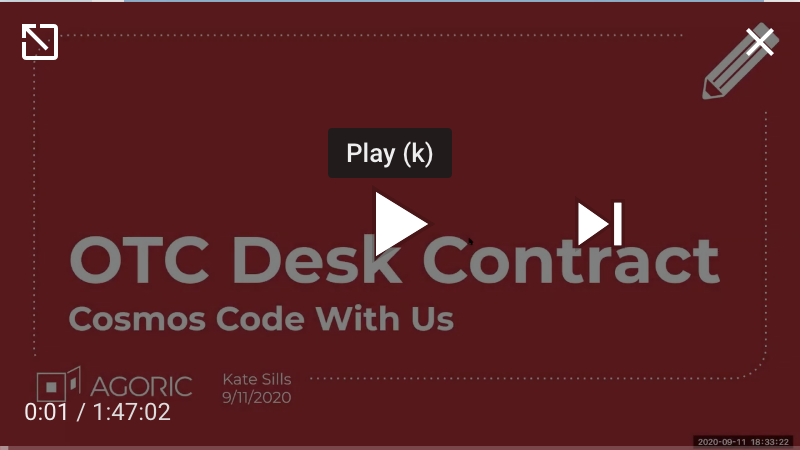

# OTC Desk Contract

<Zoe-Version/>

##### [View the code on Github](https://github.com/Agoric/agoric-sdk/blob/master/packages/zoe/src/contracts/otcDesk.js)
##### [View all contracts on Github](https://github.com/Agoric/agoric-sdk/tree/master/packages/zoe/src/contracts)

This is the OTC Desk contract from the ["Building a
Composable DeFi Contract" episode of Cosmos Code With 
Us](https://cosmos.network/series/code-with-us/building-a-composable-defi-contract).

[Watch the replay of the
workshop](https://www.youtube.com/watch?v=faxrecQgEio):

## Functionality

The OTC Desk contract is based on an idea by Haseeb Qureshi in
["Unbundling Uniswap: The Future of On-Chain Market Making"](https://medium.com/dragonfly-research/unbundling-uniswap-the-future-of-on-chain-market-making-1c7d6948d570)

In this OTC Desk Contract:
* Trades are atomic and “trustless”
* Creator keeps all profits
* Can use any pricing mechanism
* Can stop quoting when the market is crazy
* Can trade fungible and non-fungible digital assets
* Uses another contract (the [covered call option contract](https://github.com/Agoric/agoric-sdk/blob/master/packages/zoe/src/contracts/coveredCall.js)) as a reusable component

## The Dapp

This contract is also available as a [dapp with deploy scripts](https://github.com/Agoric/dapp-otc).
